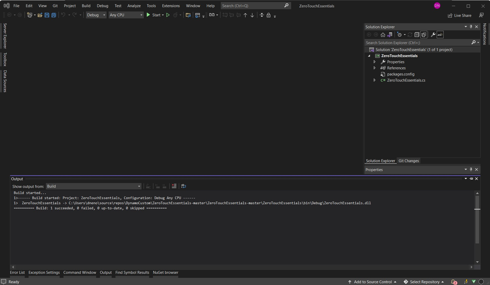

# Going Further With Zero-Touch

With an understanding of how to create a Zero-Touch project, we can go deeper into the specifics of creating a node by walking through the ZeroTouchEssentials example on the Dynamo Github.


> Many of Dynamo's standard nodes are essentially Zero-Touch nodes, like most of the Math, Color, and DateTime nodes above.

To start, download the ZeroTouchEssentials project from here: [https://github.com/DynamoDS/ZeroTouchEssentials](https://github.com/DynamoDS/ZeroTouchEssentials)

In Visual Studio, open the `ZeroTouchEssentials.sln` solution file and build the solution.



> The `ZeroTouchEssentials.cs` file contains all the methods we will be importing into Dynamo.

Open Dynamo and import the `ZeroTouchEssentials.dll` to get the nodes we will be referencing in the following examples.

The code examples are pulled from and generally match [ZeroTouchEssentials.cs](https://github.com/DynamoDS/ZeroTouchEssentials/blob/master/ZeroTouchEssentials/ZeroTouchEssentials.cs). The XML documentation has been removed to keep them concise, and each code example will create the node in the image above it.

#### Default Input Values <a href="#default-input-values" id="default-input-values"></a>

Dynamo supports the definition of default values for input ports on a node. These default values will be supplied to the node if the ports have no connections. Defaults are expressed using the C# mechanism of specifying optional arguments in the [C# Programming Guide](https://msdn.microsoft.com/en-us/library/dd264739.aspx). Default are specified in the following way:

* Set method parameters to a default value: `inputNumber = 2.0`

```
namespace ZeroTouchEssentials
{
    public class ZeroTouchEssentials
    {
        // Set the method parameter to a default value
        public static double MultiplyByTwo(double inputNumber = 2.0) 
        {
            return inputNumber * 2.0;
        }
    }
}
```


> 1. The default value will show up when hovering over the node input port

#### Returning Multiple Values <a href="#returning-multiple-values" id="returning-multiple-values"></a>

Returning multiple values is a bit more complex than creating multiple inputs and will need to be returned using a dictionary. The dictionary's entries become ports on the output side of the node. Multiple return ports are created in the following way:

* Add `using System.Collections.Generic;` to use `Dictionary<>`.
* Add `using Autodesk.DesignScript.Runtime;` to use the `MultiReturn` attribute. This references "DynamoServices.dll" from the DynamoServices NuGet package.
* Add the `[MultiReturn(new[] { "string1", "string2", ... more strings here })]` attribute to the method. The strings refer to keys in the dictionary and will become the output port names.
* Return a `Dictionary<>` from the function with keys that match the parameter names in the attribute: `return new Dictionary<string, object>`

```
using System.Collections.Generic;
using Autodesk.DesignScript.Runtime;

namespace ZeroTouchEssentials
{
    public class ZeroTouchEssentials
    {
        [MultiReturn(new[] { "add", "mult" })]
        public static Dictionary<string, object> ReturnMultiExample(double a, double b)
        {
            return new Dictionary<string, object>

                { "add", (a + b) },
                { "mult", (a * b) }
            };
        }
    }
}
```

> Refer to this code example in [ZeroTouchEssentials.cs](https://github.com/DynamoDS/ZeroTouchEssentials/blob/9917fd8159afc9e7bdb2944c960155a496e0b2dc/ZeroTouchEssentials/ZeroTouchEssentials.cs#L70)

A node that returns multiple outputs.


> 1. Notice that there are now two output ports named according to the strings we entered for the dictionary's keys.

#### Documentation, Tooltips, and Search <a href="#documentation-tooltips-and-search" id="documentation-tooltips-and-search"></a>

It is best practice to add documentation to Dynamo nodes that describe the node's function, inputs, outputs, search tags, etc. This is done through XML documentation tags. XML documentation is created in the following way:

* Any comment text that is preceded by three forward slashes is considered to be documentation
  * For example: `/// Documentation text and XML goes here`
* After the three slashes, create XML tags above methods that Dynamo will read when importing the .dll
  * For example: `/// <summary>...</summary>`
* Enable XML documentation in Visual Studio by selecting `Project > Project Properties > Build` and checking `XML documentation file`


> 1. Visual Studio will generate an XML file at the specified location

The types of tags are as follows:

* `/// <summary>...</summary>` is the main documentation for your node and will appear as a tooltip over your node in the left search side bar
* `/// <param name="inputName">...</param>` will create documentation for specific input parameters
* `/// <returns>...</returns>` will create documentation for an output parameter
* `/// <returns name = "outputName">...</returns>` will create documentation for multiple output parameters
* `/// <search>...</search>` will match your node with search results based on a comma separated list. For example, if we create a node that subdivides a mesh we may want to add tags such as "mesh", "subdivision", and "catmull-clark".

The following is an example node with input and output descriptions, as well as a summary that will display in the Library.

```
using Autodesk.DesignScript.Geometry;

namespace ZeroTouchEssentials
{
    public class ZeroTouchEssentials
    {
        /// <summary>
        /// This method demonstrates how to use a native geometry object from Dynamo
        /// in a custom method
        /// </summary>
        /// <param name="curve">Input Curve. This can be of any type deriving from Curve, such as NurbsCurve, Arc, Circle, etc</param>
        /// <returns>The twice the length of the Curve </returns>
        /// <search>example,curve</search>
        public static double DoubleLength(Curve curve)
        {
            return curve.Length * 2.0;
        }
    }
}
```

> Refer to this code example in [ZeroTouchEssentials.cs](https://github.com/DynamoDS/ZeroTouchEssentials/blob/9917fd8159afc9e7bdb2944c960155a496e0b2dc/ZeroTouchEssentials/ZeroTouchEssentials.cs#L80)

Note that the code for this example node contains:

> 1. A node summary
> 2. An input description
> 3. An output description

##### Dynamo Node Descriptions Best Practices 

Node descriptions briefly describe a node’s function and output. In Dynamo, they appear in two places:

- In the node tooltip
- In the documentation browser


Follow these guidelines to ensure consistency and help save time when writing or updating node descriptions.

###### Overview

Descriptions should be one to two sentences. If more info is needed, include it under In Depth in the Documentation Browser.

Sentence case (capitalize the first word of a sentence and any proper nouns). No period at the end.

Language should be as clear and simple as possible. Define acronyms at first mention unless they are known even to non-expert users.

Always prioritize clarity, even if that means deviating from these guidelines.

###### Guidelines

| Do's      | Don'ts |
| ----------- | ----------- |
| Start the description with a third-person verb. <ul><li>Example: *Determines* if one geometry object intersects with another</li></ul>      | Don't start with a second-person verb or with any noun. <ul><li>Example: *Determine* if one geometry object intersects with another</li></ul>       |
| Use "Returns," "Creates," or another descriptive verb instead of "Gets." <ul><li>Example: *Returns* a Nurbs representation of a surface</li></ul>   | Don't use "Get" or "Gets." It's less specific and has several possible translations. <ul><li>Example: *Gets* a Nurbs representation of the surface</li></ul>        |
| When referring to inputs, use "given" or "input" instead of "specified" or any other terms. Omit "given" or "input" when possible to simplify the description and reduce word count. <ul><li>Example: Deletes the *given* file</li><li>Example: Projects a curve along the *given* projection direction onto *given* base geometry</li></ul>You may use "specified" when not directly referring to an input. <ul><li>Example: Writes text content to a file *specified* by the given path</li></ul>       | When referring to inputs, to ensure consistency, don't use "specified" or any other term except "given" or "input." Don't mix "given" and "input" in the same description unless needed for clarity. <ul><li>Example: Deletes the *specified* file</li><li>Example: Projects an *input* curve along a *given* projection direction onto a *specified* base geometry</li></ul>      |
| Use "a" or "an" when first referring to an input. Use "the given" or "the input" instead of "a" or "an" as needed for clarity.<ul><li>Example: Sweeps *a* curve along the path curve</li></ul>      | Don't use "this" when first referring to an input. <ul><li>Example: Sweeps *this* surve along the path curve      |
| When first referring to an output or other noun that's the target of the node operation, use "a" or "an." Only use "the" when pairing it with "input" or "given." <ul><li>Example: Copies *a* file</li><li>Example: Copies *the given* file</li></ul>      | When first referring to an output or other noun that's the target of the node operation, don't use "the" on its own. <ul><li>Example: Copies *the* file</li></ul>      |
| Capitalize the first word of a sentence and any proper nouns such as names and traditionally capitalized nouns. <ul><li>Example: Returns the intersection of two *BoundingBoxes*</li></ul>      | Don't capitalize common geometry objects and concepts unless needed for clarity. <ul><li>Example: Scales non-uniformly around the given *Plane*      |
| Capitalize Boolean. Capitalize True and False when referring to the output of Booleans. <ul><li>Example: Returns *True* if the two values are different</li><li>Example: Converts a string to all uppercase or all lowercase characters based on a *Boolean* parameter      | Don't lowercase Boolean. Don't lowercase True and False when referring to the output of Booleans. <ul><li>Example: Returns *true* if the two values are different</li><li>Example: Converts a string to all uppercase characters or all lowercase characters based on a *boolean* parameter</li></ul>


#### Objects <a href="#objects" id="objects"></a>

Dynamo doesn't have a `new` keyword, so objects will need to be constructed using static construction methods. Objects are constructed in the following way:

* Make the constructor internal `internal ZeroTouchEssentials()` unless otherwise required
* Construct the object with a static method such as `public static ZeroTouchEssentials ByTwoDoubles(a, b)`

> Note: Dynamo uses the "By" prefix to indicate a static method is a constructor, and while this is optional, using "By" will help your library better fit into the existing Dynamo style.

```
namespace ZeroTouchEssentials
{
    public class ZeroTouchEssentials
    {
        private double _a;
        private double _b;

        // Make the constructor internal
        internal ZeroTouchEssentials(double a, double b)
        {
            _a = a;
            _b = b;
        }

        // The static method that Dynamo will convert into a Create node
        public static ZeroTouchEssentials ByTwoDoubles(double a, double b)
        {
            return new ZeroTouchEssentials(a, b);
        }
    }
}
```

> Refer to this code example in [ZeroTouchEssentials.cs](https://github.com/DynamoDS/ZeroTouchEssentials/blob/9917fd8159afc9e7bdb2944c960155a496e0b2dc/ZeroTouchEssentials/ZeroTouchEssentials.cs#L26)

After the ZeroTouchEssentials dll has been imported there will be a ZeroTouchEssentials node in the library. This object can be created by using the `ByTwoDoubles` node.


#### Using Dynamo Geometry Types <a href="#using-dynamo-geometry-types" id="using-dynamo-geometry-types"></a>

Dynamo libraries can use native Dynamo geometry types as inputs and create new geometry as outputs. Geometry types are created in the following way:

* Reference "ProtoGeometry.dll" in the project by including `using Autodesk.DesignScript.Geometry;` at the top of your C# file and adding the ZeroTouchLibrary NuGet package to the project.
* **Important:** Manage the geometry resources that are not returned out of your functions, see the **Dispose/using Statements** section below.

> Note: Dynamo geometry objects are used like any other passed object to functions.

```
using Autodesk.DesignScript.Geometry;

namespace ZeroTouchEssentials
{
    public class ZeroTouchEssentials
    {
        // "Autodesk.DesignScript.Geometry.Curve" is specifying the type of geometry input, 
        // just as you would specify a double, string, or integer 
        public static double DoubleLength(Autodesk.DesignScript.Geometry.Curve curve)
        {
            return curve.Length * 2.0;
        }
    }
}
```

> Refer to this code example in [ZeroTouchEssentials.cs](https://github.com/DynamoDS/ZeroTouchEssentials/blob/9917fd8159afc9e7bdb2944c960155a496e0b2dc/ZeroTouchEssentials/ZeroTouchEssentials.cs#L86)

A node that gets a curve's length and doubles it.


> 1. This node accepts a Curve geometry type as an input.

#### Dispose/using Statements <a href="#disposeusing-statements" id="disposeusing-statements"></a>

Geometry resources that are not returned out of functions will need to be manually managed unless you are using Dynamo version 2.5 or later. In Dynamo 2.5 and later versions, geometry resources are handled by the system internally, however, you may still have to dispose geometry manually if you have a complex use case or you have to cut down on memory at a deterministic time. The Dynamo engine will handle any geometry resources that are returned out of functions. Geometry resources that are not returned can be handled manually in the following ways:

*   With a using statement:

    ```
    using (Point p1 = Point.ByCoordinates(0, 0, 0))
    {
      using (Point p2 = Point.ByCoordinates(10, 10, 0))
      {
          return Line.ByStartPointEndPoint(p1, p2);
      }
    }
    ```

    > The using statement is documented [here](https://msdn.microsoft.com/en-us/library/yh598w02.aspx)
    >
    > See [Dynamo Geometry Stability Improvements](https://forum.dynamobim.com/t/dynamo-geometry-stability-improvements-request-for-feedback/39297) to read more about the new stability features introduced in Dynamo 2.5
*   With manual Dispose calls:

    ```
    Point p1 = Point.ByCoordinates(0, 0, 0);
    Point p2 = Point.ByCoordinates(10, 10, 0);
    Line l = Line.ByStartPointEndPoint(p1, p2);
    p1.Dispose();
    p2.Dispose();
    return l;
    ```

#### Migrations <a href="#migrations" id="migrations"></a>

When publishing a newer version of a library, node names may change. Name changes can be specified in a migrations file so that graphs built on previous versions of a library continue to work properly when an update is made. Migrations are implemented in the following way:

* Create a `.xml` file in the same folder as the `.dll` with the following format: "BaseDLLName".Migrations.xml
* In the `.xml`, create a single `<migrations>...</migrations>` element
* Inside the migrations element, create `<priorNameHint>...</priorNameHint>` elements for each name change
* For each name change, provide an `<oldName>...</oldName>` and `<newName>...</newName>` element


> 1. Right-click and select `Add > New Item`
> 2. Choose `XML File`
> 3. For this project, we would name the migrations file `ZeroTouchEssentials.Migrations.xml`

This example code is telling Dynamo that any node named `GetClosestPoint` is now named `ClosestPointTo`.

```
<?xml version="1.0"?>
<migrations>
  <priorNameHint>
    <oldName>Autodesk.DesignScript.Geometry.Geometry.GetClosestPoint</oldName>
    <newName>Autodesk.DesignScript.Geometry.Geometry.ClosestPointTo</newName>
  </priorNameHint>
</migrations>
```

> Refer to this code example in [ProtoGeometry.Migrations.xml](https://github.com/DynamoDS/Dynamo/blob/master/extern/ProtoGeometry/ProtoGeometry.Migrations.xml)

#### Generics <a href="#generics" id="generics"></a>

Zero-Touch currently does not support the use of generics. They can be used, but not in the code that is directly imported where the type is not set. Methods, properties, or classes that are generic and don’t have the type set cannot be exposed.

In the example below, a Zero-Touch node of type `T` will not be imported. If the rest of the library imports into Dynamo there will be missing type exceptions.

```
public class SomeGenericClass<T>
{
    public SomeGenericClass()
    {
        Console.WriteLine(typeof(T).ToString());
    }  
}
```

Using a generic type with the type set in this example will import into Dynamo.

```
public class SomeWrapper
{
    public object wrapped;
    public SomeWrapper(SomeGenericClass<double> someConstrainedType)
    {
        Console.WriteLine(this.wrapped.GetType().ToString());
    }
}
```
