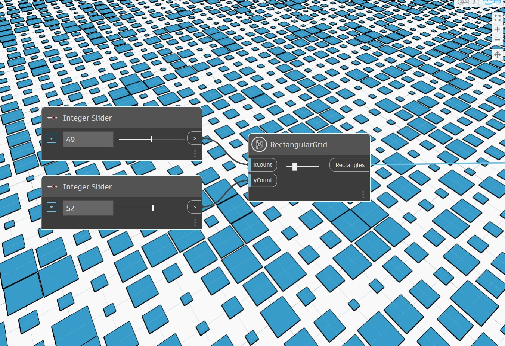
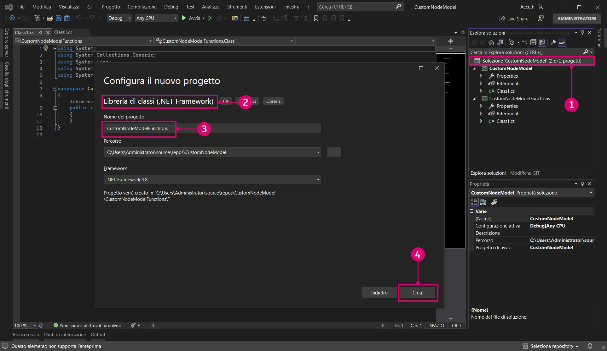
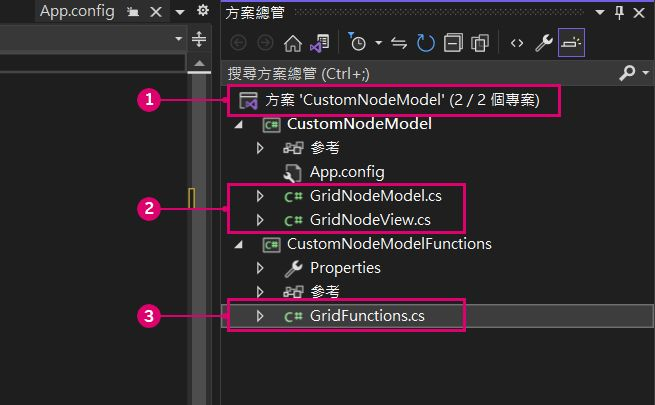
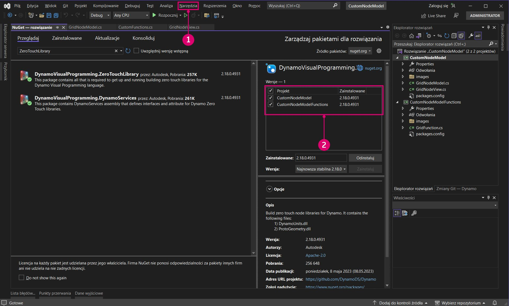
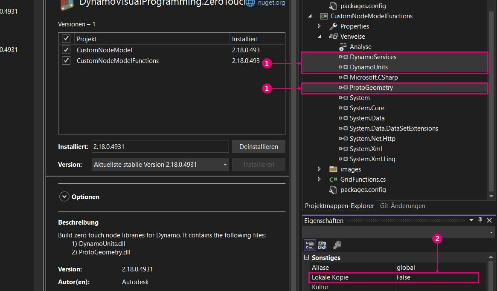
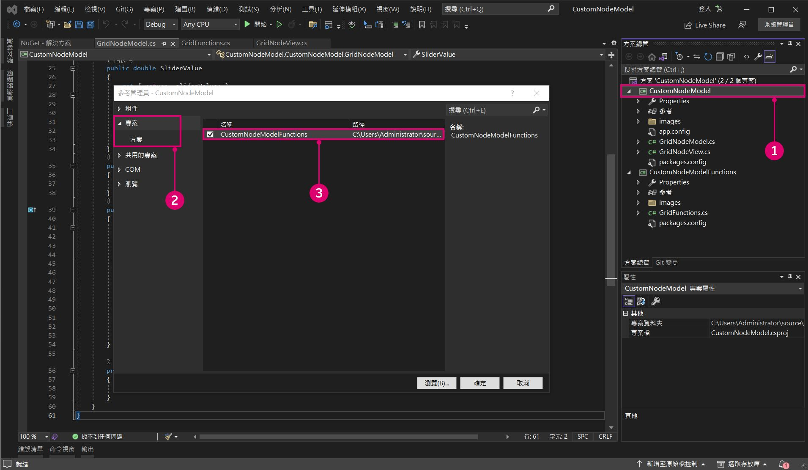
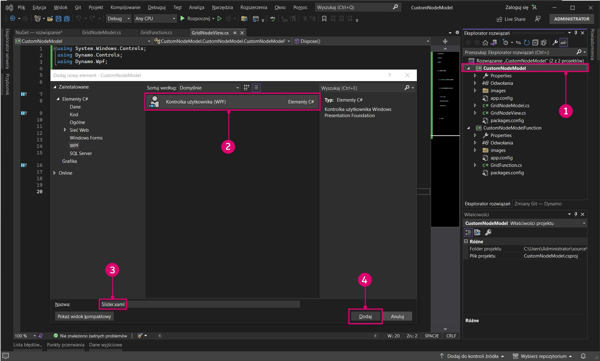
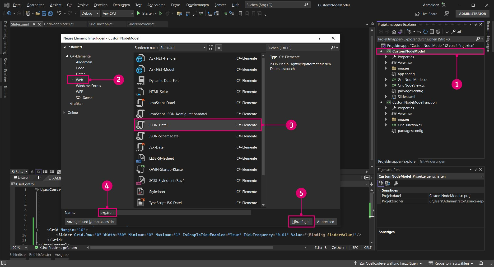

# Caso real de NodeModel (interfaz de usuario personalizada)

Los nodos basados en NodeModel proporcionan una flexibilidad y una eficacia mucho mayores que los nodos Zero-Touch. En este ejemplo, vamos a llevar el nodo de rejilla Zero-Touch al siguiente nivel mediante la adición de un control deslizante integrado que determina aleatoriamente el tamaño del rectángulo.



> El control deslizante ajusta la escala de las celdas en relación con su tamaño para que el usuario no tenga que proporcionar un control deslizante con el rango correcto.

#### El patrón Model-View-Viewmodel <a href="#the-model-view-viewmodel-pattern" id="the-model-view-viewmodel-pattern"></a>

Dynamo se basa en el patrón de arquitectura de software [Model-View-Viewmodel](https://en.wikipedia.org/wiki/Model%E2%80%93view%E2%80%93viewmodel) (MVVM) para mantener separada la interfaz de usuario del back-end. Al crear nodos Zero-Touch, Dynamo establece el enlace entre los datos de un nodo y su interfaz de usuario. Para crear una interfaz de usuario personalizada, debemos añadir la lógica de enlace de datos.

En un nivel superior, existen dos partes para establecer una relación de modelo-vista en Dynamo, como se indica a continuación:

* Una clase `NodeModel` para establecer la lógica del núcleo del nodo (el "modelo").
* Una clase `INodeViewCustomization` para personalizar cómo se visualiza el `NodeModel` (la "vista").

> Los objetos NodeModel ya tienen asociada una relación de vista-modelo (NodeViewModel), por lo que podemos centrarnos en el modelo y la vista para la interfaz de usuario personalizada.

#### Cómo implementar NodeModel <a href="#how-to-implement-nodemodel" id="how-to-implement-nodemodel"></a>

Los nodos NodeModel presentan varias diferencias significativas con respecto a los nodos Zero-Touch que se abordarán en este ejemplo. Antes de pasar a la personalización de la interfaz de usuario, vamos a empezar por generar la lógica de NodeModel.

**1\. Crear la estructura del proyecto**

Un nodo NodeModel solo puede llamar a funciones, por lo que es necesario separar el NodeModel y las funciones en bibliotecas diferentes. El método estándar para los paquetes de Dynamo es crear proyectos independientes para cada uno de ellos. Comience por crear una nueva solución para englobar los proyectos.

> 1. Seleccione `File > New > Project`.
> 2. Seleccione `Other Project Types` para abrir la opción de solución.
> 3. Seleccione `Blank Solution`.
> 4. Asigne el nombre `CustomNodeModel` a la solución.
> 5. Seleccione `Ok`.

Cree dos proyectos de biblioteca de clases de C# en la solución: uno para las funciones y otro para implementar la interfaz de NodeModel.



> 1. Haga clic con el botón derecho en la solución y seleccione `Add > New Project`.
> 2. Seleccione Biblioteca de clases.
> 3. Asígnele un nombre a `CustomNodeModel`.
> 4. Haga clic en `Ok`.
> 5. Repita el proceso para añadir otro proyecto denominado `CustomNodeModelFunctions`.

A continuación, debemos cambiar el nombre de las bibliotecas de clases que se han creado automáticamente y añadir una al proyecto `CustomNodeModel`. La clase `GridNodeModel` implementa la clase abstracta NodeModel; `GridNodeView` se utiliza para personalizar la vista, y `GridFunction` contiene las funciones a las que se debe llamar.



> 1. Añada otra clase. Para ello, haga clic con el botón derecho en el proyecto `CustomNodeModel`, seleccione `Add > New Item...` y, a continuación, elija `Class`.
> 2. En el proyecto `CustomNodeModel`, necesitamos las clases `GridNodeModel.cs` y `GridNodeView.cs`.
> 3. En el proyecto `CustomNodeModelFunction`, necesitamos una clase `GridFunctions.cs`.

Antes de agregar código a las clases, añada los paquetes necesarios para este proyecto. `CustomNodeModel` necesitará ZeroTouchLibrary y WpfUILibrary, y `CustomNodeModelFunction` solo necesitará ZeroTouchLibrary. WpfUILibrary se utilizará en la personalización de la interfaz de usuario que realizaremos más adelante y ZeroTouchLibrary se empleará para crear geometría. Los paquetes se pueden añadir individualmente para los proyectos. Como estos paquetes presentan dependencias, Core y DynamoServices se instalarán automáticamente.



> 1. Haga clic con el botón derecho en un proyecto y seleccione `Manage NuGet Packages`.
> 2. Instale solo los paquetes necesarios para ese proyecto.

Visual Studio copiará los paquetes NuGet a los que hemos hecho referencia en el directorio de compilación. Esto se puede establecer en "false" (falso) para que no tengamos ningún archivo innecesario en el paquete.



> 1. Seleccione paquetes NuGet de Dynamo.
> 2. Establezca `Copy Local` en "false" (falso).

**2\. Heredar la clase NodeModel**

Como se ha mencionado anteriormente, el aspecto principal que diferencia un nodo NodeModel de un nodo Zero-Touch es su implementación de la clase `NodeModel`. Un nodo NodeModel necesita varias funciones de esta clase y podemos obtenerlas mediante la adición de `:NodeModel` después del nombre de la clase.

Copie el código siguiente en `GridNodeModel.cs`.

```
using System;
using System.Collections.Generic;
using Dynamo.Graph.Nodes;
using CustomNodeModel.CustomNodeModelFunction;
using ProtoCore.AST.AssociativeAST;
using Autodesk.DesignScript.Geometry;

namespace CustomNodeModel.CustomNodeModel
{
    [NodeName("RectangularGrid")]
    [NodeDescription("An example NodeModel node that creates a rectangular grid. The slider randomly scales the cells.")]
    [NodeCategory("CustomNodeModel")]
    [InPortNames("xCount", "yCount")]
    [InPortTypes("double", "double")]
    [InPortDescriptions("Number of cells in the X direction", "Number of cells in the Y direction")]
    [OutPortNames("Rectangles")]
    [OutPortTypes("Autodesk.DesignScript.Geometry.Rectangle[]")]
    [OutPortDescriptions("A list of rectangles")]
    [IsDesignScriptCompatible]
    public class GridNodeModel : NodeModel
    {
        private double _sliderValue;
        public double SliderValue
        {
            get { return _sliderValue; }
            set
            {
                _sliderValue = value;
                RaisePropertyChanged("SliderValue");
                OnNodeModified(false);
            }
        }
        public GridNodeModel()
        {
            RegisterAllPorts();
        }
        public override IEnumerable<AssociativeNode> BuildOutputAst(List<AssociativeNode> inputAstNodes)
        {
            if (!HasConnectedInput(0) || !HasConnectedInput(1))
            {
                return new[] { AstFactory.BuildAssignment(GetAstIdentifierForOutputIndex(0), AstFactory.BuildNullNode()) };
            }
            var sliderValue = AstFactory.BuildDoubleNode(SliderValue);
            var functionCall =
              AstFactory.BuildFunctionCall(
                new Func<int, int, double, List<Rectangle>>(GridFunction.RectangularGrid),
                new List<AssociativeNode> { inputAstNodes[0], inputAstNodes[1], sliderValue });

            return new[] { AstFactory.BuildAssignment(GetAstIdentifierForOutputIndex(0), functionCall) };
        }
    }
}
```

Esto es diferente a los nodos Zero-Touch. Vamos a conocer lo que realiza cada parte.

* Especifique los atributos del nodo como nombre, categoría, nombres de puerto de entrada/salida, tipos de puerto de entrada/salida y descripciones.
* `public class GridNodeModel : NodeModel` es una clase que hereda la clase `NodeModel` de `Dynamo.Graph.Nodes`.
* `public GridNodeModel() { RegisterAllPorts(); }` es un constructor que registra las entradas y las salidas del nodo.
* `BuildOutputAst()` devuelve un AST (árbol de sintaxis abstracta), la estructura necesaria para devolver datos de un nodo NodeModel.
* `AstFactory.BuildFunctionCall()` llama a la función RectangularGrid desde `GridFunctions.cs`.
* `new Func<int, int, double, List<Rectangle>>(GridFunction.RectangularGrid)` especifica la función y sus parámetros.
* `new List<AssociativeNode> { inputAstNodes[0], inputAstNodes[1], sliderValue });` asigna las entradas del nodo a los parámetros de función.
* `AstFactory.BuildNullNode()` genera un nodo nulo si los puertos de entrada no están conectados. Esto se hace para evitar que se muestre una advertencia en el nodo.
* `RaisePropertyChanged("SliderValue")` notifica a la interfaz de usuario cuando cambia el valor del control deslizante.
* `var sliderValue = AstFactory.BuildDoubleNode(SliderValue)` compila un nodo en AST que representa el valor del control deslizante
* Cambie una entrada a la variable `sliderValue` en la variable functionCall `new List<AssociativeNode> { inputAstNodes[0], sliderValue });`.

**3\. Llamar a una función**

El proyecto `CustomNodeModelFunction` se creará en un montaje independiente de `CustomNodeModel` para que se pueda llamar a él.

Copie el siguiente código en `GridFunction.cs`.

```
using Autodesk.DesignScript.Geometry;
using Autodesk.DesignScript.Runtime;
using System;
using System.Collections.Generic;

namespace CustomNodeModel.CustomNodeModelFunction
{
    [IsVisibleInDynamoLibrary(false)]
    public class GridFunction
    {
        [IsVisibleInDynamoLibrary(false)]
        public static List<Rectangle> RectangularGrid(int xCount = 10, int yCount = 10, double rand = 1)
        {
            double x = 0;
            double y = 0;

            Point pt = null;
            Vector vec = null;
            Plane bP = null;

            Random rnd = new Random(2);

            var pList = new List<Rectangle>();
            for (int i = 0; i < xCount; i++)
            {
                y++;
                x = 0;
                for (int j = 0; j < yCount; j++)
                {
                    double rNum = rnd.NextDouble();
                    double scale = rNum * (1 - rand) + rand;
                    x++;
                    pt = Point.ByCoordinates(x, y);
                    vec = Vector.ZAxis();
                    bP = Plane.ByOriginNormal(pt, vec);
                    Rectangle rect = Rectangle.ByWidthLength(bP, scale, scale);
                    pList.Add(rect);
                }
            }
            pt.Dispose();
            vec.Dispose();
            bP.Dispose();
            return pList;
        }
    }
}
```

Esta clase de función es muy similar al caso real de rejilla de Zero-Touch con una diferencia:

* `[IsVisibleInDynamoLibrary(false)]` impide que Dynamo "vea" el siguiente método y clase, ya que la función ya se está llamando desde `CustomNodeModel`.

Al igual que hemos añadido referencias para los paquetes NuGet, `CustomNodeModel` deberá hacer referencia a `CustomNodeModelFunction` para llamar a la función.



> La instrucción "using" de CustomNodeModel estará inactiva hasta que hagamos referencia a la función
>
> 1. Haga clic con el botón derecho en `CustomNodeModel` y seleccione `Add > Reference`.
> 2. Seleccione `Projects > Solution`.
> 3. Active `CustomNodeModelFunction`.
> 4. Haga clic en `Ok`.

**4\. Personalizar la vista**

Para crear un control deslizante, debemos personalizar la interfaz de usuario mediante la implementación de la interfaz de `INodeViewCustomization`.

Copie el siguiente código en `GridNodeView.cs`.

```
using Dynamo.Controls;
using Dynamo.Wpf;

namespace CustomNodeModel.CustomNodeModel
{
    public class CustomNodeModelView : INodeViewCustomization<GridNodeModel>
    {
        public void CustomizeView(GridNodeModel model, NodeView nodeView)
        {
            var slider = new Slider();
            nodeView.inputGrid.Children.Add(slider);
            slider.DataContext = model;
        }

        public void Dispose()
        {
        }
    }
}
```

* `public class CustomNodeModelView : INodeViewCustomization<GridNodeModel>` define las funciones necesarias para personalizar la interfaz de usuario.

Una vez configurada la estructura del proyecto, utilice el entorno de diseño de Visual Studio para generar un control de usuario y definir sus parámetros en un archivo `.xaml`. En el cuadro de herramientas, añada un control deslizante a `<Grid>...</Grid>`.



> 1. Haga clic con el botón derecho en `CustomNodeModel` y seleccione `Add > New Item`.
> 2. Seleccione `WPF`.
> 3. Asigne el nombre `Slider` al control de usuario.
> 4. Haga clic en `Add`.

Copie el siguiente código en `Slider.xaml`.

```
<UserControl x:Class="CustomNodeModel.CustomNodeModel.Slider"
             xmlns="http://schemas.microsoft.com/winfx/2006/xaml/presentation"
             xmlns:x="http://schemas.microsoft.com/winfx/2006/xaml"
             xmlns:mc="http://schemas.openxmlformats.org/markup-compatibility/2006" 
             xmlns:d="http://schemas.microsoft.com/expression/blend/2008" 
             xmlns:local="clr-namespace:CustomNodeModel.CustomNodeModel"
             mc:Ignorable="d" 
             d:DesignHeight="75" d:DesignWidth="100">
    <Grid Margin="10">
        <Slider Grid.Row="0" Width="80" Minimum="0" Maximum="1" IsSnapToTickEnabled="True" TickFrequency="0.01" Value="{Binding SliderValue}"/>
    </Grid>
</UserControl>
```

* Los parámetros del control deslizante se definen en el archivo `.xaml`. Los atributos _Mínimo y Máximo_ definen el rango numérico de este control deslizante.
* En `<Grid>...</Grid>`, podemos colocar diferentes controles de usuario desde el cuadro de herramientas de Visual Studio.

Cuando creamos el archivo `Slider.xaml`, Visual Studio creó automáticamente un archivo de C# llamado `Slider.xaml.cs` que inicializa el control deslizante. Cambie el espacio de nombres de este archivo.

```
using System.Windows.Controls;

namespace CustomNodeModel.CustomNodeModel
{
    /// <summary>
    /// Interaction logic for Slider.xaml
    /// </summary>
    public partial class Slider : UserControl
    {
        public Slider()
        {
            InitializeComponent();
        }
    }
}
```

* El espacio de nombres debe ser `CustomNodeModel.CustomNodeModel`.

`GridNodeModel.cs` define la lógica de cálculo del control deslizante.

**5\. Configurar como paquete**

Antes de generar el proyecto, el último paso es añadir un archivo `pkg.json` para que Dynamo pueda leer el paquete.



> 1. Haga clic con el botón derecho en `CustomNodeModel` y seleccione `Add > New Item`.
> 2. Seleccione `Web`.
> 3. Seleccione `JSON File`.
> 4. Asigne al archivo el nombre `pkg.json`.
> 5. Haga clic en `Add`.

* Copie el siguiente código en `pkg.json`.

```
{
  "license": "MIT",
  "file_hash": null,
  "name": "CustomNodeModel",
  "version": "1.0.0",
  "description": "Sample node",
  "group": "CustomNodes",
  "keywords": [ "grid", "random" ],
  "dependencies": [],
  "contents": "Sample node",
  "engine_version": "1.3.0",
  "engine": "dynamo",
  "engine_metadata": "",
  "site_url": "",
  "repository_url": "",
  "contains_binaries": true,
  "node_libraries": [
    "CustomNodeModel, Version=1.0.0, Culture=neutral, PublicKeyToken=null",
    "CustomNodeModelFunction, Version=1.0.0, Culture=neutral, PublicKeyToken=null"
  ]
}
```

* `"name":` determina el nombre del paquete y su grupo en la biblioteca de Dynamo.
* `"keywords":` proporciona términos para realizar búsquedas en la biblioteca de Dynamo.
*   `"node_libraries": []` las bibliotecas asociadas con el paquete.

    El último paso es generar la solución y publicarla como un paquete de Dynamo. Consulte el capítulo Implementación de paquetes para obtener información sobre cómo crear un paquete local antes de la publicación en línea y cómo generar un paquete directamente desde Visual Studio.
