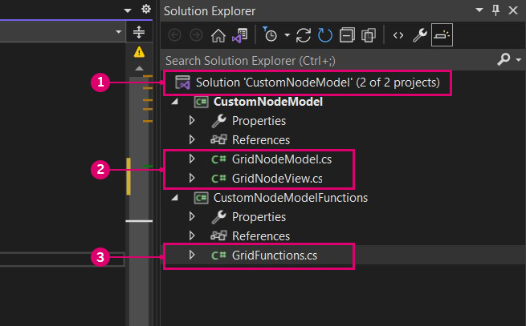

# Étude de cas de modèle de nœud : interface utilisateur personnalisée 

Les nœuds basés sur NodeModel offrent beaucoup plus de flexibilité et de puissance que les nœuds Zero-Touch. Dans cet exemple, nous ferons passer le nœud de grille Zero-Touch au niveau supérieur en ajoutant un curseur intégré qui randomise la taille du rectangle.


> Le curseur met à l’échelle les cellules en fonction de leur taille, de sorte que l’utilisateur n’a pas besoin de fournir un curseur avec la plage correcte.

#### Modèle vue-vue modèle <a href="#the-model-view-viewmodel-pattern" id="the-model-view-viewmodel-pattern"></a>

Dynamo est basé sur le modèle d’architecture logicielle [modèle-vue-vue modèle](https://en.wikipedia.org/wiki/Model%E2%80%93view%E2%80%93viewmodel) (MVVM) afin de séparer l’interface utilisateur du back-end. Lors de la création de nœuds Zero-Touch, Dynamo réalise la liaison entre les données d’un nœud et son interface utilisateur. Pour créer une interface utilisateur personnalisée, nous devons ajouter la logique de liaison des données.

À un haut niveau, établir une relation modèle-vue dans Dynamo se fait en deux temps :

* Une classe `NodeModel` pour établir la logique de base du nœud (le « modèle »)
* Une classe `INodeViewCustomization` pour personnaliser la façon dont le `NodeModel` est affiché (la « vue »)

> Les objets NodeModel ont déjà une vue-modèle associée (NodeViewModel), nous pouvons donc nous concentrer uniquement sur le modèle et la vue pour l’interface utilisateur personnalisée.

#### Comment implémenter NodeModel <a href="#how-to-implement-nodemodel" id="how-to-implement-nodemodel"></a>

Les nœuds NodeModel présentent plusieurs différences significatives par rapport aux nœuds Zero-Touch que nous aborderons dans cet exemple. Avant de passer à la personnalisation de l’interface utilisateur, commençons par générer la logique NodeModel.

**1\. Créer la structure du projet :**

Un nœud NodeModel ne peut appeler que des fonctions, nous devons donc séparer le NodeModel et les fonctions dans des bibliothèques différentes. La façon standard de procéder pour les packages Dynamo est de créer des projets distincts pour chacun d’entre eux. Commencez par créer une nouvelle solution pour englober les projets.

> 1. Sélectionnez `File > New > Project`
> 2. Sélectionnez `Other Project Types` pour afficher l’option Solution
> 3. Sélectionnez `Blank Solution`
> 4. Nommez la solution `CustomNodeModel`
> 5. Sélectionnez `Ok`

Créez deux projets de bibliothèque de classes C# dans la solution : un pour les fonctions et un pour la mise en œuvre de l’interface NodeModel.


> 1. Cliquez avec le bouton droit de la souris sur la solution et sélectionnez `Add > New Project`
> 2. Choisissez une bibliothèque de classe
> 3. Nommez-le `CustomNodeModel`
> 4. Cliquez sur `Ok`
> 5. Répétez l’opération pour ajouter un autre projet nommé `CustomNodeModelFunctions`

Ensuite, nous devons renommer les bibliothèques de classes qui ont été créées automatiquement et en ajouter une au projet `CustomNodeModel`. La classe `GridNodeModel` implémente la classe abstraite NodeModel, `GridNodeView` est utilisée pour personnaliser la vue et `GridFunction` contient toutes les fonctions que nous devons appeler.



> 1. Ajoutez une autre classe en cliquant avec le bouton droit de la souris sur le projet `CustomNodeModel`, en sélectionnant `Add > New Item...` et en choisissant `Class`
> 2. Dans le projet `CustomNodeModel`, nous avons besoin de `GridNodeModel.cs` et de `GridNodeView.cs`
> 3. Dans le projet `CustomNodeModelFunction`, nous avons besoin d’une classe `GridFunctions.cs`

Avant d’ajouter du code aux classes, ajoutez les packages nécessaires pour ce projet. `CustomNodeModel` aura besoin de ZeroTouchLibrary et de WpfUILibrary, et `CustomNodeModelFunction` n’aura besoin que de ZeroTouchLibrary. La bibliothèque WpfUILibrary sera utilisée dans la personnalisation de l’interface utilisateur que nous effectuerons ultérieurement, et la bibliothèque ZeroTouchLibrary sera utilisée pour la création de géométries. Les packages peuvent être ajoutés individuellement pour les projets. Comme ces packages ont des dépendances, Core et DynamoServices seront automatiquement installés.


> 1. Cliquez avec le bouton droit de la souris sur un projet et choisissez `Manage NuGet Packages`
> 2. Installez uniquement les packages requis pour ce projet

Visual Studio copie les packages NuGet référencés dans le répertoire de génération. Cette valeur peut être définie sur False pour éviter que le package ne contienne des fichiers inutiles.


> 1. Sélectionnez les packages Dynamo NuGet
> 2. Définissez `Copy Local` sur False

**2\. Hériter de la classe NodeModel**

Comme indiqué précédemment, l’aspect principal qui différencie un nœud NodeModel d’un nœud Zero-Touch est son implémentation de la classe `NodeModel`. Un nœud NodeModel a besoin de plusieurs fonctions de cette classe, et nous pouvons les obtenir en ajoutant `:NodeModel` après le nom de la classe.

Copiez le code suivant dans `GridNodeModel.cs`.

```
using System;
using System.Collections.Generic;
using Dynamo.Graph.Nodes;
using CustomNodeModel.CustomNodeModelFunction;
using ProtoCore.AST.AssociativeAST;
using Autodesk.DesignScript.Geometry;

namespace CustomNodeModel.CustomNodeModel
{
    [NodeName("RectangularGrid")]
    [NodeDescription("An example NodeModel node that creates a rectangular grid. The slider randomly scales the cells.")]
    [NodeCategory("CustomNodeModel")]
    [InPortNames("xCount", "yCount")]
    [InPortTypes("double", "double")]
    [InPortDescriptions("Number of cells in the X direction", "Number of cells in the Y direction")]
    [OutPortNames("Rectangles")]
    [OutPortTypes("Autodesk.DesignScript.Geometry.Rectangle[]")]
    [OutPortDescriptions("A list of rectangles")]
    [IsDesignScriptCompatible]
    public class GridNodeModel : NodeModel
    {
        private double _sliderValue;
        public double SliderValue
        {
            get { return _sliderValue; }
            set
            {
                _sliderValue = value;
                RaisePropertyChanged("SliderValue");
                OnNodeModified(false);
            }
        }
        public GridNodeModel()
        {
            RegisterAllPorts();
        }
        public override IEnumerable<AssociativeNode> BuildOutputAst(List<AssociativeNode> inputAstNodes)
        {
            if (!HasConnectedInput(0) || !HasConnectedInput(1))
            {
                return new[] { AstFactory.BuildAssignment(GetAstIdentifierForOutputIndex(0), AstFactory.BuildNullNode()) };
            }
            var sliderValue = AstFactory.BuildDoubleNode(SliderValue);
            var functionCall =
              AstFactory.BuildFunctionCall(
                new Func<int, int, double, List<Rectangle>>(GridFunction.RectangularGrid),
                new List<AssociativeNode> { inputAstNodes[0], inputAstNodes[1], sliderValue });

            return new[] { AstFactory.BuildAssignment(GetAstIdentifierForOutputIndex(0), functionCall) };
        }
    }
}
```

Cela diffère des nœuds Zero-Touch. Voyons ce que fait chaque partie.

* Spécifiez les attributs de nœud tels que le nom, la catégorie, les noms InPort/OutPort, les types InPort/OutPort et les descriptions.
* `public class GridNodeModel : NodeModel` est une classe qui hérite de la classe `NodeModel` de `Dynamo.Graph.Nodes`.
* `public GridNodeModel() { RegisterAllPorts(); }` est un constructeur qui enregistre les entrées et les sorties du nœud.
* `BuildOutputAst()` renvoie une structure ASA (Arbre de la syntaxe abstraite), qui est requise pour renvoyer des données à partir d’un nœud NodeModel.
* `AstFactory.BuildFunctionCall()` appelle la fonction RectangularGrid à partir de `GridFunctions.cs`.
* `new Func<int, int, double, List<Rectangle>>(GridFunction.RectangularGrid)` spécifie la fonction et ses paramètres.
* `new List<AssociativeNode> { inputAstNodes[0], inputAstNodes[1], sliderValue });` mappe les entrées des nœuds aux paramètres des fonctions.
* `AstFactory.BuildNullNode()` génère un nœud nul si les ports d’entrée ne sont pas connectés. Cela permet d’éviter l’affichage d’un avertissement sur le nœud.
* `RaisePropertyChanged("SliderValue")` notifie l’interface utilisateur lorsque la valeur du curseur change.
* `var sliderValue = AstFactory.BuildDoubleNode(SliderValue)` génère un nœud dans l’ASA qui représente la valeur du curseur.
* Modifiez une entrée pour la variable `sliderValue` dans la variable functionCall `new List<AssociativeNode> { inputAstNodes[0], sliderValue });`.

**3\. Appeler une fonction**

Le projet `CustomNodeModelFunction` sera créé dans un assemblage séparé de `CustomNodeModel` afin qu’il puisse être appelé.

Copiez le code suivant dans `GridFunction.cs`.

```
using Autodesk.DesignScript.Geometry;
using Autodesk.DesignScript.Runtime;
using System;
using System.Collections.Generic;

namespace CustomNodeModel.CustomNodeModelFunction
{
    [IsVisibleInDynamoLibrary(false)]
    public class GridFunction
    {
        [IsVisibleInDynamoLibrary(false)]
        public static List<Rectangle> RectangularGrid(int xCount = 10, int yCount = 10, double rand = 1)
        {
            double x = 0;
            double y = 0;

            Point pt = null;
            Vector vec = null;
            Plane bP = null;

            Random rnd = new Random(2);

            var pList = new List<Rectangle>();
            for (int i = 0; i < xCount; i++)
            {
                y++;
                x = 0;
                for (int j = 0; j < yCount; j++)
                {
                    double rNum = rnd.NextDouble();
                    double scale = rNum * (1 - rand) + rand;
                    x++;
                    pt = Point.ByCoordinates(x, y);
                    vec = Vector.ZAxis();
                    bP = Plane.ByOriginNormal(pt, vec);
                    Rectangle rect = Rectangle.ByWidthLength(bP, scale, scale);
                    pList.Add(rect);
                }
            }
            pt.Dispose();
            vec.Dispose();
            bP.Dispose();
            return pList;
        }
    }
}
```

Cette classe de fonction est très similaire à l’étude de cas Zero-Touch : nœud grille, à une différence près :

* `[IsVisibleInDynamoLibrary(false)]` empêche Dynamo de « voir » la méthode et la classe suivantes, car la fonction est déjà appelée à partir de `CustomNodeModel`.

Tout comme nous avons ajouté des références pour les packages NuGet, `CustomNodeModel` devra faire référence à `CustomNodeModelFunction` pour appeler la fonction.


> L’instruction using pour CustomNodeModel sera inactive jusqu’à ce que nous référencions la fonction
>
> 1. Cliquez avec le bouton droit de la souris sur `CustomNodeModel` et sélectionnez `Add > Reference`
> 2. Choisissez `Projects > Solution`
> 3. Cochez la case `CustomNodeModelFunction`
> 4. Cliquez sur `Ok`

**4\. Personnaliser la vue**

Pour créer un curseur, nous devons personnaliser l’interface utilisateur en implémentant l’interface `INodeViewCustomization`.

Copiez le code suivant dans `GridNodeView.cs`.

```
using Dynamo.Controls;
using Dynamo.Wpf;

namespace CustomNodeModel.CustomNodeModel
{
    public class CustomNodeModelView : INodeViewCustomization<GridNodeModel>
    {
        public void CustomizeView(GridNodeModel model, NodeView nodeView)
        {
            var slider = new Slider();
            nodeView.inputGrid.Children.Add(slider);
            slider.DataContext = model;
        }

        public void Dispose()
        {
        }
    }
}
```

* `public class CustomNodeModelView : INodeViewCustomization<GridNodeModel>` définit les fonctions nécessaires pour personnaliser l’interface utilisateur.

Une fois la structure du projet mise en place, utilisez l’environnement de conception de Visual Studio pour générer un contrôle utilisateur et définir ses paramètres dans un fichier `.xaml`. Dans la boîte à outils, ajoutez un curseur à `<Grid>...</Grid>`.


> 1. Cliquez avec le bouton droit de la souris sur `CustomNodeModel` et sélectionnez `Add > New Item`
> 2. Sélectionnez `WPF`
> 3. Nommez le contrôle utilisateur `Slider`
> 4. Cliquez sur `Add`

Copiez le code suivant dans `Slider.xaml`

```
<UserControl x:Class="CustomNodeModel.CustomNodeModel.Slider"
             xmlns="http://schemas.microsoft.com/winfx/2006/xaml/presentation"
             xmlns:x="http://schemas.microsoft.com/winfx/2006/xaml"
             xmlns:mc="http://schemas.openxmlformats.org/markup-compatibility/2006" 
             xmlns:d="http://schemas.microsoft.com/expression/blend/2008" 
             xmlns:local="clr-namespace:CustomNodeModel.CustomNodeModel"
             mc:Ignorable="d" 
             d:DesignHeight="75" d:DesignWidth="100">
    <Grid Margin="10">
        <Slider Grid.Row="0" Width="80" Minimum="0" Maximum="1" IsSnapToTickEnabled="True" TickFrequency="0.01" Value="{Binding SliderValue}"/>
    </Grid>
</UserControl>
```

* Les paramètres du contrôle du curseur sont définis dans le fichier `.xaml`. Les attributs _Minimum et Maximum_ définissent la plage numérique de ce curseur.
* Dans `<Grid>...</Grid>`, nous pouvons placer différents contrôles utilisateur de la boîte à outils de Visual Studio.

Lorsque nous avons créé le fichier `Slider.xaml`, Visual Studio a automatiquement créé un fichier C# appelé `Slider.xaml.cs` qui initialise le curseur. Modifiez l’espace de noms dans ce fichier.

```
using System.Windows.Controls;

namespace CustomNodeModel.CustomNodeModel
{
    /// <summary>
    /// Interaction logic for Slider.xaml
    /// </summary>
    public partial class Slider : UserControl
    {
        public Slider()
        {
            InitializeComponent();
        }
    }
}
```

* L’espace de noms doit être `CustomNodeModel.CustomNodeModel`

Le `GridNodeModel.cs` définit la logique de calcul du curseur.

**5\. Configurer en tant que package**

Avant de générer le projet, la dernière étape consiste à ajouter un fichier `pkg.json` pour que Dynamo puisse lire le package.


> 1. Cliquez avec le bouton droit de la souris sur `CustomNodeModel` et sélectionnez `Add > New Item`
> 2. Sélectionnez `Web`
> 3. Sélectionnez `JSON File`
> 4. Nommez le fichier `pkg.json`
> 5. Cliquez sur `Add`

* Copiez le code suivant dans `pkg.json`

```
{
  "license": "MIT",
  "file_hash": null,
  "name": "CustomNodeModel",
  "version": "1.0.0",
  "description": "Sample node",
  "group": "CustomNodes",
  "keywords": [ "grid", "random" ],
  "dependencies": [],
  "contents": "Sample node",
  "engine_version": "1.3.0",
  "engine": "dynamo",
  "engine_metadata": "",
  "site_url": "",
  "repository_url": "",
  "contains_binaries": true,
  "node_libraries": [
    "CustomNodeModel, Version=1.0.0, Culture=neutral, PublicKeyToken=null",
    "CustomNodeModelFunction, Version=1.0.0, Culture=neutral, PublicKeyToken=null"
  ]
}
```

* `"name":` détermine le nom du package et de son groupe dans la bibliothèque Dynamo
* `"keywords":` fournit des termes de recherche pour la bibliothèque Dynamo
*   `"node_libraries": []` les bibliothèques associées au package

    La dernière étape consiste à générer la solution et à la publier en tant que package Dynamo. Consultez le chapitre Déploiement de package pour savoir comment créer un package local avant de publier en ligne et comment générer un package directement à partir de Visual Studio.
