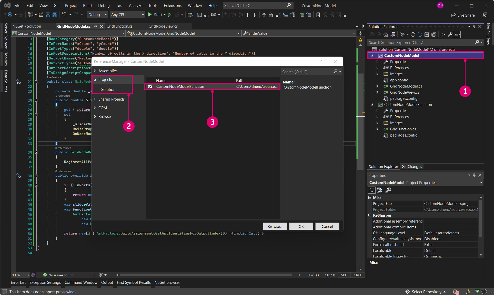

# Případová studie uzlu NodeModel – vlastní uživatelské rozhraní

Uzly založené na uzlech NodeModel poskytují podstatně větší flexibilitu a výkon než uzly Zero-Touch. V tomto příkladu posuneme uzel mřížky Zero-Touch na další úroveň přidáním integrovaného posuvníku, který náhodně nastaví velikost obdélníku.


> Posuvník změní měřítko buněk vzhledem k jejich velikosti, takže uživatel nemusí zadávat posuvník se správným rozsahem.

#### Vzor Model-View-Viewmodel <a href="#the-model-view-viewmodel-pattern" id="the-model-view-viewmodel-pattern"></a>

Aplikace Dynamo je založena na vzoru architektury [model-view-viewmodel](https://en.wikipedia.org/wiki/Model%E2%80%93view%E2%80%93viewmodel) (MVVM), aby bylo uživatelské rozhraní odděleno od back-endu. Při vytváření uzlů ZeroTouch aplikace Dynamo provádí vazbu dat mezi daty uzlu a jeho uživatelským rozhraním. Chcete-li vytvořit vlastní uživatelské rozhraní, je nutné přidat logiku vazby dat.

Vytvoření vztahu mezi modelem a pohledem (model-view) v aplikaci Dynamo se skládá ze dvou částí:

* Třída `NodeModel` slouží ke stanovení základní logiky uzlu („model“).
* Třída `INodeViewCustomization` slouží k přizpůsobení způsobu zobrazení třídy `NodeModel` („view“).

> K objektům NodeModel je již přiřazen vzor view-model (NodeViewModel), takže se můžeme zaměřit pouze na model a pohled pro vlastní uživatelské rozhraní.

#### Implementace rozhraní NodeModel <a href="#how-to-implement-nodemodel" id="how-to-implement-nodemodel"></a>

Uzly NodeModel mají několik významných rozdílů oproti uzlům Zero-Touch, kterými se budeme zabývat v tomto příkladu. Než přejdeme k přizpůsobení uživatelského rozhraní, začneme vytvořením logiky NodeModel.

**1\. Vytvoření struktury projektu:**

Uzel NodeModel může volat pouze funkce, takže je potřeba rozdělit uzel NodeModel a funkce do různých knihoven. Standardním způsobem, jak to provést u balíčků aplikace Dynamo, je vytvořit pro každý z nich samostatné projekty. Začněte vytvořením nového řešení, které bude zahrnovat projekty.

> 1. Vyberte `File > New > Project`.
> 2. Výběrem možnosti `Other Project Types` zobrazte možnost Řešení.
> 3. Vyberte `Blank Solution`.
> 4. Pojmenujte řešení jako `CustomNodeModel`.
> 5. Klikněte na tlačítko `Ok`.

Vytvořte v řešení dva projekty knihovny třídy C#: jeden pro funkce a jeden pro implementaci rozhraní NodeModel.


> 1. Klikněte pravým tlačítkem na položku Řešení a vyberte `Add > New Project`.
> 2. Vyberte knihovnu tříd.
> 3. Pojmenujte projekt jako `CustomNodeModel`.
> 4. Klikněte na tlačítko `Ok`.
> 5. Zopakujte tento postup a přidejte další projekt s názvem `CustomNodeModelFunctions`.

Dále je nutné přejmenovat knihovny tříd, které byly automaticky vytvořeny, a jednu přidat do projektu `CustomNodeModel`. Třída `GridNodeModel` implementuje abstraktní třídu NodeModel, třída `GridNodeView` se používá k přizpůsobení pohledu a třída `GridFunction` obsahuje všechny funkce, které je nutné volat.


> 1. Klikněte pravým tlačítkem na projekt `CustomNodeModel`, vyberte položku `Add > New Item...` a výběrem položky `Class` přidejte další třídu.
> 2. V projektu `CustomNodeModel` potřebujeme třídy `GridNodeModel.cs` a `GridNodeView.cs`.
> 3. V projektu `CustomNodeModelFunction` potřebujeme třídu `GridFunctions.cs`.

Než přidáme kód do tříd, přidejte potřebné balíčky pro tento projekt. Projekt `CustomNodeModel` bude potřebovat ZeroTouchLibrary a WpfUILibrary a projekt `CustomNodeModelFunction` bude potřebovat pouze ZeroTouchLibrary. Balíček WpfUILibrary bude použit při pozdějším přizpůsobení uživatelského rozhraní a balíček ZeroTouchLibrary bude použit k vytvoření geometrie. Balíčky lze přidávat jednotlivě pro projekty. Protože tyto balíčky mají závislosti, budou automaticky nainstalovány knihovny Core a DynamoServices.


> 1. Klikněte pravým tlačítkem na projekt a vyberte `Manage NuGet Packages`.
> 2. Nainstalujte pouze balíčky požadované pro daný projekt.

Aplikace Visual Studio zkopíruje balíčky NuGet, na které jsme odkazovali v adresáři sestavení. Tuto možnost můžeme nastavit na hodnotu false, aby v balíčku nebyly žádné nepotřebné soubory.


> 1. Vyberte balíčky Dynamo NuGet.
> 2. Nastavte `Copy Local` na hodnotu False.

**2\. Zdědění třídy NodeModel**

Jak bylo zmíněno výše, primárním aspektem, který odlišuje uzel NodeModel od uzlu ZeroTouch, je jeho implementace třídy `NodeModel`. Uzel NodeModel vyžaduje několik funkcí z této třídy, které můžeme získat přidáním `:NodeModel` za název třídy.

Zkopírujte následující kód do `GridNodeModel.cs`.

```
using System;
using System.Collections.Generic;
using Dynamo.Graph.Nodes;
using CustomNodeModel.CustomNodeModelFunction;
using ProtoCore.AST.AssociativeAST;
using Autodesk.DesignScript.Geometry;

namespace CustomNodeModel.CustomNodeModel
{
    [NodeName("RectangularGrid")]
    [NodeDescription("An example NodeModel node that creates a rectangular grid. The slider randomly scales the cells.")]
    [NodeCategory("CustomNodeModel")]
    [InPortNames("xCount", "yCount")]
    [InPortTypes("double", "double")]
    [InPortDescriptions("Number of cells in the X direction", "Number of cells in the Y direction")]
    [OutPortNames("Rectangles")]
    [OutPortTypes("Autodesk.DesignScript.Geometry.Rectangle[]")]
    [OutPortDescriptions("A list of rectangles")]
    [IsDesignScriptCompatible]
    public class GridNodeModel : NodeModel
    {
        private double _sliderValue;
        public double SliderValue
        {
            get { return _sliderValue; }
            set
            {
                _sliderValue = value;
                RaisePropertyChanged("SliderValue");
                OnNodeModified(false);
            }
        }
        public GridNodeModel()
        {
            RegisterAllPorts();
        }
        public override IEnumerable<AssociativeNode> BuildOutputAst(List<AssociativeNode> inputAstNodes)
        {
            if (!HasConnectedInput(0) || !HasConnectedInput(1))
            {
                return new[] { AstFactory.BuildAssignment(GetAstIdentifierForOutputIndex(0), AstFactory.BuildNullNode()) };
            }
            var sliderValue = AstFactory.BuildDoubleNode(SliderValue);
            var functionCall =
              AstFactory.BuildFunctionCall(
                new Func<int, int, double, List<Rectangle>>(GridFunction.RectangularGrid),
                new List<AssociativeNode> { inputAstNodes[0], inputAstNodes[1], sliderValue });

            return new[] { AstFactory.BuildAssignment(GetAstIdentifierForOutputIndex(0), functionCall) };
        }
    }
}
```

Tento kód se liší od uzlů Zero-Touch. Podívejme se, co dělají jednotlivé části.

* Zadejte atributy uzlu, jako jsou název, kategorie, názvy a typy vstupního/výstupního portu a popisy.
* `public class GridNodeModel : NodeModel` je třída, která dědí třídu `NodeModel` z `Dynamo.Graph.Nodes`.
* `public GridNodeModel() { RegisterAllPorts(); }` je konstruktor, který zaregistruje vstupy a výstupy uzlu.
* `BuildOutputAst()` vrací AST (abstraktní syntaktický strom), což je požadovaná struktura pro vrácení dat z uzlu NodeModel.
* `AstFactory.BuildFunctionCall()` volá funkci RectangularGrid z `GridFunctions.cs`.
* `new Func<int, int, double, List<Rectangle>>(GridFunction.RectangularGrid)` určuje funkci a její parametry.
* `new List<AssociativeNode> { inputAstNodes[0], inputAstNodes[1], sliderValue });` mapuje vstupy uzlu na parametry funkce.
* `AstFactory.BuildNullNode()` vytvoří nulový uzel, pokud nejsou připojeny vstupní porty. Tím se vyhnete zobrazení upozornění na uzlu.
* `RaisePropertyChanged("SliderValue")` upozorní uživatelské rozhraní, když se změní hodnoty posuvníku.
* `var sliderValue = AstFactory.BuildDoubleNode(SliderValue)` vytvoří uzel v AST, který reprezentuje hodnotu posuvníku.
* Změňte vstup na proměnnou `sliderValue` v proměnné functionCall `new List<AssociativeNode> { inputAstNodes[0], sliderValue });`.

**3\. Volání funkce**

Projekt `CustomNodeModelFunction` bude z projektu `CustomNodeModel` vyčleněn do samostatné sestavy, aby jej bylo možné volat.

Zkopírujte následující kód do třídy `GridFunction.cs`.

```
using Autodesk.DesignScript.Geometry;
using Autodesk.DesignScript.Runtime;
using System;
using System.Collections.Generic;

namespace CustomNodeModel.CustomNodeModelFunction
{
    [IsVisibleInDynamoLibrary(false)]
    public class GridFunction
    {
        [IsVisibleInDynamoLibrary(false)]
        public static List<Rectangle> RectangularGrid(int xCount = 10, int yCount = 10, double rand = 1)
        {
            double x = 0;
            double y = 0;

            Point pt = null;
            Vector vec = null;
            Plane bP = null;

            Random rnd = new Random(2);

            var pList = new List<Rectangle>();
            for (int i = 0; i < xCount; i++)
            {
                y++;
                x = 0;
                for (int j = 0; j < yCount; j++)
                {
                    double rNum = rnd.NextDouble();
                    double scale = rNum * (1 - rand) + rand;
                    x++;
                    pt = Point.ByCoordinates(x, y);
                    vec = Vector.ZAxis();
                    bP = Plane.ByOriginNormal(pt, vec);
                    Rectangle rect = Rectangle.ByWidthLength(bP, scale, scale);
                    pList.Add(rect);
                }
            }
            pt.Dispose();
            vec.Dispose();
            bP.Dispose();
            return pList;
        }
    }
}
```

Tato třída funkce je velmi podobná případové studii funkce Zero-Touch – uzel osnovy s jedním rozdílem:

* `[IsVisibleInDynamoLibrary(false)]` brání aplikaci Dynamo v rozpoznání následující metody a třídy, protože funkce je již volána z projektu `CustomNodeModel`.

Stejně jako jsme přidali odkazy na balíčky NuGet, bude nutné `CustomNodeModel` odkazovat na `CustomNodeModelFunction`, aby bylo možné volat funkci.



> Příkaz using pro CustomNodeModel bude neaktivní, dokud neodkážeme na funkci.
>
> 1. Klikněte pravým tlačítkem na `CustomNodeModel` a vyberte `Add > Reference`.
> 2. Zvolte `Projects > Solution`.
> 3. Zaškrtněte políčko `CustomNodeModelFunction`.
> 4. Klikněte na tlačítko `Ok`.

**4\. Přizpůsobení pohledu**

Abychom mohli vytvořit posuvník, je nutné přizpůsobit uživatelské rozhraní implementací rozhraní `INodeViewCustomization`.

Zkopírujte následující kód do `GridNodeView.cs`.

```
using Dynamo.Controls;
using Dynamo.Wpf;

namespace CustomNodeModel.CustomNodeModel
{
    public class CustomNodeModelView : INodeViewCustomization<GridNodeModel>
    {
        public void CustomizeView(GridNodeModel model, NodeView nodeView)
        {
            var slider = new Slider();
            nodeView.inputGrid.Children.Add(slider);
            slider.DataContext = model;
        }

        public void Dispose()
        {
        }
    }
}
```

* `public class CustomNodeModelView : INodeViewCustomization<GridNodeModel>` definuje nezbytné funkce pro přizpůsobení uživatelského rozhraní.

Po nastavení struktury projektu vytvořte pomocí návrhového prostředí aplikace Visual Studio uživatelský ovládací prvek a definujte jeho parametry v souboru `.xaml`. Ze sady nástrojů přidejte posuvník do části `<Grid>...</Grid>`.


> 1. Klikněte pravým tlačítkem na `CustomNodeModel` a vyberte `Add > New Item`.
> 2. Vyberte `WPF`.
> 3. Pojmenujte uživatelský ovládací prvek jako `Slider`.
> 4. Klikněte na tlačítko `Add`

Zkopírujte následující kód do souboru `Slider.xaml`.

```
<UserControl x:Class="CustomNodeModel.CustomNodeModel.Slider"
             xmlns="http://schemas.microsoft.com/winfx/2006/xaml/presentation"
             xmlns:x="http://schemas.microsoft.com/winfx/2006/xaml"
             xmlns:mc="http://schemas.openxmlformats.org/markup-compatibility/2006" 
             xmlns:d="http://schemas.microsoft.com/expression/blend/2008" 
             xmlns:local="clr-namespace:CustomNodeModel.CustomNodeModel"
             mc:Ignorable="d" 
             d:DesignHeight="75" d:DesignWidth="100">
    <Grid Margin="10">
        <Slider Grid.Row="0" Width="80" Minimum="0" Maximum="1" IsSnapToTickEnabled="True" TickFrequency="0.01" Value="{Binding SliderValue}"/>
    </Grid>
</UserControl>
```

* Parametry posuvníku jsou definovány v souboru `.xaml`. Atributy _Minimální a Maximální_ definují číselný rozsah tohoto posuvníku.
* V části `<Grid>...</Grid>` můžeme umístit různé uživatelské ovládací prvky ze sady nástrojů aplikace Visual Studio.

Když jsme vytvořili soubor `Slider.xaml`, aplikace Visual Studio automaticky vytvořila soubor C# s názvem `Slider.xaml.cs`, který inicializuje posuvník. Změňte jmenný prostor v tomto souboru.

```
using System.Windows.Controls;

namespace CustomNodeModel.CustomNodeModel
{
    /// <summary>
    /// Interaction logic for Slider.xaml
    /// </summary>
    public partial class Slider : UserControl
    {
        public Slider()
        {
            InitializeComponent();
        }
    }
}
```

* Jmenný prostor by měl být `CustomNodeModel.CustomNodeModel`.

Soubor `GridNodeModel.cs` definuje logiku výpočtu posuvníku.

**5\. Konfigurace balíčku**

Před vytvořením projektu je posledním krokem přidání souboru `pkg.json`, aby aplikace Dynamo mohla načíst balíček.


> 1. Klikněte pravým tlačítkem na `CustomNodeModel` a vyberte `Add > New Item`.
> 2. Vyberte `Web`.
> 3. Vyberte `JSON File`.
> 4. Pojmenujte soubor jako `pkg.json`.
> 5. Klikněte na tlačítko `Add`

* Zkopírujte následující kód do souboru `pkg.json`.

```
{
  "license": "MIT",
  "file_hash": null,
  "name": "CustomNodeModel",
  "version": "1.0.0",
  "description": "Sample node",
  "group": "CustomNodes",
  "keywords": [ "grid", "random" ],
  "dependencies": [],
  "contents": "Sample node",
  "engine_version": "1.3.0",
  "engine": "dynamo",
  "engine_metadata": "",
  "site_url": "",
  "repository_url": "",
  "contains_binaries": true,
  "node_libraries": [
    "CustomNodeModel, Version=1.0.0, Culture=neutral, PublicKeyToken=null",
    "CustomNodeModelFunction, Version=1.0.0, Culture=neutral, PublicKeyToken=null"
  ]
}
```

* `"name":` určuje název balíčku a jeho skupinu v knihovně aplikace Dynamo.
* `"keywords":` poskytuje vyhledávací termíny pro vyhledávání v knihovně aplikace Dynamo.
*   `"node_libraries": []` definuje knihovny asociované s balíčkem.

    Posledním krokem je vytvoření řešení a publikování jako balíčku aplikace Dynamo. Informace o tom, jak vytvořit místní balíček před publikováním online a jak sestavit balíček přímo z aplikace Visual Studio, naleznete v kapitole Rozmístění balíčku.
