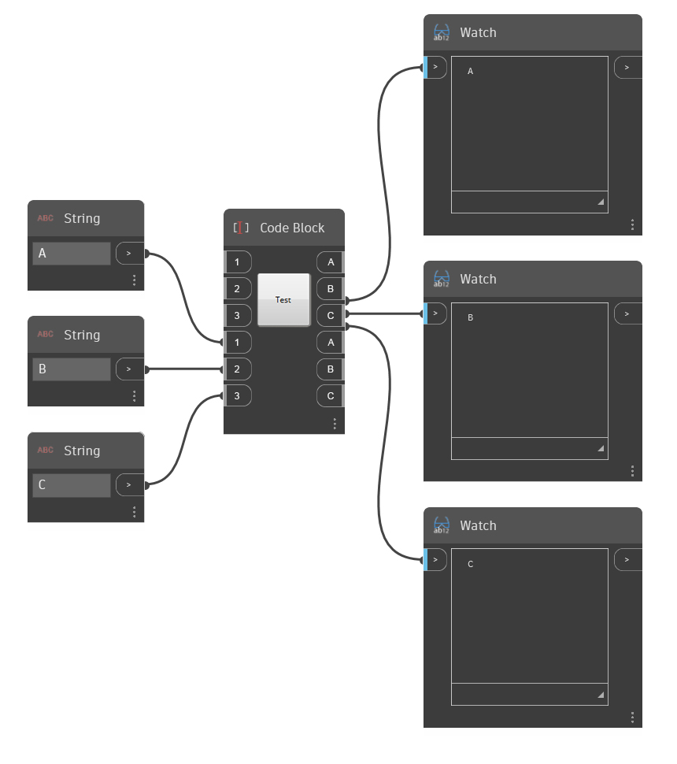

# NodeModel Case Study - Custom UI

NodeModel based nodes provides significantly more flexibility and power than the Zero-Touch nodes. In this example, we will take the Zero-Touch grid node to the next level by adding an integrated slider that randomizes the rectangle size.


> The slider scales the cells relative to their size so the user doesn't have to provide a slider with the correct range.

#### The Model-View-Viewmodel Pattern <a href="#the-model-view-viewmodel-pattern" id="the-model-view-viewmodel-pattern"></a>

Dynamo is based on the [model-view-viewmodel](https://en.wikipedia.org/wiki/Model%E2%80%93view%E2%80%93viewmodel) (MVVM) software architecture pattern to keep the UI separate from the back-end. When creating ZeroTouch nodes, Dynamo does the data bind between a node's data and its UI . To create a custom UI, we have to add the data-binding logic.

At a high-level there are two parts to establishing a model-view relationship in Dynamo:

* A `NodeModel` class to establish the core logic of the node (the "model")
* A `INodeViewCustomization` class to customize how the `NodeModel` is being viewed (the "view")

> NodeModel objects already have an associated view-model (NodeViewModel), so we can just focus on the model and view for custom UI.

#### How to Implement NodeModel <a href="#how-to-implement-nodemodel" id="how-to-implement-nodemodel"></a>

NodeModel nodes have several significant differences from Zero-Touch nodes that we will cover in this example. Before we jump into UI customization, let's start by building out the NodeModel logic.

**1. Create project structure:**

A NodeModel node can only call functions, so we need to separate the NodeModel and functions into different libraries. The standard way of doing this for Dynamo packages is creating separate projects for each. Start by creating a new Solution to encompass the projects.

> 1. Select `File > New > Project`
> 2. Select `Other Project Types` to bring up the Solution option
> 3. Select `Blank Solution`
> 4. Name the solution `CustomNodeModel`
> 5. Select `Ok`

Create two C# class library projects in the solution: one for functions and one to implement the NodeModel interface.


> 1. Right-click on the Solution and select `Add > New Project`
> 2. Choose Class Library
> 3. Name it `CustomNodeModel`
> 4. Click `Ok`
> 5. Repeat the process to add another project named `CustomNodeModelFunctions`

Next, we need to rename the class libraries that were automatically created and add one to the `CustomNodeModel` project. The class `GridNodeModel` implements the abstract NodeModel class, `GridNodeView` is used to customize the view, and `GridFunction` contains any functions we need to call.


> 1. Add another class by right-clicking on the `CustomNodeModel` project, selecting `Add > New Item...` and choose `Class`.
> 2. In the `CustomNodeModel` project, we need `GridNodeModel.cs` and `GridNodeView.cs` class
> 3. In the `CustomNodeModelFunction` project, we need a `GridFunctions.cs` class

Before we add any code to the classes, add the necessary packages for this project. `CustomNodeModel` will need ZeroTouchLibrary and WpfUILibrary, and `CustomNodeModelFunction` will only need ZeroTouchLibrary. The WpfUILibrary will be used in the UI customization we do later on, and ZeroTouchLibrary will be used for creating geometry. Packages can be added individually for projects. Since these packages have dependencies, Core and DynamoServices will be automatically installed.


> 1. Right-click on a project and select `Manage NuGet Packages`
> 2. Install only the required packages for that project

Visual Studio will copy the NuGet packages we referenced to the build directory. This can be set to false so we don't have any unnecessary files in the package.


> 1. Select Dynamo NuGet Packages
> 2. Set `Copy Local` to false

**2. Inherit the NodeModel class**

As mentioned previously, the primary aspect that makes a NodeModel node different from a ZeroTouch node is its implementation of the `NodeModel` class. A NodeModel node needs several functions from this class, and we can get them by adding `:NodeModel` after the class name.

Copy the following code into the `GridNodeModel.cs`.

```
using System;
using System.Collections.Generic;
using Dynamo.Graph.Nodes;
using CustomNodeModel.CustomNodeModelFunction;
using ProtoCore.AST.AssociativeAST;
using Autodesk.DesignScript.Geometry;

namespace CustomNodeModel.CustomNodeModel
{
    [NodeName("RectangularGrid")]
    [NodeDescription("An example NodeModel node that creates a rectangular grid. The slider randomly scales the cells.")]
    [NodeCategory("CustomNodeModel")]
    [InPortNames("xCount", "yCount")]
    [InPortTypes("double", "double")]
    [InPortDescriptions("Number of cells in the X direction", "Number of cells in the Y direction")]
    [OutPortNames("Rectangles")]
    [OutPortTypes("Autodesk.DesignScript.Geometry.Rectangle[]")]
    [OutPortDescriptions("A list of rectangles")]
    [IsDesignScriptCompatible]
    public class GridNodeModel : NodeModel
    {
        private double _sliderValue;
        public double SliderValue
        {
            get { return _sliderValue; }
            set
            {
                _sliderValue = value;
                RaisePropertyChanged("SliderValue");
                OnNodeModified(false);
            }
        }
        public GridNodeModel()
        {
            RegisterAllPorts();
        }
        public override IEnumerable<AssociativeNode> BuildOutputAst(List<AssociativeNode> inputAstNodes)
        {
            if (!HasConnectedInput(0) || !HasConnectedInput(1))
            {
                return new[] { AstFactory.BuildAssignment(GetAstIdentifierForOutputIndex(0), AstFactory.BuildNullNode()) };
            }
            var sliderValue = AstFactory.BuildDoubleNode(SliderValue);
            var functionCall =
              AstFactory.BuildFunctionCall(
                new Func<int, int, double, List<Rectangle>>(GridFunction.RectangularGrid),
                new List<AssociativeNode> { inputAstNodes[0], inputAstNodes[1], sliderValue });

            return new[] { AstFactory.BuildAssignment(GetAstIdentifierForOutputIndex(0), functionCall) };
        }
    }
}
```

This different from Zero-Touch nodes. Let's understand what each part is doing.

* Specify the Node attributes like Name, Category, InPort/OutPort names, InPort/OutPort types, descriptions.
* `public class GridNodeModel : NodeModel` is a class that inherits the `NodeModel` class from `Dynamo.Graph.Nodes`.
* `public GridNodeModel() { RegisterAllPorts(); }` is a constructor that registers the node inputs and outputs.
* `BuildOutputAst()` returns an AST (Abstract Syntax Tree), the required structure for returning data from a NodeModel node.
* `AstFactory.BuildFunctionCall()` calls the RectangularGrid function from `GridFunctions.cs`.
* `new Func<int, int, double, List<Rectangle>>(GridFunction.RectangularGrid)` specifies the function and its parameters .
* `new List<AssociativeNode> { inputAstNodes[0], inputAstNodes[1], sliderValue });` maps the node inputs to function parameters
* `AstFactory.BuildNullNode()` builds a null node if the input ports are not connected. This is to avoid displaying a warning on the node.
* `RaisePropertyChanged("SliderValue")`Notifies the UI when the slider value changes
* `var sliderValue = AstFactory.BuildDoubleNode(SliderValue)`Build a node in the AST that represents the slider value
* Change an input to the `sliderValue` variable in the functionCall variable `new List<AssociativeNode> { inputAstNodes[0], sliderValue });`

**3. Call a function**

The `CustomNodeModelFunction` project will be built into a separate assembly from `CustomNodeModel` so that it can be called.

Copy the following code into `GridFunction.cs`.

```
using Autodesk.DesignScript.Geometry;
using Autodesk.DesignScript.Runtime;
using System;
using System.Collections.Generic;

namespace CustomNodeModel.CustomNodeModelFunction
{
    [IsVisibleInDynamoLibrary(false)]
    public class GridFunction
    {
        [IsVisibleInDynamoLibrary(false)]
        public static List<Rectangle> RectangularGrid(int xCount = 10, int yCount = 10, double rand = 1)
        {
            double x = 0;
            double y = 0;

            Point pt = null;
            Vector vec = null;
            Plane bP = null;

            Random rnd = new Random(2);

            var pList = new List<Rectangle>();
            for (int i = 0; i < xCount; i++)
            {
                y++;
                x = 0;
                for (int j = 0; j < yCount; j++)
                {
                    double rNum = rnd.NextDouble();
                    double scale = rNum * (1 - rand) + rand;
                    x++;
                    pt = Point.ByCoordinates(x, y);
                    vec = Vector.ZAxis();
                    bP = Plane.ByOriginNormal(pt, vec);
                    Rectangle rect = Rectangle.ByWidthLength(bP, scale, scale);
                    pList.Add(rect);
                }
            }
            pt.Dispose();
            vec.Dispose();
            bP.Dispose();
            return pList;
        }
    }
}
```

This function class is very similar to the Zero-Touch Grid case study with one difference:

* `[IsVisibleInDynamoLibrary(false)]` prevents Dynamo from "seeing" the following method and class since the function is already being called from `CustomNodeModel`.

Just as we added references for NuGet packages, `CustomNodeModel` will need to reference `CustomNodeModelFunction` to call the function.


> The using statement for CustomNodeModel will be inactive until we reference the function
>
> 1. Right-click on `CustomNodeModel` and select `Add > Reference`
> 2. Choose `Projects > Solution`
> 3. Check `CustomNodeModelFunction`
> 4. Click `Ok`

**4. Customize the view**

To create a slider, we need to customize the UI by implementing the `INodeViewCustomization` interface.

Copy the following code into `GridNodeView.cs`

```
using Dynamo.Controls;
using Dynamo.Wpf;

namespace CustomNodeModel.CustomNodeModel
{
    public class CustomNodeModelView : INodeViewCustomization<GridNodeModel>
    {
        public void CustomizeView(GridNodeModel model, NodeView nodeView)
        {
            var slider = new Slider();
            nodeView.inputGrid.Children.Add(slider);
            slider.DataContext = model;
        }

        public void Dispose()
        {
        }
    }
}
```

* `public class CustomNodeModelView : INodeViewCustomization<GridNodeModel>` defines the necessary functions to customize the UI.

After the structure of the project is set up, use Visual Studio's design environment to build a user control and define its parameters in an `.xaml` file. From the tool box, add a slider to `<Grid>...</Grid>`.


> 1. Right click on `CustomNodeModel` and select `Add > New Item`
> 2. Select `WPF`
> 3. Name the user control `Slider`
> 4. Click `Add`

Copy the following code into `Slider.xaml`

```
<UserControl x:Class="CustomNodeModel.CustomNodeModel.Slider"
             xmlns="http://schemas.microsoft.com/winfx/2006/xaml/presentation"
             xmlns:x="http://schemas.microsoft.com/winfx/2006/xaml"
             xmlns:mc="http://schemas.openxmlformats.org/markup-compatibility/2006" 
             xmlns:d="http://schemas.microsoft.com/expression/blend/2008" 
             xmlns:local="clr-namespace:CustomNodeModel.CustomNodeModel"
             mc:Ignorable="d" 
             d:DesignHeight="75" d:DesignWidth="100">
    <Grid Margin="10">
        <Slider Grid.Row="0" Width="80" Minimum="0" Maximum="1" IsSnapToTickEnabled="True" TickFrequency="0.01" Value="{Binding SliderValue}"/>
    </Grid>
</UserControl>
```

* The parameters of the slider control is defined in In the `.xaml` file. _Minimum and Maximum_ attributes defines the the numerical range of this slider.
* Inside `<Grid>...</Grid>` we can place different user controls from the Visual Studio Toolbox

When we created the `Slider.xaml` file, Visual Studio automatically created a C# file called `Slider.xaml.cs` that initializes the slider. Change the namespace in this file.

```
using System.Windows.Controls;

namespace CustomNodeModel.CustomNodeModel
{
    /// <summary>
    /// Interaction logic for Slider.xaml
    /// </summary>
    public partial class Slider : UserControl
    {
        public Slider()
        {
            InitializeComponent();
        }
    }
}
```

* The namespace should be `CustomNodeModel.CustomNodeModel`

The `GridNodeModel.cs`, defines the slider computation logic.

**5. Configure as a package**

Before we build the project, the final step is to add a `pkg.json` file so that Dynamo can read the package.


> 1. Right-click on `CustomNodeModel` and select `Add > New Item`
> 2. Select `Web`
> 3. Select `JSON File`
> 4. Name the file `pkg.json`
> 5. Click `Add`

* Copy the following code into `pkg.json`

```
{
  "license": "MIT",
  "file_hash": null,
  "name": "CustomNodeModel",
  "version": "1.0.0",
  "description": "Sample node",
  "group": "CustomNodes",
  "keywords": [ "grid", "random" ],
  "dependencies": [],
  "contents": "Sample node",
  "engine_version": "1.3.0",
  "engine": "dynamo",
  "engine_metadata": "",
  "site_url": "",
  "repository_url": "",
  "contains_binaries": true,
  "node_libraries": [
    "CustomNodeModel, Version=1.0.0, Culture=neutral, PublicKeyToken=null",
    "CustomNodeModelFunction, Version=1.0.0, Culture=neutral, PublicKeyToken=null"
  ]
}
```

* `"name":` determines the name of the package and its group in the Dynamo Library
* `"keywords":` provide search terms for searching the Dynamo Library
*   `"node_libraries": []` the libraries associated with the package

    The last step is to build the solution and publish as a Dynamo package. Please see the Package Deployment chapter for how to create a local package before publishing online and how to build a package right out of Visual Studio.
  
#### Common Issues: <a href="#common-issues" id="common-issues"></a>

1\) Upon opening a graph some nodes have multiple ports with the same name, but the graph looked fine when saving. This issue can have a few causes.

The common root cause is because the node was created using a constructor that recreated the ports. Instead a constructor which loaded the ports should have been used. These constructors are usually marked `[JsonConstructor]` _see below for examples_



This can occur because:

* There was simply no matching `[JsonConstructor]`, or it was not passed the `Inports` and `Outports` from the JSON .dyn.
* There were two versions of JSON.net loaded into the same process at the same time causing .net runtime failure so that the `[JsonConstructor]` attribute could not be used correctly to mark the constructor.
* DynamoServices.dll with a different version than the current dynamo version has been bundled with the package and is causing the .net runtime to fail to identify the `[MultiReturn]` attribute so zero touch nodes marked with various attributes will fail to have them applied. You might find that a node returns a single dictionary output instead of multiple ports.

2\) Nodes are completely missing upon loading the graph with some errors in the console.

* This might occur if your deserialization failed for some reason. It's good practice to serialize only properties you need. We can use `[JsonIgnore]` on complex properties you don't need to load or save to ignore them. Properties like a `function pointer, delegate, action,` or `event` etc. These should not be serialized as they will usually fail to deserialize and cause a runtime error.

