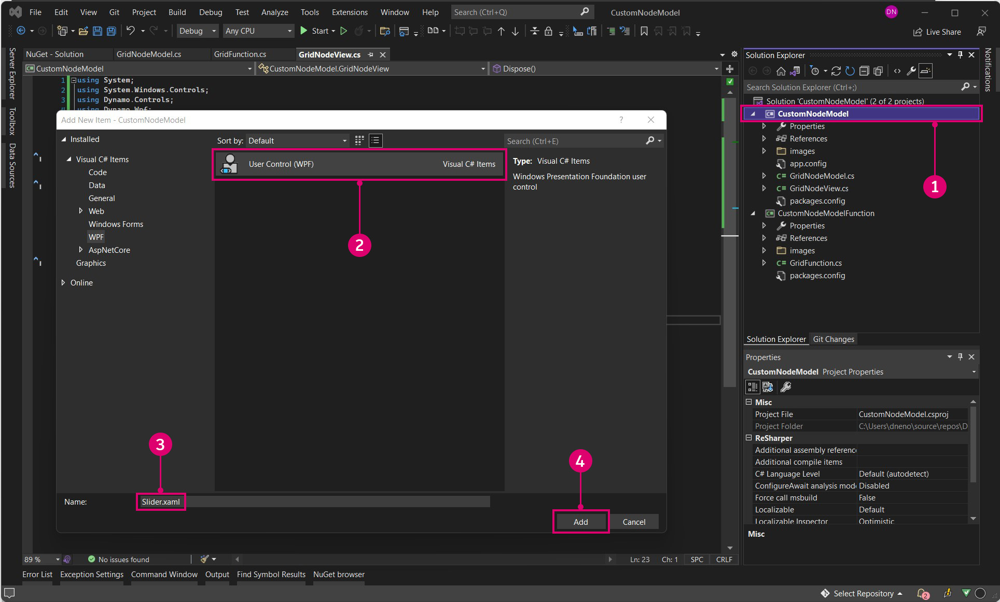

# NodeModel-Fallstudie - Angepasste Benutzeroberfläche

Auf NodeModel basierende Blöcke bieten erheblich mehr Flexibilität und Leistung als Zero-Touch-Blöcke. In diesem Beispiel wird der Zero-Touch-Rasterblock weiter optimiert. Dazu wird ein integrierter Schieberegler hinzugefügt, mit dem die Größe des Rechtecks zufällig festgelegt wird.


> Der Schieberegler skaliert die Zellen relativ zu ihrer Größe, sodass der Benutzer keinen Schieberegler mit dem richtigen Bereich zur Verfügung stellen muss.

#### Model-View-Viewmodel-Muster <a href="#the-model-view-viewmodel-pattern" id="the-model-view-viewmodel-pattern"></a>

Dynamo basiert auf dem Software-Architekturmuster [Model-view-viewmodel](https://en.wikipedia.org/wiki/Model%E2%80%93view%E2%80%93viewmodel) (MVVM), um die Benutzeroberfläche vom Backend getrennt zu halten. Beim Erstellen von Zero-Touch-Blöcken nimmt Dynamo die Datenbindung zwischen den Daten eines Blocks und der zugehörigen Benutzeroberfläche vor. Um eine angepasste Benutzeroberfläche zu erstellen, müssen wir die Datenbindungslogik hinzufügen.

Allgemein gehören zur Erstellung einer Model-View-Beziehung in Dynamo zwei Aspekte:

* Eine `NodeModel`-Klasse zum Einrichten der Kernlogik des Blocks (Modell)
* Eine `INodeViewCustomization`-Klasse zum Anpassen der Anzeige von `NodeModel` (Ansicht)

> NodeModel-Objekte verfügen bereits über eine verknüpfte View-Model-Beziehung (NodeViewModel). Daher können wir uns auf das Modell und die Ansicht für eine angepasste Benutzeroberfläche konzentrieren.

#### So implementieren Sie NodeModel <a href="#how-to-implement-nodemodel" id="how-to-implement-nodemodel"></a>

NodeModel-Blöcke unterscheiden sich in einigen wichtigen Punkten von Zero-Touch-Blöcken, die in diesem Beispiel behandelt werden. Bevor wir uns mit der Anpassung der Benutzeroberfläche befassen, erstellen wir zunächst die NodeModel-Logik.

**1\. Erstellen der Projektstruktur:**

Ein NodeModel-Block kann nur Funktionen aufrufen. Daher müssen wir den Block NodeModel und die Funktionen in verschiedene Bibliotheken unterteilen. Die Standardmethode hierfür besteht für Dynamo-Pakete darin, für jedes Paket ein separates Projekt zu erstellen. Beginnen Sie mit dem Erstellen einer neuen Projektmappe, die die Projekte enthält.

> 1. Wählen Sie `File > New > Project` aus.
> 2. Wählen Sie `Other Project Types` aus, um die Option Projektmappe aufzurufen.
> 3. Wählen Sie `Blank Solution` aus.
> 4. Geben Sie der Projektmappe den Namen `CustomNodeModel`.
> 5. Wählen Sie `Ok` aus.

Erstellen Sie in der Projektmappe zwei C#-Klassenbibliotheksprojekte: eines für Funktionen und eines zur Implementierung der NodeModel-Schnittstelle.


> 1. Klicken Sie mit der rechten Maustaste auf die Projektmappe, und wählen Sie `Add > New Project`.
> 2. Wählen Sie die Klassenbibliothek.
> 3. Vergeben Sie den Namen `CustomNodeModel`.
> 4. Klicken Sie auf `Ok`.
> 5. Wiederholen Sie den Vorgang, um ein weiteres Projekt mit dem Namen `CustomNodeModelFunctions` hinzuzufügen.

Als Nächstes müssen wir die automatisch erstellten Klassenbibliotheken umbenennen und dem Projekt `CustomNodeModel` eine der Bibliotheken hinzufügen. Die `GridNodeModel`-Klasse implementiert die abstrakte NodeModel-Klasse, `GridNodeView` wird zum Anpassen der Ansicht verwendet, und `GridFunction` enthält alle Funktionen, die aufgerufen werden müssen.


> 1. Fügen Sie eine weitere Klasse hinzu, indem Sie mit der rechten Maustaste auf das Projekt `CustomNodeModel` klicken, `Add > New Item...` auswählen und `Class` wählen.
> 2. Im Projekt `CustomNodeModel` benötigen wir die Klassen `GridNodeModel.cs` und `GridNodeView.cs`.
> 3. Für das Projekt `CustomNodeModelFunction` benötigen wir eine `GridFunctions.cs`-Klasse.

Bevor wir den Klassen Code hinzufügen, fügen wir die erforderlichen Pakete für dieses Projekt hinzu. `CustomNodeModel` benötigt ZeroTouchLibrary und WpfUILibrary, `CustomNodeModelFunction` benötigt nur ZeroTouchLibrary. WpfUILibrary wird später bei der Anpassung der Benutzeroberfläche verwendet, und ZeroTouchLibrary wird zum Erstellen von Geometrie verwendet. Pakete können einzeln für Projekte hinzugefügt werden. Da diese Pakete Abhängigkeiten aufweisen, werden Core und DynamoServices automatisch installiert.


> 1. Klicken Sie mit der rechten Maustaste auf ein Projekt, und wählen Sie `Manage NuGet Packages`.
> 2. Installieren Sie nur die für dieses Projekt erforderlichen Pakete.

Visual Studio kopiert die NuGet-Pakete, die im Build-Verzeichnis referenziert werden. Dies kann auf False gesetzt werden, damit keine unnötigen Dateien im Paket vorhanden sind.


> 1. Wählen Sie Dynamo-NuGet-Pakete aus.
> 2. Legen Sie `Copy Local` auf False fest.

**2\. Übernehmen der NodeModel-Klasse**

Wie bereits erwähnt, ist der wichtigste Aspekt, der einen NodeModel-Block von einem ZeroTouch-Block unterscheidet, die Implementierung der `NodeModel`-Klasse. Ein NodeModel-Block benötigt mehrere Funktionen aus dieser Klasse. Fügen Sie nach dem Klassennamen `:NodeModel` hinzu, um sie abzurufen.

Kopieren Sie den folgenden Code in `GridNodeModel.cs`.

```
using System;
using System.Collections.Generic;
using Dynamo.Graph.Nodes;
using CustomNodeModel.CustomNodeModelFunction;
using ProtoCore.AST.AssociativeAST;
using Autodesk.DesignScript.Geometry;

namespace CustomNodeModel.CustomNodeModel
{
    [NodeName("RectangularGrid")]
    [NodeDescription("An example NodeModel node that creates a rectangular grid. The slider randomly scales the cells.")]
    [NodeCategory("CustomNodeModel")]
    [InPortNames("xCount", "yCount")]
    [InPortTypes("double", "double")]
    [InPortDescriptions("Number of cells in the X direction", "Number of cells in the Y direction")]
    [OutPortNames("Rectangles")]
    [OutPortTypes("Autodesk.DesignScript.Geometry.Rectangle[]")]
    [OutPortDescriptions("A list of rectangles")]
    [IsDesignScriptCompatible]
    public class GridNodeModel : NodeModel
    {
        private double _sliderValue;
        public double SliderValue
        {
            get { return _sliderValue; }
            set
            {
                _sliderValue = value;
                RaisePropertyChanged("SliderValue");
                OnNodeModified(false);
            }
        }
        public GridNodeModel()
        {
            RegisterAllPorts();
        }
        public override IEnumerable<AssociativeNode> BuildOutputAst(List<AssociativeNode> inputAstNodes)
        {
            if (!HasConnectedInput(0) || !HasConnectedInput(1))
            {
                return new[] { AstFactory.BuildAssignment(GetAstIdentifierForOutputIndex(0), AstFactory.BuildNullNode()) };
            }
            var sliderValue = AstFactory.BuildDoubleNode(SliderValue);
            var functionCall =
              AstFactory.BuildFunctionCall(
                new Func<int, int, double, List<Rectangle>>(GridFunction.RectangularGrid),
                new List<AssociativeNode> { inputAstNodes[0], inputAstNodes[1], sliderValue });

            return new[] { AstFactory.BuildAssignment(GetAstIdentifierForOutputIndex(0), functionCall) };
        }
    }
}
```

Dies unterscheidet sich von Zero-Touch-Blöcken. Sehen wir uns die einzelnen Aspekte an.

* Geben Sie die Blockattribute wie Name, Kategorie, InPort-/OutPort-Namen, InPort-/OutPort-Typen und Beschreibungen an.
* `public class GridNodeModel : NodeModel` ist eine Klasse, die die `NodeModel`-Klasse von `Dynamo.Graph.Nodes` übernimmt.
* `public GridNodeModel() { RegisterAllPorts(); }` ist ein Konstruktor, der die Ein- und Ausgaben des Blocks registriert.
* `BuildOutputAst()` gibt einen AST (Abstract Syntax Tree, abstrakter Syntaxbaum) zurück, die erforderliche Struktur für die Rückgabe von Daten aus einem NodeModel-Block.
* `AstFactory.BuildFunctionCall()` ruft die Funktion RectangularGrid von `GridFunctions.cs` auf.
* `new Func<int, int, double, List<Rectangle>>(GridFunction.RectangularGrid)` gibt die Funktion und ihre Parameter an.
* `new List<AssociativeNode> { inputAstNodes[0], inputAstNodes[1], sliderValue });` ordnet die Blockeingaben den Funktionsparametern zu.
* `AstFactory.BuildNullNode()` erstellt einen Null-Block, wenn die Eingabeanschlüsse nicht verbunden sind. Dadurch wird vermieden, dass eine Warnung für den Block angezeigt wird.
* `RaisePropertyChanged("SliderValue")` benachrichtigt die Benutzeroberfläche, wenn sich der Schiebereglerwert ändert.
* `var sliderValue = AstFactory.BuildDoubleNode(SliderValue)` erstellt einen Block im AST, der den Schiebereglerwert darstellt.
* Ändern Sie eine Eingabe für die Variable `sliderValue` in der functionCall-Variablen `new List<AssociativeNode> { inputAstNodes[0], sliderValue });`.

**3\. Aufrufen einer Funktion**

Das Projekt `CustomNodeModelFunction` wird in einer anderen Assembly als `CustomNodeModel` erstellt, sodass es aufgerufen werden kann.

Kopieren Sie den folgenden Code in `GridFunction.cs`.

```
using Autodesk.DesignScript.Geometry;
using Autodesk.DesignScript.Runtime;
using System;
using System.Collections.Generic;

namespace CustomNodeModel.CustomNodeModelFunction
{
    [IsVisibleInDynamoLibrary(false)]
    public class GridFunction
    {
        [IsVisibleInDynamoLibrary(false)]
        public static List<Rectangle> RectangularGrid(int xCount = 10, int yCount = 10, double rand = 1)
        {
            double x = 0;
            double y = 0;

            Point pt = null;
            Vector vec = null;
            Plane bP = null;

            Random rnd = new Random(2);

            var pList = new List<Rectangle>();
            for (int i = 0; i < xCount; i++)
            {
                y++;
                x = 0;
                for (int j = 0; j < yCount; j++)
                {
                    double rNum = rnd.NextDouble();
                    double scale = rNum * (1 - rand) + rand;
                    x++;
                    pt = Point.ByCoordinates(x, y);
                    vec = Vector.ZAxis();
                    bP = Plane.ByOriginNormal(pt, vec);
                    Rectangle rect = Rectangle.ByWidthLength(bP, scale, scale);
                    pList.Add(rect);
                }
            }
            pt.Dispose();
            vec.Dispose();
            bP.Dispose();
            return pList;
        }
    }
}
```

Diese Funktionsklasse ist der Zero-Touch-Rasterfallstudie sehr ähnlich, mit einem Unterschied:

* `[IsVisibleInDynamoLibrary(false)]` verhindert, dass Dynamo die folgende Methode und Klasse "sieht", da die Funktion bereits von `CustomNodeModel` aufgerufen wird.

Genauso wie wir Referenzen für NuGet-Pakete hinzugefügt haben, muss `CustomNodeModel` auf `CustomNodeModelFunction` verweisen, um die Funktion aufzurufen.


> Die using-Anweisung für CustomNodeModel ist inaktiv, bis wir die Funktion referenzieren.
>
> 1. Klicken Sie mit der rechten Maustaste auf `CustomNodeModel`, und wählen Sie `Add > Reference` aus.
> 2. Wählen Sie `Projects > Solution`.
> 3. Aktivieren Sie `CustomNodeModelFunction`.
> 4. Klicken Sie auf `Ok`.

**4\. Anpassen der Ansicht**

Um einen Schieberegler zu erstellen, müssen wir die Benutzeroberfläche durch Implementierung der `INodeViewCustomization`-Schnittstelle anpassen.

Kopieren Sie den folgenden Code in `GridNodeView.cs`:

```
using Dynamo.Controls;
using Dynamo.Wpf;

namespace CustomNodeModel.CustomNodeModel
{
    public class CustomNodeModelView : INodeViewCustomization<GridNodeModel>
    {
        public void CustomizeView(GridNodeModel model, NodeView nodeView)
        {
            var slider = new Slider();
            nodeView.inputGrid.Children.Add(slider);
            slider.DataContext = model;
        }

        public void Dispose()
        {
        }
    }
}
```

* `public class CustomNodeModelView : INodeViewCustomization<GridNodeModel>` definiert die Funktionen, die zum Anpassen der Benutzeroberfläche erforderlich sind.

Nachdem die Struktur des Projekts eingerichtet wurde, verwenden Sie die Entwurfsumgebung von Visual Studio, um ein Benutzersteuerelement zu erstellen und dessen Parameter in einer `.xaml`-Datei zu definieren. Fügen Sie im Werkzeugkasten einen Schieberegler zu `<Grid>...</Grid>` hinzu.



> 1. Klicken Sie mit der rechten Maustaste auf `CustomNodeModel`, und wählen Sie `Add > New Item` aus.
> 2. Wählen Sie `WPF` aus.
> 3. Geben Sie dem Benutzersteuerelement den Namen `Slider`.
> 4. Klicken Sie auf `Add`.

Kopieren Sie den folgenden Code in `Slider.xaml`:

```
<UserControl x:Class="CustomNodeModel.CustomNodeModel.Slider"
             xmlns="http://schemas.microsoft.com/winfx/2006/xaml/presentation"
             xmlns:x="http://schemas.microsoft.com/winfx/2006/xaml"
             xmlns:mc="http://schemas.openxmlformats.org/markup-compatibility/2006" 
             xmlns:d="http://schemas.microsoft.com/expression/blend/2008" 
             xmlns:local="clr-namespace:CustomNodeModel.CustomNodeModel"
             mc:Ignorable="d" 
             d:DesignHeight="75" d:DesignWidth="100">
    <Grid Margin="10">
        <Slider Grid.Row="0" Width="80" Minimum="0" Maximum="1" IsSnapToTickEnabled="True" TickFrequency="0.01" Value="{Binding SliderValue}"/>
    </Grid>
</UserControl>
```

* Die Parameter des Schiebereglers werden in der `.xaml`-Datei definiert. _Minimum- und Maximum_-Attribute definieren den numerischen Bereich dieses Schiebereglers.
* In `<Grid>...</Grid>` können wir verschiedene Benutzersteuerelemente aus dem Visual Studio-Werkzeugkasten platzieren.

Beim Erstellen der Datei `Slider.xaml` hat Visual Studio automatisch eine C#-Datei mit dem Namen `Slider.xaml.cs` erstellt, die den Schieberegler initialisiert. Ändern Sie den Namensbereich in dieser Datei.

```
using System.Windows.Controls;

namespace CustomNodeModel.CustomNodeModel
{
    /// <summary>
    /// Interaction logic for Slider.xaml
    /// </summary>
    public partial class Slider : UserControl
    {
        public Slider()
        {
            InitializeComponent();
        }
    }
}
```

* Der Namensbereich sollte `CustomNodeModel.CustomNodeModel` lauten.

In `GridNodeModel.cs` wird die Berechnungslogik des Schiebereglers definiert.

**5\. Konfigurieren als Paket**

Bevor wir das Projekt erstellen, fügen wir im letzten Schritt eine `pkg.json`-Datei hinzu, damit Dynamo das Paket lesen kann.


> 1. Klicken Sie mit der rechten Maustaste auf `CustomNodeModel`, und wählen Sie `Add > New Item` aus.
> 2. Wählen Sie `Web` aus.
> 3. Wählen Sie `JSON File` aus.
> 4. Geben Sie der Datei den Namen `pkg.json`.
> 5. Klicken Sie auf `Add`.

* Kopieren Sie den folgenden Code in `pkg.json`:

```
{
  "license": "MIT",
  "file_hash": null,
  "name": "CustomNodeModel",
  "version": "1.0.0",
  "description": "Sample node",
  "group": "CustomNodes",
  "keywords": [ "grid", "random" ],
  "dependencies": [],
  "contents": "Sample node",
  "engine_version": "1.3.0",
  "engine": "dynamo",
  "engine_metadata": "",
  "site_url": "",
  "repository_url": "",
  "contains_binaries": true,
  "node_libraries": [
    "CustomNodeModel, Version=1.0.0, Culture=neutral, PublicKeyToken=null",
    "CustomNodeModelFunction, Version=1.0.0, Culture=neutral, PublicKeyToken=null"
  ]
}
```

* `"name":` Bestimmt den Namen des Pakets und dessen Gruppe in der Dynamo-Bibliothek.
* `"keywords":` Geben Sie Suchbegriffe für die Suche in der Dynamo-Bibliothek an.
*   `"node_libraries": []` Die mit dem Paket verknüpften Bibliotheken.

    Der letzte Schritt besteht darin, die Projektmappe zu erstellen und als Dynamo-Paket zu publizieren. Im Kapitel Paketbereitstellung finden Sie Informationen zum Erstellen eines lokalen Pakets vor der Online-Publizierung und zum Erstellen eines Pakets direkt in Visual Studio.
