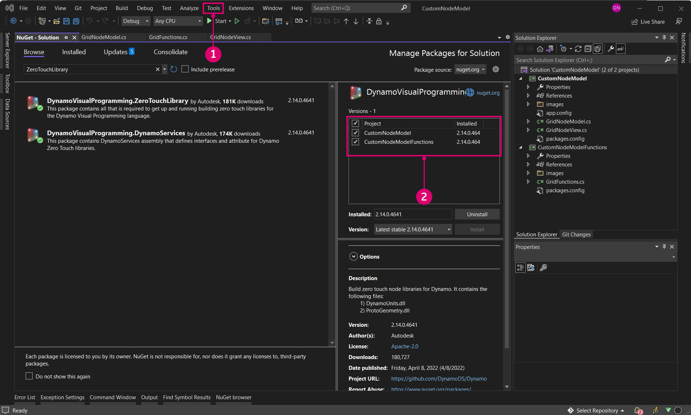

# Estudo de caso do NodeModel – Interface do usuário personalizada 

Os nós baseados no NodeModel fornecem significativamente mais flexibilidade e potência do que os nós Sem toque. Neste exemplo, levaremos o nó de grade Sem toque para o próximo nível ao adicionar um controle deslizante integrado que randomiza o tamanho do retângulo.


> O controle deslizante dimensiona as células em relação a seu tamanho, de modo que o usuário não precise fornecer um controle deslizante com o intervalo correto.

#### Padrão “Model-View-Viewmodel”<a href="#the-model-view-viewmodel-pattern" id="the-model-view-viewmodel-pattern"></a>

O Dynamo é baseado no padrão de arquitetura do software [model-view-viewmodel](https://en.wikipedia.org/wiki/Model%E2%80%93view%E2%80%93viewmodel) (MVVM) para manter a interface do usuário separada do back-end. Ao criar nós Sem toque, o Dynamo faz a associação de dados entre os dados de um nó e sua interface de usuário. Para criar uma interface de usuário personalizada, é preciso adicionar a lógica de vinculação de dados.

Em um alto nível, há duas partes para estabelecer uma relação de vista de modelo no Dynamo:

* Uma classe `NodeModel` para estabelecer a lógica central do nó (o “modelo”)
* Uma classe `INodeViewCustomization` para personalizar como o `NodeModel` está sendo visualizado (a “vista”)

> Os objetos NodeModel já têm um modelo de vista associado (NodeViewModel), portanto, podemos nos concentrar no modelo e na vista para a interface do usuário personalizada.

#### Como implementar o NodeModel <a href="#how-to-implement-nodemodel" id="how-to-implement-nodemodel"></a>

Os nós NodeModel têm diversas diferenças significativas dos nós Sem toque que abordaremos neste exemplo. Antes de passarmos para a personalização da interface do usuário, vamos começar compilando a lógica do NodeModel.

**1\. Criar a estrutura do projeto:**

Um nó NodeModel pode chamar somente funções, portanto, precisamos separar o NodeModel e as funções em diferentes bibliotecas. A forma padrão de fazer isso para pacotes do Dynamo é criar projetos separados para cada um. Comece criando uma nova solução para englobar os projetos.

> 1. Selecionar `File > New > Project`
> 2. Selecionar `Other Project Types` para ativar a opção Solução
> 3. Selecionar `Blank Solution`
> 4. Nomear a solução `CustomNodeModel`
> 5. Selecionar `Ok`

Crie dois projetos de biblioteca de classes C# na solução: um para as funções e outro para implementar a interface NodeModel.


> 1. Clicar com o botão direito do mouse na Solução e selecionar `Add > New Project`
> 2. Escolher a biblioteca de classes
> 3. Nomeá-la `CustomNodeModel`
> 4. Clicar em `Ok`
> 5. Repita o processo para adicionar outro projeto nomeado `CustomNodeModelFunctions`

Em seguida, precisamos renomear as bibliotecas de classes que foram criadas automaticamente e adicionar uma ao projeto `CustomNodeModel`. A classe `GridNodeModel` implementa a classe NodeModel abstrata, `GridNodeView` é usada para personalizar a vista e `GridFunction` contém as funções que precisamos chamar.


> 1. Adicionar outra classe clicando com o botão direito do mouse no projeto `CustomNodeModel`, selecionando `Add > New Item...` e escolhendo `Class`.
> 2. No projeto `CustomNodeModel`, precisamos das classes `GridNodeModel.cs` e `GridNodeView.cs`
> 3. No projeto `CustomNodeModelFunction`, precisamos de uma classe `GridFunctions.cs`

Antes de adicionarmos qualquer código às classes, adicione os pacotes necessários para este projeto. `CustomNodeModel` precisará de ZeroTouchLibrary e WpfUILibrary e `CustomNodeModelFunction` só precisará de ZeroTouchLibrary. A biblioteca WpfUIL será usada na personalização da interface do usuário que faremos mais tarde, e a biblioteca ZeroTouchLibrary será usada para criar a geometria. É possível adicionar os pacotes individualmente para os projetos. Como esses pacotes têm dependências, o Core e o DynamoServices serão instalados automaticamente.



> 1. Clicar com o botão direito do mouse em um projeto e selecionar `Manage NuGet Packages`
> 2. Instalar somente os pacotes necessários para aquele projeto

O Visual Studio copiará os pacotes NuGet aos quais fizemos referência para o diretório de compilação. Isso pode ser definido como false, para que não tenhamos arquivos desnecessários no pacote.


> 1. Selecionar pacotes do Dynamo NuGet
> 2. Definir `Copy Local` como false

**2\. Herdar a classe NodeModel**

Como mencionado anteriormente, o aspecto principal que torna um nó NodeModel diferente de um nó Sem toque é a implementação da classe `NodeModel`. Um nó NodeModel precisa de diversas funções dessa classe, e podemos obtê-las adicionando `:NodeModel` após o nome da classe.

Copie o seguinte código para o `GridNodeModel.cs`.

```
using System;
using System.Collections.Generic;
using Dynamo.Graph.Nodes;
using CustomNodeModel.CustomNodeModelFunction;
using ProtoCore.AST.AssociativeAST;
using Autodesk.DesignScript.Geometry;

namespace CustomNodeModel.CustomNodeModel
{
    [NodeName("RectangularGrid")]
    [NodeDescription("An example NodeModel node that creates a rectangular grid. The slider randomly scales the cells.")]
    [NodeCategory("CustomNodeModel")]
    [InPortNames("xCount", "yCount")]
    [InPortTypes("double", "double")]
    [InPortDescriptions("Number of cells in the X direction", "Number of cells in the Y direction")]
    [OutPortNames("Rectangles")]
    [OutPortTypes("Autodesk.DesignScript.Geometry.Rectangle[]")]
    [OutPortDescriptions("A list of rectangles")]
    [IsDesignScriptCompatible]
    public class GridNodeModel : NodeModel
    {
        private double _sliderValue;
        public double SliderValue
        {
            get { return _sliderValue; }
            set
            {
                _sliderValue = value;
                RaisePropertyChanged("SliderValue");
                OnNodeModified(false);
            }
        }
        public GridNodeModel()
        {
            RegisterAllPorts();
        }
        public override IEnumerable<AssociativeNode> BuildOutputAst(List<AssociativeNode> inputAstNodes)
        {
            if (!HasConnectedInput(0) || !HasConnectedInput(1))
            {
                return new[] { AstFactory.BuildAssignment(GetAstIdentifierForOutputIndex(0), AstFactory.BuildNullNode()) };
            }
            var sliderValue = AstFactory.BuildDoubleNode(SliderValue);
            var functionCall =
              AstFactory.BuildFunctionCall(
                new Func<int, int, double, List<Rectangle>>(GridFunction.RectangularGrid),
                new List<AssociativeNode> { inputAstNodes[0], inputAstNodes[1], sliderValue });

            return new[] { AstFactory.BuildAssignment(GetAstIdentifierForOutputIndex(0), functionCall) };
        }
    }
}
```

Isso é diferente dos nós Sem toque. Vamos entender o que cada parte está fazendo.

* Especificar os atributos do nó, como nomes Name, Category, InPort/OutPort, tipos InPort/OutPort e descrições.
* `public class GridNodeModel : NodeModel` é uma classe que herda a classe `NodeModel` de `Dynamo.Graph.Nodes`.
* `public GridNodeModel() { RegisterAllPorts(); }` é um construtor que registra as entradas e saídas do nó.
* `BuildOutputAst()` retorna um AST (Abstract Syntax Tree), a estrutura necessária para retornar os dados de um nó NodeModel.
* `AstFactory.BuildFunctionCall()` chama a função RetangularGrid de `GridFunctions.cs`.
* `new Func<int, int, double, List<Rectangle>>(GridFunction.RectangularGrid)` especifica a função e seus parâmetros.
* `new List<AssociativeNode> { inputAstNodes[0], inputAstNodes[1], sliderValue });` mapeia as entradas do nó para parâmetros de função
* `AstFactory.BuildNullNode()` compilará um nó nulo se as portas de entrada não estiverem conectadas. Isso é para evitar a exibição de um aviso no nó.
* `RaisePropertyChanged("SliderValue")` notifica a interface do usuário quando o valor do controle deslizante é alterado
* `var sliderValue = AstFactory.BuildDoubleNode(SliderValue)` compila um nó no AST que representa o valor do controle deslizante
* Alterar uma entrada para a variável `sliderValue` na variável functionCall `new List<AssociativeNode> { inputAstNodes[0], sliderValue });`

**3\. Chamar uma função**

O projeto `CustomNodeModelFunction` será compilado em uma montagem separada de `CustomNodeModel` para que possa ser chamado.

Copie o seguinte código para `GridFunction.cs`.

```
using Autodesk.DesignScript.Geometry;
using Autodesk.DesignScript.Runtime;
using System;
using System.Collections.Generic;

namespace CustomNodeModel.CustomNodeModelFunction
{
    [IsVisibleInDynamoLibrary(false)]
    public class GridFunction
    {
        [IsVisibleInDynamoLibrary(false)]
        public static List<Rectangle> RectangularGrid(int xCount = 10, int yCount = 10, double rand = 1)
        {
            double x = 0;
            double y = 0;

            Point pt = null;
            Vector vec = null;
            Plane bP = null;

            Random rnd = new Random(2);

            var pList = new List<Rectangle>();
            for (int i = 0; i < xCount; i++)
            {
                y++;
                x = 0;
                for (int j = 0; j < yCount; j++)
                {
                    double rNum = rnd.NextDouble();
                    double scale = rNum * (1 - rand) + rand;
                    x++;
                    pt = Point.ByCoordinates(x, y);
                    vec = Vector.ZAxis();
                    bP = Plane.ByOriginNormal(pt, vec);
                    Rectangle rect = Rectangle.ByWidthLength(bP, scale, scale);
                    pList.Add(rect);
                }
            }
            pt.Dispose();
            vec.Dispose();
            bP.Dispose();
            return pList;
        }
    }
}
```

Essa classe de função é muito similar ao estudo de caso de Grade sem Toque, com uma diferença:

* `[IsVisibleInDynamoLibrary(false)]` impede que o Dynamo “veja” o seguinte método e classe, já que a função já está sendo chamada de `CustomNodeModel`.

Assim como adicionamos referências para pacotes NuGet, `CustomNodeModel` precisará fazer referência a `CustomNodeModelFunction` para chamar a função.


> A declaração de uso para CustomNodeModel estará inativa até que a função seja referenciada
>
> 1. Clicar com o botão direito do mouse em `CustomNodeModel` e selecionar `Add > Reference`
> 2. Escolher `Projects > Solution`
> 3. Marcar `CustomNodeModelFunction`
> 4. Clicar em `Ok`

**4\. Personalizar a vista**

Para criar um controle deslizante, é preciso personalizar a interface do usuário implementando a interface do `INodeViewCustomization`.

Copie o seguinte código para `GridNodeView.cs`

```
using Dynamo.Controls;
using Dynamo.Wpf;

namespace CustomNodeModel.CustomNodeModel
{
    public class CustomNodeModelView : INodeViewCustomization<GridNodeModel>
    {
        public void CustomizeView(GridNodeModel model, NodeView nodeView)
        {
            var slider = new Slider();
            nodeView.inputGrid.Children.Add(slider);
            slider.DataContext = model;
        }

        public void Dispose()
        {
        }
    }
}
```

* `public class CustomNodeModelView : INodeViewCustomization<GridNodeModel>` define as funções necessárias para personalizar a interface do usuário.

Após a estrutura do projeto ter sido configurada, use o ambiente de projeto do Visual Studio para compilar um controle de usuário e definir seus parâmetros em um arquivo `.xaml`. Na caixa de ferramentas, adicione um controle deslizante a `<Grid>...</Grid>`.


> 1. Clicar com o botão direito do mouse em `CustomNodeModel` e selecionar `Add > New Item`
> 2. Selecionar `WPF`
> 3. Nomear o controle de usuário `Slider`
> 4. Clicar em `Add`

Copie o seguinte código para `Slider.xaml`

```
<UserControl x:Class="CustomNodeModel.CustomNodeModel.Slider"
             xmlns="http://schemas.microsoft.com/winfx/2006/xaml/presentation"
             xmlns:x="http://schemas.microsoft.com/winfx/2006/xaml"
             xmlns:mc="http://schemas.openxmlformats.org/markup-compatibility/2006" 
             xmlns:d="http://schemas.microsoft.com/expression/blend/2008" 
             xmlns:local="clr-namespace:CustomNodeModel.CustomNodeModel"
             mc:Ignorable="d" 
             d:DesignHeight="75" d:DesignWidth="100">
    <Grid Margin="10">
        <Slider Grid.Row="0" Width="80" Minimum="0" Maximum="1" IsSnapToTickEnabled="True" TickFrequency="0.01" Value="{Binding SliderValue}"/>
    </Grid>
</UserControl>
```

* Os parâmetros do controle deslizante são definidos no arquivo `.xaml`. Os atributos _Mínimo e Máximo_ definem o intervalo numérico dessa barra deslizante.
* Dentro de `<Grid>...</Grid>`, podemos colocar diferentes controles de usuário na caixa de ferramentas do Visual Studio

Quando criamos o arquivo `Slider.xaml`, o Visual Studio criou automaticamente um arquivo C# chamado `Slider.xaml.cs` que inicializa o controle deslizante. Altere o namespace nesse arquivo.

```
using System.Windows.Controls;

namespace CustomNodeModel.CustomNodeModel
{
    /// <summary>
    /// Interaction logic for Slider.xaml
    /// </summary>
    public partial class Slider : UserControl
    {
        public Slider()
        {
            InitializeComponent();
        }
    }
}
```

* O namespace deve ser `CustomNodeModel.CustomNodeModel`

O `GridNodeModel.cs` define a lógica de cálculo do controle deslizante.

**5\. Configurar como um pacote**

Antes de compilarmos o projeto, a etapa final é adicionar um arquivo `pkg.json` para que o Dynamo possa ler o pacote.


> 1. Clicar com o botão direito do mouse em `CustomNodeModel` e selecionar `Add > New Item`
> 2. Selecionar `Web`
> 3. Selecionar `JSON File`
> 4. Nomear o arquivo `pkg.json`
> 5. Clicar em `Add`

* Copie o seguinte código para `pkg.json`

```
{
  "license": "MIT",
  "file_hash": null,
  "name": "CustomNodeModel",
  "version": "1.0.0",
  "description": "Sample node",
  "group": "CustomNodes",
  "keywords": [ "grid", "random" ],
  "dependencies": [],
  "contents": "Sample node",
  "engine_version": "1.3.0",
  "engine": "dynamo",
  "engine_metadata": "",
  "site_url": "",
  "repository_url": "",
  "contains_binaries": true,
  "node_libraries": [
    "CustomNodeModel, Version=1.0.0, Culture=neutral, PublicKeyToken=null",
    "CustomNodeModelFunction, Version=1.0.0, Culture=neutral, PublicKeyToken=null"
  ]
}
```

* `"name":` determina o nome do pacote e seu grupo na biblioteca do Dynamo
* `"keywords":` fornece termos de pesquisa para pesquisar na biblioteca do Dynamo
*   `"node_libraries": []` as bibliotecas associadas ao pacote

    A última etapa é compilar a solução e publicar como um pacote do Dynamo. Consulte o capítulo Implantação do pacote para saber como criar um pacote local antes de publicar on-line e como compilar um pacote diretamente do Visual Studio.
