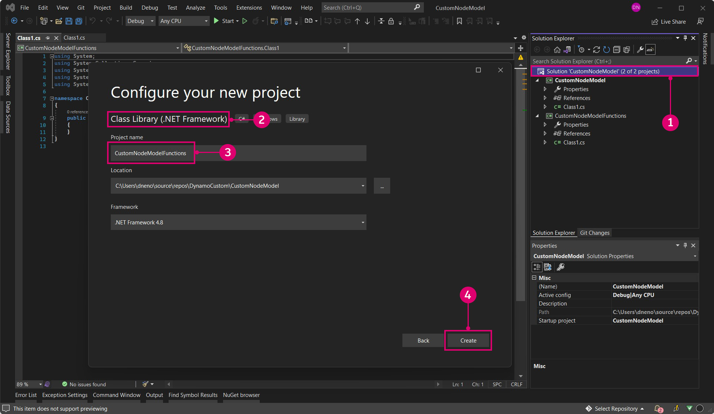
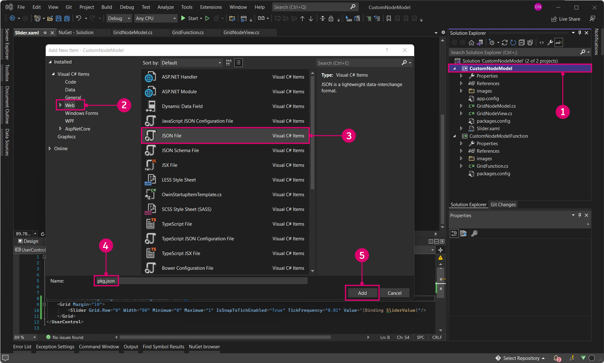

# NodeModel 사례 연구 - 사용자 지정 UI

NodeModel 기반 노드는 Zero-Touch 노드보다 훨씬 더 뛰어난 유연성과 강력한 기능을 제공합니다. 이 예에서는 직사각형 크기를 임의 지정하는 통합 슬라이더를 추가하여 Zero-Touch 그리드 노드를 한 단계 높여 보겠습니다.


> 슬라이더는 셀의 크기를 기준으로 셀의 크기를 조정하므로 사용자가 슬라이더의 범위를 정확하게 지정할 필요가 없습니다.

#### Model-View-Viewmodel 패턴 <a href="#the-model-view-viewmodel-pattern" id="the-model-view-viewmodel-pattern"></a>

Dynamo는 [model-view-viewmodel](https://en.wikipedia.org/wiki/Model%E2%80%93view%E2%80%93viewmodel) (MVVM) 소프트웨어 아키텍처 패턴을 기반으로 UI를 백엔드와 분리하여 유지합니다. ZeroTouch 노드를 만들 때 Dynamo는 노드의 데이터와 해당 UI 간에 데이터 바인딩을 수행합니다. 사용자 지정 UI를 생성하려면 데이터 바인딩 논리를 추가해야 합니다.

크게 보면 Dynamo에서 모델-뷰 관계를 설정하는 데는 두 가지 부분이 있습니다.

* 노드의 코어 논리를 설정하는 `NodeModel` 클래스("모델")
* `NodeModel`이 표시되는 방식을 사용자 지정하는 `INodeViewCustomization` 클래스("뷰")

> NodeModel 객체에는 이미 연관된 뷰-모델(NodeViewModel)이 있으므로 사용자 지정 UI를 위해 모델과 뷰에만 초점을 맞추면 됩니다.

#### NodeModel을 구현하는 방법 <a href="#how-to-implement-nodemodel" id="how-to-implement-nodemodel"></a>

NodeModel 노드는 Zero-Touch 노드와 몇 가지 중요한 차이점이 있으며, 이에 대해서는 이 예에서 다룰 것입니다. UI 사용자 지정으로 넘어가기 전에 NodeModel 논리를 빌드해 보겠습니다.

**1\. 프로젝트 구조 생성하기:**

NodeModel 노드는 함수를 호출할 수만 있으므로 NodeModel 및 함수를 서로 다른 라이브러리로 분리해야 합니다. Dynamo 패키지에 대해 이 작업을 수행하는 표준 방법은 각각에 대해 별도의 프로젝트를 생성하는 것입니다. 먼저 프로젝트를 포괄하는 새 솔루션을 생성합니다.

> 1. `File > New > Project`를 선택합니다.
> 2. `Other Project Types`를 선택하여 솔루션 옵션을 표시합니다.
> 3. `Blank Solution`을 선택합니다.
> 4. 솔루션의 이름을 `CustomNodeModel`로 지정합니다.
> 5. `Ok`를 선택합니다.

솔루션에서 C# 클래스 라이브러리 프로젝트 2개(함수용 프로젝트와 NodeModel 인터페이스를 구현하기 위한 프로젝트)를 생성합니다.



> 1. 솔루션을 마우스 오른쪽 버튼으로 클릭하고 `Add > New Project`를 선택합니다.
> 2. 클래스 라이브러리를 선택합니다.
> 3. 이름을 `CustomNodeModel`로 지정합니다.
> 4. `Ok`를 클릭합니다.
> 5. 프로세스를 반복하여 이름이 `CustomNodeModelFunctions`인 다른 프로젝트를 추가합니다.

다음으로, 자동으로 생성된 클래스 라이브러리의 이름을 바꾸고 하나를 `CustomNodeModel` 프로젝트에 추가해야 합니다. 클래스 `GridNodeModel`은 추상 NodeModel 클래스를 구현하고 `GridNodeView`는 뷰를 사용자 지정하는 데 사용되고, `GridFunction`에는 호출해야 하는 함수가 포함되어 있습니다.


> 1. `CustomNodeModel` 프로젝트를 마우스 오른쪽 버튼으로 클릭하고 `Add > New Item...`을 선택한 후 `Class`를 선택하여 다른 클래스를 추가합니다.
> 2. `CustomNodeModel` 프로젝트에는 `GridNodeModel.cs` 및 `GridNodeView.cs` 클래스가 필요합니다.
> 3. `CustomNodeModelFunction` 프로젝트에는 `GridFunctions.cs` 클래스가 필요합니다.

클래스에 코드를 추가하기 전에 이 프로젝트에 필요한 패키지를 추가합니다. `CustomNodeModel`에는 ZeroTouchLibrary 및 WpfUILlibrary가 필요하고 `CustomNodeModelFunction`에는 ZeroTouchLibrary만 필요합니다. WpfUILlibrary는 나중에 UI를 사용자 지정하는 데 사용되며 ZeroTouchLibrary는 형상을 생성하는 데 사용됩니다. 패키지는 프로젝트에 대해 개별적으로 추가할 수 있습니다. 이러한 패키지에는 종속성이 있으므로 Core 및 DynamoServices가 자동으로 설치됩니다.


> 1. 프로젝트를 마우스 오른쪽 버튼으로 클릭하고 `Manage NuGet Packages`를 선택합니다.
> 2. 해당 프로젝트에 필요한 패키지만 설치합니다.

Visual Studio는 빌드 디렉토리에 참조한 NuGet 패키지를 복사합니다. 패키지에 불필요한 파일이 포함되지 않도록 이 값을 false로 설정할 수 있습니다.


> 1. Dynamo NuGet 패키지를 선택합니다.
> 2. `Copy Local`를 false로 설정합니다.

**2\. NodeModel 클래스 상속하기**

앞에서 설명한 것처럼 NodeModel 노드가 ZeroTouch 노드와 다른 주요 측면은 `NodeModel` 클래스의 구현입니다. NodeModel 노드에는 이 클래스의 여러 함수가 필요하며, 클래스 이름 뒤에 `:NodeModel`을 추가하여 이러한 함수를 가져올 수 있습니다.

다음 코드를 `GridNodeModel.cs`에 복사합니다.

```
using System;
using System.Collections.Generic;
using Dynamo.Graph.Nodes;
using CustomNodeModel.CustomNodeModelFunction;
using ProtoCore.AST.AssociativeAST;
using Autodesk.DesignScript.Geometry;

namespace CustomNodeModel.CustomNodeModel
{
    [NodeName("RectangularGrid")]
    [NodeDescription("An example NodeModel node that creates a rectangular grid. The slider randomly scales the cells.")]
    [NodeCategory("CustomNodeModel")]
    [InPortNames("xCount", "yCount")]
    [InPortTypes("double", "double")]
    [InPortDescriptions("Number of cells in the X direction", "Number of cells in the Y direction")]
    [OutPortNames("Rectangles")]
    [OutPortTypes("Autodesk.DesignScript.Geometry.Rectangle[]")]
    [OutPortDescriptions("A list of rectangles")]
    [IsDesignScriptCompatible]
    public class GridNodeModel : NodeModel
    {
        private double _sliderValue;
        public double SliderValue
        {
            get { return _sliderValue; }
            set
            {
                _sliderValue = value;
                RaisePropertyChanged("SliderValue");
                OnNodeModified(false);
            }
        }
        public GridNodeModel()
        {
            RegisterAllPorts();
        }
        public override IEnumerable<AssociativeNode> BuildOutputAst(List<AssociativeNode> inputAstNodes)
        {
            if (!HasConnectedInput(0) || !HasConnectedInput(1))
            {
                return new[] { AstFactory.BuildAssignment(GetAstIdentifierForOutputIndex(0), AstFactory.BuildNullNode()) };
            }
            var sliderValue = AstFactory.BuildDoubleNode(SliderValue);
            var functionCall =
              AstFactory.BuildFunctionCall(
                new Func<int, int, double, List<Rectangle>>(GridFunction.RectangularGrid),
                new List<AssociativeNode> { inputAstNodes[0], inputAstNodes[1], sliderValue });

            return new[] { AstFactory.BuildAssignment(GetAstIdentifierForOutputIndex(0), functionCall) };
        }
    }
}
```

이것은 Zero-Touch 노드와 다릅니다. 각 부분의 기능을 살펴보겠습니다.

* 노드 속성(예: 이름, 카테고리, InPort/OutPort 이름, InPort/OutPort 유형, 설명)을 지정합니다.
* `public class GridNodeModel : NodeModel`은 `Dynamo.Graph.Nodes`에서 `NodeModel` 클래스를 상속하는 클래스입니다.
* `public GridNodeModel() { RegisterAllPorts(); }`는 노드 입력 및 출력을 등록하는 생성자입니다.
* `BuildOutputAst()`는 NodeModel 노드에서 데이터를 반환하는 데 필요한 구조인 AST(추상 구문 트리)를 반환합니다.
* `AstFactory.BuildFunctionCall()`은 `GridFunctions.cs`에서 RectangularGrid 함수를 호출합니다.
* `new Func<int, int, double, List<Rectangle>>(GridFunction.RectangularGrid)`는 함수와 해당 매개변수를 지정합니다.
* `new List<AssociativeNode> { inputAstNodes[0], inputAstNodes[1], sliderValue });`는 노드 입력을 함수 매개변수에 매핑합니다.
* `AstFactory.BuildNullNode()`는 입력 포트가 연결되지 않은 경우 null 노드를 빌드합니다. 이는 노드에 경고가 표시되지 않도록 하기 위한 것입니다.
* `RaisePropertyChanged("SliderValue")`는 슬라이더 값이 변경되면 UI에 알립니다.
* `var sliderValue = AstFactory.BuildDoubleNode(SliderValue)`는 AST에서 슬라이더 값을 나타내는 노드를 빌드합니다.
* functionCall 변수 `new List<AssociativeNode> { inputAstNodes[0], sliderValue });`에서 `sliderValue` 변수에 대한 입력을 변경합니다.

**3\. 함수 호출**

`CustomNodeModelFunction` 프로젝트는 `CustomNodeModel`과 별도의 어셈블리에 빌드되므로 호출할 수 있습니다.

다음 코드를 `GridFunction.cs`에 복사합니다.

```
using Autodesk.DesignScript.Geometry;
using Autodesk.DesignScript.Runtime;
using System;
using System.Collections.Generic;

namespace CustomNodeModel.CustomNodeModelFunction
{
    [IsVisibleInDynamoLibrary(false)]
    public class GridFunction
    {
        [IsVisibleInDynamoLibrary(false)]
        public static List<Rectangle> RectangularGrid(int xCount = 10, int yCount = 10, double rand = 1)
        {
            double x = 0;
            double y = 0;

            Point pt = null;
            Vector vec = null;
            Plane bP = null;

            Random rnd = new Random(2);

            var pList = new List<Rectangle>();
            for (int i = 0; i < xCount; i++)
            {
                y++;
                x = 0;
                for (int j = 0; j < yCount; j++)
                {
                    double rNum = rnd.NextDouble();
                    double scale = rNum * (1 - rand) + rand;
                    x++;
                    pt = Point.ByCoordinates(x, y);
                    vec = Vector.ZAxis();
                    bP = Plane.ByOriginNormal(pt, vec);
                    Rectangle rect = Rectangle.ByWidthLength(bP, scale, scale);
                    pList.Add(rect);
                }
            }
            pt.Dispose();
            vec.Dispose();
            bP.Dispose();
            return pList;
        }
    }
}
```

이 함수 클래스는 다음 한 가지 차이점을 제외하면 Zero-Touch 그리드 사례 연구와 매우 유사합니다.

* 함수가 이미 `CustomNodeModel`에서 호출되고 있으므로 `[IsVisibleInDynamoLibrary(false)]`는 Dynamo가 다음 메서드 및 클래스를 "인식"하지 못하도록 합니다.

NuGet 패키지에 대한 참조를 추가한 것처럼, 함수를 호출하려면 `CustomNodeModel`이 `CustomNodeModelFunction`을 참조해야 합니다.


> CustomNodeModel에 대한 using 문은 함수를 참조할 때까지 비활성화됩니다.
>
> 1. `CustomNodeModel`을 마우스 오른쪽 버튼으로 클릭하고 `Add > Reference`를 선택합니다.
> 2. `Projects > Solution`을 선택합니다.
> 3. `CustomNodeModelFunction`을 확인합니다.
> 4. `Ok`를 클릭합니다.

**4\. 뷰 사용자 지정하기**

슬라이더를 생성하려면 `INodeViewCustomization` 인터페이스를 구현하여 UI를 사용자 지정해야 합니다.

다음 코드를 `GridNodeView.cs`에 복사합니다.

```
using Dynamo.Controls;
using Dynamo.Wpf;

namespace CustomNodeModel.CustomNodeModel
{
    public class CustomNodeModelView : INodeViewCustomization<GridNodeModel>
    {
        public void CustomizeView(GridNodeModel model, NodeView nodeView)
        {
            var slider = new Slider();
            nodeView.inputGrid.Children.Add(slider);
            slider.DataContext = model;
        }

        public void Dispose()
        {
        }
    }
}
```

* `public class CustomNodeModelView : INodeViewCustomization<GridNodeModel>`은 UI를 사용자 지정하는 데 필요한 함수를 정의합니다.

프로젝트 구조를 설정한 후 Visual Studio의 설계 환경을 사용하여 사용자 컨트롤을 빌드하고 해당 매개변수를 `.xaml` 파일에 정의합니다. 도구 상자에서 슬라이더를 `<Grid>...</Grid>`에 추가합니다.


> 1. `CustomNodeModel`을 마우스 오른쪽 버튼으로 클릭하고 `Add > New Item`을 선택합니다.
> 2. `WPF`를 선택합니다.
> 3. 사용자 컨트롤의 이름을 `Slider`로 지정합니다.
> 4. `Add`를 클릭합니다.

다음 코드를 `Slider.xaml`에 복사합니다.

```
<UserControl x:Class="CustomNodeModel.CustomNodeModel.Slider"
             xmlns="http://schemas.microsoft.com/winfx/2006/xaml/presentation"
             xmlns:x="http://schemas.microsoft.com/winfx/2006/xaml"
             xmlns:mc="http://schemas.openxmlformats.org/markup-compatibility/2006" 
             xmlns:d="http://schemas.microsoft.com/expression/blend/2008" 
             xmlns:local="clr-namespace:CustomNodeModel.CustomNodeModel"
             mc:Ignorable="d" 
             d:DesignHeight="75" d:DesignWidth="100">
    <Grid Margin="10">
        <Slider Grid.Row="0" Width="80" Minimum="0" Maximum="1" IsSnapToTickEnabled="True" TickFrequency="0.01" Value="{Binding SliderValue}"/>
    </Grid>
</UserControl>
```

* 슬라이더 컨트롤의 매개변수는 `.xaml` 파일에 정의되어 있습니다. _최소 및 최대_ 속성은 이 슬라이더의 숫자 범위를 정의합니다.
* `<Grid>...</Grid>` 안에 Visual Studio 도구 상자의 다양한 사용자 컨트롤을 배치할 수 있습니다.

`Slider.xaml` 파일을 생성했을 때, Visual Studio는 슬라이더를 초기화하는 `Slider.xaml.cs`라는 C# 파일을 자동으로 생성했습니다. 이 파일에서 네임스페이스를 변경합니다.

```
using System.Windows.Controls;

namespace CustomNodeModel.CustomNodeModel
{
    /// <summary>
    /// Interaction logic for Slider.xaml
    /// </summary>
    public partial class Slider : UserControl
    {
        public Slider()
        {
            InitializeComponent();
        }
    }
}
```

* 네임스페이스는 `CustomNodeModel.CustomNodeModel`이어야 합니다.

`GridNodeModel.cs`는 슬라이더 계산 논리를 정의합니다.

**5 패키지로 구성하기**

프로젝트를 빌드하기 전 마지막 단계는 Dynamo에서 패키지를 읽을 수 있도록 `pkg.json` 파일을 추가하는 것입니다.



> 1. `CustomNodeModel`을 마우스 오른쪽 버튼으로 클릭하고 `Add > New Item`을 선택합니다.
> 2. `Web`을 선택합니다.
> 3. `JSON File`을 선택합니다.
> 4. 파일 이름을 `pkg.json`으로 지정합니다.
> 5. `Add`를 클릭합니다.

* 다음 코드를 `pkg.json`에 복사합니다.

```
{
  "license": "MIT",
  "file_hash": null,
  "name": "CustomNodeModel",
  "version": "1.0.0",
  "description": "Sample node",
  "group": "CustomNodes",
  "keywords": [ "grid", "random" ],
  "dependencies": [],
  "contents": "Sample node",
  "engine_version": "1.3.0",
  "engine": "dynamo",
  "engine_metadata": "",
  "site_url": "",
  "repository_url": "",
  "contains_binaries": true,
  "node_libraries": [
    "CustomNodeModel, Version=1.0.0, Culture=neutral, PublicKeyToken=null",
    "CustomNodeModelFunction, Version=1.0.0, Culture=neutral, PublicKeyToken=null"
  ]
}
```

* `"name":`은 Dynamo 라이브러리에서 패키지 이름과 해당 그룹을 결정합니다.
* `"keywords":`는 Dynamo 라이브러리 검색을 위한 검색 용어를 제공합니다.
*   `"node_libraries": []`는 패키지와 연관된 라이브러리입니다.

    마지막 단계는 솔루션을 빌드하고 Dynamo 패키지로 게시하는 것입니다. 온라인에 게시하기 전에 로컬 패키지를 생성하는 방법과 Visual Studio에서 바로 패키지를 빌드하는 방법은 패키지 배포 장을 참조하십시오.
