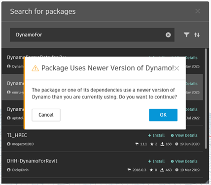
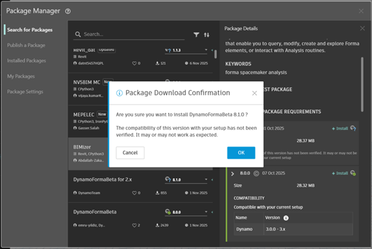

# Aktualizowanie pakietów i bibliotek dodatku Dynamo dla dodatku Dynamo 4.x

### Wprowadzenie <a href="#introduction" id="introduction"></a>

Ta sekcja zawiera informacje na temat problemów, które mogą wystąpić podczas migrowania wykresów, pakietów i bibliotek do dodatku Dynamo 4.x. W dodatku Dynamo 4.0 wprowadzono następujące ulepszenia:
* Znaczące ulepszenia wydajności
* Aktualizacje zwiększające stabilność i z poprawkami błędów
* Modernizacja bazy kodu (codebase)
* Usunięcie interfejsów API, które w wersji 1.x były oznaczone jako przestarzałe
* Aktualizacja główna środowiska uruchomieniowego z poziomu platformy .NET 8 do platformy .NET 10
* PythonNet 3 jest teraz domyślnym silnikiem języka Python dla wszystkich nowych węzłów języka Python

Działania na rzecz migracji na platformę .NET 10 zapewniają, że dodatek Dynamo pozostaje zgodny z planem rozwoju technologii firmy Microsoft — na długo przed zakończeniem wsparcia dla platformy .NET 8 w listopadzie 2026 r.

Po uruchomieniu dodatku Dynamo 4.0 zostanie wyświetlony monit o zaktualizowanie do platformy .NET 10, jeśli jeszcze tego nie zrobiono. Od autorów pakietów wymaga się zaktualizowania ich projektów do docelowej platformy .NET 10 w celu zapewnienia pełnej zgodności.

Wszystkie nowe węzły w języku Python tworzone w dodatku Dynamo od wersji 4.0 są uruchamiane przy użyciu silnika PythonNet3. Nie trzeba martwić się o zgodność ze starszymi wersjami: użytkownicy pracujący w środowiskach z wieloma wersjami (np. Revit lub Civil 3D 2025/2026) powinni zainstalować pakiet silnika PythonNet3 w dodatku Dynamo 3.3–3.6, aby zachować zgodność. Więcej informacji można znaleźć [tutaj](https://dynamobim.org/dynamo-core-4-0-release/).

Interfejs API i węzły, które były oznaczone jako przestarzałe w wersji 1.x, w dodatku Dynamo 4.0 zostały usunięte. [Pełna lista zmian znajduje się tutaj](https://github.com/DynamoDS/Dynamo/wiki/API-Changes-in-Dynamo-4.0.0).

### Zgodność pakietów <a href="#package-compatibility" id="package-compatibility"></a>

#### Korzystanie z pakietów dodatku Dynamo 2.x i Dynamo 3.x w dodatku Dynamo 4.x 
Ponieważ dodatek Dynamo 4.x działa teraz w środowisku wykonawczym .NET 10, nie ma gwarancji, że pakiety utworzone dla dodatku Dynamo 2.x (*przy użyciu platformy .NET48*) i Dynamo 3.x *(przy użyciu platformy .NET 8)* będą działać w dodatku Dynamo 4.x. W przypadku próby pobrania w dodatku Dynamo 4.x pakietu opublikowanego w wersji Dynamo starszej niż 4.0 zostanie wyświetlone ostrzeżenie, że pakiet pochodzi ze starszej wersji dodatku Dynamo.

**To nie oznacza, że pakiet nie będzie działał**. Jest to po prostu ostrzeżenie, że mogą wystąpić problemy ze zgodnością i że ogólnie warto sprawdzić, czy nie istnieje nowsza wersja, która została opracowana specjalnie dla dodatku Dynamo 4.x.

Ten typ ostrzeżenia może też pojawiać się w plikach dziennika dodatku Dynamo podczas wczytywania pakietu. Jeśli wszystko działa poprawnie, można zignorować to ostrzeżenie.

#### Korzystanie z pakietów dodatku Dynamo 4.x w dodatku Dynamo 2.x 

Jest bardzo mało prawdopodobne, że pakiet utworzony dla dodatku Dynamo 4.x (*przy użyciu platformy .Net 10*) będzie działał w dodatku Dynamo 2.x. Ponadto poniższe ostrzeżenie jest wyświetlane podczas próby zainstalowania pakietów skompilowanych dla dodatku Dynamo 4.x w dodatku Dynamo 2.x.




#### Korzystanie z pakietów dodatku Dynamo 4.x w dodatku Dynamo 3.x 

Pakiet utworzony dla dodatku Dynamo 4.x (*przy użyciu platformy .NET 10*) może działać w dodatku Dynamo 3.x, o ile wszystkie interfejsy API używane w tym pakiecie istnieją na platformie .NET 8. Nie ma jednak gwarancji, że to zadziała. Ponadto poniższe ostrzeżenie jest wyświetlane podczas próby zainstalowania pakietów skompilowanych dla dodatku Dynamo 4.x w dodatku Dynamo 3.x.



#### Najlepsze praktyki dla autorów pakietów 
Najlepszą praktyką jest ustawienie projektu jako wieloplatformowego, przeznaczonego zarówno dla platformy .NET 8, jak i dla platformy.NET 10, przez zmodyfikowanie pliku csproj.

```
<TargetFrameworks>net8.0;net10.0</TargetFrameworks>
```
Zapewnia to:
* Obsługę wersji dodatku Dynamo hostowanych w programie Revit nadal korzystających z platformy .NET 8.
* Zgodność z autonomicznym dodatkiem Dynamo 4.x na platformie .NET 10.