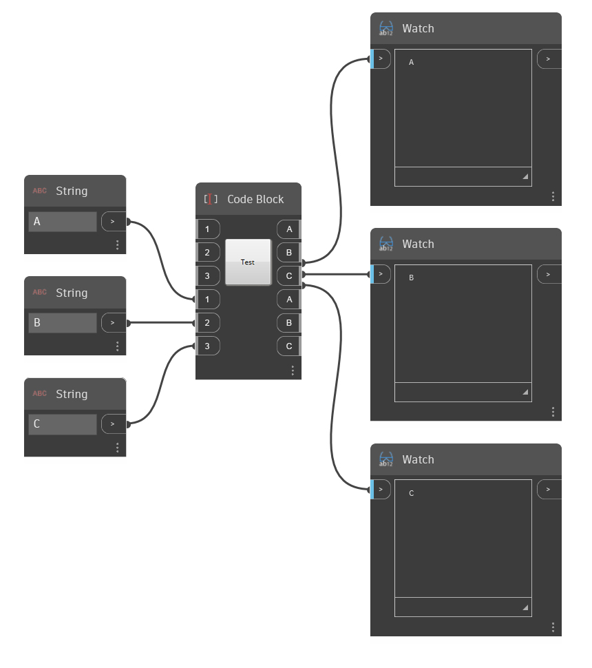

# Aggiornamento di pacchetti e librerie di Dynamo per Dynamo 2.x

### Introduzione: <a href="#introduction" id="introduction"></a>

Dynamo 2.0 è una release principale e alcune API sono state modificate o rimosse. Una delle modifiche più importanti che influiranno sugli autori di nodi e pacchetti è il passaggio al formato di file JSON.

In generale, gli autori dei nodi zero-touch dovranno fare poco o nulla per far funzionare i loro pacchetti nella versione 2.0.

I nodi dell'interfaccia utente e i nodi che derivano direttamente da NodeModel richiederanno più lavoro per l'esecuzione nella versione 2.x.

Anche gli autori di estensioni potrebbero dover apportare alcune modifiche, a seconda della quantità di API di Dynamo Core che utilizzano nelle loro estensioni.

***

### Regole generali di creazione di pacchetti: <a href="#general-packaging-rules" id="general-packaging-rules"></a>

* Non aggregare i file .dll di Dynamo o DynamoRevit al pacchetto. Questi file DLL verranno già caricati da Dynamo. Se si aggrega una versione diversa da quella caricata dall'utente _(ad esempio si distribuisce Dynamo Core 1.3 ma l'utente sta eseguendo il pacchetto in Dynamo 2.0)_, si verificheranno inspiegabili bug di runtime. Ciò include file .dll come `DynamoCore.dll`, `DynamoServices.dll`, `DSCodeNodes.dll` e `ProtoGeometry.dll`.
* Non aggregare e distribuire `newtonsoft.json.net` con il pacchetto se è possibile evitarlo. Questo file .dll verrà caricato anche da Dynamo 2.x. Può verificarsi lo stesso problema descritto in precedenza.
* Non aggregare e distribuire `CEFSharp` con il pacchetto se è possibile evitarlo. Questo file .dll verrà caricato anche da Dynamo 2.x. Può verificarsi lo stesso problema descritto in precedenza.
* In generale, evitare di condividere le dipendenze con Dynamo o Revit se è necessario controllare la versione di tale dipendenza.


### Problemi comuni: <a href="#common-issues" id="common-issues"></a>

1) All'apertura di un grafico, alcuni nodi presentano più porte con lo stesso nome, ma il grafico risultava corretto al momento del salvataggio. Questo problema può avere varie cause.

La causa principale comune è che il nodo è stato creato utilizzando un costruttore che ha ricreato le porte. Invece, avrebbe dovuto essere utilizzato un costruttore che ha caricato le porte. Questi costruttori sono generalmente contrassegnati `[JsonConstructor]`. _Per alcuni esempi, vedere di seguito._



Ciò può verificarsi perché:

* Semplicemente era presente un valore `[JsonConstructor]` corrispondente o non è stato trasferito il valore `Inports` e `Outports` dal file .dyn JSON.
* Sono state caricate due versioni di JSON.net nello stesso processo contemporaneamente, causando un errore di runtime del file.net, pertanto l'attributo `[JsonConstructor]` non può essere utilizzato correttamente per contrassegnare il costruttore.
* Il file DynamoServices.dll con una versione diversa da quella corrente di Dynamo è stato aggregato nel pacchetto e causa la mancata identificazione dell'attributo `[MultiReturn]` in fase di runtime del file .net, pertanto i nodi zero-touch contrassegnati con vari attributi non verranno applicati. È possibile che un nodo restituisca un singolo output del dizionario anziché più porte.

2) I nodi risultano completamente mancanti durante il caricamento del grafico con alcuni errori nella console.

* Ciò potrebbe verificarsi se la deserializzazione non è riuscita per qualche motivo. È consigliabile serializzare solo le proprietà necessarie. È possibile utilizzare `[JsonIgnore]` su proprietà complesse che non è necessario caricare o salvare per ignorarle. Proprietà come `function pointer, delegate, action,` o `event` e così via non dovrebbero essere serializzate, perché di solito non vengono deserializzate e causano un errore di runtime.


### Aggiornamento in profondità: <a href="#upgrading-in-depth" id="upgrading-in-depth"></a>

### Nodi personalizzati 1.3 - > 2.0 <a href="#custom-nodes-13----20" id="custom-nodes-13----20"></a>

[Organizzazione di nodi personalizzati in librarie.js](https://github.com/DynamoDS/Dynamo/wiki/Library-2.0-Add-Ons-Organization#customnodes)

Problemi noti:

* Un nome di nodo personalizzato e un nome di categoria coincidenti allo stesso livello in librarie.js causano un funzionamento imprevisto. [QNTM-3653](https://jira.autodesk.com/browse/QNTM-3653): evitare di utilizzare gli stessi nomi per la categoria e i nodi.
* I commenti verranno convertiti in commenti di blocco anziché in commenti di riga.
* I nomi di tipo breve verranno sostituiti con nomi completi. Ad esempio, se non è stato specificato un tipo quando si carica nuovamente il nodo personalizzato, verrà visualizzato `var[]..[]`, poiché questo è il tipo di default.


### Nodi zero-touch 1.3 -> 2.0 <a href="#zero-touch-nodes-13---20" id="zero-touch-nodes-13---20"></a>

* In Dynamo 2.0 i tipi di elenco e dizionario sono stati divisi e la sintassi per la creazione di elenchi e dizionari è stata modificata. Gli elenchi vengono inizializzati utilizzando `[]`, mentre i dizionari usano `{}`.\
 Se in precedenza si utilizzava l'attributo `DefaultArgument` per contrassegnare i parametri sui nodi zero-touch e si usava la sintassi dell'elenco per impostare come default un elenco specifico come `someFunc([DefaultArgument("{0,1,2}")])`, questo metodo non sarà più valido e sarà necessario modificare il frammento DesignScript per utilizzare la nuova sintassi di inizializzazione per gli elenchi.
* Come indicato in precedenza, non distribuire i file .dll di Dynamo con i pacchetti. (`DynamoCore`, `DynamoServices` e così via).


### Nodi NodeModel 1.3 -> 2.0 <a href="#node-model-nodes-13---20" id="node-model-nodes-13---20"></a>

I nodi NodeModel richiedono la maggior parte del lavoro per eseguire l'aggiornamento a Dynamo 2.x. A livello generale, sarà necessario implementare i costruttori che verranno utilizzati solo per caricare i nodi dal file JSON, oltre ai normali costruttori di NodeModel usati per creare nuove istanze dei tipi di nodi. Per differenziarli, contrassegnare i costruttori del tempo di caricamento con `[JsonConstructor]`, che è un attributo di newtonsoft.Json.net.

I nomi dei parametri nel costruttore dovrebbero in genere corrispondere ai nomi delle proprietà JSON, sebbene questo mappaggio risulti più complicata se si sostituiscono i nomi serializzati con gli attributi [JsonProperty].\
 [Per ulteriori informazioni, vedere la documentazione sui file Json.net.](https://www.newtonsoft.com/json/help/html/Introduction.htm)


#### Costruttori di file JSON <a href="#json-constructors" id="json-constructors"></a>

La modifica più comune necessaria per l'aggiornamento dei nodi derivati dalla classe di base `NodeModel` (o da altre classi di base di Dynamo Core, ad esempio `DSDropDownBase`) è la necessità di aggiungere un costruttore JSON alla classe.

Il costruttore senza parametri originale gestirà comunque l'inizializzazione di un nuovo nodo creato in Dynamo (ad esempio tramite la libreria). Il costruttore JSON è necessario per inizializzare un nodo deserializzato _(caricato)_ da un file .dyn o .dyf salvato.

Il costruttore JSON è diverso dal costruttore di base in quanto contiene i parametri `PortModel` per `inPorts` e `outPorts`, forniti dalla logica di caricamento JSON. La chiamata per la registrazione delle porte per il nodo non è necessaria in questo caso, poiché esistono i dati nel file .dyn. Un esempio di costruttore JSON è simile al seguente:

`using Newtonsoft.Json; //New dependency for Json`

………

`[JsonConstructor] //Attribute required to identity the Json constructor`

`//Minimum constructor implementation. Note that the base method invocation must also be present.`

`FooNode(IEnumerable<PortModel> inPorts, IEnumerable<PortModel> outPorts) : base(inPorts, outPorts) { }`

Questa sintassi `:base(Inports,outPorts){}` chiama il costruttore di base `nodeModel` e vi trasferisce le porte deserializzate.

Non è necessario ripetere in questo costruttore qualsiasi logica speciale presente nel costruttore della classe che implica l'inizializzazione di dati specifici serializzati nel file .dyn _(ad esempio, l'impostazione della registrazione della porta, della strategia di collegamento e così via)_, poiché questi valori possono essere letti dal file JSON.

Questa è la differenza principale tra il costruttore JSON e i costruttori non JSON per i nodi NodeModel. I costruttori JSON vengono richiamati quando si esegue il caricamento da un file e vengono trasferiti ad essi i dati caricati. È tuttavia necessario duplicare un'altra logica utente nel costruttore JSON _(ad esempio, inizializzando i gestori eventi per il nodo o l'associazione)_.

Sono disponibili esempi nel repository DynamoSamples - > [ButtonCustomNodeModel](https://github.com/DynamoDS/DynamoSamples/blob/master/src/SampleLibraryUI/Examples/ButtonCustomNodeModel.cs#L156), [DropDown](https://github.com/DynamoDS/DynamoSamples/blob/master/src/SampleLibraryUI/Examples/DropDown.cs#L23) o [SliderCustomNodeModel](https://github.com/DynamoDS/DynamoSamples/blob/master/src/SampleLibraryUI/Examples/SliderCustomNodeModel.cs#L123).


#### Proprietà pubbliche e serializzazione <a href="#public-properties-and-serialization" id="public-properties-and-serialization"></a>

In precedenza, uno sviluppatore poteva serializzare e deserializzare dati specifici del modello nel documento XML mediante i metodi `SerializeCore` e `DeserializeCore`. Questi metodi esistono ancora nell'API, ma verranno dichiarati obsoleti in una release futura di Dynamo (un esempio è disponibile [qui](https://github.com/DynamoDS/Dynamo/blob/master/src/Libraries/CoreNodeModels/Input/DoubleSlider.cs#L140)). Con l'implementazione JSON.NET ora è possibile serializzare direttamente le proprietà `public` della classe derivata NodeModel nel file .dyn. JSON.net fornisce più attributi per controllare la modalità di serializzazione della proprietà.

Questo esempio che specifica `PropertyName` è disponibile [qui](https://github.com/DynamoDS/Dynamo/blob/master/src/Libraries/CoreNodeModels/Input/ColorPalette.cs#L38) nel repository di Dynamo.

`[JsonProperty(PropertyName = "InputValue")]`

`public DSColor DsColor {...`


#### Convertitori: <a href="#converters" id="converters"></a>

**Nota**\
 Se si crea una classe di convertitori JSON.net, Dynamo non dispone attualmente di un meccanismo che consente di inserirla nei metodi di caricamento e salvataggio. Pertanto, anche se si contrassegna la classe con l'attributo `[JsonConverter]`, potrebbe non essere utilizzata; è invece possibile chiamare il convertitore direttamente nel setter o nel getter. _//TODO need confirmation of this limitation. Any evidence is welcome._

Un esempio che specifica un metodo di serializzazione per convertire la proprietà in una stringa è disponibile [qui](https://github.com/DynamoDS/Dynamo/blob/master/src/Libraries/CoreNodeModels/DynamoConvert.cs#L66) nel repository di Dynamo.

`[JsonProperty("MeasurementType"), JsonConverter(typeof(StringEnumConverter))]`

`public ConversionMetricUnit SelectedMetricConversion{...`


#### Esclusione delle proprietà <a href="#ignoring-properties" id="ignoring-properties"></a>

Alle proprietà `public` non destinate alla serializzazione è necessario aggiungere l'attributo `[JsonIgnore]`. Quando i nodi vengono salvati nel file .dyn, questo assicura che i dati vengano ignorati dal meccanismo di serializzazione e non provochino conseguenze impreviste quando il grafico viene aperto di nuovo. Un esempio di questo è disponibile [qui](https://github.com/DynamoDS/Dynamo/blob/master/src/Libraries/CoreNodeModels/DynamoConvert.cs#L45) nel repository di Dynamo.

***

#### Annullamento/Ripetizione <a href="#undoredo" id="undoredo"></a>

Come indicato sopra, in passato sono stati utilizzati metodi `SerializeCore` e `DeserializeCore` per salvare e caricare i nodi nel file .dyn del documento XML. Inoltre, sono stati utilizzati per salvare e caricare lo stato del nodo per l'annullamento/la ripetizione e **lo sono ancora.** Se si desidera implementare funzionalità complesse di annullamento/ripetizione per il nodo NodeModel dell'interfaccia utente, sarà necessario implementare questi metodi e serializzarli nell'oggetto documento XML fornito come parametro per questi metodi. Questo dovrebbe essere un caso di utilizzo raro, ad eccezione dei nodi complessi dell'interfaccia utente.


#### API delle porte di input e output <a href="#input-and-output-port-apis" id="input-and-output-port-apis"></a>

Un'occorrenza comune nei nodi NodeModel interessati dalle modifiche API 2.0 è la registrazione della porta nel costruttore del nodo. Esaminando gli esempi nel repository di Dynamo o DynamoSamples, si è notato in precedenza l'uso dei metodi `InPortData.Add()` o `OutPortData.Add()`. In precedenza, nell'API di Dynamo, le proprietà pubbliche `InPortData` e `OutPortData` erano contrassegnate come obsolete. Nella versione 2.0 queste proprietà sono state rimosse. Gli sviluppatori dovrebbero ora utilizzare i metodi `InPorts.Add()` e `OutPorts.Add()`. Inoltre, questi due metodi `Add()` hanno firme leggermente diverse:

`InPortData.Add(new PortData("Port Name", "Port Description")); //Old version valid in 1.3 but now deprecated`

e

`InPorts.Add(new PortModel(PortType.Input, this, new PortData("Port Name", "Port Description"))); //Recommended 2.0`

Esempi di codice convertito sono disponibili qui nel repository di Dynamo -> [DynamoConvert.cs](https://github.com/DynamoDS/Dynamo/blob/RC2.0.0\_master/src/Libraries/CoreNodeModels/DynamoConvert.cs#L142) o [FileSystem.cs](https://github.com/DynamoDS/Dynamo/blob/RC2.0.0\_master/src/Libraries/CoreNodeModels/Input/FileSystem.cs#L281).

L'altro caso di utilizzo comune interessato dalle modifiche dell'API 2.0 è correlato ai metodi comunemente usati nel metodo `BuildAst()` per determinare il funzionamento del nodo in base alla presenza o all'assenza di connettori di porte. In precedenza veniva utilizzato l'attributo `HasConnectedInput(index)` per convalidare lo stato di una porta connessa. Gli sviluppatori dovrebbero ora utilizzare la proprietà `InPorts[0].IsConnected` per verificare lo stato di connessione della porta. Un esempio di questo aspetto è disponibile in [ColorRange.cs](https://github.com/DynamoDS/Dynamo/blob/RC2.0.0\_master/src/Libraries/CoreNodeModels/ColorRange.cs#L83) nel repository di Dynamo.


### Esempi: <a href="#examples" id="examples"></a>

Illustriamo ora all'aggiornamento di un nodo dell'interfaccia utente 1.3 a Dynamo 2.x.

```
using System;
using System.Collections.Generic;
using Dynamo.Graph.Nodes;
using CustomNodeModel.CustomNodeModelFunction;
using ProtoCore.AST.AssociativeAST;
using Autodesk.DesignScript.Geometry;

namespace CustomNodeModel.CustomNodeModel
{
    [NodeName("RectangularGrid")]
    [NodeDescription("An example NodeModel node that creates a rectangular grid. The slider randomly scales the cells.")]
    [NodeCategory("CustomNodeModel")]
    [InPortNames("xCount", "yCount")]
    [InPortTypes("double", "double")]
    [InPortDescriptions("Number of cells in the X direction", "Number of cells in the Y direction")]
    [OutPortNames("Rectangles")]
    [OutPortTypes("Autodesk.DesignScript.Geometry.Rectangle[]")]
    [OutPortDescriptions("A list of rectangles")]
    [IsDesignScriptCompatible]
    public class GridNodeModel : NodeModel
    {
        private double _sliderValue;
        public double SliderValue
        {
            get { return _sliderValue; }
            set
            {
                _sliderValue = value;
                RaisePropertyChanged("SliderValue");
                OnNodeModified(false);
            }
        }
        public GridNodeModel()
        {
            RegisterAllPorts();
        }
        public override IEnumerable<AssociativeNode> BuildOutputAst(List<AssociativeNode> inputAstNodes)
        {
            if (!HasConnectedInput(0) || !HasConnectedInput(1))
            {
                return new[] { AstFactory.BuildAssignment(GetAstIdentifierForOutputIndex(0), AstFactory.BuildNullNode()) };
            }
            var sliderValue = AstFactory.BuildDoubleNode(SliderValue);
            var functionCall =
              AstFactory.BuildFunctionCall(
                new Func<int, int, double, List<Rectangle>>(GridFunction.RectangularGrid),
                new List<AssociativeNode> { inputAstNodes[0], inputAstNodes[1], sliderValue });

            return new[] { AstFactory.BuildAssignment(GetAstIdentifierForOutputIndex(0), functionCall) };
        }
    }
}
```

Per caricare e salvare correttamente la classe `nodeModel` nella versione 2.0, è sufficiente aggiungere un attributo JsonConstructor per gestire il caricamento delle porte. Trasferire semplicemente le porte al costruttore di base e questa implementazione è vuota.

```
[JsonConstructor]
protected GridNodeModel(IEnumerable<PortModel> Inports, IEnumerable<PortModel> Outports ) :
base(Inports,Outports)
{

}
```

Nota Non chiamare `RegisterPorts()` o qualche variazione di tale valore nell'attributo JsonConstructor: per costruire nuove porte, verranno utilizzati gli attributi dei parametri di input e output nella classe di nodi. **Non è questo il caso**, poiché si desidera utilizzare le porte caricate che vengono trasferite al costruttore.

```
[InPortNames("xCount", "yCount")]
[InPortTypes("double", "double")]
```

Questo esempio aggiunge il costruttore JSON di caricamento minimo possibile. Ma cosa succede se servisse di eseguire una logica di costruzione più complessa, come impostare alcuni listener per la gestione di eventi all'interno del costruttore? L'esempio successivo tratto dal \
 [repository di DynamoSamples](https://github.com/DynamoDS/DynamoSamples) è collegato sopra nella parte `JsonConstructors Section` di questo documento.

Di seguito è riportato un costruttore più complesso per un nodo dell'interfaccia utente:

```
 public ButtonCustomNodeModel()
        {
            // When you create a UI node, you need to do the
            // work of setting up the ports yourself. To do this,
            // you can populate the InPorts and the OutPorts
            // collections with PortData objects describing your ports.
            InPorts.Add(new PortModel(PortType.Input, this, new PortData("inputString", "a string value displayed on our button")));

            // Nodes can have an arbitrary number of inputs and outputs.
            // If you want more ports, just create more PortData objects.
            OutPorts.Add(new PortModel(PortType.Output, this, new PortData("button value", "returns the string value displayed on our button")));
            OutPorts.Add(new PortModel(PortType.Output, this, new PortData("window value", "returns the string value displayed in our window when button is pressed")));

            // This call is required to ensure that your ports are
            // properly created.
            RegisterAllPorts();

            // Listen for input port disconnection to trigger button UI update
            this.PortDisconnected += ButtonCustomNodeModel_PortDisconnected;

            // The arugment lacing is the way in which Dynamo handles
            // inputs of lists. If you don't want your node to
            // support argument lacing, you can set this to LacingStrategy.Disabled.
            ArgumentLacing = LacingStrategy.Disabled;

            // We create a DelegateCommand object which will be 
            // bound to our button in our custom UI. Clicking the button 
            // will call the ShowMessage method.
            ButtonCommand = new DelegateCommand(ShowMessage, CanShowMessage);

            // Setting our property here will trigger a 
            // property change notification and the UI 
            // will be updated to reflect the new value.
            ButtonText = defaultButtonText;
            WindowText = defaultWindowText;
        }
```

Quando si aggiunge un costruttore JSON per il caricamento di questo nodo da un file, è necessario ricreare una parte di questa logica, ma si noti che non è incluso il codice che crea porte, imposta il collegamento o imposta i valori di default per le proprietà che è possibile caricare dal file.

```
        // This constructor is called when opening a Json graph.

        [JsonConstructor]
        ButtonCustomNodeModel(IEnumerable<PortModel> inPorts, IEnumerable<PortModel> outPorts) : base(inPorts, outPorts)
        {
            this.PortDisconnected += ButtonCustomNodeModel_PortDisconnected;
            ButtonCommand = new DelegateCommand(ShowMessage, CanShowMessage);
        }
```

Notare che altre proprietà pubbliche che sono state serializzate in JSON come `ButtonText` e `WindowText` non verranno aggiunte come parametri espliciti al costruttore; vengono impostate automaticamente da JSON.net utilizzando i setter per tali proprietà.
