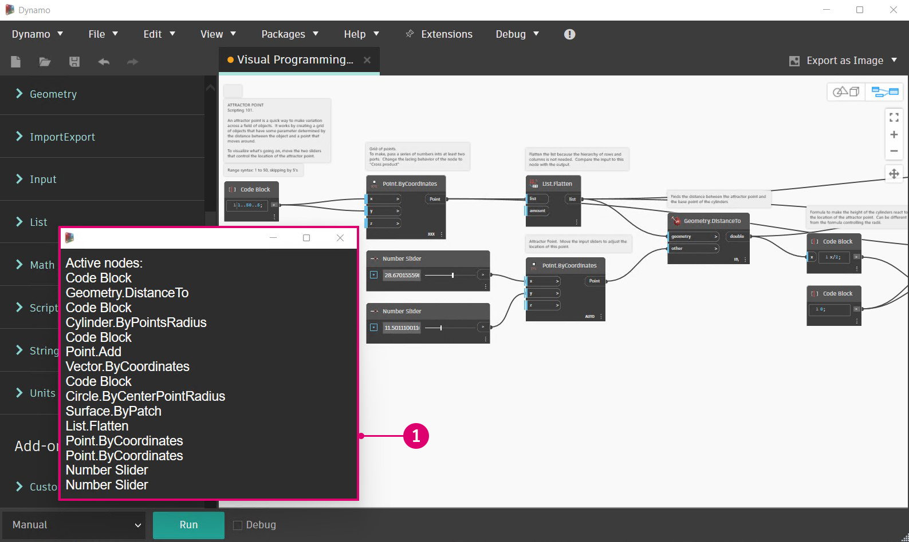
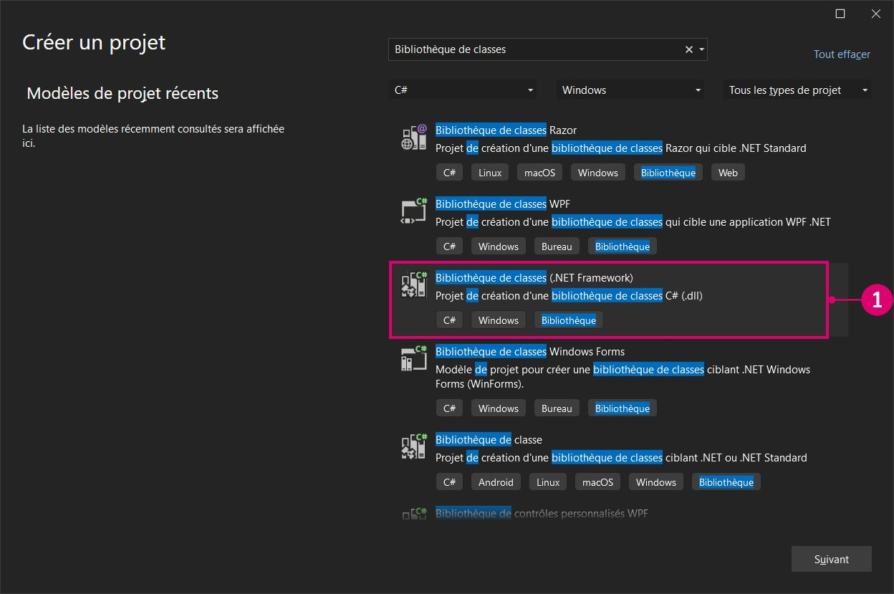
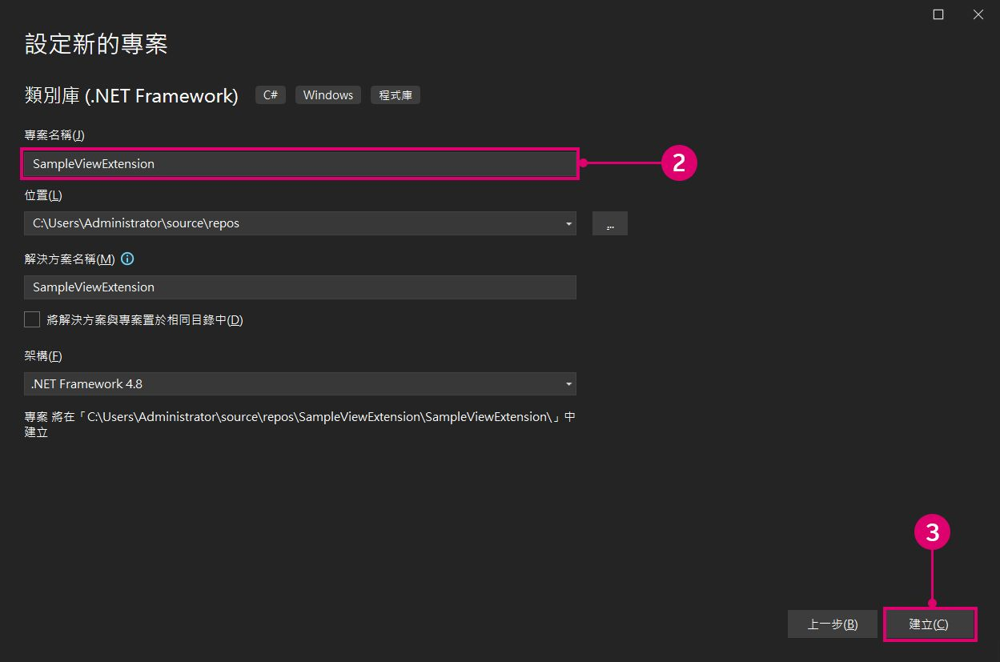
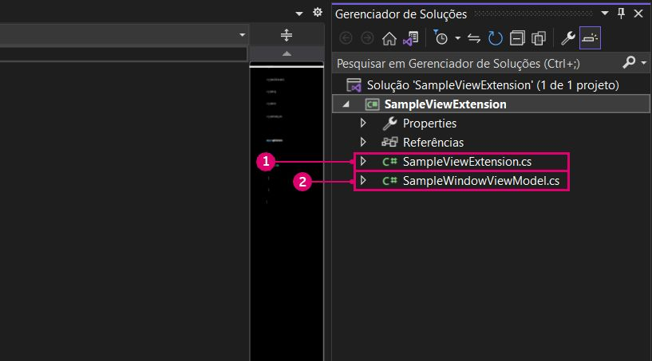
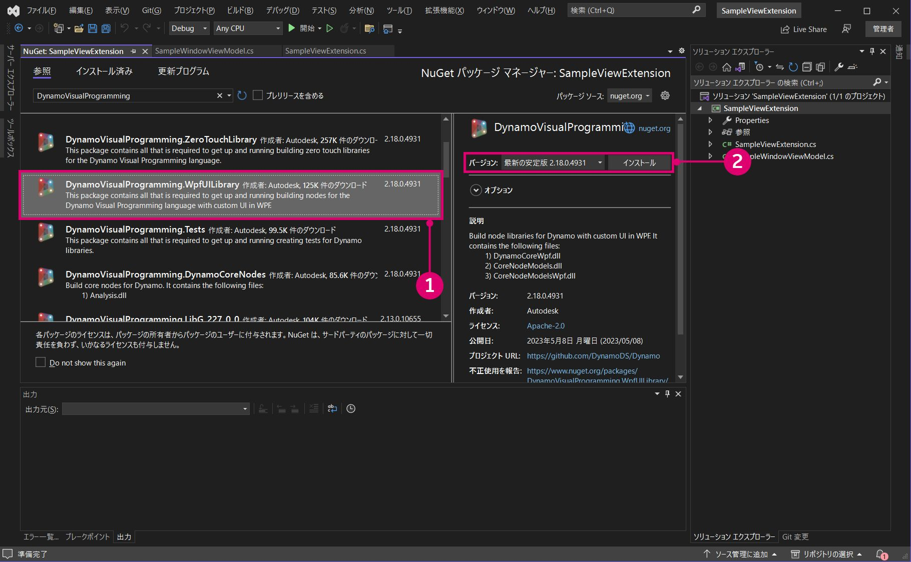
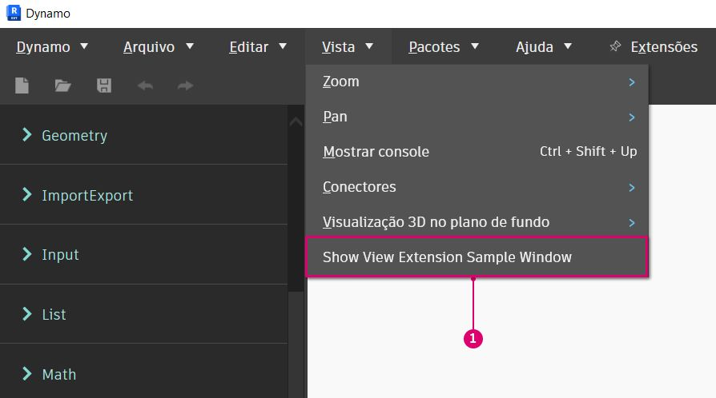
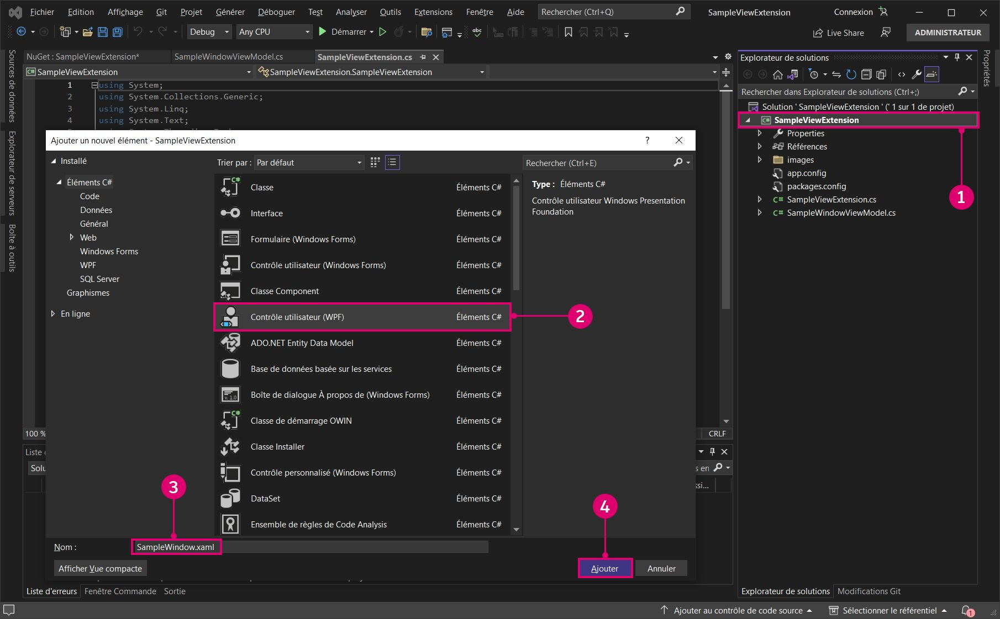
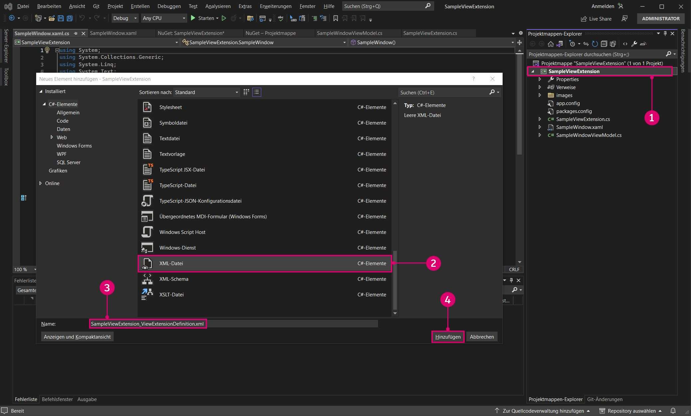
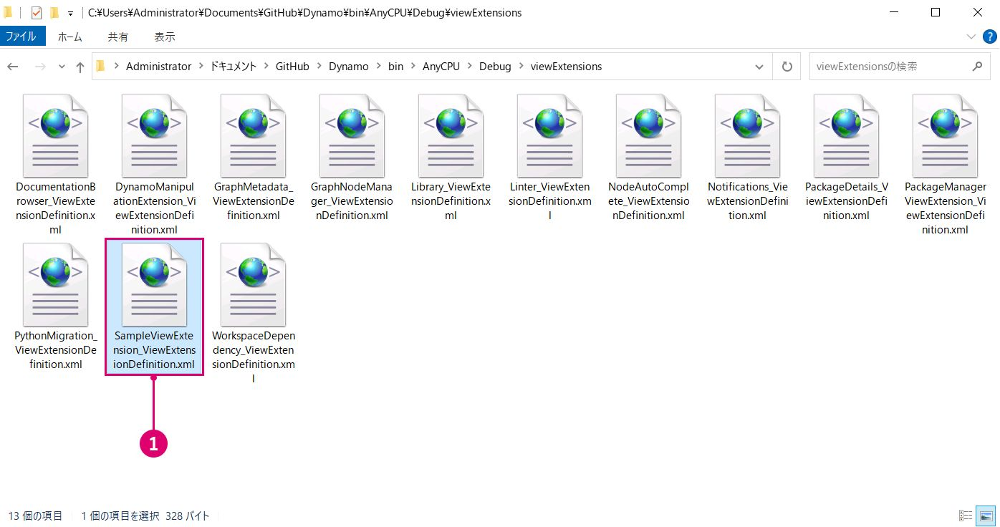

# Extensiones

Las extensiones son una eficaz herramienta de desarrollo en el ecosistema de Dynamo. Permiten a los desarrolladores impulsar funciones personalizadas basadas en interacciones y la lógica de Dynamo. Las extensiones se pueden dividir en dos categorías principales, extensiones y extensiones de vista. Como indica su nombre, la estructura de extensiones de vista permite ampliar la interfaz de usuario de Dynamo mediante el registro de elementos de menú personalizados. Las extensiones normales funcionan de una manera muy similar, pero sin la interfaz de usuario. Por ejemplo, podemos crear una extensión que registre información específica en la consola de Dynamo. En este caso, no se necesita una interfaz de usuario personalizada y, por lo tanto, también se puede lograr lo mismo con una extensión.

#### Caso real de extensión <a href="#extension-case-study" id="extension-case-study"></a>

Siguiendo el ejemplo SampleViewExtension del repositorio DynamoSamples de GitHub, recorreremos los pasos necesarios para crear una sencilla ventana sin modo que muestre los nodos activos del gráfico en tiempo real. Una extensión de vista requiere que creemos una interfaz de usuario para la ventana y que vinculemos valores a un modelo de vista.



> 1. La ventana de extensión de vista desarrollada siguiendo el ejemplo SampleViewExtension en el repositorio de GitHub.

Aunque compilaremos el ejemplo desde cero, también puede descargar y compilar el repositorio DynamoSamples para que le sirva de referencia.

Repositorio DynamoSamples: [https://github.com/DynamoDS/DynamoSamples](https://github.com/DynamoDS/DynamoSamples)

> Este recorrido hará referencia específicamente al proyecto denominado SampleViewExtension, que se encuentra en `DynamoSamples/src/`.

#### Cómo implementar una extensión de vista <a href="#how-to-implement-a-view-extension" id="how-to-implement-a-view-extension"></a>

Una extensión de vista incluye las siguientes tres partes esenciales:

* Un montaje que contiene una clase que implementa `IViewExtension`, así como una clase que crea un modelo de vista.
* Un archivo `.xml`, que indica a Dynamo dónde debe buscar este montaje en el tiempo de ejecución y el tipo de extensión
* Un archivo `.xaml` que enlaza datos a la visualización de gráficos y determina el aspecto de la ventana.

**1\. Crear la estructura del proyecto**

Cree un nuevo proyecto `Class Library` denominado `SampleViewExtension`.





> 1. Cree un nuevo proyecto. Para ello, seleccione `File > New > Project`.
> 2. Seleccione `Class Library`.
> 3. Asigne el nombre `SampleViewExtension` al proyecto.
> 4. Seleccione `Ok`.

En este proyecto, necesitaremos dos clases. Una clase que implementará `IViewExtension` y otra que implementará `NotificationObject.`. `IViewExtension` contendrá toda la información sobre cómo se implementará, se cargará y se desechará la extensión, y cómo se hará referencia a ella. `NotificationObject` proporcionará notificaciones de cambios en `IDisposable` y Dynamo. Cuando se produzca un cambio, el recuento se actualizará en consecuencia.



> 1. Un archivo de clase denominado `SampleViewExtension.cs` que implementará `IViewExtension`.
> 2. Un archivo de clase denominado `SampleWindowViewMode.cs` que implementará `NotificationObject`.

Para utilizar `IViewExtension`, necesitaremos el paquete NuGet WpfUILibrary. Al instalar este paquete, se instalarán automáticamente los paquetes Core, Services y ZeroTouchLibrary.



> 1. Seleccione WpfUILibrary.
> 2. Seleccione `Install` para instalar todos los paquetes dependientes.

**2\. Implementar la clase IViewExtension**

En la clase `IViewExtension`, determinaremos qué ocurre cuando se inicia Dynamo, se carga la extensión y se cierra Dynamo. En el archivo de clase `SampleViewExtension.cs`, añada el código siguiente:

```
using System;
using System.Windows;
using System.Windows.Controls;
using Dynamo.Wpf.Extensions;

namespace SampleViewExtension
{

    public class SampleViewExtension : IViewExtension
    {
        private MenuItem sampleMenuItem;

        public void Dispose()
        {
        }

        public void Startup(ViewStartupParams p)
        {
        }

        public void Loaded(ViewLoadedParams p)
        {
            // Save a reference to your loaded parameters.
            // You'll need these later when you want to use
            // the supplied workspaces

            sampleMenuItem = new MenuItem {Header = "Show View Extension Sample Window"};
            sampleMenuItem.Click += (sender, args) =>
            {
                var viewModel = new SampleWindowViewModel(p);
                var window = new SampleWindow
                {
                    // Set the data context for the main grid in the window.
                    MainGrid = { DataContext = viewModel },

                    // Set the owner of the window to the Dynamo window.
                    Owner = p.DynamoWindow
                };

                window.Left = window.Owner.Left + 400;
                window.Top = window.Owner.Top + 200;

                // Show a modeless window.
                window.Show();
            };
            p.AddExtensionMenuItem(sampleMenuItem);
        }

        public void Shutdown()
        {
        }

        public string UniqueId
        {
            get
            {
                return Guid.NewGuid().ToString();
            }  
        } 

        public string Name
        {
            get
            {
                return "Sample View Extension";
            }
        } 

    }
}
```

La clase `SampleViewExtension` crea un elemento de menú en el que se puede hacer clic para abrir la ventana y lo conecta al modelo de vista y la ventana.

* `public class SampleViewExtension : IViewExtension` `SampleViewExtension` hereda de la interfaz de `IViewExtension` y proporciona todo lo que necesitamos para crear el elemento de menú.
* `sampleMenuItem = new MenuItem { Header = "Show View Extension Sample Window" };` crea un MenuItem y lo añade al menú `View`.



> 1. El elemento de menú

* `sampleMenuItem.Click += (sender, args)` activa un evento que abrirá una nueva ventana cuando se haga clic en el elemento de menú.
* `MainGrid = { DataContext = viewModel }` establece el contexto de datos para la rejilla principal de la ventana, haciendo referencia a `Main Grid` en el archivo `.xaml` que crearemos.
* `Owner = p.DynamoWindow` establece el propietario de la ventana emergente en Dynamo. Esto significa que la nueva ventana depende de Dynamo, por lo que acciones como, por ejemplo, minimizar, maximizar y restaurar Dynamo provocarán que la nueva ventana siga este mismo comportamiento
* `window.Show();` muestra la ventana en la que se han establecido las propiedades adicionales de ventana.

**3\. Implementar el modelo de vista**

Ahora que hemos establecido algunos de los parámetros básicos de la ventana, añadiremos la lógica para responder a diversos eventos relacionados con Dynamo e indicaremos a la interfaz de usuario que realice la actualización en función de estos eventos. Copie el código siguiente en el archivo de clase `SampleWindowViewModel.cs`:

```
using System;
using Dynamo.Core;
using Dynamo.Extensions;
using Dynamo.Graph.Nodes;

namespace SampleViewExtension
{
    public class SampleWindowViewModel : NotificationObject, IDisposable
    {
        private string activeNodeTypes;
        private ReadyParams readyParams;

        // Displays active nodes in the workspace
        public string ActiveNodeTypes
        {
            get
            {
                activeNodeTypes = getNodeTypes();
                return activeNodeTypes;
            }
        }

        // Helper function that builds string of active nodes
        public string getNodeTypes()
        {
            string output = "Active nodes:\n";

            foreach (NodeModel node in readyParams.CurrentWorkspaceModel.Nodes)
            {
                string nickName = node.Name;
                output += nickName + "\n";
            }

            return output;
        }

        public SampleWindowViewModel(ReadyParams p)
        {
            readyParams = p;
            p.CurrentWorkspaceModel.NodeAdded += CurrentWorkspaceModel_NodesChanged;
            p.CurrentWorkspaceModel.NodeRemoved += CurrentWorkspaceModel_NodesChanged;
        }

        private void CurrentWorkspaceModel_NodesChanged(NodeModel obj)
        {
            RaisePropertyChanged("ActiveNodeTypes");
        }

        public void Dispose()
        {
            readyParams.CurrentWorkspaceModel.NodeAdded -= CurrentWorkspaceModel_NodesChanged;
            readyParams.CurrentWorkspaceModel.NodeRemoved -= CurrentWorkspaceModel_NodesChanged;
        }
    }
}
```

Esta implementación de la clase de modelo de vista escucha en el `CurrentWorkspaceModel` y activa un evento cuando se añade o se elimina un nodo del espacio de trabajo. Esto genera un cambio de propiedad que notifica a los elementos de la interfaz de usuario o enlazados que los datos han cambiado y deben actualizarse. Se llama al captador `ActiveNodeTypes`, que llama internamente a una función auxiliar adicional `getNodeTypes()`. Esta función recorre todos los nodos activos en el lienzo, rellena una cadena que contiene los nombres de estos nodos y devuelve esta cadena al enlace en el archivo .xaml para que se muestre en la ventana emergente.

Con la lógica básica de la extensión definida, ahora especificaremos los detalles de apariencia de la ventana con un archivo `.xaml`. Todo lo que necesitamos es una ventana sencilla que muestre la cadena mediante el enlace de propiedad `ActiveNodeTypes` en `TextBlock` `Text`.



> 1. Haga clic con el botón derecho en el proyecto y seleccione `Add > New Item...`.
> 2. Seleccione la plantilla de control de usuario que modificaremos para crear una ventana.
> 3. Asigne el nombre `SampleWindow.xaml` al nuevo archivo.
> 4. Seleccione `Add`.

En el código `.xaml` de la ventana, deberemos enlazar `SelectedNodesText` a un bloque de texto. Añada el siguiente código a `SampleWindow.xaml`:

```
<Window x:Class="SampleViewExtension.SampleWindow"
             xmlns="http://schemas.microsoft.com/winfx/2006/xaml/presentation"
             xmlns:x="http://schemas.microsoft.com/winfx/2006/xaml"
             xmlns:mc="http://schemas.openxmlformats.org/markup-compatibility/2006" 
             xmlns:d="http://schemas.microsoft.com/expression/blend/2008" 
             xmlns:local="clr-namespace:SampleViewExtension"
             mc:Ignorable="d" 
             d:DesignHeight="300" d:DesignWidth="300"
            Width="500" Height="100">
    <Grid Name="MainGrid" 
          HorizontalAlignment="Stretch"
          VerticalAlignment="Stretch">
        <TextBlock HorizontalAlignment="Stretch" Text="{Binding ActiveNodeTypes}" FontFamily="Arial" Padding="10" FontWeight="Medium" FontSize="18" Background="#2d2d2d" Foreground="White"/>
    </Grid>
</Window>
```

* `Text="{Binding ActiveNodeTypes}"` enlaza el valor de propiedad de `ActiveNodeTypes` en `SampleWindowViewModel.cs` con el valor de `TextBlock` `Text` de la ventana.

Ahora inicializaremos la ventana de ejemplo en el archivo de copia de seguridad .xaml de C# `SampleWindow.xaml.cs`. Añada el siguiente código a `SampleWindow.xaml`:

```
using System.Windows;

namespace SampleViewExtension
{
    /// <summary>
    /// Interaction logic for SampleWindow.xaml
    /// </summary>
    public partial class SampleWindow : Window
    {
        public SampleWindow()
        {
            InitializeComponent();
        }
    }
}
```

La extensión de vista ya puede crearse y añadirse a Dynamo. Dynamo requiere un archivo `xml` para registrar el archivo `.dll` de salida como una extensión.



> 1. Haga clic con el botón derecho en el proyecto y seleccione `Add > New Item...`.
> 2. Seleccione Archivo XML.
> 3. Asigne el nombre `SampleViewExtension_ViewExtensionDefinition.xml` al archivo.
> 4. Seleccione `Add`.

* El nombre de archivo sigue la norma de Dynamo para hacer referencia a un montaje de extensión de la siguiente forma: `"extensionName"_ViewExtensionDefinition.xml`.

En el archivo `xml`, añada el siguiente código para indicar a Dynamo dónde debe buscar el montaje de extensión:

```
<ViewExtensionDefinition>
  <AssemblyPath>C:\Users\username\Documents\Visual Studio 2015\Projects\SampleViewExtension\SampleViewExtension\bin\Debug\SampleViewExtension.dll</AssemblyPath>
  <TypeName>SampleViewExtension.SampleViewExtension</TypeName>
</ViewExtensionDefinition>
```

* En este ejemplo, hemos generado el montaje en la carpeta de proyecto por defecto de Visual Studio. Sustituya el destino `<AssemblyPath>...</AssemblyPath>` por la ubicación del montaje.

El último paso consiste en copiar el archivo `SampleViewExtension_ViewExtensionDefinition.xml` en la carpeta de extensiones de vista de Dynamo, que se encuentra en el directorio de instalación de Dynamo Core `C:\Program Files\Dynamo\Dynamo Core\1.3\viewExtensions`. Es importante tener en cuenta que hay carpetas independientes para `extensions` y `viewExtensions`. Si coloca el archivo `xml` en la carpeta incorrecta, puede que no se cargue correctamente en el tiempo de ejecución.



> 1. El archivo `.xml` que hemos copiado en la carpeta de extensiones de vista de Dynamo

Esta es una introducción básica a las extensiones de vista. Para obtener un caso real más sofisticado, consulte el paquete DynaShape, un proyecto de código abierto de GitHub. El paquete utiliza una extensión de vista que permite la edición activa en la vista del modelo de Dynamo.

Puede descargar un instalador de paquetes para DynaShape desde el foro de Dynamo, [https://forum.dynamobim.com/t/dynashape-published/11666](https://forum.dynamobim.com/t/dynashape-published/11666).

El código fuente se puede clonar desde GitHub, [https://github.com/LongNguyenP/DynaShape](https://github.com/LongNguyenP/DynaShape).
