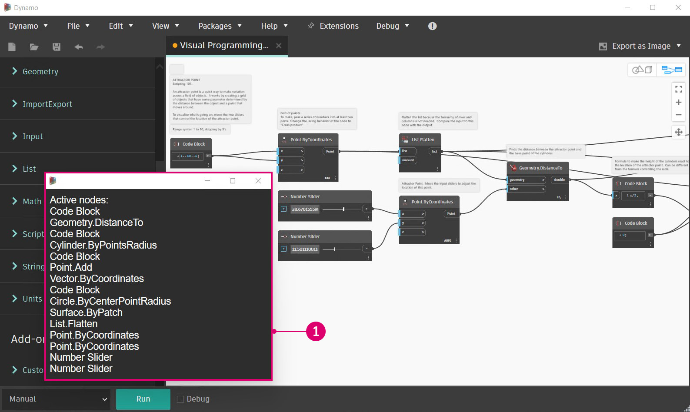
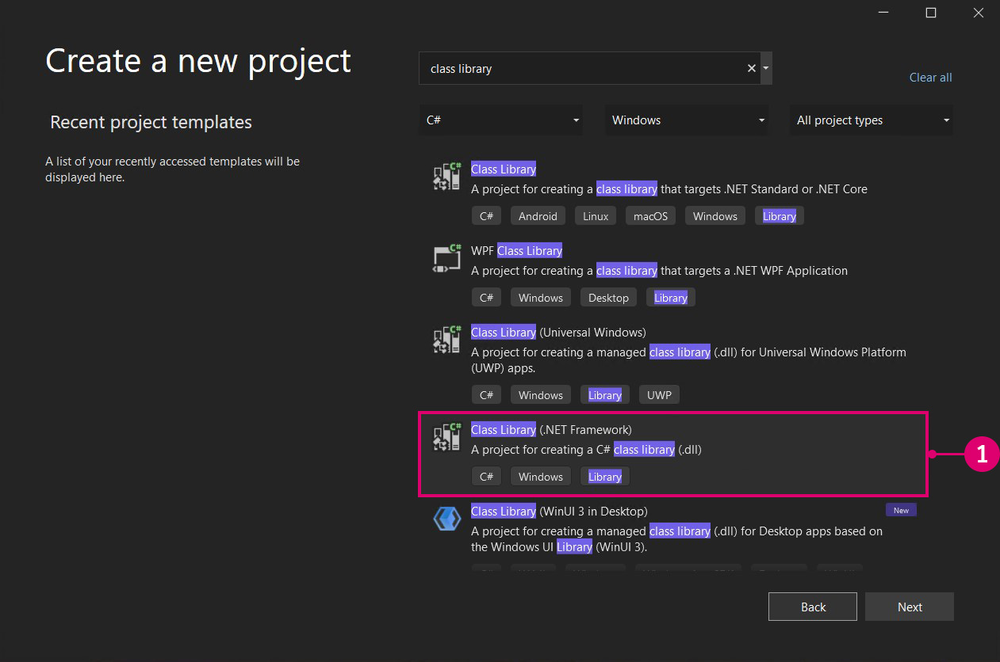
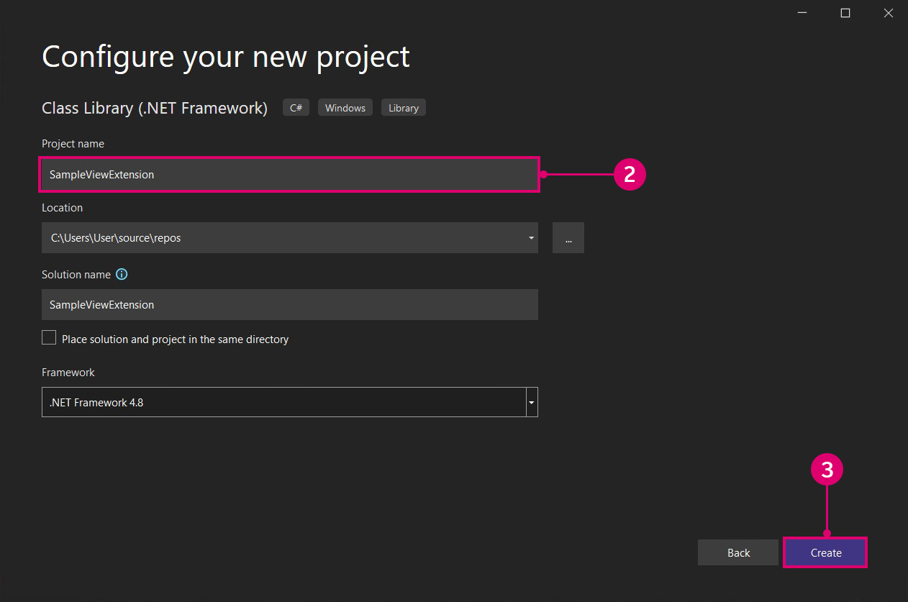
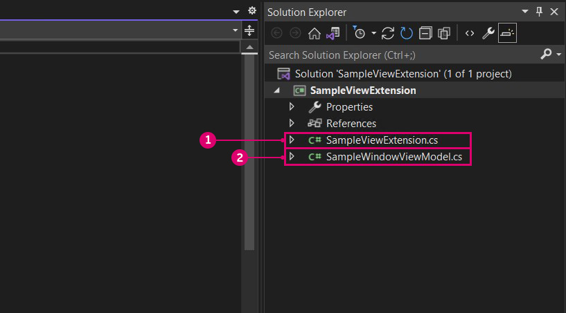
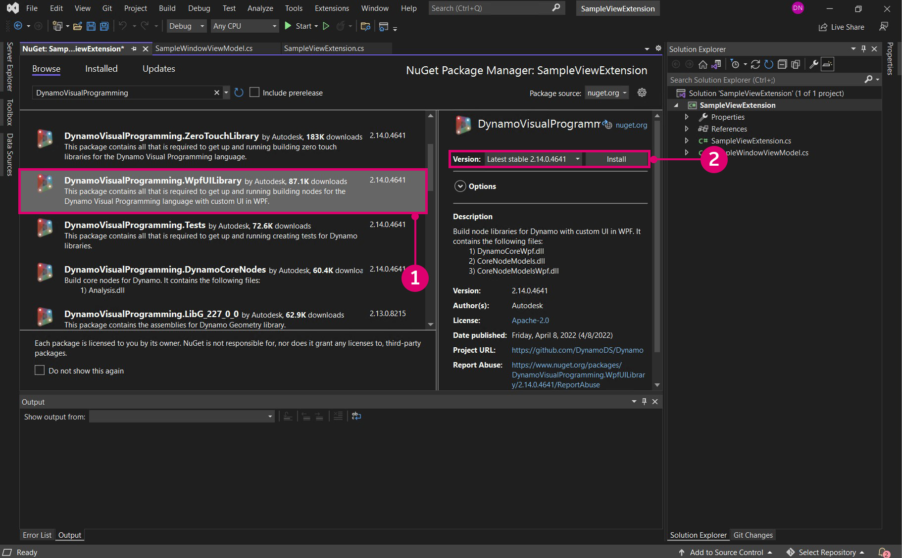
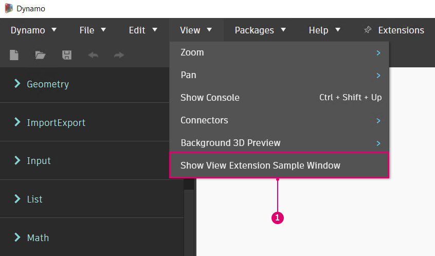
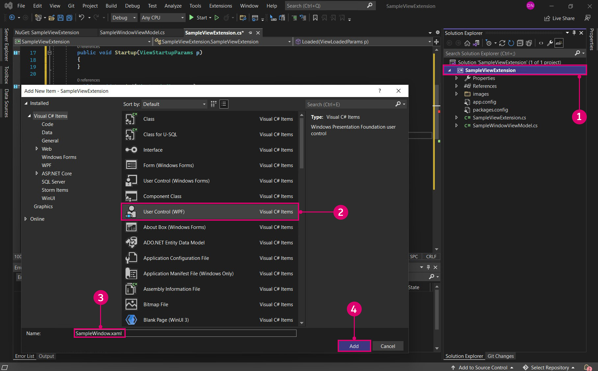
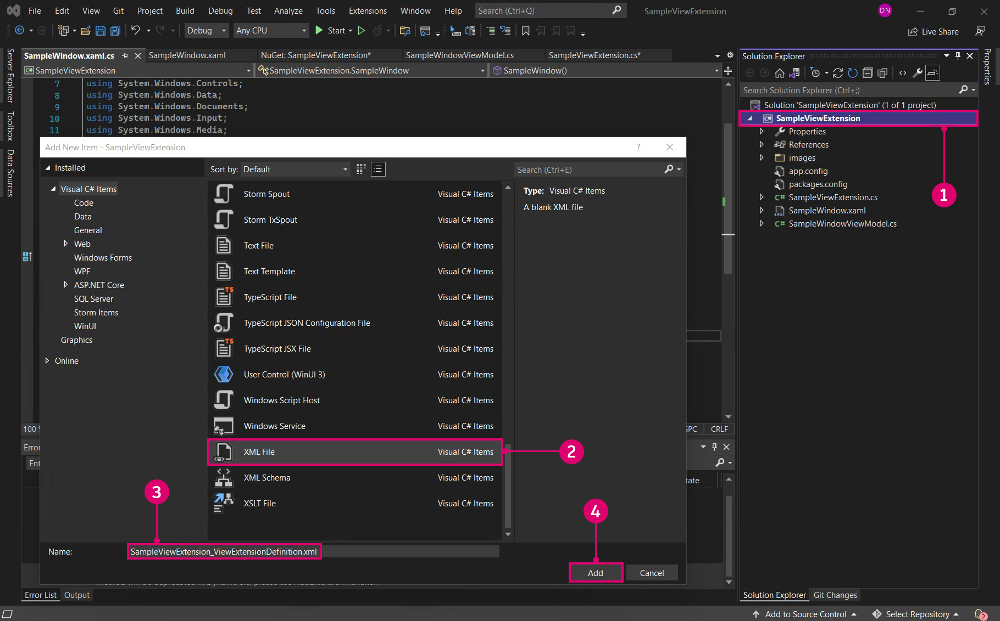
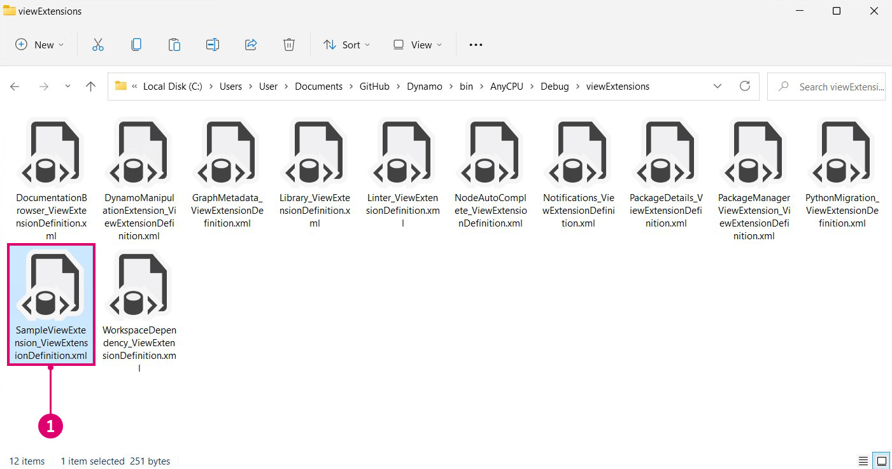

# Extensões

As extensões são uma poderosa ferramenta de desenvolvimento no ecossistema do Dynamo. Elas permitem que os desenvolvedores direcionem a funcionalidade personalizada com base nas interações e lógica do Dynamo. As extensões podem ser divididas em duas categorias principais, extensões e extensões de vista. Como a nomenclatura indica, a estrutura de extensão da vista permite estender a interface do usuário do Dynamo registrando itens de menu personalizados. As extensões regulares operam de forma muito semelhante, exceto a interface do usuário. Por exemplo, podemos compilar uma extensão que registra informações específicas no console do Dynamo. Esse cenário não requer uma interface do usuário personalizada e, portanto, também pode ser realizado usando uma extensão.

#### Estudo de caso de extensão <a href="#extension-case-study" id="extension-case-study"></a>

Seguindo o exemplo SampleViewExtension do repositório Github do DynamoSamples, vamos percorrer as etapas necessárias para criar uma janela simples sem janela restrita que exibe os nós ativos no gráfico em tempo real. Uma extensão de vista requer que criemos uma interface do usuário para a janela e vinculemos valores a um modelo de vista.



> 1. A janela de extensão da vista foi desenvolvida seguindo o exemplo SampleViewExtension no repositório Github.

Embora possamos compilar o exemplo desde o início, também é possível fazer o download e criar o repositório DynamoSamples para servir como referência.

Repositório DynamoSamples: [https://github.com/DynamoDS/DynamoSamples](https://github.com/DynamoDS/DynamoSamples)

> Este percurso virtual fará referência específica ao projeto denominado SampleViewExtension encontrado em `DynamoSamples/src/`.

#### Como implementar uma extensão de vista <a href="#how-to-implement-a-view-extension" id="how-to-implement-a-view-extension"></a>

Uma extensão de vista tem três partes essenciais:

* Uma montagem contendo uma classe que implementa `IViewExtension`, bem como uma classe que cria um modelo de vista
* Um arquivo `.xml` que informa ao Dynamo onde ele deve procurar por essa montagem no tempo de execução e o tipo de extensão
* Um arquivo `.xaml` que vincula os dados à exibição gráfica e determina a aparência da janela

**1\. Criar a estrutura do projeto**

Comece criando um novo projeto `Class Library` chamado `SampleViewExtension`.





> 1. Criar um novo projeto selecionando `File > New > Project`
> 2. Selecionar `Class Library`
> 3. Nomear o projeto `SampleViewExtension`
> 4. Selecionar `Ok`

Neste projeto, precisaremos de duas classes. Uma classe implementará `IViewExtension` e a outra que implementará `NotificationObject.` `IViewExtension` conterá todas as informações sobre como nossa extensão será implantada, carregada, referenciada e eliminada. `NotificationObject` fornecerá notificações de alterações no Dynamo e `IDisposable` quando ocorrer uma alteração, a contagem será atualizada de acordo.



> 1. Um arquivo de classe denominado `SampleViewExtension.cs` que implementará `IViewExtension`
> 2. Um arquivo de classe denominado `SampleWindowViewMode.cs` que implementará `NotificationObject`

Para usar o `IViewExtension`, precisaremos do pacote WpfUILibrary NuGet. A instalação desse pacote instalará automaticamente os pacotes Core, Services e ZeroTouchLibrary.



> 1. Selecionar a biblioteca WpfUIL
> 2. Selecionar `Install` para instalar todos os pacotes dependentes

**2\. Implementar a classe IViewExtension**

Na classe `IViewExtension`, vamos determinar o que acontece quando o Dynamo é iniciado, quando a extensão é carregada e quando o Dynamo é fechado. No arquivo de classe `SampleViewExtension.cs`, adicione o seguinte código:

```
using System;
using System.Windows;
using System.Windows.Controls;
using Dynamo.Wpf.Extensions;

namespace SampleViewExtension
{

    public class SampleViewExtension : IViewExtension
    {
        private MenuItem sampleMenuItem;

        public void Dispose()
        {
        }

        public void Startup(ViewStartupParams p)
        {
        }

        public void Loaded(ViewLoadedParams p)
        {
            // Save a reference to your loaded parameters.
            // You'll need these later when you want to use
            // the supplied workspaces

            sampleMenuItem = new MenuItem {Header = "Show View Extension Sample Window"};
            sampleMenuItem.Click += (sender, args) =>
            {
                var viewModel = new SampleWindowViewModel(p);
                var window = new SampleWindow
                {
                    // Set the data context for the main grid in the window.
                    MainGrid = { DataContext = viewModel },

                    // Set the owner of the window to the Dynamo window.
                    Owner = p.DynamoWindow
                };

                window.Left = window.Owner.Left + 400;
                window.Top = window.Owner.Top + 200;

                // Show a modeless window.
                window.Show();
            };
            p.AddExtensionMenuItem(sampleMenuItem);
        }

        public void Shutdown()
        {
        }

        public string UniqueId
        {
            get
            {
                return Guid.NewGuid().ToString();
            }  
        } 

        public string Name
        {
            get
            {
                return "Sample View Extension";
            }
        } 

    }
}
```

A classe `SampleViewExtension` cria um item de menu clicável para abrir a janela e conecta-a ao modelo de vista e à janela.

* `public class SampleViewExtension : IViewExtension` `SampleViewExtension` herda da interface do `IViewExtension` e fornece tudo o que precisamos para criar o item de menu.
* `sampleMenuItem = new MenuItem { Header = "Show View Extension Sample Window" };` cria um MenuItem e o adiciona ao menu `View`.



> 1. O item de menu

* `sampleMenuItem.Click += (sender, args)` aciona um evento que abrirá uma nova janela quando o item de menu for clicado
* `MainGrid = { DataContext = viewModel }` define o contexto de dados para a grade principal na janela, referindo-se a `Main Grid` no arquivo `.xaml` que criaremos
* `Owner = p.DynamoWindow` define o proprietário da janela pop-out como Dynamo. Isso significa que a nova janela depende do Dynamo, portanto, ações como minimizar, maximizar e restaurar o Dynamo farão com que a nova janela siga esse mesmo comportamento
* `window.Show();` exibe a janela onde as propriedades adicionais da janela foram definidas

**3\. Implementar o modelo de vista**

Agora que estabelecemos alguns dos parâmetros básicos da janela, adicionaremos a lógica para responder a vários eventos relacionados ao Dynamo e instruiremos a interface do usuário a atualizar com base nesses eventos. Copie o seguinte código para o arquivo de classe `SampleWindowViewModel.cs`:

```
using System;
using Dynamo.Core;
using Dynamo.Extensions;
using Dynamo.Graph.Nodes;

namespace SampleViewExtension
{
    public class SampleWindowViewModel : NotificationObject, IDisposable
    {
        private string activeNodeTypes;
        private ReadyParams readyParams;

        // Displays active nodes in the workspace
        public string ActiveNodeTypes
        {
            get
            {
                activeNodeTypes = getNodeTypes();
                return activeNodeTypes;
            }
        }

        // Helper function that builds string of active nodes
        public string getNodeTypes()
        {
            string output = "Active nodes:\n";

            foreach (NodeModel node in readyParams.CurrentWorkspaceModel.Nodes)
            {
                string nickName = node.Name;
                output += nickName + "\n";
            }

            return output;
        }

        public SampleWindowViewModel(ReadyParams p)
        {
            readyParams = p;
            p.CurrentWorkspaceModel.NodeAdded += CurrentWorkspaceModel_NodesChanged;
            p.CurrentWorkspaceModel.NodeRemoved += CurrentWorkspaceModel_NodesChanged;
        }

        private void CurrentWorkspaceModel_NodesChanged(NodeModel obj)
        {
            RaisePropertyChanged("ActiveNodeTypes");
        }

        public void Dispose()
        {
            readyParams.CurrentWorkspaceModel.NodeAdded -= CurrentWorkspaceModel_NodesChanged;
            readyParams.CurrentWorkspaceModel.NodeRemoved -= CurrentWorkspaceModel_NodesChanged;
        }
    }
}
```

Essa implementação da classe de modelo de vista ouve o `CurrentWorkspaceModel` e aciona um evento quando um nó é adicionado ou removido do espaço de trabalho. Isso gera uma alteração de propriedade que notifica a interface do usuário ou elementos vinculados que os dados foram alterados e precisam ser atualizados. O getter `ActiveNodeTypes` é chamado, o que chama internamente uma função `getNodeTypes()` de ajuda adicional. Essa função interage em todos os nós ativos na tela, preenche uma sequência de caracteres contendo os nomes desses nós e retorna essa sequência para nossa associação no arquivo .xaml para ser exibido em nossa janela pop-out.

Com a lógica principal da extensão definida, agora vamos especificar os detalhes de aparência da janela com um arquivo `.xaml`. Tudo que precisamos é uma janela simples que exiba a sequência de caracteres usando a associação de propriedade `ActiveNodeTypes` no`TextBlock` `Text`.



> 1. Clicar com o botão direito do mouse no projeto e selecionar `Add > New Item...`
> 2. Selecionar o modelo Controle de usuário que vamos alterar para criar uma janela
> 3. Nomear o novo arquivo `SampleWindow.xaml`
> 4. Selecionar `Add`

No código da janela `.xaml`, precisaremos vincular `SelectedNodesText` a um bloco de texto. Adicione o seguinte código a `SampleWindow.xaml`:

```
<Window x:Class="SampleViewExtension.SampleWindow"
             xmlns="http://schemas.microsoft.com/winfx/2006/xaml/presentation"
             xmlns:x="http://schemas.microsoft.com/winfx/2006/xaml"
             xmlns:mc="http://schemas.openxmlformats.org/markup-compatibility/2006" 
             xmlns:d="http://schemas.microsoft.com/expression/blend/2008" 
             xmlns:local="clr-namespace:SampleViewExtension"
             mc:Ignorable="d" 
             d:DesignHeight="300" d:DesignWidth="300"
            Width="500" Height="100">
    <Grid Name="MainGrid" 
          HorizontalAlignment="Stretch"
          VerticalAlignment="Stretch">
        <TextBlock HorizontalAlignment="Stretch" Text="{Binding ActiveNodeTypes}" FontFamily="Arial" Padding="10" FontWeight="Medium" FontSize="18" Background="#2d2d2d" Foreground="White"/>
    </Grid>
</Window>
```

* `Text="{Binding ActiveNodeTypes}"` vincula o valor da propriedade de `ActiveNodeTypes` em `SampleWindowViewModel.cs` ao valor `TextBlock` `Text` na janela.

Agora, inicializaremos a janela de amostra no arquivo de backup .xaml C# `SampleWindow.xaml.cs`. Adicione o seguinte código a `SampleWindow.xaml`:

```
using System.Windows;

namespace SampleViewExtension
{
    /// <summary>
    /// Interaction logic for SampleWindow.xaml
    /// </summary>
    public partial class SampleWindow : Window
    {
        public SampleWindow()
        {
            InitializeComponent();
        }
    }
}
```

A extensão da vista agora está pronta para ser criada e adicionada ao Dynamo. O Dynamo requer um arquivo `xml` para registrar nossa saída `.dll` como uma extensão.



> 1. Clicar com o botão direito do mouse no projeto e selecionar `Add > New Item...`
> 2. Selecionar o arquivo XML
> 3. Nomear o arquivo `SampleViewExtension_ViewExtensionDefinition.xml`
> 4. Selecionar `Add`

* O nome do arquivo segue a norma do Dynamo para fazer referência a uma montagem de extensão como esta: `"extensionName"_ViewExtensionDefinition.xml`

No arquivo `xml`, adicione o seguinte código para informar ao Dynamo onde procurar a montagem de extensão:

```
<ViewExtensionDefinition>
  <AssemblyPath>C:\Users\username\Documents\Visual Studio 2015\Projects\SampleViewExtension\SampleViewExtension\bin\Debug\SampleViewExtension.dll</AssemblyPath>
  <TypeName>SampleViewExtension.SampleViewExtension</TypeName>
</ViewExtensionDefinition>
```

* Neste exemplo, compilamos a montagem na pasta de projeto padrão do Visual Studio. Substitua o destino `<AssemblyPath>...</AssemblyPath>` pela localização da montagem.

A última etapa é copiar o arquivo `SampleViewExtension_ViewExtensionDefinition.xml` para a pasta de extensões de vista do Dynamo localizada no diretório de instalação `C:\Program Files\Dynamo\Dynamo Core\1.3\viewExtensions` do Dynamo Core. É importante observar que há pastas separadas para `extensions` e `viewExtensions`. Colocar o arquivo `xml` na pasta incorreta pode causar falha ao carregar corretamente no tempo de execução.



> 1. O arquivo `.xml` que copiamos para a pasta de extensões de vista do Dynamo

Esta é uma introdução básica às extensões da vista. Para um estudo de caso mais sofisticado, consulte o pacote DynaShape, um projeto de código aberto no Github. O pacote usa uma extensão de vista que permite a edição ao vivo na vista do modelo do Dynamo.

É possível fazer o download de um instalador de pacote para o DynamoShape do Fórum do Dynamo: [https://forum.dynamobim.com/t/dynashape-published/11666](https://forum.dynamobim.com/t/dynashape-published/11666)

O código-fonte pode ser clonado do Github: [https://github.com/LongNguyenP/DynaShape](https://github.com/LongNguyenP/DynaShape)
