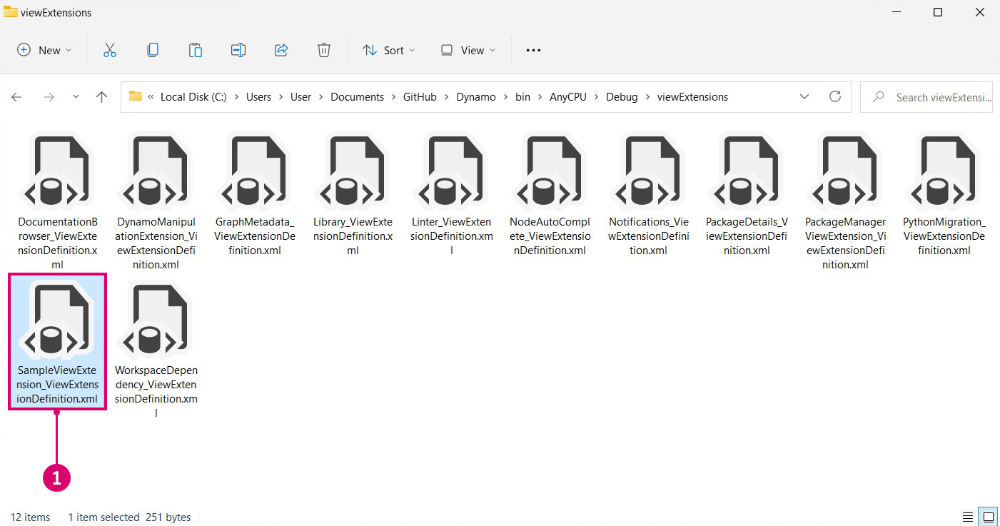

# Extensions

Extensions are a powerful development tool in the Dynamo ecosystem. They allow for developers to drive custom functionality based on Dynamo interactions and logic. Extensions can be broken down into two main categories, extensions and view extensions. As the naming implies, the view extension framework allows you to extend the Dynamo UI by registering custom menu items. Regular extensions operate in a very similar fashion minus the UI. For instance, we could build an extension that logs specific information to the Dynamo console. This scenario requires no custom UI and therefore could also be accomplished using an extension.

#### Extension Case Study <a href="#extension-case-study" id="extension-case-study"></a>

Following the SampleViewExtension example from the DynamoSamples Github repository, we will walk through the steps necessary to create a simple modeless window that displays the active nodes in the graph in real-time. A view extension requires that we create a UI for the window and bind values to a view model.


> 1. The view extension window developed following the SampleViewExtension example in the Github repository.

Though we will build the example from the ground up, you can also download and build the DynamoSamples repository to serve as a reference.

The DynamoSamples repository: [https://github.com/DynamoDS/DynamoSamples](https://github.com/DynamoDS/DynamoSamples)

> This walk-through will be specifically referencing the project named SampleViewExtension found in `DynamoSamples/src/`.

#### How to implement a view extension <a href="#how-to-implement-a-view-extension" id="how-to-implement-a-view-extension"></a>

A view extension has three essential parts:

* An assembly containing a class that implements `IViewExtension` as well as a class that creates a view model
* An `.xml` file that tells Dynamo where it should look for this assembly at runtime, and the type of extension
* An `.xaml` file that binds data to the graphic display and determines the window's appearance

**1. Create the project structure**

Start by creating a new `Class Library` project named `SampleViewExtension`.


> 1. Create a new project by selecting `File > New > Project`
> 2. Select `Class Library`
> 3. Name the project `SampleViewExtension`
> 4. Select `Ok`

In this project, we will need two classes. One class will implement `IViewExtension` and another that will implement `NotificationObject.` `IViewExtension` will contain all the information about how our extension will be deployed, loaded, referenced, and disposed. `NotificationObject` will provide notifications for changes in Dynamo and `IDisposable` When a change occurs the count will update accordingly.


> 1. A class file named `SampleViewExtension.cs` that will implement `IViewExtension`
> 2. A class file named `SampleWindowViewMode.cs` that will implement `NotificationObject`

To use `IViewExtension`, we will need the WpfUILibrary NuGet package. Installing this package will automatically install the Core, Services, and ZeroTouchLibrary packages.


> 1. Select the WpfUILibrary
> 2. Select `Install` to install all dependent packages

**2. Implement the IViewExtension class**

From the `IViewExtension` class we will determine what happens when Dynamo starts up, when the extension is loaded, and when Dynamo shuts down. In the `SampleViewExtension.cs` class file, add the following code:

```
using System;
using System.Windows;
using System.Windows.Controls;
using Dynamo.Wpf.Extensions;

namespace SampleViewExtension
{

    public class SampleViewExtension : IViewExtension
    {
        private MenuItem sampleMenuItem;

        public void Dispose()
        {
        }

        public void Startup(ViewStartupParams p)
        {
        }

        public void Loaded(ViewLoadedParams p)
        {
            // Save a reference to your loaded parameters.
            // You'll need these later when you want to use
            // the supplied workspaces

            sampleMenuItem = new MenuItem {Header = "Show View Extension Sample Window"};
            sampleMenuItem.Click += (sender, args) =>
            {
                var viewModel = new SampleWindowViewModel(p);
                var window = new SampleWindow
                {
                    // Set the data context for the main grid in the window.
                    MainGrid = { DataContext = viewModel },

                    // Set the owner of the window to the Dynamo window.
                    Owner = p.DynamoWindow
                };

                window.Left = window.Owner.Left + 400;
                window.Top = window.Owner.Top + 200;

                // Show a modeless window.
                window.Show();
            };
            p.AddExtensionMenuItem(sampleMenuItem);
        }

        public void Shutdown()
        {
        }

        public string UniqueId
        {
            get
            {
                return Guid.NewGuid().ToString();
            }  
        } 

        public string Name
        {
            get
            {
                return "Sample View Extension";
            }
        } 

    }
}
```

The `SampleViewExtension` class creates a clickable menu item to open the window and connects it to the view model and window.

* `public class SampleViewExtension : IViewExtension` `SampleViewExtension` inherits from the `IViewExtension` interface provides everything we need to create the menu item.
* `sampleMenuItem = new MenuItem { Header = "Show View Extension Sample Window" };` creates a MenuItem and adds it to the `View` menu.


> 1. The menu item

* `sampleMenuItem.Click += (sender, args)` triggers an event that will open a new window when the menu item is clicked
* `MainGrid = { DataContext = viewModel }` sets the data context for the main grid in the window, referring to `Main Grid` in the `.xaml` file we will create
* `Owner = p.DynamoWindow` sets the owner of our pop-out window to Dynamo. This means the new window is dependent on Dynamo so actions such as minimizing, maximizing, and restoring Dynamo will cause the new window to follow this same behavior
* `window.Show();` displays the window the additional window properties have been set

**3. Implementing the view model**

Now that we have established some of the window's basic parameters, we will add the logic for responding to various Dynamo related events and instruct the UI to update based on these events. Copy the following code into the `SampleWindowViewModel.cs` class file:

```
using System;
using Dynamo.Core;
using Dynamo.Extensions;
using Dynamo.Graph.Nodes;

namespace SampleViewExtension
{
    public class SampleWindowViewModel : NotificationObject, IDisposable
    {
        private string activeNodeTypes;
        private ReadyParams readyParams;

        // Displays active nodes in the workspace
        public string ActiveNodeTypes
        {
            get
            {
                activeNodeTypes = getNodeTypes();
                return activeNodeTypes;
            }
        }

        // Helper function that builds string of active nodes
        public string getNodeTypes()
        {
            string output = "Active nodes:\n";

            foreach (NodeModel node in readyParams.CurrentWorkspaceModel.Nodes)
            {
                string nickName = node.Name;
                output += nickName + "\n";
            }

            return output;
        }

        public SampleWindowViewModel(ReadyParams p)
        {
            readyParams = p;
            p.CurrentWorkspaceModel.NodeAdded += CurrentWorkspaceModel_NodesChanged;
            p.CurrentWorkspaceModel.NodeRemoved += CurrentWorkspaceModel_NodesChanged;
        }

        private void CurrentWorkspaceModel_NodesChanged(NodeModel obj)
        {
            RaisePropertyChanged("ActiveNodeTypes");
        }

        public void Dispose()
        {
            readyParams.CurrentWorkspaceModel.NodeAdded -= CurrentWorkspaceModel_NodesChanged;
            readyParams.CurrentWorkspaceModel.NodeRemoved -= CurrentWorkspaceModel_NodesChanged;
        }
    }
}
```

This implementation of the view model class listens to the `CurrentWorkspaceModel` and triggers an event when a node is added or removed from the workspace. This raises a property change that notifies the UI or bound elements that the data has changed and needs to be updated. The `ActiveNodeTypes` getter is called which internally calls an additional helper function `getNodeTypes()`. This function iterates through all the active nodes on the canvas, populate a string containing the names of these nodes, and returns this string to our binding in the .xaml file to be displayed in our pop-out window.

With the core logic of the extension defined, we will now specify the appearance details of the window with an `.xaml` file. All we need is a simple window that will display the string via the `ActiveNodeTypes` property binding in the`TextBlock` `Text`.


> 1. Right-click on the project and select `Add > New Item...`
> 2. Select the User Control template which we will alter to create a window
> 3. Name the new file `SampleWindow.xaml`
> 4. Select `Add`

In the window `.xaml` code, we will need to bind `SelectedNodesText` to a text block. Add the following code to `SampleWindow.xaml`:

```
<Window x:Class="SampleViewExtension.SampleWindow"
             xmlns="http://schemas.microsoft.com/winfx/2006/xaml/presentation"
             xmlns:x="http://schemas.microsoft.com/winfx/2006/xaml"
             xmlns:mc="http://schemas.openxmlformats.org/markup-compatibility/2006" 
             xmlns:d="http://schemas.microsoft.com/expression/blend/2008" 
             xmlns:local="clr-namespace:SampleViewExtension"
             mc:Ignorable="d" 
             d:DesignHeight="300" d:DesignWidth="300"
            Width="500" Height="100">
    <Grid Name="MainGrid" 
          HorizontalAlignment="Stretch"
          VerticalAlignment="Stretch">
        <TextBlock HorizontalAlignment="Stretch" Text="{Binding ActiveNodeTypes}" FontFamily="Arial" Padding="10" FontWeight="Medium" FontSize="18" Background="#2d2d2d" Foreground="White"/>
    </Grid>
</Window>
```

* `Text="{Binding ActiveNodeTypes}"` binds to the property value of `ActiveNodeTypes` in `SampleWindowViewModel.cs` to the `TextBlock` `Text` value in the window.

We will now initialize the sample window in the .xaml C# backing file `SampleWindow.xaml.cs`. Add the following code to `SampleWindow.xaml`:

```
using System.Windows;

namespace SampleViewExtension
{
    /// <summary>
    /// Interaction logic for SampleWindow.xaml
    /// </summary>
    public partial class SampleWindow : Window
    {
        public SampleWindow()
        {
            InitializeComponent();
        }
    }
}
```

The view extension is now ready to be built and added to Dynamo. Dynamo requires an `xml` file in order to register our output `.dll` as an extension.


> 1. Right-click on the project and select `Add > New Item...`
> 2. Select XML file
> 3. Name the file `SampleViewExtension_ViewExtensionDefinition.xml`
> 4. Select `Add`

* The file name follows the Dynamo standard for referencing an extension assembly like so: `"extensionName"_ViewExtensionDefinition.xml`

In the `xml` file, add the following code to tell Dynamo where to look for the extension assembly:

```
<ViewExtensionDefinition>
  <AssemblyPath>C:\Users\username\Documents\Visual Studio 2015\Projects\SampleViewExtension\SampleViewExtension\bin\Debug\SampleViewExtension.dll</AssemblyPath>
  <TypeName>SampleViewExtension.SampleViewExtension</TypeName>
</ViewExtensionDefinition>
```

* In this example, we built the assembly to the default Visual Studio project folder. Replace the `<AssemblyPath>...</AssemblyPath>` target with the location of the assembly.

The last step is to copy the `SampleViewExtension_ViewExtensionDefinition.xml` file into Dynamo's view extensions folder located in the Dynamo Core installation directory `C:\Program Files\Dynamo\Dynamo Core\1.3\viewExtensions`. It is important to note that there are separate folders for `extensions` and `viewExtensions`. Placing the `xml` file in the incorrect folder may cause failure to properly load at runtime.



> 1. The `.xml` file we copied into Dynamo's view extensions folder

This is a basic introduction to view extensions. For a more sophisticated case study see the DynaShape package, an open source project on Github. The package uses a view extension that enables live editing in the Dynamo model view.

A package installer for DynaShape can be downloaded from the Dynamo Forum: [https://forum.dynamobim.com/t/dynashape-published/11666](https://forum.dynamobim.com/t/dynashape-published/11666)

The source code can be cloned from Github: [https://github.com/LongNguyenP/DynaShape](https://github.com/LongNguyenP/DynaShape)
