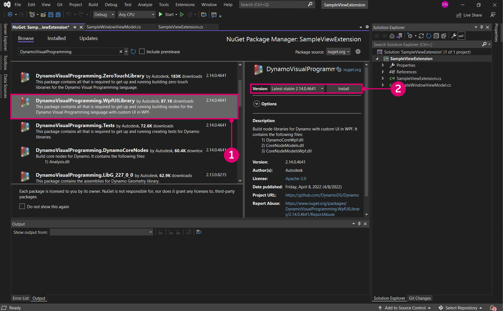

# Extensions 

Les extensions sont un outil de développement puissant dans l’écosystème Dynamo. Elles permettent aux développeurs de créer des fonctionnalités personnalisées basées sur les interactions et la logique de Dynamo. Les extensions peuvent être divisées en deux catégories principales : les extensions et les extensions de vue. Comme son nom l’indique, le cadre d’extension de vue vous permet d’étendre l’interface utilisateur Dynamo en enregistrant des éléments de menu personnalisés. Les extensions classiques fonctionnent de manière très similaire, à l’exception de l’interface utilisateur. Par exemple, nous pourrions générer une extension qui enregistre des informations spécifiques dans la console Dynamo. Ce scénario ne nécessite pas d’interface utilisateur personnalisée et pourrait donc être réalisé à l’aide d’une extension.

#### Étude de cas sur les extensions <a href="#extension-case-study" id="extension-case-study"></a>

En suivant l’exemple SampleViewExtension du dépôt DynamoSamples de Github, nous allons parcourir les étapes nécessaires à la création d’une simple fenêtre sans modèle qui affiche les nœuds actifs du graphique en temps réel. Une extension de vue nécessite la création d’une interface utilisateur pour la fenêtre et l’association de valeurs à un modèle de vue.


> 1. La fenêtre d’extension de vue a été développée en suivant l’exemple SampleViewExtension dans le dépôt de Github.

Bien que nous allons générer l’exemple à partir de zéro, vous pouvez également télécharger et générer le dépôt DynamoSamples comme référence.

Le dépôt DynamoSamples : [https://github.com/DynamoDS/DynamoSamples](https://github.com/DynamoDS/DynamoSamples)

> Cette présentation fait référence au projet nommé SampleViewExtension qui se trouve dans `DynamoSamples/src/`.

#### Comment implémenter une extension de vue <a href="#how-to-implement-a-view-extension" id="how-to-implement-a-view-extension"></a>

Une extension de vue comporte trois parties essentielles :

* un assemblage contenant une classe qui implémente `IViewExtension` ainsi qu’une classe qui crée un modèle de vue ;
* un fichier `.xml` qui indique à Dynamo où il doit chercher cet assemblage lors de l’exécution, et le type d’extension ;
* un fichier `.xaml` qui lie les données à l’affichage graphique et détermine l’apparence de la fenêtre.

**1\. Créer la structure du projet**

Commencez par créer un projet `Class Library` nommé `SampleViewExtension`.


> 1. Créez un projet en sélectionnant `File > New > Project`
> 2. Sélectionnez `Class Library`
> 3. Nommez le projet `SampleViewExtension`
> 4. Sélectionnez `Ok`

Dans ce projet, nous aurons besoin de deux classes. Une classe implémentera `IViewExtension` et une autre qui implémentera `NotificationObject.` `IViewExtension` contiendra toutes les informations sur la façon dont l’extension sera déployée, chargée, référencée et supprimée. `NotificationObject` fournira des notifications pour les modifications dans Dynamo et `IDisposable`. Lorsqu’un changement se produit, le compte sera mis à jour en conséquence.


> 1. Un fichier de classe nommé `SampleViewExtension.cs` qui implémentera `IViewExtension`
> 2. Un fichier de classe nommé `SampleWindowViewMode.cs` qui implémentera `NotificationObject`

Pour utiliser `IViewExtension`, nous aurons besoin du package NuGet WpfUILibrary. L’installation de ce package installera automatiquement les packages Core, Services et ZeroTouchLibrary.



> 1. Sélectionnez la bibliothèque WpfUILibrary
> 2. Sélectionnez `Install` pour installer tous les packages dépendants

**2\. Implémenter la classe IViewExtension**

Dans la classe `IViewExtension`, nous allons déterminer les actions qui se produisent au démarrage de Dynamo, au chargement de l’extension et à l’arrêt de Dynamo. Dans le fichier de classe `SampleViewExtension.cs`, ajoutez le code suivant :

```
using System;
using System.Windows;
using System.Windows.Controls;
using Dynamo.Wpf.Extensions;

namespace SampleViewExtension
{

    public class SampleViewExtension : IViewExtension
    {
        private MenuItem sampleMenuItem;

        public void Dispose()
        {
        }

        public void Startup(ViewStartupParams p)
        {
        }

        public void Loaded(ViewLoadedParams p)
        {
            // Save a reference to your loaded parameters.
            // You'll need these later when you want to use
            // the supplied workspaces

            sampleMenuItem = new MenuItem {Header = "Show View Extension Sample Window"};
            sampleMenuItem.Click += (sender, args) =>
            {
                var viewModel = new SampleWindowViewModel(p);
                var window = new SampleWindow
                {
                    // Set the data context for the main grid in the window.
                    MainGrid = { DataContext = viewModel },

                    // Set the owner of the window to the Dynamo window.
                    Owner = p.DynamoWindow
                };

                window.Left = window.Owner.Left + 400;
                window.Top = window.Owner.Top + 200;

                // Show a modeless window.
                window.Show();
            };
            p.AddMenuItem(MenuBarType.View, sampleMenuItem);
        }

        public void Shutdown()
        {
        }

        public string UniqueId
        {
            get
            {
                return Guid.NewGuid().ToString();
            }  
        } 

        public string Name
        {
            get
            {
                return "Sample View Extension";
            }
        } 

    }
}
```

La classe `SampleViewExtension` crée un élément de menu cliquable pour ouvrir la fenêtre et le relie au modèle de vue et à la fenêtre.

* `public class SampleViewExtension : IViewExtension` `SampleViewExtension` hérite de l’interface `IViewExtension` et fournit tout ce dont nous avons besoin pour créer l’élément de menu.
* `sampleMenuItem = new MenuItem { Header = "Show View Extension Sample Window" };` crée un élément MenuItem et l’ajoute au menu `View`.


> 1. L’élément de menu

* `sampleMenuItem.Click += (sender, args)` déclenche un événement qui ouvre une nouvelle fenêtre lorsque vous cliquez sur l’élément de menu
* `MainGrid = { DataContext = viewModel }` définit le contexte de données pour la grille principale de la fenêtre, en se référant à `Main Grid` dans le fichier `.xaml` que nous allons créer
* `Owner = p.DynamoWindow` définit le propriétaire de la fenêtre contextuelle sur Dynamo. Cela signifie que la nouvelle fenêtre est dépendante de Dynamo, de sorte que les actions telles que la réduction, l’agrandissement et la restauration de Dynamo entraîneront le même comportement dans la nouvelle fenêtre
* `window.Show();` affiche la fenêtre dans laquelle les propriétés de fenêtre supplémentaires ont été définies

**3\. Implémentation du modèle de vue**

Maintenant que nous avons établi certains des paramètres de base de la fenêtre, nous allons ajouter la logique de réponse aux différents événements liés à Dynamo et indiquer à l’interface utilisateur de se mettre à jour en fonction de ces événements. Copiez le code suivant dans le fichier de classe `SampleWindowViewModel.cs` :

```
using System;
using Dynamo.Core;
using Dynamo.Extensions;
using Dynamo.Graph.Nodes;

namespace SampleViewExtension
{
    public class SampleWindowViewModel : NotificationObject, IDisposable
    {
        private string activeNodeTypes;
        private ReadyParams readyParams;

        // Displays active nodes in the workspace
        public string ActiveNodeTypes
        {
            get
            {
                activeNodeTypes = getNodeTypes();
                return activeNodeTypes;
            }
        }

        // Helper function that builds string of active nodes
        public string getNodeTypes()
        {
            string output = "Active nodes:\n";

            foreach (NodeModel node in readyParams.CurrentWorkspaceModel.Nodes)
            {
                string nickName = node.Name;
                output += nickName + "\n";
            }

            return output;
        }

        public SampleWindowViewModel(ReadyParams p)
        {
            readyParams = p;
            p.CurrentWorkspaceModel.NodeAdded += CurrentWorkspaceModel_NodesChanged;
            p.CurrentWorkspaceModel.NodeRemoved += CurrentWorkspaceModel_NodesChanged;
        }

        private void CurrentWorkspaceModel_NodesChanged(NodeModel obj)
        {
            RaisePropertyChanged("ActiveNodeTypes");
        }

        public void Dispose()
        {
            readyParams.CurrentWorkspaceModel.NodeAdded -= CurrentWorkspaceModel_NodesChanged;
            readyParams.CurrentWorkspaceModel.NodeRemoved -= CurrentWorkspaceModel_NodesChanged;
        }
    }
}
```

Cette implémentation de la classe de modèle de vue écoute le `CurrentWorkspaceModel` et déclenche un événement lorsqu’un nœud est ajouté ou supprimé de l’espace de travail. Cela déclenche un changement de propriété qui signale à l’interface utilisateur ou aux éléments liés que les données ont changé et qu’elles doivent être mises à jour. Le getter `ActiveNodeTypes` est appelé, ce qui appelle en interne une fonction d’assistant supplémentaire `getNodeTypes()`. Cette fonction parcourt tous les nœuds actifs de la zone de dessin, remplit une chaîne contenant les noms de ces nœuds et renvoie cette chaîne à notre liaison dans le fichier .xaml pour qu’elle soit affichée dans notre fenêtre contextuelle.

Une fois la logique principale de l’extension définie, vous allez maintenant spécifier les détails d’apparence de la fenêtre avec un fichier `.xaml`. Il suffit d’une simple fenêtre qui affiche la chaîne via la liaison de propriété `ActiveNodeTypes` dans le `TextBlock` `Text`.


> 1. Cliquez avec le bouton droit de la souris sur le projet et choisissez `Add > New Item...`
> 2. Sélectionnez le modèle de contrôle utilisateur que vous allez modifier pour créer une fenêtre
> 3. Nommez le nouveau fichier `SampleWindow.xaml`
> 4. Sélectionnez `Add`

Dans le code de la fenêtre `.xaml`, vous devez lier `SelectedNodesText` à un bloc de texte. Ajoutez le code suivant à `SampleWindow.xaml` :

```
<Window x:Class="SampleViewExtension.SampleWindow"
             xmlns="http://schemas.microsoft.com/winfx/2006/xaml/presentation"
             xmlns:x="http://schemas.microsoft.com/winfx/2006/xaml"
             xmlns:mc="http://schemas.openxmlformats.org/markup-compatibility/2006" 
             xmlns:d="http://schemas.microsoft.com/expression/blend/2008" 
             xmlns:local="clr-namespace:SampleViewExtension"
             mc:Ignorable="d" 
             d:DesignHeight="300" d:DesignWidth="300"
            Width="500" Height="100">
    <Grid Name="MainGrid" 
          HorizontalAlignment="Stretch"
          VerticalAlignment="Stretch">
        <TextBlock HorizontalAlignment="Stretch" Text="{Binding ActiveNodeTypes}" FontFamily="Arial" Padding="10" FontWeight="Medium" FontSize="18" Background="#2d2d2d" Foreground="White"/>
    </Grid>
</Window>
```

* `Text="{Binding ActiveNodeTypes}"` se lie à la valeur de propriété de `ActiveNodeTypes` dans `SampleWindowViewModel.cs` à la valeur de `TextBlock` `Text` dans la fenêtre.

Nous allons maintenant initialiser la fenêtre d’exemple dans le fichier de sauvegarde .xaml C# `SampleWindow.xaml.cs`. Ajoutez le code suivant à `SampleWindow.xaml` :

```
using System.Windows;

namespace SampleViewExtension
{
    /// <summary>
    /// Interaction logic for SampleWindow.xaml
    /// </summary>
    public partial class SampleWindow : Window
    {
        public SampleWindow()
        {
            InitializeComponent();
        }
    }
}
```

L’extension de vue est maintenant prête à être créée et ajoutée à Dynamo. Dynamo requiert un fichier `xml` pour enregistrer la sortie `.dll` en tant qu’extension.


> 1. Cliquez avec le bouton droit de la souris sur le projet et choisissez `Add > New Item...`
> 2. Sélectionner un fichier XML
> 3. Nommez le fichier `SampleViewExtension_ViewExtensionDefinition.xml`
> 4. Sélectionnez `Add`

* Le nom du fichier suit la norme Dynamo pour référencer un ensemble d’extension de la manière suivante : `"extensionName"_ViewExtensionDefinition.xml`

Dans le fichier `xml`, ajoutez le code suivant pour indiquer à Dynamo où rechercher l’assemblage d’extension :

```
<ViewExtensionDefinition>
  <AssemblyPath>C:\Users\username\Documents\Visual Studio 2015\Projects\SampleViewExtension\SampleViewExtension\bin\Debug\SampleViewExtension.dll</AssemblyPath>
  <TypeName>SampleViewExtension.SampleViewExtension</TypeName>
</ViewExtensionDefinition>
```

* Dans cet exemple, nous avons créé l’assemblage dans le dossier par défaut du projet Visual Studio. Remplacez la cible `<AssemblyPath>...</AssemblyPath>` par l’emplacement de l’assemblage.

La dernière étape consiste à copier le fichier `SampleViewExtension_ViewExtensionDefinition.xml` dans le dossier des extensions de vue de Dynamo situé dans le répertoire d’installation de Dynamo Core `C:\Program Files\Dynamo\Dynamo Core\1.3\viewExtensions`. Il est important de noter qu’il existe des dossiers distincts pour `extensions` et `viewExtensions`. Placer le fichier `xml` dans un dossier incorrect peut entraîner un échec du chargement au moment de l’exécution.


> 1. Le fichier `.xml` que nous avons copié dans le dossier des extensions de vue de Dynamo

Il s’agit d’une introduction sommaire aux extensions de vues. Pour une étude de cas plus sophistiquée, consultez le package DynaShape, un projet open source sur Github. Le package utilise une extension de vue qui permet de modifier en direct la vue du modèle Dynamo.

Un programme d’installation du package pour Dynamo Shape peut être téléchargé à partir du forum Dynamo : [https://forum.dynamobim.com/t/dynashape-published/11666](https://forum.dynamobim.com/t/dynashape-published/11666)

Le code source peut être cloné à partir de Github : [https://github.com/LongNguyenP/DynaShape](https://github.com/LongNguyenP/DynaShape)
