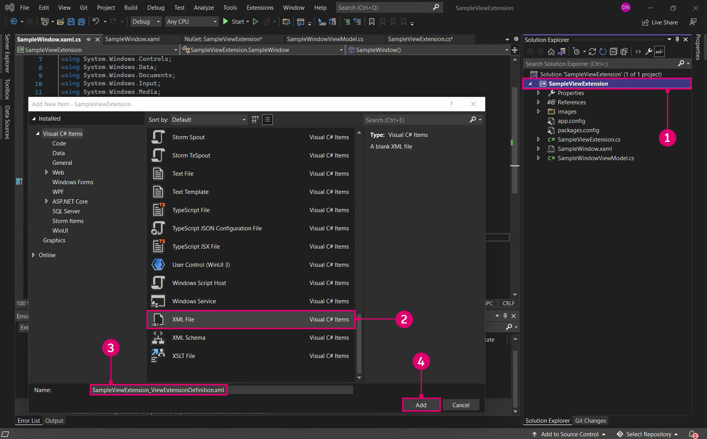

# 延伸 

延伸是 Dynamo 生態系統中功能強大的開發工具。這些工具可讓開發人員根據 Dynamo 的互動和邏輯驅動自訂功能。延伸可以分為兩個主要品類：延伸和視圖延伸。如同字面意思，視圖延伸架構可讓您透過註冊自訂功能表項目的方式來延伸 Dynamo 使用者介面。一般延伸則以非常相似的方式 (除了使用者介面之外) 運作。例如，我們可以建置一個延伸，將特定資訊記錄到 Dynamo 主控台。此情況不需要自訂使用者介面，因此也可以使用延伸完成。

#### 延伸案例研究 <a href="#extension-case-study" id="extension-case-study"></a>

按照 DynamoSamples Github 儲存庫的 SampleViewExtension 範例，我們將逐步瞭解建立簡單的共存式視窗即時在圖表中顯示作用中節點所需的步驟。視圖延伸會要求我們為視窗建立使用者介面，並將值與視圖模型繫結。


> 1. 按照 Github 儲存庫中 SampleViewExtension 範例而開發的視圖延伸視窗。

雖然我們將從頭開始建置範例，但您也可以下載並建置 DynamoSamples 儲存庫做為參考。

DynamoSamples 儲存庫：[https://github.com/DynamoDS/DynamoSamples](https://github.com/DynamoDS/DynamoSamples)

> 此逐步解說將明確參考在 `DynamoSamples/src/` 中名為 SampleViewExtension 的專案。

#### 如何實作視圖延伸 <a href="#how-to-implement-a-view-extension" id="how-to-implement-a-view-extension"></a>

視圖延伸有三個基本部分：

* 一個組合，其中包含實作 `IViewExtension` 的類別，以及建立視圖模型的類別
* 一個 `.xml` 檔案，告訴 Dynamo 在執行時期應在何處尋找此組合，以及延伸的類型
* 一個 `.xaml` 檔案，將資料與圖形顯示繫結，並決定視窗的外觀

**1\.建立專案結構**

首先，建立一個名為 `SampleViewExtension` 的新 `Class Library` 專案。


> 1. 選取「`File > New > Project`」建立新專案
> 2. 選取「`Class Library`」
> 3. 將專案命名為 `SampleViewExtension`
> 4. 選取「`Ok`」

在此專案中，我們需要兩個類別。一個類別將實作 `IViewExtension`，另一個類別將實作 `NotificationObject.`。`IViewExtension` 包含有關如何部署、載入、參考和處置延伸的所有資訊。`NotificationObject` 提供 Dynamo 和 `IDisposable` 中發生變更的通知。發生變更時，計數將相應更新。


> 1. 名為 `SampleViewExtension.cs` 的類別檔案，將實作 `IViewExtension`
> 2. 名為 `SampleWindowViewMode.cs` 的類別檔案，將實作 `NotificationObject`

若要使用 `IViewExtension`，我們需要 WpfUILibrary NuGet 套件。安裝此套件會自動安裝 Core、Services 和 ZeroTouchLibrary 等套件。


> 1. 選取 WpfUILibrary
> 2. 選取「`Install`」以安裝所有相依套件

**2\.實作 IViewExtension 類別**

從 `IViewExtension` 類別，我們將決定 Dynamo 啟動時、載入延伸時，以 及Dynamo 關閉時會發生什麼情況。在 `SampleViewExtension.cs` 類別檔案中，加入以下程式碼：

```
using System;
using System.Windows;
using System.Windows.Controls;
using Dynamo.Wpf.Extensions;

namespace SampleViewExtension
{

    public class SampleViewExtension : IViewExtension
    {
        private MenuItem sampleMenuItem;

        public void Dispose()
        {
        }

        public void Startup(ViewStartupParams p)
        {
        }

        public void Loaded(ViewLoadedParams p)
        {
            // Save a reference to your loaded parameters.
            // You'll need these later when you want to use
            // the supplied workspaces

            sampleMenuItem = new MenuItem {Header = "Show View Extension Sample Window"};
            sampleMenuItem.Click += (sender, args) =>
            {
                var viewModel = new SampleWindowViewModel(p);
                var window = new SampleWindow
                {
                    // Set the data context for the main grid in the window.
                    MainGrid = { DataContext = viewModel },

                    // Set the owner of the window to the Dynamo window.
                    Owner = p.DynamoWindow
                };

                window.Left = window.Owner.Left + 400;
                window.Top = window.Owner.Top + 200;

                // Show a modeless window.
                window.Show();
            };
            p.AddMenuItem(MenuBarType.View, sampleMenuItem);
        }

        public void Shutdown()
        {
        }

        public string UniqueId
        {
            get
            {
                return Guid.NewGuid().ToString();
            }  
        } 

        public string Name
        {
            get
            {
                return "Sample View Extension";
            }
        } 

    }
}
```

`SampleViewExtension` 類別建立可點選的功能表項目，以開啟視窗並連接至視圖模型和視窗。

* `public class SampleViewExtension : IViewExtension` `SampleViewExtension` 從 `IViewExtension` 介面繼承，提供建立功能表項目所需的一切。
* `sampleMenuItem = new MenuItem { Header = "Show View Extension Sample Window" };` 建立 MenuItem，並加入「`View`」功能表。


> 1. 功能表項目

* `sampleMenuItem.Click += (sender, args)` 觸發在按一下功能表項目時將開啟新視窗的事件
* `MainGrid = { DataContext = viewModel }` 參考我們將建立的 `.xaml` 檔案中的 `Main Grid`，設定視窗中主格線的資料內容
* `Owner = p.DynamoWindow` 將彈出視窗的擁有者設定為 Dynamo。這表示新視窗依賴於 Dynamo，因此動作 (例如最小化、最大化和還原 Dynamo) 將導致新視窗遵循此相同行為
* `window.Show();` 顯示已設定其他視窗性質的視窗

**3\.實作視圖模型**

現在，我們已建立視窗的某些基本參數，我們將加入回應各種 Dynamo 相關事件的邏輯，並指示使用者介面根據這些事件進行更新。將以下程式碼複製到 `SampleWindowViewModel.cs` 類別檔案：

```
using System;
using Dynamo.Core;
using Dynamo.Extensions;
using Dynamo.Graph.Nodes;

namespace SampleViewExtension
{
    public class SampleWindowViewModel : NotificationObject, IDisposable
    {
        private string activeNodeTypes;
        private ReadyParams readyParams;

        // Displays active nodes in the workspace
        public string ActiveNodeTypes
        {
            get
            {
                activeNodeTypes = getNodeTypes();
                return activeNodeTypes;
            }
        }

        // Helper function that builds string of active nodes
        public string getNodeTypes()
        {
            string output = "Active nodes:\n";

            foreach (NodeModel node in readyParams.CurrentWorkspaceModel.Nodes)
            {
                string nickName = node.Name;
                output += nickName + "\n";
            }

            return output;
        }

        public SampleWindowViewModel(ReadyParams p)
        {
            readyParams = p;
            p.CurrentWorkspaceModel.NodeAdded += CurrentWorkspaceModel_NodesChanged;
            p.CurrentWorkspaceModel.NodeRemoved += CurrentWorkspaceModel_NodesChanged;
        }

        private void CurrentWorkspaceModel_NodesChanged(NodeModel obj)
        {
            RaisePropertyChanged("ActiveNodeTypes");
        }

        public void Dispose()
        {
            readyParams.CurrentWorkspaceModel.NodeAdded -= CurrentWorkspaceModel_NodesChanged;
            readyParams.CurrentWorkspaceModel.NodeRemoved -= CurrentWorkspaceModel_NodesChanged;
        }
    }
}
```

此視圖模型類別實作會監聽 `CurrentWorkspaceModel`，並在節點加入工作區或從工作區中移除時觸發事件。這會引發性質變更，通知使用者介面或已繫結的元素，資料已變更而需要更新。呼叫 `ActiveNodeTypes` getter，這會在內部呼叫其他協助函數 `getNodeTypes()`。此函數會逐一查看圖元區上所有作用中的節點，填入包含這些節點名稱的字串，然後將此字串傳回 .xaml 檔案中的繫結，以顯示在快顯視窗中。

定義延伸的核心邏輯後，我們現在將使用 `.xaml` 檔案指定視窗的外觀詳細資料。我們只需要一個簡單的視窗，透過 `TextBlock` `Text` 中的 `ActiveNodeTypes` 性質繫結顯示字串。


> 1. 在專案上按一下右鍵，然後選取「`Add > New Item...`」
> 2. 選取我們將做變更以建立視窗的「使用者控制項」樣板
> 3. 將新檔案命名為 `SampleWindow.xaml`
> 4. 選取「`Add`」

在視窗 `.xaml` 程式碼中，我們需要將 `SelectedNodesText` 繫結到文字區塊。將以下程式碼加入 `SampleWindow.xaml`：

```
<Window x:Class="SampleViewExtension.SampleWindow"
             xmlns="http://schemas.microsoft.com/winfx/2006/xaml/presentation"
             xmlns:x="http://schemas.microsoft.com/winfx/2006/xaml"
             xmlns:mc="http://schemas.openxmlformats.org/markup-compatibility/2006" 
             xmlns:d="http://schemas.microsoft.com/expression/blend/2008" 
             xmlns:local="clr-namespace:SampleViewExtension"
             mc:Ignorable="d" 
             d:DesignHeight="300" d:DesignWidth="300"
            Width="500" Height="100">
    <Grid Name="MainGrid" 
          HorizontalAlignment="Stretch"
          VerticalAlignment="Stretch">
        <TextBlock HorizontalAlignment="Stretch" Text="{Binding ActiveNodeTypes}" FontFamily="Arial" Padding="10" FontWeight="Medium" FontSize="18" Background="#2d2d2d" Foreground="White"/>
    </Grid>
</Window>
```

* `Text="{Binding ActiveNodeTypes}"` 將 `SampleWindowViewModel.cs` 中 `ActiveNodeTypes` 的性質值繫結到視窗中的 `TextBlock` `Text` 值。

我們現在要初始化 .xaml C# 支援檔案 `SampleWindow.xaml.cs` 中的範例視窗。將以下程式碼加入 `SampleWindow.xaml`：

```
using System.Windows;

namespace SampleViewExtension
{
    /// <summary>
    /// Interaction logic for SampleWindow.xaml
    /// </summary>
    public partial class SampleWindow : Window
    {
        public SampleWindow()
        {
            InitializeComponent();
        }
    }
}
```

視圖延伸現在已準備好建置並加到 Dynamo 中。Dynamo 需要 `xml` 檔案，才能將輸出 `.dll` 註冊為延伸。



> 1. 在專案上按一下右鍵，然後選取「`Add > New Item...`」
> 2. 選取 XML 檔案
> 3. 將檔案命名為 `SampleViewExtension_ViewExtensionDefinition.xml`
> 4. 選取「`Add`」

* 檔名會遵循 Dynamo 標準，以參考如下的延伸組合：`"extensionName"_ViewExtensionDefinition.xml`

在 `xml` 檔案中，加入以下程式碼，以告訴 Dynamo 在何處尋找延伸組合：

```
<ViewExtensionDefinition>
  <AssemblyPath>C:\Users\username\Documents\Visual Studio 2015\Projects\SampleViewExtension\SampleViewExtension\bin\Debug\SampleViewExtension.dll</AssemblyPath>
  <TypeName>SampleViewExtension.SampleViewExtension</TypeName>
</ViewExtensionDefinition>
```

* 在此範例中，我們將組合建置到預設的 Visual Studio 專案資料夾。將 `<AssemblyPath>...</AssemblyPath>` 目標取代為組合位置。

最後一步是將 `SampleViewExtension_ViewExtensionDefinition.xml` 檔案複製到 Dynamo 位於 Dynamo Core 安裝目錄 `C:\Program Files\Dynamo\Dynamo Core\1.3\viewExtensions` 中的視圖延伸資料夾。請務必注意，`extensions` 和 `viewExtensions` 是不同的資料夾。將 `xml` 檔案放在不正確的資料夾中，可能會導致在執行時期無法正確載入。


> 1. 我們複製到 Dynamo 的視圖延伸資料夾中的 `.xml` 檔案

這是視圖延伸的基本簡介。如需更複雜的案例研究，請參閱 Github 上的開放原始碼專案 DynaShape 套件。該套件使用可在 Dynamo 模型視圖中進行即時編輯的視圖延伸。

從 Dynamo 論壇 [https://forum.dynamobim.com/t/dynashape-published/11666](https://forum.dynamobim.com/t/dynashape-published/11666) 可下載 DynamoShape 的套件安裝程式

從 Github [https://github.com/LongNguyenP/DynaShape](https://github.com/LongNguyenP/DynaShape) 可以複製原始程式碼
