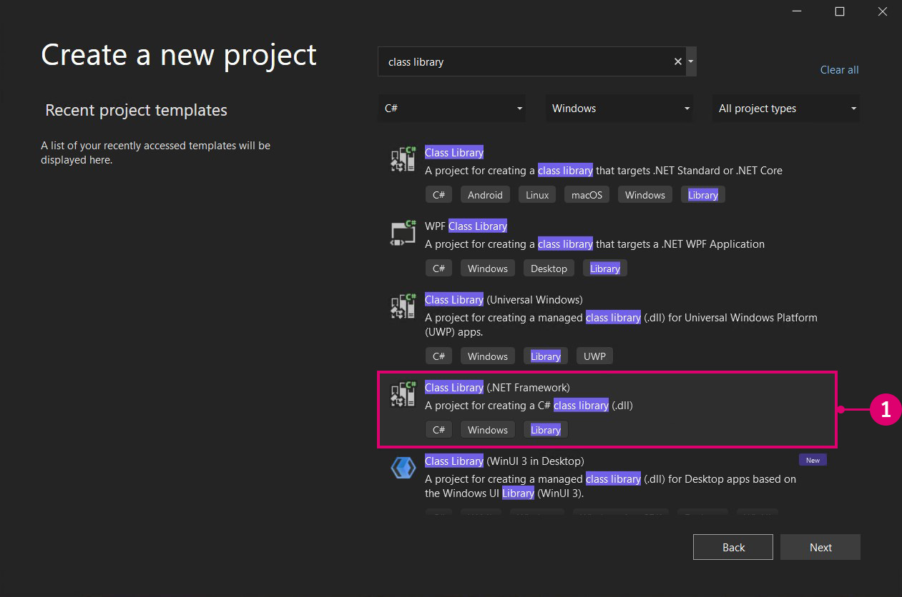
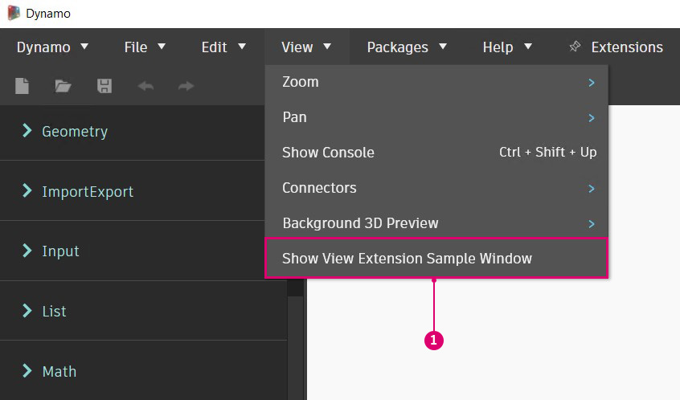

# Erweiterungen 

Erweiterungen sind ein leistungsstarkes Entwicklungswerkzeug im Dynamo-Ökosystem. Sie ermöglichen Entwicklern, benutzerdefinierte Funktionen basierend auf Dynamo-Interaktionen und -Logik zu steuern. Erweiterungen können in zwei Hauptkategorien unterteilt werden: Erweiterungen und Ansichtserweiterungen. Wie die Namen schon sagen, können Sie mit dem Ansichtserweiterungs-Framework die Dynamo-Benutzeroberfläche durch Registrieren benutzerdefinierter Menüelemente erweitern. Normale Erweiterungen funktionieren auf ähnliche Weise, nur ohne Benutzeroberfläche. Wir können beispielsweise eine Erweiterung erstellen, die bestimmte Informationen in der Dynamo-Konsole protokolliert. Dieses Szenario erfordert keine angepasste Benutzeroberfläche und kann daher auch mit einer Erweiterung durchgeführt werden.

#### Fallstudie für Erweiterungen <a href="#extension-case-study" id="extension-case-study"></a>

Im Anschluss an das Beispiel SampleViewExtension aus dem DynamoSamples-GitHub-Repository gehen wir die Schritte zum Erstellen eines einfachen, modusunabhängigen Fensters durch, in dem die aktiven Blöcke im Diagramm in Echtzeit angezeigt werden. Für eine Ansichtserweiterung müssen wir eine Benutzeroberfläche für das Fenster erstellen und Werte an ein Ansichtsmodell binden.


> 1. Das Fenster der Ansichtserweiterung, das nach dem Beispiel SampleViewExtension im GitHub-Repository entwickelt wurde.

Wir erstellen das Beispiel zwar von Grund auf. Sie können aber auch das DynamoSamples-Repository herunterladen und erstellen, um es als Referenz zu verwenden.

DynamoSamples-Repository: [https://github.com/DynamoDS/DynamoSamples](https://github.com/DynamoDS/DynamoSamples)

> Diese exemplarische Vorgehensweise referenziert speziell das Projekt mit dem Namen SampleViewExtension, das unter `DynamoSamples/src/` zu finden ist.

#### So implementieren Sie eine Ansichtserweiterung <a href="#how-to-implement-a-view-extension" id="how-to-implement-a-view-extension"></a>

Eine Ansichtserweiterung besteht aus drei wesentlichen Teilen:

* Einer Assembly, die eine Klasse enthält, die `IViewExtension` implementiert, sowie einer Klasse, die ein Ansichtsmodell erstellt
* Einer `.xml`-Datei, die Dynamo mitteilt, wo zur Laufzeit nach dieser Assembly gesucht werden soll, und dem Typ der Erweiterung
* Einer `.xaml`-Datei, die Daten an die grafische Darstellung bindet und die Darstellung des Fensters bestimmt

**1\. Erstellen der Projektstruktur**

Erstellen Sie zunächst ein neues `Class Library`-Projekt mit dem Namen `SampleViewExtension`.




> 1. Erstellen Sie ein neues Projekt, indem Sie `File > New > Project` auswählen.
> 2. Wählen Sie `Class Library` aus.
> 3. Geben Sie dem Projekt den Namen `SampleViewExtension`.
> 4. Wählen Sie `Ok` aus.

In diesem Projekt benötigen wir zwei Klassen. Eine Klasse, die `IViewExtension`, und eine andere, die `NotificationObject.` implementiert. `IViewExtension` enthält alle Informationen darüber, wie die Erweiterung bereitgestellt, geladen, referenziert und verworfen wird. `NotificationObject` informiert über Änderungen in Dynamo und `IDisposable`. Bei einer Änderung wird die Anzahl entsprechend aktualisiert.


> 1. Eine Klassendatei mit dem Namen `SampleViewExtension.cs`, die `IViewExtension` implementiert.
> 2. Eine Klassendatei mit dem Namen `SampleWindowViewMode.cs`, die `NotificationObject` implementiert.

Um `IViewExtension` verwenden zu können, benötigen wir das NuGet-Paket WpfUILibrary. Bei der Installation dieses Pakets werden automatisch die Pakete Core, Services und ZeroTouchLibrary installiert.


> 1. Wählen Sie WpfUILibrary aus.
> 2. Wählen Sie `Install` aus, um alle abhängigen Pakete zu installieren.

**2\. Implementieren der IViewExtension-Klasse**

In der `IViewExtension`-Klasse legen wir fest, was geschieht, wenn Dynamo gestartet, die Erweiterung geladen und Dynamo beendet wird. Fügen Sie in der Klassendatei `SampleViewExtension.cs` den folgenden Code hinzu:

```
using System;
using System.Windows;
using System.Windows.Controls;
using Dynamo.Wpf.Extensions;

namespace SampleViewExtension
{

    public class SampleViewExtension : IViewExtension
    {
        private MenuItem sampleMenuItem;

        public void Dispose()
        {
        }

        public void Startup(ViewStartupParams p)
        {
        }

        public void Loaded(ViewLoadedParams p)
        {
            // Save a reference to your loaded parameters.
            // You'll need these later when you want to use
            // the supplied workspaces

            sampleMenuItem = new MenuItem {Header = "Show View Extension Sample Window"};
            sampleMenuItem.Click += (sender, args) =>
            {
                var viewModel = new SampleWindowViewModel(p);
                var window = new SampleWindow
                {
                    // Set the data context for the main grid in the window.
                    MainGrid = { DataContext = viewModel },

                    // Set the owner of the window to the Dynamo window.
                    Owner = p.DynamoWindow
                };

                window.Left = window.Owner.Left + 400;
                window.Top = window.Owner.Top + 200;

                // Show a modeless window.
                window.Show();
            };
            p.AddMenuItem(MenuBarType.View, sampleMenuItem);
        }

        public void Shutdown()
        {
        }

        public string UniqueId
        {
            get
            {
                return Guid.NewGuid().ToString();
            }  
        } 

        public string Name
        {
            get
            {
                return "Sample View Extension";
            }
        } 

    }
}
```

Die `SampleViewExtension`-Klasse erstellt ein anklickbares Menüelement, um das Fenster zu öffnen, und verbindet es mit dem Ansichtsmodell und dem Ansichtsfenster.

* `public class SampleViewExtension : IViewExtension` `SampleViewExtension` übernimmt Daten von der `IViewExtension`-Schnittstelle und stellt alles bereit, was wir zur Erstellung des Menüelements benötigen.
* `sampleMenuItem = new MenuItem { Header = "Show View Extension Sample Window" };` erstellt ein MenuItem und fügt es dem Menü `View` hinzu.



> 1. Menüelement

* `sampleMenuItem.Click += (sender, args)` löst ein Ereignis aus, das ein neues Fenster öffnet, wenn auf das Menüelement geklickt wird.
* `MainGrid = { DataContext = viewModel }` legt den Datenkontext für das Hauptraster im Fenster fest, wobei auf `Main Grid` in der zu erstellenden Datei `.xaml` verwiesen wird.
* `Owner = p.DynamoWindow` legt den Eigentümer des Popup-Fensters auf Dynamo fest. Das bedeutet, dass das neue Fenster von Dynamo abhängig ist. Aktionen wie das Minimieren, Maximieren und Wiederherstellen von Dynamo bewirken daher, dass das neue Fenster dasselbe Verhalten aufweist.
* `window.Show();` zeigt das Fenster an, für das die zusätzlichen Fenstereigenschaften festgelegt wurden.

**3\. Implementieren des Ansichtsmodells**

Nachdem wir einige der grundlegenden Parameter des Fensters festgelegt haben, fügen wir die Logik für die Reaktion auf verschiedene Dynamo-bezogene Ereignisse hinzu und weisen die Benutzeroberfläche an, basierend auf diesen Ereignissen zu aktualisieren. Kopieren Sie den folgenden Code in die Klassendatei `SampleWindowViewModel.cs`:

```
using System;
using Dynamo.Core;
using Dynamo.Extensions;
using Dynamo.Graph.Nodes;

namespace SampleViewExtension
{
    public class SampleWindowViewModel : NotificationObject, IDisposable
    {
        private string activeNodeTypes;
        private ReadyParams readyParams;

        // Displays active nodes in the workspace
        public string ActiveNodeTypes
        {
            get
            {
                activeNodeTypes = getNodeTypes();
                return activeNodeTypes;
            }
        }

        // Helper function that builds string of active nodes
        public string getNodeTypes()
        {
            string output = "Active nodes:\n";

            foreach (NodeModel node in readyParams.CurrentWorkspaceModel.Nodes)
            {
                string nickName = node.Name;
                output += nickName + "\n";
            }

            return output;
        }

        public SampleWindowViewModel(ReadyParams p)
        {
            readyParams = p;
            p.CurrentWorkspaceModel.NodeAdded += CurrentWorkspaceModel_NodesChanged;
            p.CurrentWorkspaceModel.NodeRemoved += CurrentWorkspaceModel_NodesChanged;
        }

        private void CurrentWorkspaceModel_NodesChanged(NodeModel obj)
        {
            RaisePropertyChanged("ActiveNodeTypes");
        }

        public void Dispose()
        {
            readyParams.CurrentWorkspaceModel.NodeAdded -= CurrentWorkspaceModel_NodesChanged;
            readyParams.CurrentWorkspaceModel.NodeRemoved -= CurrentWorkspaceModel_NodesChanged;
        }
    }
}
```

Diese Implementierung der Ansichtsmodellklasse überwacht `CurrentWorkspaceModel` und löst ein Ereignis aus, wenn ein Block zum Arbeitsbereich hinzugefügt oder aus diesem entfernt wird. Dadurch wird eine Eigenschaftsänderung ausgelöst, die die Benutzeroberfläche oder gebundenen Elemente darüber informiert, dass die Daten geändert wurden und aktualisiert werden müssen. Der `ActiveNodeTypes`-Getter wird aufgerufen, der intern eine zusätzliche Hilfsfunktion `getNodeTypes()` aufruft. Diese Funktion durchläuft alle aktiven Blöcke im Ansichtsbereich, füllt eine Zeichenfolge mit den Namen dieser Blöcke aus und gibt diese Zeichenfolge an die Bindung in der XAML-Datei zurück, die im Popup-Fenster angezeigt werden soll.

Nachdem wir die Kernlogik der Erweiterung definiert haben, legen wir nun die Darstellungsdetails des Fensters mit einer `.xaml`-Datei fest. Wir benötigen lediglich ein einfaches Fenster, in dem die Zeichenfolge über die `ActiveNodeTypes`-Eigenschaftenbindung in `TextBlock` `Text` angezeigt wird.


> 1. Klicken Sie mit der rechten Maustaste auf das Projekt, und wählen Sie `Add > New Item...`.
> 2. Wählen Sie die Vorlage des Benutzersteuerelements aus, die wir später zum Erstellen eines Fensters ändern werden.
> 3. Geben Sie der neuen Datei den Namen `SampleWindow.xaml`.
> 4. Wählen Sie `Add` aus.

Im `.xaml`-Code des Fensters müssen wir `SelectedNodesText` an einen Textblock binden. Fügen Sie den folgenden Code zu `SampleWindow.xaml` hinzu:

```
<Window x:Class="SampleViewExtension.SampleWindow"
             xmlns="http://schemas.microsoft.com/winfx/2006/xaml/presentation"
             xmlns:x="http://schemas.microsoft.com/winfx/2006/xaml"
             xmlns:mc="http://schemas.openxmlformats.org/markup-compatibility/2006" 
             xmlns:d="http://schemas.microsoft.com/expression/blend/2008" 
             xmlns:local="clr-namespace:SampleViewExtension"
             mc:Ignorable="d" 
             d:DesignHeight="300" d:DesignWidth="300"
            Width="500" Height="100">
    <Grid Name="MainGrid" 
          HorizontalAlignment="Stretch"
          VerticalAlignment="Stretch">
        <TextBlock HorizontalAlignment="Stretch" Text="{Binding ActiveNodeTypes}" FontFamily="Arial" Padding="10" FontWeight="Medium" FontSize="18" Background="#2d2d2d" Foreground="White"/>
    </Grid>
</Window>
```

* `Text="{Binding ActiveNodeTypes}"` bindet den Eigenschaftswert von `ActiveNodeTypes` in `SampleWindowViewModel.cs` an den Wert `TextBlock` `Text` im Fenster.

Als Nächstes initialisieren wir das Beispielfenster in der XAML-C#-Sicherungsdatei `SampleWindow.xaml.cs`. Fügen Sie den folgenden Code zu `SampleWindow.xaml` hinzu:

```
using System.Windows;

namespace SampleViewExtension
{
    /// <summary>
    /// Interaction logic for SampleWindow.xaml
    /// </summary>
    public partial class SampleWindow : Window
    {
        public SampleWindow()
        {
            InitializeComponent();
        }
    }
}
```

Die Ansichtserweiterung kann jetzt erstellt und zu Dynamo hinzugefügt werden. Dynamo benötigt eine `xml`-Datei, um die `.dll`-Ausgabedatei als Erweiterung zu registrieren.


> 1. Klicken Sie mit der rechten Maustaste auf das Projekt, und wählen Sie `Add > New Item...`.
> 2. Wählen Sie die XML-Datei aus.
> 3. Geben Sie der Datei den Namen `SampleViewExtension_ViewExtensionDefinition.xml`.
> 4. Wählen Sie `Add` aus.

* Der Dateiname entspricht dem Dynamo-Standard zum Referenzieren einer Erweiterungs-Assembly wie folgt: `"extensionName"_ViewExtensionDefinition.xml`

Fügen Sie in der `xml`-Datei den folgenden Code hinzu, um Dynamo anzuweisen, wo nach der Erweiterungs-Assembly gesucht werden soll:

```
<ViewExtensionDefinition>
  <AssemblyPath>C:\Users\username\Documents\Visual Studio 2015\Projects\SampleViewExtension\SampleViewExtension\bin\Debug\SampleViewExtension.dll</AssemblyPath>
  <TypeName>SampleViewExtension.SampleViewExtension</TypeName>
</ViewExtensionDefinition>
```

* In diesem Beispiel haben wir die Assembly im Vorgabeprojektordner von Visual Studio erstellt. Ersetzen Sie das Ziel `<AssemblyPath>...</AssemblyPath>` durch den Speicherort der Assembly.

Der letzte Schritt besteht darin, die Datei `SampleViewExtension_ViewExtensionDefinition.xml` in den Ordner der Ansichtserweiterungen von Dynamo zu kopieren, der sich im Dynamo Core-Installationsverzeichnis `C:\Program Files\Dynamo\Dynamo Core\1.3\viewExtensions` befindet. Beachten Sie, dass separate Ordner für `extensions` und `viewExtensions` existieren. Wenn Sie die `xml`-Datei in den falschen Ordner verschieben, wird sie zur Laufzeit möglicherweise nicht ordnungsgemäß geladen.


> 1. Die `.xml`-Datei, die wir in den Dynamo-Ordner mit den Ansichtserweiterungen kopiert haben.

Dies ist eine grundlegende Einführung in Ansichtserweiterungen. Eine detailliertere Fallstudie finden Sie im DynaShape-Paket, einem Open-Source-Projekt auf GitHub. Das Paket verwendet eine Ansichtserweiterung, die die Live-Bearbeitung in der Dynamo-Modellansicht ermöglicht.

Ein Paket-Installationsprogramm für DynaShape kann im Dynamo-Forum heruntergeladen werden: [https://forum.dynamobim.com/t/dynashape-published/11666](https://forum.dynamobim.com/t/dynashape-published/11666).

Der Quellcode kann von GitHub geklont werden: [https://github.com/LongNguyenP/DynaShape](https://github.com/LongNguyenP/DynaShape).
