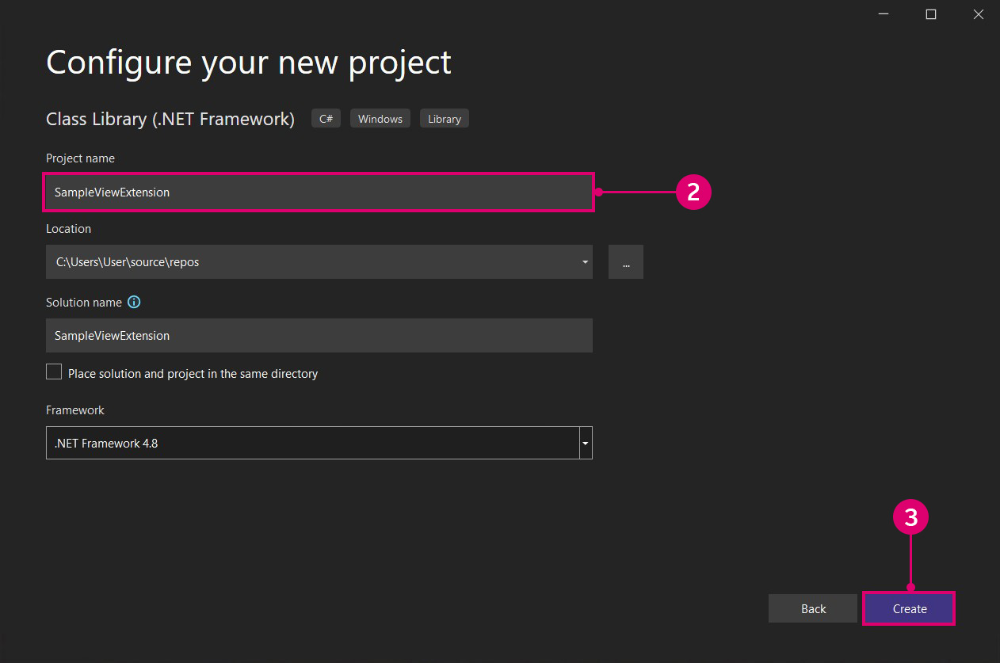

# Расширения

Расширения — это эффективное средство разработки в экосистеме Dynamo. Они позволяют разработчикам управлять пользовательскими функциями на основе взаимодействия и логики Dynamo. Расширения можно разделить на две основные категории: расширения и расширения вида. Как видно из названия, расширение вида позволяет расширить пользовательский интерфейс Dynamo путем регистрации пользовательских элементов меню. Обычные расширения работают аналогично, за исключением пользовательского интерфейса. Например, можно создать расширение, которое будет записывать определенную информацию в консоль Dynamo. Для этого сценария не требуется настраиваемый пользовательский интерфейс, поэтому его можно выполнить с помощью расширения.

#### Пример расширения <a href="#extension-case-study" id="extension-case-study"></a>

Мы возьмем пример SampleViewExtension из репозитория DynamoSamples на Github и выполним действия, необходимые для создания простого немодального окна, в котором отображаются активные узлы на графике в реальном времени. Для расширения вида требуется создать пользовательский интерфейс для окна и привязать значения к модели вида.


> 1. Окно расширения вида, созданное в соответствии с примером SampleViewExtension в репозитории Github.

Мы будем создавать пример с нуля, однако вы также можете скачать и собрать репозиторий DynamoSamples, чтобы опираться на него.

Репозиторий DynamoSamples: [https://github.com/DynamoDS/DynamoSamples](https://github.com/DynamoDS/DynamoSamples)

> В этом пошаговом руководстве мы будем ссылаться на проект SampleViewExtension, который находится в папке `DynamoSamples/src/`.

#### Реализация расширения вида <a href="#how-to-implement-a-view-extension" id="how-to-implement-a-view-extension"></a>

Расширение вида состоит из трех основных частей:

* сборка, содержащая класс, который реализует `IViewExtension`, а также класс, который создает модель вида.
* файл `.xml`, указывающий Dynamo, где следует искать эту сборку во время выполнения, и тип расширения.
* файл `.xaml`, который привязывает данные к графическому отображению и определяет внешний вид окна.

**1\. Создание структуры проекта**

Начните с создания нового проекта `Class Library` (Библиотека классов) с именем `SampleViewExtension`.




> 1. Создайте новый проект, выбрав `File > New > Project` (Файл > Создать > Проект).
> 2. Выберите `Class Library` (Библиотека классов).
> 3. Присвойте проекту имя `SampleViewExtension`.
> 4. Нажмите `Ok`.

В этом проекте нам потребуется два класса. Один класс будет реализовывать `IViewExtension`, а другой, который реализует `NotificationObject.` `IViewExtension`, будет содержать все сведения о развертывании, загрузке, ссылке и удалении расширения. `NotificationObject` будет предоставлять уведомления об изменениях в Dynamo, а `IDisposable` будет обновлять количество при внесении изменений.


> 1. Файл класса с именем `SampleViewExtension.cs`, который будет реализовывать `IViewExtension`.
> 2. Файл класса с именем `SampleWindowViewMode.cs`, который будет реализовывать `NotificationObject`.

Для использования `IViewExtension` нам потребуется пакет NuGet WpfUILibrary. При установке этого пакета будут автоматически установлены пакеты Core, Services и ZeroTouchLibrary.


> 1. Выберите библиотеку WpfUILibrary.
> 2. Нажмите `Install` (Установить) для установки всех зависимых пакетов.

**2\. Реализация класса IViewExtension**

В классе `IViewExtension` мы определим, что происходит при запуске Dynamo, при загрузке расширения и при завершении работы Dynamo. В файл класса `SampleViewExtension.cs` добавьте следующий код:

```
using System;
using System.Windows;
using System.Windows.Controls;
using Dynamo.Wpf.Extensions;

namespace SampleViewExtension
{

    public class SampleViewExtension : IViewExtension
    {
        private MenuItem sampleMenuItem;

        public void Dispose()
        {
        }

        public void Startup(ViewStartupParams p)
        {
        }

        public void Loaded(ViewLoadedParams p)
        {
            // Save a reference to your loaded parameters.
            // You'll need these later when you want to use
            // the supplied workspaces

            sampleMenuItem = new MenuItem {Header = "Show View Extension Sample Window"};
            sampleMenuItem.Click += (sender, args) =>
            {
                var viewModel = new SampleWindowViewModel(p);
                var window = new SampleWindow
                {
                    // Set the data context for the main grid in the window.
                    MainGrid = { DataContext = viewModel },

                    // Set the owner of the window to the Dynamo window.
                    Owner = p.DynamoWindow
                };

                window.Left = window.Owner.Left + 400;
                window.Top = window.Owner.Top + 200;

                // Show a modeless window.
                window.Show();
            };
            p.AddExtensionMenuItem(sampleMenuItem);
        }

        public void Shutdown()
        {
        }

        public string UniqueId
        {
            get
            {
                return Guid.NewGuid().ToString();
            }  
        } 

        public string Name
        {
            get
            {
                return "Sample View Extension";
            }
        } 

    }
}
```

Класс `SampleViewExtension` создает пункт меню, на который можно нажать, чтобы открыть окно, и подключает его к модели вида и окну.

* `public class SampleViewExtension : IViewExtension` `SampleViewExtension` наследуется из интерфейса `IViewExtension` и предоставляет все необходимое для создания пункта меню.
* `sampleMenuItem = new MenuItem { Header = "Show View Extension Sample Window" };` создает MenuItem (Пункт меню) и добавляет его в меню `View` (Вид).


> 1. Пункт меню

* `sampleMenuItem.Click += (sender, args)` инициирует событие, которое откроет новое окно при нажатии пункта меню.
* `MainGrid = { DataContext = viewModel }` задает контекст данных для основной сетки в окне, ссылаясь на `Main Grid` в создаваемом файле `.xaml`.
* `Owner = p.DynamoWindow` назначает Dynamo владельцем всплывающего окна. Это означает, что новое окно находится в зависимости от Dynamo, поэтому при сворачивании, развертывании и восстановлении Dynamo те же действия будут выполняться с новым окном.
* `window.Show();` отображает окно, в котором заданы дополнительные свойства.

**3\. Реализация модели вида**

Определив некоторые основные параметры окна, добавим логику для реагирования на различные события, связанные с Dynamo, а также поставим для пользовательского интерфейса задачу обновления данных в соответствии с этими событиями. Скопируйте следующий код в файл класса `SampleWindowViewModel.cs`:

```
using System;
using Dynamo.Core;
using Dynamo.Extensions;
using Dynamo.Graph.Nodes;

namespace SampleViewExtension
{
    public class SampleWindowViewModel : NotificationObject, IDisposable
    {
        private string activeNodeTypes;
        private ReadyParams readyParams;

        // Displays active nodes in the workspace
        public string ActiveNodeTypes
        {
            get
            {
                activeNodeTypes = getNodeTypes();
                return activeNodeTypes;
            }
        }

        // Helper function that builds string of active nodes
        public string getNodeTypes()
        {
            string output = "Active nodes:\n";

            foreach (NodeModel node in readyParams.CurrentWorkspaceModel.Nodes)
            {
                string nickName = node.Name;
                output += nickName + "\n";
            }

            return output;
        }

        public SampleWindowViewModel(ReadyParams p)
        {
            readyParams = p;
            p.CurrentWorkspaceModel.NodeAdded += CurrentWorkspaceModel_NodesChanged;
            p.CurrentWorkspaceModel.NodeRemoved += CurrentWorkspaceModel_NodesChanged;
        }

        private void CurrentWorkspaceModel_NodesChanged(NodeModel obj)
        {
            RaisePropertyChanged("ActiveNodeTypes");
        }

        public void Dispose()
        {
            readyParams.CurrentWorkspaceModel.NodeAdded -= CurrentWorkspaceModel_NodesChanged;
            readyParams.CurrentWorkspaceModel.NodeRemoved -= CurrentWorkspaceModel_NodesChanged;
        }
    }
}
```

Эта реализация класса модели вида прослушивает `CurrentWorkspaceModel` и инициирует событие при добавлении или удалении узла из рабочего пространства. При этом происходит изменение свойства, которое уведомляет пользовательский интерфейс или связанные элементы о том, что данные были изменены и их необходимо обновить. Метод получения `ActiveNodeTypes` вызывает дополнительную вспомогательную функцию `getNodeTypes()`. Эта функция проходит по всем активным узлам в рабочей области, заполняет строку, содержащую имена этих узлов, и возвращает эту строку в нашу привязку в файле XAML, чтобы она отобразилась в нашем всплывающем окне.

Теперь, когда определена основная логика расширения, мы зададим параметры отображения окна с помощью файла `.xaml`. Нам нужно простое окно, в котором будет отображаться строка с помощью привязки свойства `ActiveNodeTypes` в `TextBlock` `Text`.


> 1. Щелкните проект правой кнопкой мыши и выберите `Add > New Item...` (Добавить > Новый элемент).
> 2. Выберите шаблон пользовательского элемента управления, который будет изменен для создания окна.
> 3. Присвойте новому файлу имя `SampleWindow.xaml`.
> 4. Нажмите `Add` (Добавить).

В коде окна `.xaml` нам потребуется привязать `SelectedNodesText` к текстовому блоку. Добавьте следующий код в файл `SampleWindow.xaml`:

```
<Window x:Class="SampleViewExtension.SampleWindow"
             xmlns="http://schemas.microsoft.com/winfx/2006/xaml/presentation"
             xmlns:x="http://schemas.microsoft.com/winfx/2006/xaml"
             xmlns:mc="http://schemas.openxmlformats.org/markup-compatibility/2006" 
             xmlns:d="http://schemas.microsoft.com/expression/blend/2008" 
             xmlns:local="clr-namespace:SampleViewExtension"
             mc:Ignorable="d" 
             d:DesignHeight="300" d:DesignWidth="300"
            Width="500" Height="100">
    <Grid Name="MainGrid" 
          HorizontalAlignment="Stretch"
          VerticalAlignment="Stretch">
        <TextBlock HorizontalAlignment="Stretch" Text="{Binding ActiveNodeTypes}" FontFamily="Arial" Padding="10" FontWeight="Medium" FontSize="18" Background="#2d2d2d" Foreground="White"/>
    </Grid>
</Window>
```

* `Text="{Binding ActiveNodeTypes}"` привязывает значение свойства `ActiveNodeTypes` в `SampleWindowViewModel.cs` к значению `TextBlock` `Text` в окне.

Теперь инициализируем окно образца в файле резервной копии XAML C# `SampleWindow.xaml.cs`. Добавьте следующий код в файл `SampleWindow.xaml`:

```
using System.Windows;

namespace SampleViewExtension
{
    /// <summary>
    /// Interaction logic for SampleWindow.xaml
    /// </summary>
    public partial class SampleWindow : Window
    {
        public SampleWindow()
        {
            InitializeComponent();
        }
    }
}
```

Теперь можно приступать к сборке и добавлению расширения вида в Dynamo. Для регистрации выходного файла `.dll` в качестве расширения Dynamo требуется файл `xml`.


> 1. Щелкните проект правой кнопкой мыши и выберите `Add > New Item...` (Добавить > Новый элемент).
> 2. Выберите файл XML.
> 3. Присвойте файлу имя `SampleViewExtension_ViewExtensionDefinition.xml`.
> 4. Нажмите `Add` (Добавить).

* Имя файла соответствует стандарту Dynamo для ссылки на сборку расширения: `"extensionName"_ViewExtensionDefinition.xml`

В файле `xml` добавьте следующий код, указывающий Dynamo, где искать сборку расширения:

```
<ViewExtensionDefinition>
  <AssemblyPath>C:\Users\username\Documents\Visual Studio 2015\Projects\SampleViewExtension\SampleViewExtension\bin\Debug\SampleViewExtension.dll</AssemblyPath>
  <TypeName>SampleViewExtension.SampleViewExtension</TypeName>
</ViewExtensionDefinition>
```

* В этом примере сборка была создана в папке проекта Visual Studio по умолчанию. Замените целевое расположение `<AssemblyPath>...</AssemblyPath>` на путь к сборке.

Наконец, скопируйте файл `SampleViewExtension_ViewExtensionDefinition.xml` в папку расширений видов Dynamo, расположенную в каталоге установки Dynamo Core `C:\Program Files\Dynamo\Dynamo Core\1.3\viewExtensions`. Важно отметить, что для `extensions` и `viewExtensions` существуют отдельные папки. Если разместить файл `xml` в неправильной папке, во время выполнения может произойти сбой загрузки.


> 1. Файл `.xml`, скопированный в папку расширений видов Dynamo.

Это основная информация о расширениях видов. Более сложный пример можно найти в пакете DynaShape, проекте с открытым исходным кодом на GitHub. Пакет использует расширение вида, которое позволяет редактировать модель Dynamo в реальном времени.

Программу установки пакета для DynaShape можно скачать на форуме Dynamo: [https://forum.dynamobim.com/t/dynashape-published/11666](https://forum.dynamobim.com/t/dynashape-published/11666)

Исходный код можно скопировать с сайта GitHub: [https://github.com/LongNguyenP/DynaShape](https://github.com/LongNguyenP/DynaShape)
