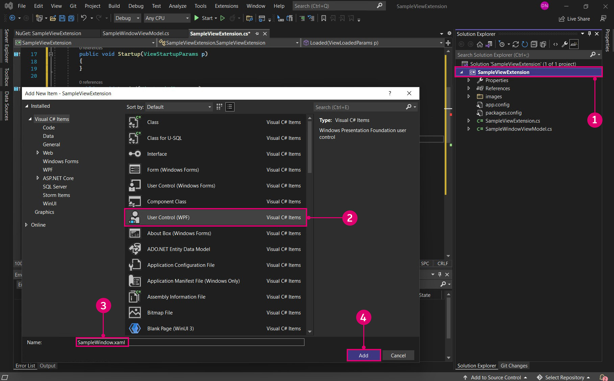

# Rozszerzenia

Rozszerzenia są zaawansowanym narzędziem programistycznym w ekosystemie dodatku Dynamo. Umożliwiają programistom sterowanie funkcjami niestandardowymi opartymi na interakcjach i logice dodatku Dynamo. Rozszerzenia można podzielić na dwie główne kategorie, rozszerzenia i rozszerzenia widoku. Jak sugeruje nazwa, struktura rozszerzeń widoku umożliwia rozszerzenie interfejsu użytkownika dodatku Dynamo przez zarejestrowanie niestandardowych elementów menu. Zwykłe rozszerzenia działają w bardzo podobny sposób, ale bez interfejsu użytkownika. Przykładowo można utworzyć rozszerzenie rejestrujące określone informacje w konsoli dodatku Dynamo. Ten scenariusz nie wymaga niestandardowego interfejsu użytkownika i dlatego można go zrealizować również za pomocą rozszerzenia.

#### Analiza przypadku rozszerzenia <a href="#extension-case-study" id="extension-case-study"></a>

Korzystając z przykładu SampleViewExtension z repozytorium DynamoSamples z serwisu Github, przeanalizujemy czynności niezbędne do utworzenia prostego okna niemodalnego, w którym wyświetlane są aktywne węzły na wykresie w czasie rzeczywistym. Rozszerzenie widoku wymaga utworzenia interfejsu użytkownika dla tego okna i powiązania wartości z modelem widoku.


> 1. To okno rozszerzenia widoku opracowano na podstawie przykładu SampleViewExtension z repozytorium Github.

Mimo że utworzymy tu ten przykład od podstaw, można również pobrać i skompilować repozytorium DynamoSamples, a następnie używać go jako odniesienia.

Repozytorium DynamoSamples: [https://github.com/DynamoDS/DynamoSamples](https://github.com/DynamoDS/DynamoSamples)

> W tym przewodniku będziemy odwoływać się konkretnie do projektu o nazwie SampleViewExtension znajdującego się w folderze `DynamoSamples/src/`.

#### Jak zaimplementować rozszerzenie widoku <a href="#how-to-implement-a-view-extension" id="how-to-implement-a-view-extension"></a>

Rozszerzenie widoku zawiera trzy zasadnicze części:

* Zespół zawierający klasę z zaimplementowanym interfejsem `IViewExtension` oraz klasę tworzącą model widoku
* Plik `.xml` informujący dodatek Dynamo, gdzie należy szukać tego zespołu w czasie wykonywania oraz jaki jest typ rozszerzenia
* Plik `.xaml`, który wiąże dane z wyświetlaniem grafiki i określa wygląd okna

**1\. Tworzenie struktury projektu**

Rozpocznij od utworzenia nowego projektu `Class Library` o nazwie `SampleViewExtension`.


> 1. Utwórz nowy projekt, wybierając opcję `File > New > Project`
> 2. Wybierz opcję `Class Library`
> 3. Nadaj projektowi nazwę `SampleViewExtension`
> 4. Wybierz przycisk `Ok`

W tym projekcie będą potrzebne dwie klasy. W jednej klasie zostanie zaimplementowany interfejs `IViewExtension`, a w drugiej — klasa `NotificationObject.` Interfejs `IViewExtension` będzie zawierać wszystkie informacje o sposobie wdrażania, wczytywania, i usuwania rozszerzenia oraz odwoływania się do niego. Klasa `NotificationObject` będzie udostępniać powiadomienia o zmianach w dodatku Dynamo i interfejsie `IDisposable`. Po wprowadzeniu zmiany liczba zostanie odpowiednio zaktualizowana.


> 1. Plik klasy o nazwie `SampleViewExtension.cs`, w której zostanie zaimplementowany interfejs `IViewExtension`
> 2. Plik klasy o nazwie `SampleWindowViewMode.cs`, w której zostanie zaimplementowana klasa `NotificationObject`

Aby można było użyć interfejsu `IViewExtension`, potrzebny jest pakiet NuGet WpfUILibrary. Zainstalowanie tego pakietu spowoduje automatyczne zainstalowanie pakietów Core, Services i ZeroTouchLibrary.


> 1. Wybierz pakiet WpfUILibrary
> 2. Wybierz opcję `Install`, aby zainstalować wszystkie pakiety zależne

**2\. Implementowanie klasy IViewExtension**

W klasie `IViewExtension` określimy, co się dzieje podczas uruchamiania dodatku Dynamo, gdy rozszerzenie jest wczytywane i gdy dodatek Dynamo zostaje zamknięty. W pliku klasy `SampleViewExtension.cs` dodaj następujący kod:

```
using System;
using System.Windows;
using System.Windows.Controls;
using Dynamo.Wpf.Extensions;

namespace SampleViewExtension
{

    public class SampleViewExtension : IViewExtension
    {
        private MenuItem sampleMenuItem;

        public void Dispose()
        {
        }

        public void Startup(ViewStartupParams p)
        {
        }

        public void Loaded(ViewLoadedParams p)
        {
            // Save a reference to your loaded parameters.
            // You'll need these later when you want to use
            // the supplied workspaces

            sampleMenuItem = new MenuItem {Header = "Show View Extension Sample Window"};
            sampleMenuItem.Click += (sender, args) =>
            {
                var viewModel = new SampleWindowViewModel(p);
                var window = new SampleWindow
                {
                    // Set the data context for the main grid in the window.
                    MainGrid = { DataContext = viewModel },

                    // Set the owner of the window to the Dynamo window.
                    Owner = p.DynamoWindow
                };

                window.Left = window.Owner.Left + 400;
                window.Top = window.Owner.Top + 200;

                // Show a modeless window.
                window.Show();
            };
            p.AddMenuItem(MenuBarType.View, sampleMenuItem);
        }

        public void Shutdown()
        {
        }

        public string UniqueId
        {
            get
            {
                return Guid.NewGuid().ToString();
            }  
        } 

        public string Name
        {
            get
            {
                return "Sample View Extension";
            }
        } 

    }
}
```

Klasa `SampleViewExtension` tworzy element menu, który można kliknąć, służący do otwierania okna, i łączy go z oknem i modelem widoku.

* Instrukcja `public class SampleViewExtension : IViewExtension` `SampleViewExtension` powoduje dziedziczenie po interfejsie `IViewExtension` i udostępnia wszystkie funkcje potrzebne do utworzenia elementu menu.
* Instrukcja `sampleMenuItem = new MenuItem { Header = "Show View Extension Sample Window" };` tworzy element MenuItem i dodaje go do menu `View`.


> 1. Element menu

* Instrukcja `sampleMenuItem.Click += (sender, args)` wyzwala zdarzenie, które powoduje otwarcie nowego okna po kliknięciu elementu menu
* Instrukcja `MainGrid = { DataContext = viewModel }` ustawia kontekst danych dla siatki głównej w oknie, odwołując się do elementu `Main Grid` w pliku `.xaml`, który zostanie utworzony
* Instrukcja `Owner = p.DynamoWindow` ustawia dodatek Dynamo jako właściciela wyskakującego okna. Oznacza to, że nowe okno jest zależne od dodatku Dynamo, więc takie operacje jak zminimalizowanie, zmaksymalizowanie i przywrócenie dodatku Dynamo spowodują, że nowe okno będzie działało tak samo
* Metoda `window.Show();` wyświetla okno, w którym ustawiono dodatkowe właściwości okna

** 3. Implementowanie modelu widoku**

Po ustaleniu niektórych podstawowych parametrów okna dodamy logikę reagowania na różne zdarzenia związane z dodatkiem Dynamo i poinstruujemy interfejs użytkownika, aby dokonał aktualizacji na podstawie tych zdarzeń. Skopiuj następujący kod do pliku klasy `SampleWindowViewModel.cs`:

```
using System;
using Dynamo.Core;
using Dynamo.Extensions;
using Dynamo.Graph.Nodes;

namespace SampleViewExtension
{
    public class SampleWindowViewModel : NotificationObject, IDisposable
    {
        private string activeNodeTypes;
        private ReadyParams readyParams;

        // Displays active nodes in the workspace
        public string ActiveNodeTypes
        {
            get
            {
                activeNodeTypes = getNodeTypes();
                return activeNodeTypes;
            }
        }

        // Helper function that builds string of active nodes
        public string getNodeTypes()
        {
            string output = "Active nodes:\n";

            foreach (NodeModel node in readyParams.CurrentWorkspaceModel.Nodes)
            {
                string nickName = node.Name;
                output += nickName + "\n";
            }

            return output;
        }

        public SampleWindowViewModel(ReadyParams p)
        {
            readyParams = p;
            p.CurrentWorkspaceModel.NodeAdded += CurrentWorkspaceModel_NodesChanged;
            p.CurrentWorkspaceModel.NodeRemoved += CurrentWorkspaceModel_NodesChanged;
        }

        private void CurrentWorkspaceModel_NodesChanged(NodeModel obj)
        {
            RaisePropertyChanged("ActiveNodeTypes");
        }

        public void Dispose()
        {
            readyParams.CurrentWorkspaceModel.NodeAdded -= CurrentWorkspaceModel_NodesChanged;
            readyParams.CurrentWorkspaceModel.NodeRemoved -= CurrentWorkspaceModel_NodesChanged;
        }
    }
}
```

Ta implementacja klasy modelu widoku nasłuchuje elementu `CurrentWorkspaceModel` i wyzwala zdarzenie w przypadku dodania lub usunięcia węzła z obszaru roboczego. Powoduje to zgłoszenie zmiany właściwości i powiadomienie interfejsu użytkownika lub powiązanych elementów o zmianie danych i konieczności ich zaktualizowania. Wywoływany jest mechanizm pobierania `ActiveNodeTypes`, który wewnętrznie wywołuje dodatkową funkcję pomocniczą `getNodeTypes()`. Ta funkcja iteruje przez wszystkie aktywne węzły w obszarze rysunku, wypełnia ciąg zawierający nazwy tych węzłów i zwraca ten ciąg do powiązania w pliku .xaml do wyświetlenia w wyskakującym oknie.

Po zdefiniowaniu logiki podstawowej rozszerzenia określimy teraz szczegóły wyglądu okna za pomocą pliku `.xaml`. Wystarczy proste okno, w którym ten ciąg będzie wyświetlany za pomocą powiązania właściwości `ActiveNodeTypes` w kontrolce `TextBlock` `Text`.



> 1. Kliknij prawym przyciskiem myszy projekt i wybierz pozycję `Add > New Item...`
> 2. Wybierz szablon kontroli użytkownika, który zmienimy w celu utworzenia okna
> 3. Nadaj nowemu plikowi nazwę `SampleWindow.xaml`
> 4. Wybierz opcję `Add`

W kodzie `.xaml` okna należy powiązać element `SelectedNodesText` z blokiem tekstowym. Dodaj następujący kod do pliku `SampleWindow.xaml`:

```
<Window x:Class="SampleViewExtension.SampleWindow"
             xmlns="http://schemas.microsoft.com/winfx/2006/xaml/presentation"
             xmlns:x="http://schemas.microsoft.com/winfx/2006/xaml"
             xmlns:mc="http://schemas.openxmlformats.org/markup-compatibility/2006" 
             xmlns:d="http://schemas.microsoft.com/expression/blend/2008" 
             xmlns:local="clr-namespace:SampleViewExtension"
             mc:Ignorable="d" 
             d:DesignHeight="300" d:DesignWidth="300"
            Width="500" Height="100">
    <Grid Name="MainGrid" 
          HorizontalAlignment="Stretch"
          VerticalAlignment="Stretch">
        <TextBlock HorizontalAlignment="Stretch" Text="{Binding ActiveNodeTypes}" FontFamily="Arial" Padding="10" FontWeight="Medium" FontSize="18" Background="#2d2d2d" Foreground="White"/>
    </Grid>
</Window>
```

* Instrukcja `Text="{Binding ActiveNodeTypes}"` wiąże wartość właściwości `ActiveNodeTypes` w pliku `SampleWindowViewModel.cs` z wartością `Text` elementu `TextBlock` w oknie.

Teraz zainicjujemy okno przykładowe w pliku zaplecza pliku C# .xaml: `SampleWindow.xaml.cs`. Dodaj następujący kod do pliku `SampleWindow.xaml`:

```
using System.Windows;

namespace SampleViewExtension
{
    /// <summary>
    /// Interaction logic for SampleWindow.xaml
    /// </summary>
    public partial class SampleWindow : Window
    {
        public SampleWindow()
        {
            InitializeComponent();
        }
    }
}
```

Rozszerzenie widoku jest teraz gotowe do skompilowania i dodania do dodatku Dynamo. Dodatek Dynamo wymaga pliku `xml`, aby zarejestrować wynikowy plik `.dll` jako rozszerzenie.


> 1. Kliknij prawym przyciskiem myszy projekt i wybierz pozycję `Add > New Item...`
> 2. Wybierz plik XML
> 3. Nadaj plikowi nazwę `SampleViewExtension_ViewExtensionDefinition.xml`
> 4. Wybierz opcję `Add`

* Ta nazwa pliku jest zgodna ze standardem dodatku Dynamo dotyczącego odwoływania się do zespołu rozszerzenia: `"extensionName"_ViewExtensionDefinition.xml`

W pliku `xml` dodaj następujący kod, aby wskazać dodatkowi Dynamo, gdzie ma szukać zespołu rozszerzenia:

```
<ViewExtensionDefinition>
  <AssemblyPath>C:\Users\username\Documents\Visual Studio 2015\Projects\SampleViewExtension\SampleViewExtension\bin\Debug\SampleViewExtension.dll</AssemblyPath>
  <TypeName>SampleViewExtension.SampleViewExtension</TypeName>
</ViewExtensionDefinition>
```

* W tym przykładzie skompilowaliśmy zespół w domyślnym folderze projektu programu Visual Studio. Zastąp położenie docelowe `<AssemblyPath>...</AssemblyPath>` położeniem zespołu.

Ostatnią czynnością jest skopiowanie pliku `SampleViewExtension_ViewExtensionDefinition.xml` do folderu rozszerzeń widoku dodatku Dynamo znajdującego się w katalogu instalacyjnym Dynamo Core `C:\Program Files\Dynamo\Dynamo Core\1.3\viewExtensions`. Należy pamiętać, że istnieją oddzielne foldery dla rozszerzeń `extensions` i `viewExtensions`. Umieszczenie pliku `xml` w niewłaściwym folderze może spowodować błąd podczas wczytywania pliku w trakcie wykonywania.


> 1. Plik `.xml` skopiowany do folderu rozszerzeń widoku dodatku Dynamo

Jest to podstawowe wprowadzenie do rozszerzeń widoku. Bardziej zaawansowaną analizę przypadku zawiera pakiet DynaShape, projekt open source w serwisie GitHub. Ten pakiet zawiera rozszerzenie widoku umożliwiające edycję na żywo w widoku modelu dodatku Dynamo.

Instalator pakietu DynaShape można pobrać z forum dodatku Dynamo: [https://forum.dynamobim.com/t/dynashape-published/11666](https://forum.dynamobim.com/t/dynashape-published/11666)

Kod źródłowy można sklonować z serwisu GitHub: [https://github.com/LongNguyenP/DynaShape](https://github.com/LongNguyenP/DynaShape)
