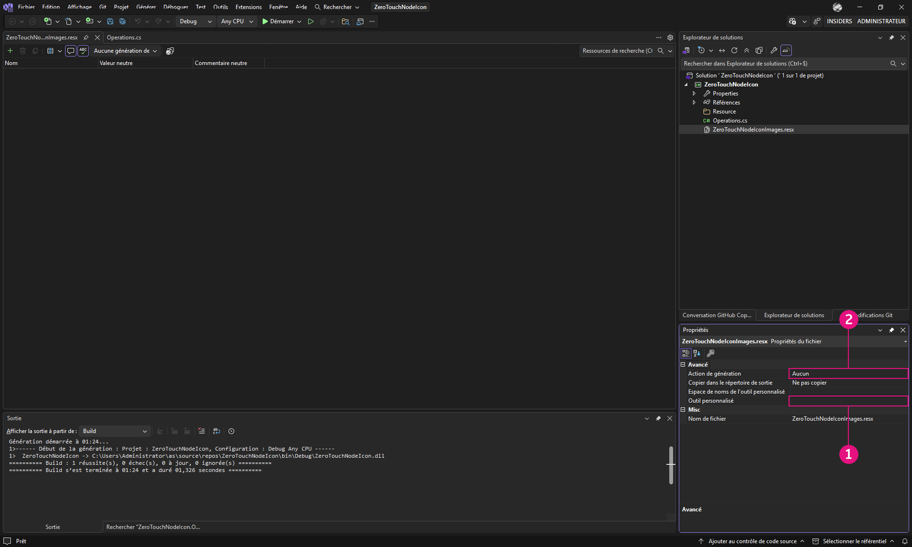
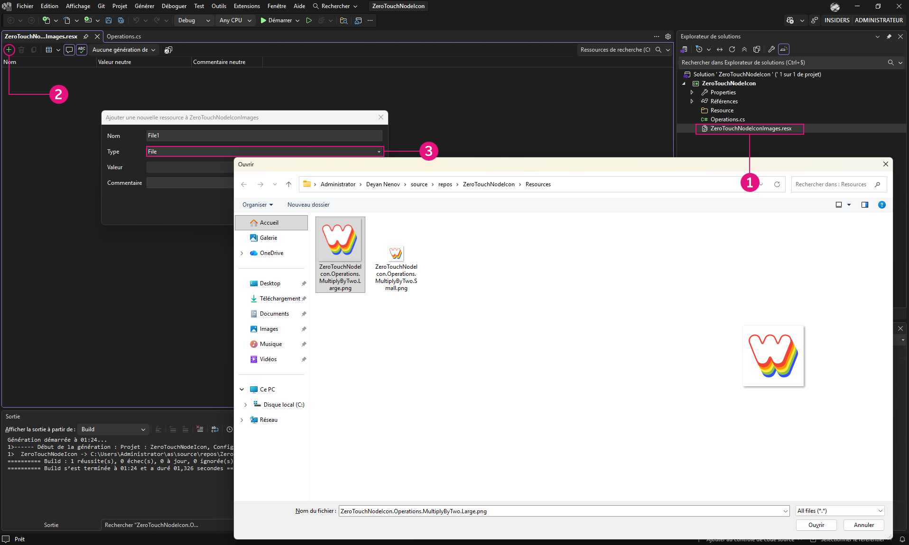
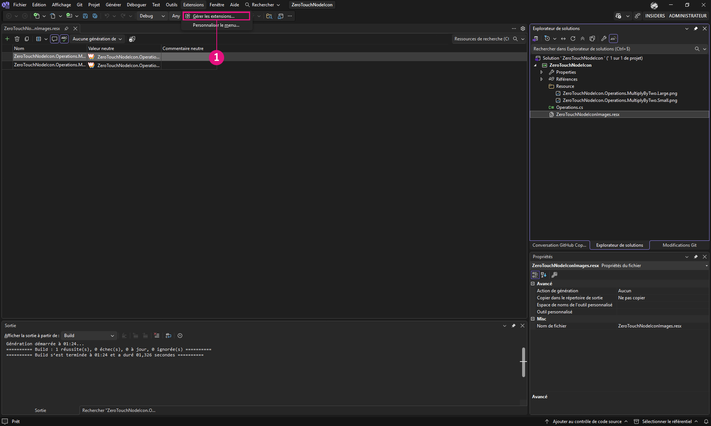

# Erweiterte Anpassung von Dynamo-Blöcken

In diesem Abschnitt werden, ein Grundwissen über ZeroTouch vorausgesetzt, die Vorteile der Anpassung von Dynamo-Blöcken erläutert, um sowohl die Funktionalität als auch das Benutzererlebnis zu verbessern. Durch Hinzufügen von Elementen wie Warnmeldungen, Informationsmeldungen und benutzerdefinierten Symbolen können Sie Blöcke erstellen, die intuitiver, informativer und visuell ansprechender sind. Diese Anpassungen helfen den Benutzern nicht nur, potenzielle Probleme zu verstehen oder ihre Arbeitsabläufe zu optimieren, sondern stellen Ihre Blöcke auch als professionelle und benutzerfreundliche Werkzeuge in den Vordergrund.

Das Anpassen von Blöcken ist eine hervorragende Möglichkeit, um sicherzustellen, dass Ihre Lösungen klar, zuverlässig und auf die spezifischen Projektanforderungen zugeschnitten sind.

## Erstellen von benutzerdefinierten Warnmeldungen mit OnLogWarningMessage <a href="#generating-custom-warning-messages-using-onlogwarningmessage" id="generating-custom-warning-messages-using-onlogwarningmessage"></a>

In Dynamo bietet die Methode `OnLogWarningMessage` eine Möglichkeit, Warnmeldungen direkt in der Konsole von Dynamo zu protokollieren. Dies ist eine leistungsstarke Funktion, insbesondere für Zero-Touch-Blöcke, da Entwickler Benutzer benachrichtigen können, wenn Probleme mit Eingaben oder Parametern auftreten, die zu unerwartetem Verhalten führen könnten. In dieser Anleitung erfahren Sie, wie Sie `OnLogWarningMessage` in einem beliebigen Zero-Touch-Block implementieren.

### Implementierungsschritte für `OnLogWarningMessage` <a href="#implementation-step-for-onlogwarningmessage" id="implementation-step-for-onlogwarningmessage"></a>

#### Schritt 1: Importieren des erforderlichen Namensbereichs <a href="#import-the-required-namespace" id="import-the-required-namespace"></a>

`OnLogWarningMessage` ist Teil des `DynamoServices`-Namensbereichs. Fügen Sie dies daher zunächst Ihrer Projektdatei hinzu.

```
using DynamoServices;
```

#### Schritt 2: Ermitteln, wann Warnungen protokolliert werden sollen <a href="#identify-when-to-log-warnings" id="identify-when-to-log-warnings"></a>

Bevor Sie eine Warnmeldung hinzufügen, beachten Sie die Logik in Ihrer Methode:

* Welche Bedingungen können zu falschen oder unerwarteten Ergebnissen führen?
* Gibt es bestimmte Eingabewerte oder Parameter, die für eine ordnungsgemäße Funktionsweise der Methode erforderlich sind?

Beispiele für zu überprüfende Bedingungen:

* **Werte außerhalb des Bereichs** (z. B. `if (inputValue < 0)`)
* **Null oder leere Sammlungen** (z. B. `if (list == null || list.Count == 0)`)
* **Nicht übereinstimmende Datentypen** (z. B., wenn ein Dateityp nicht unterstützt wird)

#### Schritt 3: Verwenden von `OnLogWarningMessage`, um die Warnung zu protokollieren <a href="#use-onlogwarningmessage-to-log-the-warning" id="use-onlogwarningmessage-to-log-the-warning"></a>

Platzieren Sie `OnLogWarningMessage`-Aufrufe dort, wo Sie Bedingungen erkennen, die Probleme verursachen könnten. Wenn die Bedingung erfüllt ist, protokollieren Sie eine Warnmeldung mit klaren Anweisungen für den Benutzer.

### Syntax für `OnLogWarningMessage` <a href="#syntax-for-onlogwarningmessage" id="syntax-for-onlogwarningmessage"></a>

```
LogWarningMessageEvents.OnLogWarningMessage("Your warning message here.");
```

### Implementierungsbeispiele für `OnLogWarningMessage` <a href="#example-implementations-of-onlogwarningmessage" id="example-implementations-of-onlogwarningmessage"></a>

Um `OnLogWarningMessage` in der Praxis zu demonstrieren, sehen Sie hier verschiedene Szenarien, die beim Erstellen eines Zero-Touch-Blocks auftreten können.

#### Beispiel 1: Überprüfen numerischer Eingaben <a href="#example-1-validating-numeric-inputs" id="example-1-validating-numeric-inputs"></a>

In diesem Beispiel verwenden wir den benutzerdefinierten Block, der im vorherigen Abschnitt **Zero-Touch-Fallstudie - Rasterblock** erstellt wurde, eine Methode mit der Bezeichnung `RectangularGrid`, die basierend auf `xCount`\- und `yCount`-Eingaben ein Raster aus Rechtecken generiert. Wir gehen die Tests durch, wenn eine Eingabe ungültig ist, und verwenden dann `OnLogWarningMessage`, um eine Warnung zu protokollieren und die Verarbeitung zu stoppen.


**Verwenden von `OnLogWarningMessage` für die Eingabevalidierung**

Für die Erstellung eines Rasters basierend auf `xCount` und `yCount`. Stellen Sie sicher, dass es sich bei beiden Werten um positive Ganzzahlen handelt, bevor Sie fortfahren.

```
public static List<Rectangle> CreateGrid(int xCount, int yCount)
{
    // Check if xCount and yCount are positive
    if (xCount <= 0 || yCount <= 0)
    {
        LogWarningMessageEvents.OnLogWarningMessage("Grid count values must be positive integers.");
        return new List<Rectangle>();  // Return an empty list if inputs are invalid
    }
    // Proceed with grid creation...
}
```

In diesem Beispiel:

* **Bedingung**: Wenn entweder `xCount` oder `yCount` kleiner oder gleich null ist
* **Meldung**: `"Grid count values must be positive integers."`

Dadurch wird die Warnung in Dynamo angezeigt, wenn ein Benutzer null oder negative Werte eingibt. Dies erleichtert das Verständnis der erwarteten Eingabe.

Nun können wir die Warnung in den Beispielblock Grids implementieren:

```
using Autodesk.DesignScript.Geometry;
using DynamoServices;

namespace CustomNodes
{
    public class Grids
    {
        // The empty private constructor.
        // This will not be imported into Dynamo.
        private Grids() { }

        /// <summary>
        /// This method creates a rectangular grid from an X and Y count.
        /// </summary>
        /// <param name="xCount">Number of grid cells in the X direction</param>
        /// <param name="yCount">Number of grid cells in the Y direction</param>
        /// <returns>A list of rectangles</returns>
        /// <search>grid, rectangle</search>
        public static List<Rectangle> RectangularGrid(int xCount = 10, int yCount = 10)
        {
            // Check for valid input values
            if (xCount <= 0 || yCount <= 0)
            {
                // Log a warning message if the input values are invalid
                LogWarningMessageEvents.OnLogWarningMessage("Grid count values must be positive integers.");
                return new List<Rectangle>(); // Return an empty list if inputs are invalid
            }

            double x = 0;
            double y = 0;

            var pList = new List<Rectangle>();

            for (int i = 0; i < xCount; i++)
            {
                y++;
                x = 0;
                for (int j = 0; j < yCount; j++)
                {
                    x++;
                    Point pt = Point.ByCoordinates(x, y);
                    Vector vec = Vector.ZAxis();
                    Plane bP = Plane.ByOriginNormal(pt, vec);
                    Rectangle rect = Rectangle.ByWidthLength(bP, 1, 1);
                    pList.Add(rect);
                    Point cPt = rect.Center();
                }
            }

            return pList;
        }
    }
}
```

**Beispiel 2: Prüfung auf keine oder leere Sammlungen**

Wenn Ihre Methode eine Liste von Punkten erfordert, ein Benutzer jedoch eine leere oder Nullliste übergibt, können Sie `OnLogWarningMessage` verwenden, um ihn über das Problem zu informieren.


```
public static Polygon CreatePolygonFromPoints(List<Point> points)
{
    if (points == null || points.Count < 3)
    {
        LogWarningMessageEvents.OnLogWarningMessage("Point list cannot be null or have fewer than three points.");
        return null;  // Return null if the input list is invalid
    }
    // Proceed with polygon creation...
}
```

In diesem Beispiel:

* **Bedingung**: Wenn die `points`-Liste null ist oder weniger als drei Punkte enthält
* **Meldung**: `"Point list cannot be null or have fewer than three points."`

Dadurch werden Benutzer gewarnt, dass sie eine gültige Liste mit mindestens drei Punkten übergeben müssen, um ein Polygon zu bilden.

***

**Beispiel 3: Überprüfen der Dateitypkompatibilität **

Bei einem Block, der Dateipfade verarbeitet, sollten Sie sicherstellen, dass nur bestimmte Dateitypen zulässig sind. Wenn ein nicht unterstützter Dateityp erkannt wird, protokollieren Sie eine Warnung.


```
public static void ProcessFile(string filePath)
{
    if (!filePath.EndsWith(".csv"))
    {
        LogWarningMessageEvents.OnLogWarningMessage("Only CSV files are supported.");
        return;
    }
    // Proceed with file processing...
}
```

In diesem Beispiel:

* **Bedingung**: Wenn der Dateipfad nicht auf .csv endet
* **Meldung**: `"Only CSV files are supported."`

Dadurch werden Benutzer darauf aufmerksam gemacht, sicherzustellen, dass sie eine CSV-Datei übermitteln, um Probleme im Zusammenhang mit inkompatiblen Dateiformaten zu vermeiden.

## Hinzufügen von Informationsmeldungen mit `OnLogInfoMessage` <a href="#adding-informational-messages-with-onloginfomessage" id="adding-informational-messages-with-onloginfomessage"></a>

In Dynamo ermöglicht es `OnLogInfoMessage` aus dem `DynamoServices`-Namensbereich Entwicklern, Informationsmeldungen direkt in der Konsole von Dynamo zu protokollieren. Dies ist hilfreich, um erfolgreiche Vorgänge zu bestätigen, den Fortschritt zu kommunizieren oder zusätzliche Einblicke in Blockaktionen zu erhalten. In dieser Anleitung erfahren Sie, wie Sie `OnLogInfoMessage` in einen beliebigen Zero-Touch-Block einfügen, um Feedback und Benutzerfreundlichkeit zu verbessern.

### Implementierungsschritte für `OnLogInfoMessage` <a href="#implementation-steps-for-onloginfomessage" id="implementation-steps-for-onloginfomessage"></a>

#### Schritt 1: Importieren des erforderlichen Namensbereichs <a href="#step-1-import-the-required-namespace" id="step-1-import-the-required-namespace"></a>

`OnLogInfoMessage` ist Teil des `DynamoServices`-Namensbereichs. Fügen Sie dies daher zunächst Ihrer Projektdatei hinzu.

#### Schritt 2: Ermitteln, wann Informationen protokolliert werden sollen <a href="#step-2-identify-when-to-log-information" id="step-2-identify-when-to-log-information"></a>

Bevor Sie eine Informationsmeldung hinzufügen, denken Sie über den Zweck Ihrer Methode nach:

* Welche Informationen sollten nach Abschluss eines Vorgangs sinnvollerweise bestätigt werden?
* Gibt es wichtige Schritte oder Meilensteine innerhalb der Methode, über die die Benutzer möglicherweise informiert werden sollten?

Beispiele für nützliche Bestätigungen:

* **Abschlussmeldungen** (z. B., wenn ein Raster oder Modell vollständig erstellt wurde)
* **Details zu verarbeiteten Daten** (z. B. 10 Elemente erfolgreich verarbeitet)
* **Zusammenfassung der Ausführung** (z. B. im Prozess verwendete Parameter)

#### Schritt 3: Verwenden von `OnLogInfoMessage` zum Protokollieren von Informationsmeldungen <a href="#step-3-use-onloginfomessage-to-log-informational-message" id="step-3-use-onloginfomessage-to-log-informational-message"></a>

Platzieren Sie `OnLogInfoMessage`-Aufrufe an wichtigen Punkten in Ihrer Methode. Wenn ein wichtiger Schritt oder Abschluss erfolgt, protokollieren Sie eine Informationsmeldung, um den Benutzer über den Vorfall zu informieren.

### Syntax für `OnLogInfoMessage` <a href="#syntax-for-onloginfomessage" id="syntax-for-onloginfomessage"></a>

```
LogWarningMessageEvents.OnLogInfoMessage("Your info message here.");
```

### Implementierungsbeispiele für `OnLogInfoMessage` <a href="#example-implementations-of-onloginfomessage" id="example-implementations-of-onloginfomessage"></a>

Im Folgenden finden Sie verschiedene Szenarien, um die Verwendung von `OnLogInfoMessage` in Ihren Zero-Touch-Blöcken zu veranschaulichen.

#### Beispiel 1: Überprüfen numerischer Eingaben <a href="#example-1-validating-numeric-inputs" id="example-1-validating-numeric-inputs"></a>

In diesem Beispiel verwenden wir den benutzerdefinierten Block, der im vorherigen Abschnitt **Zero-Touch-Fallstudie - Rasterblock** erstellt wurde, eine Methode mit der Bezeichnung `RectangularGrid`, die basierend auf `xCount`\- und `yCount`-Eingaben ein Raster aus Rechtecken generiert. Wir werden die Tests durchgehen, wenn eine Eingabe ungültig ist, und dann `OnLogInfoMessage` verwenden, um Informationen bereitzustellen, nachdem der Block fertig ausgeführt wurde.


**Verwenden von `OnLogInfoMessage` für die Eingabevalidierung**

Für die Erstellung eines Rasters basierend auf `xCount` und `yCount`. Nach dem Erstellen des Rasters können Sie dessen Erstellung bestätigen, indem Sie eine Informationsmeldung mit den Bemaßungen des Rasters protokollieren.

```
public static List<Rectangle> CreateGrid(int xCount, int yCount)
{
    var pList = new List<Rectangle>();
    // Grid creation code here...

    // Confirm successful grid creation
    LogWarningMessageEvents.OnLogInfoMessage($"Successfully created a grid with dimensions {xCount}x{yCount}.");

    return pList;
}
```

In diesem Beispiel:

* **Bedingung**: Die Rastererstellung ist abgeschlossen.
* **Meldung**: `"Successfully created a grid with dimensions {xCount}x{yCount}."`

Diese Meldung informiert Benutzer darüber, dass das Raster wie angegeben erstellt wurde, und hilft ihnen zu bestätigen, dass der Block wie erwartet funktionierte.

Nun können wir die Warnung in den Beispielblock Grids implementieren:

```
using Autodesk.DesignScript.Geometry;
using DynamoServices;

namespace CustomNodes
{
    public class Grids
    {
        // The empty private constructor.
        // This will not be imported into Dynamo.
        private Grids() { }

        /// <summary>
        /// This method creates a rectangular grid from an X and Y count.
        /// </summary>
        /// <param name="xCount">Number of grid cells in the X direction</param>
        /// <param name="yCount">Number of grid cells in the Y direction</param>
        /// <returns>A list of rectangles</returns>
        /// <search>grid, rectangle</search>
        public static List<Rectangle> RectangularGrid(int xCount = 10, int yCount = 10)
        {
            double x = 0;
            double y = 0;

            var pList = new List<Rectangle>();

            for (int i = 0; i < xCount; i++)
            {
                y++;
                x = 0;
                for (int j = 0; j < yCount; j++)
                {
                    x++;
                    Point pt = Point.ByCoordinates(x, y);
                    Vector vec = Vector.ZAxis();
                    Plane bP = Plane.ByOriginNormal(pt, vec);
                    Rectangle rect = Rectangle.ByWidthLength(bP, 1, 1);
                    pList.Add(rect);
                    Point cPt = rect.Center();
                }
            }

            // Log an info message indicating the grid was successfully created
            LogWarningMessageEvents.OnLogInfoMessage($"Successfully created a grid with dimensions {xCount}x{yCount}.");

            return pList;
        }
    }
}
```

#### Beispiel 2: Bereitstellen von Informationen zur Datenanzahl <a href="#example-2-providing-data-count-information" id="example-2-providing-data-count-information"></a>

Wenn Sie einen Block erstellen, der eine Liste von Punkten verarbeitet, können Sie protokollieren, wie viele Punkte erfolgreich verarbeitet wurden. Dies kann für große Datensätze nützlich sein.


```
public static List<Point> ProcessPoints(List<Point> points)
{
    var processedPoints = new List<Point>();
    foreach (var point in points)
    {
        // Process each point...
        processedPoints.Add(point);
    }

    // Log info about the count of processed points
    LogWarningMessageEvents.OnLogInfoMessage($"{processedPoints.Count} points were processed successfully.");

    return processedPoints;
}
```

In diesem Beispiel:

* **Bedingung**: Nach Abschluss der Schleife, die Anzahl der verarbeiteten Elemente wird angezeigt.
* **Meldung**: `"6 points were processed successfully."`

Diese Meldung hilft Benutzern, das Ergebnis der Verarbeitung nachzuvollziehen und zu bestätigen, dass alle Punkte verarbeitet wurden.

#### Beispiel 3: Zusammenfassung der verwendeten Parameter <a href="#example-3-summarizing-parameters-used" id="example-3-summarizing-parameters-used"></a>

In einigen Fällen ist es hilfreich, die Eingabeparameter zu bestätigen, die ein Block zum Abschließen einer Aktion verwendet hat. Wenn Ihr Block beispielsweise Daten in eine Datei exportiert, können Sie durch das Protokollieren des Dateinamens und -pfads Benutzern die Sicherheit geben, dass die richtige Datei verwendet wurde.


```
public static void ExportData(string filePath, List<string> data)
{
    // Code to write data to the specified file path...

    // Log the file path used for export
    LogWarningMessageEvents.OnLogInfoMessage($"Data exported successfully to {filePath}.");

}
```

In diesem Beispiel:

* **Bedingung**: Der Exportvorgang wurde erfolgreich abgeschlossen.
* **Meldung**: `"Data exported successfully to {filePath}."`

Mit dieser Meldung wird den Benutzern bestätigt, dass der Export erfolgreich war, und der genaue Dateipfad wird angezeigt, um Verwirrung über die Dateispeicherorte zu vermeiden.

## Erstellen und Hinzufügen von benutzerdefinierter Dokumentation zu Blöcken

### Dokumentation für benutzerdefinierte Blöcke

In der Vergangenheit gab es in Dynamo Einschränkungen bei der Art und Weise, wie Paketautoren die Dokumentation für ihre Blöcke bereitstellen konnten. Autoren von benutzerdefinierten Blöcken konnten nur kurze Beschreibungen in der QuickInfo des Blocks angeben oder das Paket mit ausführlich kommentierten Beispieldiagrammen versenden.


### Eine neue Möglichkeit

Dynamo bietet jetzt ein verbessertes System für Paketautoren, mit dem eine optimierte und mehr beschreibende Dokumentation für Ihre benutzerdefinierten Blöcke bereitgestellt werden kann. Bei diesem neuen Ansatz werden die benutzerfreundliche Markdown-Sprache für die Texterstellung und die Ansichtserweiterung des Dokumentationsbrowsers zur Anzeige von Markdown in Dynamo verwendet. Die Verwendung von Markdown bietet Paketautoren eine Vielzahl neuer Möglichkeiten beim Dokumentieren ihrer benutzerdefinierten Blöcke.

#### Was ist Markdown?

Markdown ist eine einfache Auszeichnungssprache, die Sie zum Formatieren von Klartextdokumenten verwenden können. Seit Markdown im Jahr 2004 ins Leben gerufen wurde, hat ihre Popularität stetig zugenommen, sodass sie heute eine der beliebtesten Auszeichnungssprachen der Welt ist.

#### Erste Schritte mit Markdown

Es ist ganz einfach, Markdown-Dateien zu erstellen. Alles, was Sie brauchen, ist ein einfacher Texteditor, wie den Windows-Editor, und schon kann es losgehen. Es gibt jedoch noch einfachere Möglichkeiten, Markdown-Code zu schreiben, als den Editor zu verwenden. Es gibt mehrere Online-Editoren, wie z. B. [Dillinger](https://dillinger.io/), mit denen Sie Ihre Änderungen in Echtzeit sehen können, während Sie sie vornehmen. Eine weitere beliebte Methode zum Bearbeiten von Markdown-Dateien ist die Verwendung eines Code-Editors wie [Visual Studio Code](https://code.visualstudio.com/).

#### Was kann Markdown?

Markdown ist sehr flexibel und sollte genügend Funktionen bieten, um auf einfache Weise eine gute Dokumentation zu erstellen. Dazu gehören: Hinzufügen von Mediendateien wie Bildern oder Videos, Erstellen von Tabellen mit verschiedenen Inhaltsformen und natürlich einfache Textformatierungsfunktionen wie **fett** oder _kursiv_. All dies und noch viel mehr ist beim Schreiben von Markdown-Dokumenten möglich. Weitere Informationen finden Sie in dieser Anleitung, in der die [grundlegende Markdown-Syntax](https://www.markdownguide.org/basic-syntax/) erklärt wird.

### Hinzufügen erweiterter Dokumentation zu Ihren Blöcken

Das Hinzufügen von Dokumentation zu Ihren Blöcken ist einfach. Die Dokumentation kann zu allen Varianten benutzerdefinierter Blöcke hinzugefügt werden, dazu gehören:

* Vordefinierte Dynamo-Blöcke
* Benutzerdefinierte Blöcke (.dyf): Sammlungen von vordefinierten und/oder anderen Paketblöcken.
* Benutzerdefinierte C#-Paketblöcke (auch als ZeroTouch bezeichnet). Diese benutzerdefinierten Blöcke sehen wie die vordefinierten Blöcke aus.
* NodeModel-Blöcke (Blöcke, die spezielle Benutzeroberflächen-Elemente wie Dropdown-Menüs oder Auswahlschaltflächen enthalten)
* NodeModel-Blöcke mit angepasster Benutzeroberfläche (Blöcke, die eindeutige Benutzeroberflächen-Elemente wie Grafiken im Block enthalten)

Führen Sie die folgenden Schritte aus, damit Ihre Markdown-Dateien in Dynamo angezeigt werden.

#### Öffnen von Dokumentationsdateien in Dynamo

Dynamo verwendet die Ansichtserweiterung des Dokumentationsbrowsers, um die Dokumentation für Blöcke anzuzeigen. Um die Dokumentation eines Blocks zu öffnen, klicken Sie mit der rechten Maustaste auf den Block und wählen Hilfe. Dadurch wird der Dokumentationsbrowser geöffnet, und der mit diesem Block verknüpften Markdown-Code wird angezeigt, sofern vorhanden.


Die im Dokumentationsbrowser angezeigte Dokumentation besteht aus zwei Teilen. Der erste Teil ist der Abschnitt `Node Info`. Dieser wird automatisch aus den aus dem Block extrahierten Informationen generiert, wie z. B. Eingaben/Ausgaben, Blockkategorie, Blockname/Namensbereich und Kurzbeschreibung des Blocks. Im zweiten Teil wird die Dokumentation für benutzerdefinierte Blöcke angezeigt. Dabei handelt es sich um die Markdown-Datei, die zur Dokumentation des Blocks bereitgestellt wird.


#### doc-Ordner für Pakete

Um Dokumentationsdateien zu Ihren Blöcken in Dynamo hinzuzufügen, erstellen Sie in Ihrem Paketverzeichnis einen neuen Ordner mit dem Namen `/doc`. Wenn das Paket geladen ist, durchsucht Dynamo dieses Verzeichnis und ruft alle darin enthaltenen Markdown-Dokumentationsdateien ab.

#### Benennen von Markdown-Dateien

Um sicherzustellen, dass Dynamo weiß, welche Datei geöffnet werden soll, wenn diese für einen bestimmten Block angefordert wird, muss die Benennung der Markdown-Datei in einem bestimmten Format erfolgen. Die Markdown-Datei sollte entsprechend dem Namensbereich des Blocks benannt werden, den sie dokumentiert. Wenn Sie sich beim Namensbereich des Blocks nicht sicher sind, sehen Sie sich den Abschnitt `Node Info` an, nachdem Sie `Help` im Block gedrückt haben. Unter dem Blocknamen sehen Sie den vollständigen Namensbereich des ausgewählten Blocks.

Dieser Namensbereich sollte der Name der Markdown-Datei für diesen bestimmten Block sein. Der Namensbereich von `CustomNodeExample` aus den obigen Abbildungen lautet beispielsweise `TestPackage.TestCategory.CustomNodeExample`. Daher sollte die Markdown-Datei für diesen Block den Namen `TestPackage.TestCategory.CustomNodeExample.md` erhalten.

In besonderen Fällen, in denen Überlastungen Ihrer Blöcke (Blöcke mit demselben Namen, aber unterschiedlichen Eingaben) vorhanden sind, müssen Sie die Eingabenamen in `()` nach dem Blocknamensbereich hinzufügen. Der integrierte Block `Geometry.Translate` weist beispielsweise mehrere Überlastungen auf. In diesem Fall würden wir die Markdown-Dateien für die Blöcke unten wie folgt benennen: `Autodesk.DesignScript.Geometry.Geometry.Translate(geometry,direction).md` `Autodesk.DesignScript.Geometry.Geometry.Translate(geometry,direction,distance).md`


#### Ändern von Markdown-Dateien, während sie in Dynamo geöffnet sind

Um das Ändern von Dokumentationsdateien zu erleichtern, implementiert der Dokumentationsbrowser einen Dateibeobachter für die geöffnete Dokumentationsdatei. Dadurch können Sie Änderungen an der Markdown-Datei vornehmen, und die Änderungen werden sofort in Dynamo angezeigt.


Das Hinzufügen neuer Dokumentationsdateien ist auch möglich, während Dynamo geöffnet ist. Fügen Sie dem Ordner `/doc` einfach eine neue Markdown-Datei mit einem Namen hinzu, der dem dokumentierten Block entspricht.

## Hinzufügen von benutzerdefinierten Symbolen zu Zero-Touch-Blöcken

### Überblick

Durch benutzerdefinierte Symbole für Zero-Touch-Blöcke in Dynamo werden Ihre Blöcke optisch unterscheidbar und sind in der Bibliothek leichter zu erkennen. Durch Hinzufügen maßgeschneiderter Symbole können Sie Ihre Blöcke von den anderen besser unterscheidbar machen, sodass Benutzer sie in einer Liste schnell ermitteln können.

In dieser Anleitung erfahren Sie, wie Sie Symbole zu Ihren Zero-Touch-Blöcken hinzufügen.

### Schritte zum Hinzufügen von benutzerdefinierten Blocksymbolen

#### Schritt 1: Einrichten des Projekts

Erstellen Sie zunächst ein Visual Studio-Klassenbibliotheksprojekt (.NET Framework) für Ihre Zero Touch-Blöcke. Wenn Sie noch kein Projekt haben, finden Sie im Abschnitt **Erste Schritte** eine Schritt-für-Schritt-Anleitung zum Erstellen eines Projekts.


Stellen Sie sicher, dass Sie mindestens einen funktionalen Zero-Touch-Block haben, da Symbole nur zu vorhandenen Blöcken hinzugefügt werden können. Weitere Informationen finden Sie unter **Zero-Touch-Fallstudie - Rasterblock**.

#### Schritt 2: Erstellen Ihrer Symbolbilder

So erstellen Sie benutzerdefinierte Symbole

1. **Entwerfen Sie Ihre Symbole**: Verwenden Sie einen Bildeditor, um einfache, visuell klare Symbole für Ihre Blöcke zu erstellen.
2. **Bildspezifikationen**:
   * **Kleines Symbol**: 32 x 32 Pixel (wird in der Seitenleiste der Bibliothek und auf dem Block selbst verwendet).
   * **Großes Symbol**: 128 x 128 Pixel (wird in den Blockeigenschaften verwendet, wenn Sie den Mauszeiger in der Bibliothek über den Block bewegen).
3. **Dateibenennungskonvention**:
   * Die Dateinamen müssen dem folgenden Format entsprechen, um mit dem richtigen Block verknüpft zu werden:
     * **`<ProjectName>.<ClassName>.<MethodName>.Small.png`** (für das kleine Symbol)
     * **`<ProjectName>.<ClassName>.<MethodName>.Large.png`** (für das große Symbol)

**Beispiel**: Wenn das Projekt `ZeroTouchNodeIcons`, Ihre Klasse `Grids` und Ihre Methode `RectangularGrid` lauten, werden die Dateien wie folgt benannt:

* `ZeroTouchNodeIcons.Grids.RectangularGrid.Small.png`
* `ZeroTouchNodeIcons.Grids.RectangularGrid.Large.png`

> Tipp: Verwenden Sie für alle Ihre Symbole einen einheitlichen Designstil, um ein professionelles Aussehen zu erzielen.

#### Schritt 3: Hinzufügen einer Ressourcendatei zum Projekt

Erstellen Sie eine Ressourcendatei, um Ihre Symbole in die `.dll` einzubetten:

1. **Fügen Sie eine neue Ressourcendatei hinzu**:

* Klicken Sie im **Solution Explorer** mit der rechten Maustaste auf das Projekt.


* Wechseln Sie zu **Add > New Item** und wählen Sie **Resources File** aus.


* Geben Sie der Datei den Namen `<ProjectName>Images.resx`. Beispielsweise `ZeroTouchNodeIconsImages.resx`.

2. **Deaktivieren Sie die benutzerdefinierte Werkzeugeigenschaft**:
   * Wählen Sie die Ressourcendatei im **Solution Explorer** aus.
   * Löschen Sie in der Gruppe **Properties** das Feld `Custom Tool`, indem Sie den Wert `ResXFileCodeGenerator` entfernen.

3. **Legen Sie Build Action auf None fest.**
    * Da wir diese Ressource etwas weiter unten selbst erstellen werden, müssen wir sie nicht zusätzlich automatisch erstellen.



> _ANMERKUNG: Wenn Sie das Feld Custom Tool nicht bereinigen, konvertiert Visual Studio Punkte in Ihren Ressourcennamen in Unterstriche. Vergewissern Sie sich vor der Erstellung, dass die Ressourcennamen anstelle von Unterstrichen Punkte als Trennzeichen für Klassennamen enthalten._

#### Schritt 4: Fügen Sie Ihre Bilder als Ressourcen hinzu

1. Doppelklicken Sie auf die erstellte Ressourcendatei:
    * Fügen Sie jeweils ein Bild mit der Schaltfläche + hinzu. 
    * Setzen Sie den Ressourcentyp auf **File**.
    * Navigieren Sie zum Speicherort der Bilddatei, und fügen Sie die **großen** und **kleinen** Blocksymbole hinzu.



> _ANMERKUNG: Sie müssen Ihre Bilder nicht in einem **Ressourcenordner** oder Unterordnern **Large** und **Small** organisieren. Diese Methode hat sich jedoch bewährt._


#### Schritt 5: Konvertieren des Projekts in den SDK-Stil (für ältere Projekte)

Wenn Ihr Projekt noch nicht im SDK-Stil vorliegt (erforderlich zum Einbetten von Ressourcen), konvertieren Sie es:

1. Installieren Sie die `.NET Upgrade Assistant`-Erweiterung über das Menü **Extensions > Manage Extensions** in Visual Studio.




2. Klicken Sie im **Solution Explorer** mit der rechten Maustaste auf das Projekt, und wählen Sie **Upgrade > Convert project to SDK-style** aus.


3. Warten Sie, bis die Konvertierung abgeschlossen ist.


#### Schritt 6: Hinzufügen eines After-Build-Skripts zum Einbetten von Ressourcen

1. Beenden Sie das Projekt:
   * Klicken Sie im **Solution Explorer** mit der rechten Maustaste auf das Projekt, und wählen Sie **Unload Project** aus.


2. Bearbeiten Sie die Datei `.csproj`:
   * Fügen Sie das folgende `<Target>`-Element zwischen `</ItemGroup>` und `</Project>` hinzu:

```
<Target Name="CreateNodeIcons" AfterTargets="PostBuildEvent">
		<!-- Get System.Drawing.dll     -->
		<GetReferenceAssemblyPaths TargetFrameworkMoniker=".NETFramework, Version=v4.8">
			<Output TaskParameter="FullFrameworkReferenceAssemblyPaths" PropertyName="FrameworkAssembliesPath" />
		</GetReferenceAssemblyPaths>
		<!-- Get assembly -->
		<GetAssemblyIdentity AssemblyFiles="$(OutDir)$(TargetName).dll">
			<Output TaskParameter="Assemblies" ItemName="AssemblyInfo" />
		</GetAssemblyIdentity>
		<!-- Generate customization dll -->
		<GenerateResource SdkToolsPath="$(TargetFrameworkSDKToolsDirectory)" UseSourcePath="true" Sources="$(ProjectDir)ZeroTouchNodeIconsImages.resx" OutputResources="$(ProjectDir)ZeroTouchNodeIconsImages.resources" References="$(FrameworkAssembliesPath)System.Drawing.dll" />
		<AL SdkToolsPath="$(TargetFrameworkSDKToolsDirectory)" TargetType="library" EmbedResources="$(ProjectDir)ZeroTouchNodeIconsImages.resources" OutputAssembly="$(OutDir)ZeroTouchNodeIcons.customization.dll" Version="%(AssemblyInfo.Version)" />
	</Target>
```


1. Ersetzen Sie alle Instanzen von `ZeroTouchNodeIcons` durch Ihren Projektnamen.
2. Laden Sie das Projekt neu:
   * Klicken Sie mit der rechten Maustaste auf das beendete Projekt, und wählen Sie **Reload Project**.


#### Schritt 7: Erstellen und Laden Ihrer .dll in Dynamo

1. Erstellen Sie das Projekt:
   * Nachdem Sie das After-Build-Skript hinzugefügt haben, erstellen Sie Ihr Projekt in Visual Studio.


2. Suchen Sie nach Ausgabedateien:
   * Stellen Sie sicher, dass sich `.dll` und `.customization.dll` im Ordner `bin` befinden.
3. Fügen Sie die `.dll` zu Dynamo hinzu:
   * Verwenden Sie in Dynamo die Schaltfläche Bibliothek importieren, um Ihre .dll in Dynamo zu importieren.


4. Ihre benutzerdefinierten Blöcke sollten nun mit den entsprechenden Symbolen angezeigt werden.
