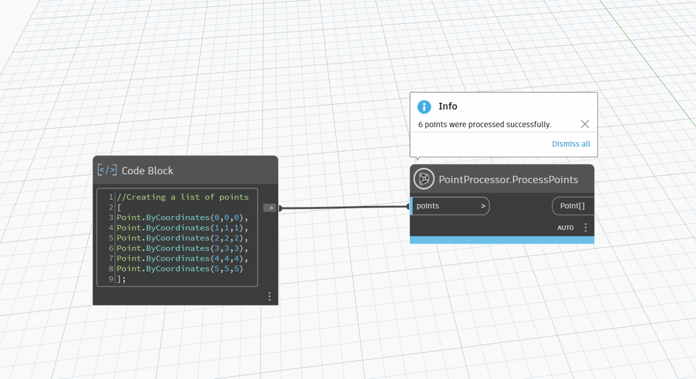
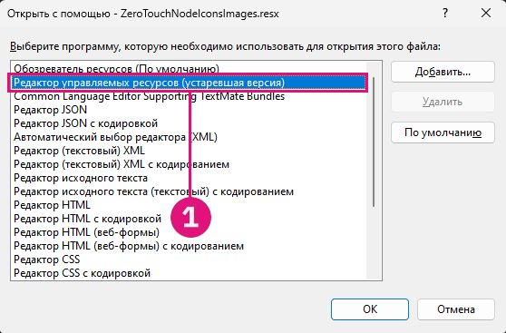
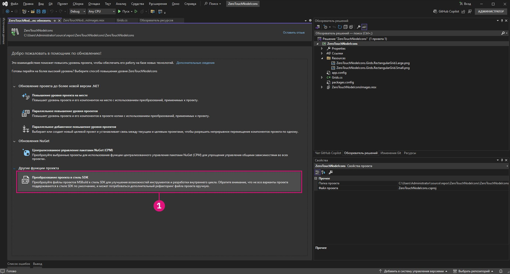

# Personalización avanzada de nodos de Dynamo

Ahora que tiene un conocimiento básico sobre Zero-Touch, en esta sección, se profundiza en las ventajas de personalizar los nodos de Dynamo para mejorar tanto la funcionalidad como la experiencia del usuario. Al agregar características como mensajes de advertencia, mensajes informativos e íconos personalizados, puede crear nodos que sean más intuitivos, informativos y visualmente atractivos. Estas personalizaciones no solo ayudan a los usuarios a comprender las posibles incidencias u optimizar los flujos de trabajo, sino que también le permiten a usted hacer que sus nodos destaquen como herramientas profesionales y fáciles de usar.

La personalización de los nodos es una excelente manera de garantizar que sus soluciones sean claras y fiables y se adapten a las necesidades específicas del proyecto.

## Generación de mensajes de advertencia personalizados mediante OnLogWarningMessage <a href="#generating-custom-warning-messages-using-onlogwarningmessage" id="generating-custom-warning-messages-using-onlogwarningmessage"></a>

En Dynamo, el método `OnLogWarningMessage` proporciona una forma de registrar mensajes de advertencia directamente en la consola de Dynamo. Se trata de una característica poderosa, especialmente para los nodos Zero Touch, ya que permite a los desarrolladores alertar a los usuarios cuando hay problemas con entradas o parámetros que podrían conducir a un comportamiento inesperado. Esta guía le enseñará a implementar `OnLogWarningMessage` en cualquier nodo Zero Touch.

### Pasos de implementación de `OnLogWarningMessage` <a href="#implementation-step-for-onlogwarningmessage" id="implementation-step-for-onlogwarningmessage"></a>

#### Paso 1: Importar el espacio de nombres necesario <a href="#import-the-required-namespace" id="import-the-required-namespace"></a>

`OnLogWarningMessage` forma parte del espacio de nombres `DynamoServices`, por lo que el primer paso es añadirlo al archivo del proyecto.

```
using DynamoServices;
```

#### Paso 2: Identificar cuándo registrar advertencias <a href="#identify-when-to-log-warnings" id="identify-when-to-log-warnings"></a>

Antes de agregar un mensaje de advertencia, tenga en cuenta la lógica del método:

* ¿Qué condiciones pueden provocar resultados incorrectos o inesperados?
* ¿Existen parámetros o valores de entrada específicos necesarios para que el método funcione correctamente?

Ejemplos de condiciones que deben comprobarse:

* **Valores fuera de rango** (p. ej., `if (inputValue < 0)`).
* **Colecciones nulas o vacías** (por ejemplo, `if (list == null || list.Count == 0)`).
* **Disparidad en el tipo de datos** (p. ej., si un tipo de archivo no es compatible).

#### Paso 3: Utilizar `OnLogWarningMessage` para registrar la advertencia <a href="#use-onlogwarningmessage-to-log-the-warning" id="use-onlogwarningmessage-to-log-the-warning"></a>

Realice llamadas `OnLogWarningMessage` en las que detecte condiciones que podrían causar problemas. Cuando se cumpla la condición, registre un mensaje de advertencia que proporcione directrices claras al usuario.

### Sintaxis para `OnLogWarningMessage` <a href="#syntax-for-onlogwarningmessage" id="syntax-for-onlogwarningmessage"></a>

```
LogWarningMessageEvents.OnLogWarningMessage("Your warning message here.");
```

### Ejemplos de implementaciones de `OnLogWarningMessage` <a href="#example-implementations-of-onlogwarningmessage" id="example-implementations-of-onlogwarningmessage"></a>

Para demostrar `OnLogWarningMessage` en acción, aquí presentamos diferentes escenarios que puede encontrar al crear un nodo Zero Touch.

#### Ejemplo 1: Validación de entradas numéricas <a href="#example-1-validating-numeric-inputs" id="example-1-validating-numeric-inputs"></a>

En este ejemplo, nos basaremos en el nodo personalizado creado en el anterior **"Caso real de Zero-Touch (nodo de rejilla)";** un método denominado `RectangularGrid` que genera una rejilla de rectángulos basada en entradas de `xCount` y `yCount`. Veremos paso a paso cómo hacer las pruebas si una entrada no es válida y, a continuación, cómo utilizar `OnLogWarningMessage` para registrar una advertencia y detener el procesamiento.


##### Uso de `OnLogWarningMessage` para la validación de entradas <a href="#using-onlogwarningmessage-for-input-validation" id="using-onlogwarningmessage-for-input-validation"></a>

Al generar una rejilla basada en `xCount` y `yCount`, asegúrese de que ambos valores sean enteros positivos antes de continuar.

```
public static List<Rectangle> CreateGrid(int xCount, int yCount)
{
    // Check if xCount and yCount are positive
    if (xCount <= 0 || yCount <= 0)
    {
        LogWarningMessageEvents.OnLogWarningMessage("Grid count values must be positive integers.");
        return new List<Rectangle>();  // Return an empty list if inputs are invalid
    }
    // Proceed with grid creation...
}
```

En este ejemplo:

* **Condición**: si `xCount` o `yCount` es menor o igual que cero.
* **Mensaje**: `"Grid count values must be positive integers."`

De este modo, se mostrará la advertencia en Dynamo si un usuario introduce valores de cero o negativos, lo que le permitirá saber cómo es la entrada esperada. 

Ahora que sabemos cómo se articula, podemos implementarlo en el nodo de rejilla de ejemplo:

```
using Autodesk.DesignScript.Geometry;
using DynamoServices;

namespace CustomNodes
{
    public class Grids
    {
        // The empty private constructor.
        // This will not be imported into Dynamo.
        private Grids() { }

        /// <summary>
        /// This method creates a rectangular grid from an X and Y count.
        /// </summary>
        /// <param name="xCount">Number of grid cells in the X direction</param>
        /// <param name="yCount">Number of grid cells in the Y direction</param>
        /// <returns>A list of rectangles</returns>
        /// <search>grid, rectangle</search>
        public static List<Rectangle> RectangularGrid(int xCount = 10, int yCount = 10)
        {
            // Check for valid input values
            if (xCount <= 0 || yCount <= 0)
            {
                // Log a warning message if the input values are invalid
                LogWarningMessageEvents.OnLogWarningMessage("Grid count values must be positive integers.");
                return new List<Rectangle>(); // Return an empty list if inputs are invalid
            }

            double x = 0;
            double y = 0;

            var pList = new List<Rectangle>();

            for (int i = 0; i < xCount; i++)
            {
                y++;
                x = 0;
                for (int j = 0; j < yCount; j++)
                {
                    x++;
                    Point pt = Point.ByCoordinates(x, y);
                    Vector vec = Vector.ZAxis();
                    Plane bP = Plane.ByOriginNormal(pt, vec);
                    Rectangle rect = Rectangle.ByWidthLength(bP, 1, 1);
                    pList.Add(rect);
                    Point cPt = rect.Center();
                }
            }

            return pList;
        }
    }
}
```

##### Ejemplo 2: Comprobación de colecciones nulas o vacías <a href="#example-2-checking-for-null-or-empty-collections" id="example-2-checking-for-null-or-empty-collections"></a>

Si su método requiere una lista de puntos, pero un usuario envía una lista vacía o nula, puede usar `OnLogWarningMessage` para informarle sobre el problema.


```
public static Polygon CreatePolygonFromPoints(List<Point> points)
{
    if (points == null || points.Count < 3)
    {
        LogWarningMessageEvents.OnLogWarningMessage("Point list cannot be null or have fewer than three points.");
        return null;  // Return null if the input list is invalid
    }
    // Proceed with polygon creation...
}
```

En este ejemplo:

* **Condición**: si la lista `points` es nula o contiene menos de tres puntos.
* **Mensaje**: `"Point list cannot be null or have fewer than three points."`

Esto advierte a los usuarios de que deben enviar una lista válida con al menos tres puntos para formar un polígono.

---

##### Ejemplo 3: Verificación de la compatibilidad del tipo de archivo <a href="#example-3-verifying-file-type-compatibility" id="example-3-verifying-file-type-compatibility"></a>

En el caso de un nodo que procesa rutas de archivo, quizá quiera asegurarse de que solo se permiten determinados tipos de archivo. Si se detecta un tipo de archivo no admitido, registre una advertencia.


```
public static void ProcessFile(string filePath)
{
    if (!filePath.EndsWith(".csv"))
    {
        LogWarningMessageEvents.OnLogWarningMessage("Only CSV files are supported.");
        return;
    }
    // Proceed with file processing...
}
```

En este ejemplo:

* **Condición**: si la ruta del archivo no termina en ".csv".
* **Mensaje**: `"Only CSV files are supported."`

Esto advierte a los usuarios para que se aseguren de que están enviando un archivo CSV, lo que ayuda a evitar problemas relacionados con formatos de archivo incompatibles.

## Adición de mensajes informativos con `OnLogInfoMessage` <a href="#adding-informational-messages-with-onloginfomessage" id="adding-informational-messages-with-onloginfomessage"></a>

En Dynamo, `OnLogInfoMessage` del espacio de nombres `DynamoServices` permite a los desarrolladores registrar mensajes informativos directamente en la consola de Dynamo. Esto es útil para confirmar operaciones correctas, comunicar el progreso o proporcionar información adicional sobre las acciones de los nodos. Esta guía le mostrará cómo añadir `OnLogInfoMessage` en cualquier nodo Zero Touch para mejorar la comunicación y la experiencia del usuario.

### Pasos de implementación de `OnLogInfoMessage` <a href="#implementation-steps-for-onloginfomessage" id="implementation-steps-for-onloginfomessage"></a>
#### Paso 1: Importar el espacio de nombres necesario <a href="#step-1-import-the-required-namespace" id="step-1-import-the-required-namespace"></a>

`OnLogInfoMessage` forma parte del espacio de nombres `DynamoServices`, por lo que el primer paso es añadirlo al archivo del proyecto.

#### Paso 2: Identificar cuándo registrar la información <a href="#step-2-identify-when-to-log-information" id="step-2-identify-when-to-log-information"></a>

Antes de agregar un mensaje de información, piense en la finalidad de su método:

* ¿Qué información sería útil confirmar una vez completada una acción?
* ¿Hay pasos o hitos clave dentro del método que los usuarios quieran conocer?

Ejemplos de confirmaciones útiles:

* **Mensajes de finalización** (p. ej., cuando se crea completamente una rejilla o un modelo).
* **Detalles de los datos procesados** (por ejemplo, "10 elementos procesados correctamente").
* **Resúmenes de ejecución** (por ejemplo, parámetros utilizados en el proceso).

#### Paso 3: Utilizar `OnLogInfoMessage` para registrar mensajes informativos <a href="#step-3-use-onloginfomessage-to-log-informational-message" id="step-3-use-onloginfomessage-to-log-informational-message"></a>

Realice `OnLogInfoMessage` llamadas en puntos significativos del método. Cuando se produzca un paso clave o una finalización, registre un mensaje informativo para enviar actualizaciones al usuario sobre lo sucedido.

### Sintaxis para `OnLogInfoMessage` <a href="#syntax-for-onloginfomessage" id="syntax-for-onloginfomessage"></a>

```
LogWarningMessageEvents.OnLogInfoMessage("Your info message here.");
```

### Ejemplos de implementaciones de `OnLogInfoMessage` <a href="#example-implementations-of-onloginfomessage" id="example-implementations-of-onloginfomessage"></a>

A continuación se presentan diferentes escenarios para demostrar el uso de `OnLogInfoMessage` en los nodos Zero Touch.

#### Ejemplo 1: Validación de entradas numéricas <a href="#example-1-validating-numeric-inputs" id="example-1-validating-numeric-inputs"></a>

En este ejemplo, nos basaremos en el nodo personalizado creado en el anterior **"Caso real de Zero-Touch (nodo de rejilla)";** un método denominado `RectangularGrid` que genera una rejilla de rectángulos basada en entradas de `xCount` y `yCount`. Veremos paso a paso cómo hacer las pruebas si una entrada no es válida y, a continuación, cómo utilizar `OnLogInfoMessage` para proporcionar información después de que el nodo haya completado su ejecución.


###### Uso de `OnLogInfoMessage` para la validación de entradas <a href="#using-onloginfomessage-for-unput-validation" id="using-onloginfomessage-for-unput-validation"></a>

Al generar una rejilla basada en `xCount` y `yCount`, después de generar la rejilla, querrá confirmar su creación registrando un mensaje informativo con sus cotas.

```
public static List<Rectangle> CreateGrid(int xCount, int yCount)
{
    var pList = new List<Rectangle>();
    // Grid creation code here...

    // Confirm successful grid creation
    LogWarningMessageEvents.OnLogInfoMessage($"Successfully created a grid with dimensions {xCount}x{yCount}.");

    return pList;
}
```

En este ejemplo:

* **Condición**: el proceso de creación de la rejilla se ha completado.
* **Mensaje**: `"Successfully created a grid with dimensions {xCount}x{yCount}."`

Este mensaje informará a los usuarios de que la rejilla se ha creado según lo especificado, lo que les permitirá confirmar que el nodo funciona según lo previsto.

Ahora que sabemos cómo se articula, podemos implementarlo en el nodo de rejilla de ejemplo:

```
using Autodesk.DesignScript.Geometry;
using DynamoServices;

namespace CustomNodes
{
    public class Grids
    {
        // The empty private constructor.
        // This will not be imported into Dynamo.
        private Grids() { }

        /// <summary>
        /// This method creates a rectangular grid from an X and Y count.
        /// </summary>
        /// <param name="xCount">Number of grid cells in the X direction</param>
        /// <param name="yCount">Number of grid cells in the Y direction</param>
        /// <returns>A list of rectangles</returns>
        /// <search>grid, rectangle</search>
        public static List<Rectangle> RectangularGrid(int xCount = 10, int yCount = 10)
        {
            double x = 0;
            double y = 0;

            var pList = new List<Rectangle>();

            for (int i = 0; i < xCount; i++)
            {
                y++;
                x = 0;
                for (int j = 0; j < yCount; j++)
                {
                    x++;
                    Point pt = Point.ByCoordinates(x, y);
                    Vector vec = Vector.ZAxis();
                    Plane bP = Plane.ByOriginNormal(pt, vec);
                    Rectangle rect = Rectangle.ByWidthLength(bP, 1, 1);
                    pList.Add(rect);
                    Point cPt = rect.Center();
                }
            }

            // Log an info message indicating the grid was successfully created
            LogWarningMessageEvents.OnLogInfoMessage($"Successfully created a grid with dimensions {xCount}x{yCount}.");

            return pList;
        }
    }
}
```

#### Ejemplo 2: Proporcionar información de recuento de datos <a href="#example-2-providing-data-count-information" id="example-2-providing-data-count-information"></a>

Si está creando un nodo que procesa una lista de puntos, es posible que desee registrar cuántos puntos se procesan correctamente. Esto puede ser útil para grandes conjuntos de datos.



```
public static List<Point> ProcessPoints(List<Point> points)
{
    var processedPoints = new List<Point>();
    foreach (var point in points)
    {
        // Process each point...
        processedPoints.Add(point);
    }

    // Log info about the count of processed points
    LogWarningMessageEvents.OnLogInfoMessage($"{processedPoints.Count} points were processed successfully.");

    return processedPoints;
}
```

En este ejemplo:

* **Condición**: después de que se complete el bucle, se muestra el recuento de elementos procesados.
* **Mensaje**: `"6 points were processed successfully."`

Este mensaje permite a los usuarios conocer el resultado del procesamiento y confirmar que se han procesado todos los puntos.


#### Ejemplo 3: Resumen de los parámetros utilizados <a href="#example-3-summarizing-parameters-used" id="example-3-summarizing-parameters-used"></a>

En algunos casos, es útil confirmar los parámetros de entrada que ha utilizado un nodo para completar una acción. Por ejemplo, si el nodo exporta datos a un archivo, el registro del nombre y la ruta del archivo puede servir a los usuarios como garantía de que se ha utilizado el archivo correcto.


```
public static void ExportData(string filePath, List<string> data)
{
    // Code to write data to the specified file path...

    // Log the file path used for export
    LogWarningMessageEvents.OnLogInfoMessage($"Data exported successfully to {filePath}.");

}
```

En este ejemplo:

* **Condición**: el proceso de exportación se ha completado correctamente.
* **Mensaje**: `"Data exported successfully to {filePath}."`

Este mensaje confirma a los usuarios que la exportación se ha realizado correctamente y muestra la ruta exacta del archivo, lo que ayuda a evitar confusiones sobre las ubicaciones de los archivos.

## Creación y adición de documentación personalizada en los nodos

### Documentación de nodos personalizados
Tradicionalmente, ha habido limitaciones en Dynamo en cuanto a la forma en que los autores de paquetes podían proporcionar documentación para sus nodos. Los autores de nodos personalizados se han visto limitados a permitir solo una descripción breve que se muestre en la información de herramientas del nodo o a enviar el paquete con gráficos de muestra cargados de anotaciones.


### Una nueva vía
Dynamo ahora ofrece un sistema mejorado para que los autores de paquetes proporcionen una documentación de mayor calidad y claridad para los nodos personalizados. Este nuevo enfoque utiliza el sencillo lenguaje Markdown para la creación de texto y la extensión de vista del Navegador de documentación para mostrar Markdown en Dynamo. El uso de Markdown ofrece a los autores de paquetes una amplia gama de nuevas posibilidades a la hora de generar la documentación para sus nodos personalizados. 

#### ¿Qué es Markdown?
Markdown es un lenguaje de marcado ligero que se puede utilizar para dar formato a documentos de texto sin formato. Desde que se creó Markdown en 2004, su popularidad no ha hecho más que aumentar y ahora es uno de los lenguajes de marcado más populares del mundo.

#### Para empezar con Markdown
Es fácil comenzar a crear archivos de Markdown: todo lo que necesita es un editor de texto simple, como el Bloc de notas. Sin embargo, hay formas más fáciles de escribir Markdown que usar el Bloc de notas. Hay varios editores en línea, como [Dillinger](https://dillinger.io/), que permiten ver los cambios en tiempo real a medida que se realizan. Otra forma popular de editar archivos de Markdown es usar un editor de código como [Visual Studio Code](https://code.visualstudio.com/).

#### ¿Qué puede hacer Markdown?
Markdown es muy flexible y las funciones que ofrece deberían bastar para crear fácilmente una buena documentación; entre estas funciones están la adición de archivos multimedia como imágenes o vídeos, la creación de tablas con diferentes formas de contenido y, por supuesto, funciones sencillas de formato de texto, como poner el texto en **negrita** o *cursiva*. Markdown permite hacer todo esto y mucho más. Para obtener más información, consulte esta guía en la que se explica la [sintaxis básica de Markdown](https://www.Markdownguide.org/basic-syntax/).

### Adición de documentación ampliada a los nodos
Añadir documentación a los nodos es sencillo. La documentación se puede agregar a todos los tipos de nodos personalizados, que son los siguientes:
* Nodos predefinidos de Dynamo
* Nodos personalizados (.dyf): colecciones de nodos predefinidos u otros nodos de paquete
* Nodos de paquete de C# personalizados (también conocidos como Zerotouch Estos nodos personalizados tienen un aspecto similar a los nodos predefinidos)
* Nodos NodeModel (nodos que contienen funciones especiales de la interfaz de usuario, como menús desplegables o botones de selección)
* Nodos NodeModel con interfaz de usuario personalizada (nodos que contienen funciones de interfaz de usuario únicas, como gráficos en el nodo)

Siga estos pasos para que los archivos de Markdown se muestren en Dynamo.

#### Abrir archivos de documentación en Dynamo
Dynamo utiliza la extensión de vista del Navegador de documentación para mostrar la documentación de los nodos. Para abrir la documentación de un nodo, haga clic con el botón derecho en el nodo y seleccione Ayuda. De esta forma, se abrirá el Navegador de documentación y se mostrará el archivo de Markdown asociado con ese nodo, si lo hay.


La documentación que se muestra en el Navegador de documentación consta de dos partes. La primera es la sección `Node Info`, que se genera automáticamente a partir de la información extraída del nodo, como las entradas/salidas, la categoría, el nombre/espacio de nombres y la descripción breve del nodo. La segunda parte muestra la documentación del nodo personalizado, que es el archivo de Markdown que se proporciona para generar dicha documentación.


#### Carpeta de documentos del paquete
Para añadir archivos de documentación a los nodos de Dynamo, cree una nueva carpeta denominada `/doc` en el directorio de paquetes. Cuando se cargue el paquete, Dynamo analizará este directorio y obtendrá todos los archivos de Markdown de documentación que contenga.

#### Asignar nombre a los archivos de Markdown
Para asegurarse de que Dynamo sepa qué archivo abrir para un nodo específico cuando se le solicite, la denominación del archivo de Markdown debe tener un formato específico. El archivo de Markdown debe nombrarse en función del espacio de nombres del nodo para el que genera documentación. Si no conoce con certeza el espacio de nombres del nodo, observe la sección `Node Info` cuando presione `Help` en el nodo y, bajo del nombre del nodo, verá el espacio de nombres completo del nodo seleccionado. 

Este espacio de nombres debe ser el nombre del archivo de Markdown para ese nodo en particular. Por ejemplo, el espacio de nombres de `CustomNodeExample` en las imágenes anteriores es `TestPackage.TestCategory.CustomNodeExample`; por lo tanto, el archivo Markdown para este nodo debe tener por nombre `TestPackage.TestCategory.CustomNodeExample.md`

En los casos especiales en los que haya sobrecargas en los nodos (nodos con el mismo nombre, pero entradas diferentes), tendrá que añadir los nombres de entrada entre `()` después del espacio de nombres del nodo. Por ejemplo, el nodo integrado `Geometry.Translate` tiene varias sobrecargas. En este caso, denominaríamos a los archivos de Markdown de los siguientes nodos de la siguiente forma: `Autodesk.DesignScript.Geometry.Geometry.Translate(geometry,direction).md` `Autodesk.DesignScript.Geometry.Geometry.Translate(geometry,direction,distance).md`


#### Modificación de archivos de Markdown mientras están abiertos en Dynamo
Para facilitar la modificación de los archivos de documentación, el Navegador de documentación incluye un visor de archivos en el archivo de documentación abierto. Esto permite realizar cambios en el archivo de Markdown y ver los cambios en Dynamo al instante. 


También se pueden añadir nuevos archivos de documentación mientras Dynamo está abierto. Basta con añadir un nuevo archivo de Markdown a la carpeta `/doc` con un nombre que se corresponda con el nodo para el que genera documentación.

## Adición de iconos personalizados a los nodos Zero Touch

### Información general

Los iconos personalizados para nodos ZeroTouch de Dynamo hacen que los nodos sean visualmente distinguibles y fáciles de reconocer en la biblioteca. Mediante los íconos personalizados, puede hacer que sus nodos destaquen sobre el resto, lo que permite a los usuarios identificarlos rápidamente en una lista.

Esta guía le mostrará cómo añadir iconos a los nodos Zero Touch.


### Pasos para añadir iconos de nodo personalizados

#### Paso 1: Configurar el proyecto

Para empezar, cree un proyecto de biblioteca de clases de Visual Studio (.NET Framework) para los nodos Zero Touch. Si aún no tiene un proyecto, consulte la sección **Introducción** para obtener instrucciones paso a paso sobre cómo crear uno.


Asegúrese de tener al menos un nodo Zero Touch operativo, ya que los iconos solo se pueden agregar a nodos existentes. Para obtener instrucciones, consulte el **Caso real de Zero Touch (nodo de rejilla)**.


#### Paso 2: Crear las imágenes de los iconos

Para crear iconos personalizados:

1. **Diseñe los iconos**: utilice un editor de imágenes para crear iconos sencillos y visualmente claros para sus nodos.
2. **Especificaciones de las imágenes**:
    * **Icono pequeño**: 32 x 32 píxeles (se utiliza en la barra lateral de la biblioteca y en el propio nodo).
    * **Icono grande**: 128 x 128 píxeles (se utiliza en las propiedades del nodo al pasar el cursor sobre el nodo en la biblioteca).
3. **Convención de denominación de archivos**:
    * Los nombres de archivo deben coincidir con el formato siguiente para que se asocien al nodo correcto:
        * **`<ProjectName>.<ClassName>.<MethodName>.Small.png`** (para iconos pequeños).
        * **`<ProjectName>.<ClassName>.<MethodName>.Large.png`** (para iconos grandes).

**Ejemplo**: si el proyecto es `ZeroTouchNodeIcons`, la clase es `Grids` y el método es `RectangularGrid`, los archivos se llamarán:

* `ZeroTouchNodeIcons.Grids.RectangularGrid.Small.png`
* `ZeroTouchNodeIcons.Grids.RectangularGrid.Large.png`

> Consejo: utilice un tema de diseño coherente en todos los iconos para conseguir un aspecto profesional.


#### Paso 3: Añadir un archivo de recursos al proyecto

Para incrustar los iconos en el archivo `.dll`, cree un archivo de recursos:

1. **Añada un nuevo archivo de recursos**:

  * Haga clic con el botón derecho en el proyecto desde el **Explorador de soluciones**.


  * Vaya a **Añadir > Nuevo elemento** y seleccione **Archivo de recursos**.


  * Nombre el archivo `<ProjectName>Images.resx`. Por ejemplo, `ZeroTouchNodeIconsImages.resx`.

2. **Desactive la propiedad de herramienta personalizada**:
    * Seleccione el archivo de recursos en el **Explorador de soluciones**.
    * En el panel **Propiedades** desactive el campo `Custom Tool` eliminando el valor `ResXFileCodeGenerator`.


> *NOTA: Si no se desactiva el campo "Herramienta personalizada", Visual Studio convertirá los puntos en guiones bajos en los nombres de los recursos. Antes de generar el archivo, compruebe que los nombres de los recursos cuentan con puntos para separar los nombres de clase, y no guiones bajos.*


#### Paso 4: Añadir las imágenes como recursos

1. Abra el archivo de recursos mediante el **Editor de recursos administrados (heredado)**:
    * Si usa Visual Studio 17.11 o una versión posterior, haga clic con el botón derecho en el archivo de recursos, elija **Abrir con** y seleccione **Editor de recursos administrados (heredado)**.
    * Si usa una versión de Visual Studio anterior a la 17.11, haga doble clic en el archivo de recursos para abrirlo con el Editor de recursos (que en su versión de Visual Studio aún no se ha convertido en heredado).




2. Añada las imágenes:
    * Arrastre y suelte los archivos de imagen en el editor o utilice la opción **Añadir archivo existente**.


3. Actualice la persistencia:
    * Seleccione las imágenes en el Editor de recursos (la acción no se realizará correctamente si las selecciona en el Explorador de soluciones), cambie la propiedad **Persistencia** en el panel **Propiedades** a `Embedded in .resx`. De este modo, se garantiza la inclusión de las imágenes en el archivo `.dll`.


#### Paso 5: Convertir el proyecto al estilo de SDK

Si el proyecto aún no es de estilo SDK (necesario para incrustar recursos), conviértalo:

1. Instale la extensión de `.NET Upgrade Assistant` desde el menú **Extensiones > Administrar extensiones** de Visual Studio.


2. Haga clic con el botón derecho en el proyecto en el **Explorador de soluciones** y seleccione **Actualizar > Convertir proyecto a estilo SDK**.




3. Espere a que se complete la conversión.


#### Paso 6: Añadir una secuencia de comandos posterior a la compilación para incrustar recursos

1. Descargue el proyecto:
    * Haga clic con el botón derecho en el proyecto en el **Explorador de soluciones** y seleccione **Descargar proyecto**.


2. Edite el archivo `.csproj`:
    * Añada el siguiente elemento `<Target>` entre `</ItemGroup>` y `</Project>`:

```
<Target Name="CreateNodeIcons" AfterTargets="PostBuildEvent">
		<!-- Get System.Drawing.dll     -->
		<GetReferenceAssemblyPaths TargetFrameworkMoniker=".NETFramework, Version=v4.8">
			<Output TaskParameter="FullFrameworkReferenceAssemblyPaths" PropertyName="FrameworkAssembliesPath" />
		</GetReferenceAssemblyPaths>
		<!-- Get assembly -->
		<GetAssemblyIdentity AssemblyFiles="$(OutDir)$(TargetName).dll">
			<Output TaskParameter="Assemblies" ItemName="AssemblyInfo" />
		</GetAssemblyIdentity>
		<!-- Generate customization dll -->
		<GenerateResource SdkToolsPath="$(TargetFrameworkSDKToolsDirectory)" UseSourcePath="true" Sources="$(ProjectDir)ZeroTouchNodeIconsImages.resx" OutputResources="$(ProjectDir)ZeroTouchNodeIconsImages.resources" References="$(FrameworkAssembliesPath)System.Drawing.dll" />
		<AL SdkToolsPath="$(TargetFrameworkSDKToolsDirectory)" TargetType="library" EmbedResources="$(ProjectDir)ZeroTouchNodeIconsImages.resources" OutputAssembly="$(OutDir)ZeroTouchNodeIcons.customization.dll" Version="%(AssemblyInfo.Version)" />
	</Target>
```

1. Reemplace todos los ejemplares de `ZeroTouchNodeIcons` por el nombre del proyecto.
2. Vuelva a cargar el proyecto:
    * Haga clic con el botón derecho en el proyecto descargado y seleccione **Volver a cargar proyecto**.


#### Paso 7: Compilar y cargar el archivo .dll en Dynamo

1. Compile el proyecto:
    * Después de añadir la secuencia de comandos posterior a la compilación, compile el proyecto en Visual Studio.


2. Compruebe los archivos de salida:
    * Asegúrese de que los archivos `.dll` y `.customization.dll` se encuentran en la carpeta `bin`.
3. Añada el archivo `.dll` a Dynamo:
    * En Dynamo, utilice el botón Importar biblioteca para importar el archivo .dll.


4. Los nodos personalizados deberían aparecer ahora con sus respectivos iconos.