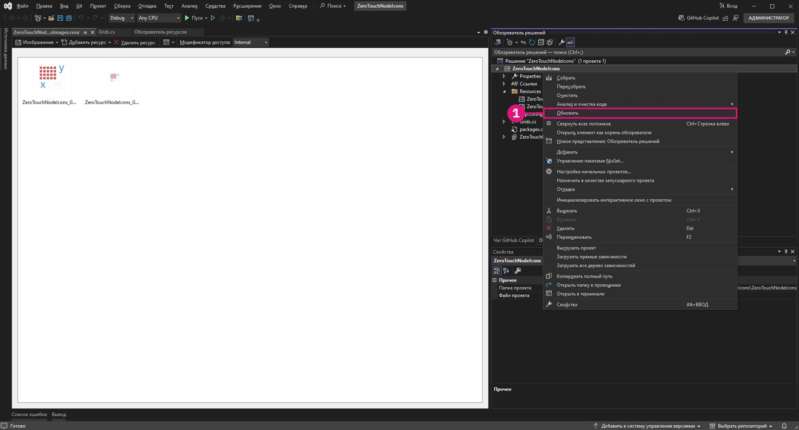

# Расширенная настройка узлов Dynamo

Подразумевается, что у читателя уже есть базовые знания о ZeroTouch. В этом разделе рассматриваются преимущества настройки узлов Dynamo для расширения функциональных возможностей и повышения удобства работы пользователей. Добавляя такие функции, как предупреждения, информационные сообщения и настраиваемые значки, можно создавать узлы, которые являются более интуитивно понятными, информативными и визуально привлекательными. Эти настройки не только помогают пользователям понять потенциальные проблемы или оптимизировать рабочие процессы, но и выделяют ваши узлы как профессиональные и удобные инструменты.

Настройка узлов — это отличный способ обеспечить четкость, надежность и адаптированность решений к конкретным задачам проекта.

## Создание настраиваемых предупреждений с помощью OnLogWarningMessage <a href="#generating-custom-warning-messages-using-onlogwarningmessage" id="generating-custom-warning-messages-using-onlogwarningmessage"></a>

В Dynamo метод `OnLogWarningMessage` позволяет регистрировать предупреждения непосредственно в консоли Dynamo. Это эффективная функция, особенно для узлов Zero Touch, поскольку она позволяет разработчикам предупреждать пользователей о проблемах с входными данными или параметрами, которые могут привести к непредвиденному поведению. В этом руководстве рассказывается о том, как реализовать `OnLogWarningMessage` в любом узле Zero Touch.

### Этапы реализации `OnLogWarningMessage` <a href="#implementation-step-for-onlogwarningmessage" id="implementation-step-for-onlogwarningmessage"></a>

#### Шаг 1\. Импорт требуемого пространства имен <a href="#import-the-required-namespace" id="import-the-required-namespace"></a>

`OnLogWarningMessage` является частью пространства имен `DynamoServices`, поэтому начните с его добавления в файл проекта.

```
using DynamoServices;
```

#### Шаг 2\. Определение того, когда следует регистрировать предупреждения <a href="#identify-when-to-log-warnings" id="identify-when-to-log-warnings"></a>

Прежде чем добавлять предупреждение, продумайте логику в своем методе.

* Какие условия могут привести к неправильным или неожиданным результатам?
* Существуют ли определенные входные значения или параметры, необходимые для правильной работы метода?

Примеры условий для проверки:

* **значения вне диапазона** (например, `if (inputValue < 0)`);
* **нулевые или пустые коллекции** (например, `if (list == null || list.Count == 0)`);
* **несоответствие типов данных** (например, если тип файла не поддерживается).

#### Шаг 3\. Использование `OnLogWarningMessage` для регистрации предупреждения <a href="#use-onlogwarningmessage-to-log-the-warning" id="use-onlogwarningmessage-to-log-the-warning"></a>

Добавьте вызовы `OnLogWarningMessage` при обнаружении условий, которые могут привести к проблемам. Когда условие выполняется, зарегистрируйте предупреждение, в котором содержатся четкие инструкции для пользователя.

### Синтаксис для `OnLogWarningMessage` <a href="#syntax-for-onlogwarningmessage" id="syntax-for-onlogwarningmessage"></a>

```
LogWarningMessageEvents.OnLogWarningMessage("Your warning message here.");
```

### Примеры реализации `OnLogWarningMessage` <a href="#example-implementations-of-onlogwarningmessage" id="example-implementations-of-onlogwarningmessage"></a>

Чтобы продемонстрировать `OnLogWarningMessage` в действии, ниже приведены различные сценарии, с которыми вы можете столкнуться при создании узла Zero Touch.

#### Пример 1\. Проверка числовых значений <a href="#example-1-validating-numeric-inputs" id="example-1-validating-numeric-inputs"></a>

В этом примере применяется пользовательский узел, созданный ранее в разделе **Пример использования узлов Zero-Touch — узел сетки**; метод `RectangularGrid`, который создает сетку из прямоугольников на основе входных данных `xCount` и `yCount`. Мы проверим, действительны ли входные данные, а затем с помощью `OnLogWarningMessage` зарегистрируем предупреждение и остановим обработку.


##### Использование `OnLogWarningMessage` для проверки входных данных <a href="#using-onlogwarningmessage-for-input-validation" id="using-onlogwarningmessage-for-input-validation"></a>

При создании сетки на основе `xCount` и `yCount` сначала необходимо убедиться в том, что оба значения являются положительными целыми числами.

```
public static List<Rectangle> CreateGrid(int xCount, int yCount)
{
    // Check if xCount and yCount are positive
    if (xCount <= 0 || yCount <= 0)
    {
        LogWarningMessageEvents.OnLogWarningMessage("Grid count values must be positive integers.");
        return new List<Rectangle>();  // Return an empty list if inputs are invalid
    }
    // Proceed with grid creation...
}
```

В этом примере:

* **Условие**: если `xCount` или `yCount` меньше или равно нулю.
* **Сообщение**: `"Grid count values must be positive integers."`

При вводе ноля или отрицательных значений в Dynamo отображается предупреждение, что помогает понять, какой ввод ожидается. 

Теперь, когда мы знаем, как это выглядит, мы можем реализовать это в примере узла Grids.

```
using Autodesk.DesignScript.Geometry;
using DynamoServices;

namespace CustomNodes
{
    public class Grids
    {
        // The empty private constructor.
        // This will not be imported into Dynamo.
        private Grids() { }

        /// <summary>
        /// This method creates a rectangular grid from an X and Y count.
        /// </summary>
        /// <param name="xCount">Number of grid cells in the X direction</param>
        /// <param name="yCount">Number of grid cells in the Y direction</param>
        /// <returns>A list of rectangles</returns>
        /// <search>grid, rectangle</search>
        public static List<Rectangle> RectangularGrid(int xCount = 10, int yCount = 10)
        {
            // Check for valid input values
            if (xCount <= 0 || yCount <= 0)
            {
                // Log a warning message if the input values are invalid
                LogWarningMessageEvents.OnLogWarningMessage("Grid count values must be positive integers.");
                return new List<Rectangle>(); // Return an empty list if inputs are invalid
            }

            double x = 0;
            double y = 0;

            var pList = new List<Rectangle>();

            for (int i = 0; i < xCount; i++)
            {
                y++;
                x = 0;
                for (int j = 0; j < yCount; j++)
                {
                    x++;
                    Point pt = Point.ByCoordinates(x, y);
                    Vector vec = Vector.ZAxis();
                    Plane bP = Plane.ByOriginNormal(pt, vec);
                    Rectangle rect = Rectangle.ByWidthLength(bP, 1, 1);
                    pList.Add(rect);
                    Point cPt = rect.Center();
                }
            }

            return pList;
        }
    }
}
```

##### Пример 2\. Проверка нулевых или пустых коллекций <a href="#example-2-checking-for-null-or-empty-collections" id="example-2-checking-for-null-or-empty-collections"></a>

Если для метода требуется список точек, но пользователь передает пустой или нулевой список, можно использовать `OnLogWarningMessage`, чтобы сообщить о проблеме.


```
public static Polygon CreatePolygonFromPoints(List<Point> points)
{
    if (points == null || points.Count < 3)
    {
        LogWarningMessageEvents.OnLogWarningMessage("Point list cannot be null or have fewer than three points.");
        return null;  // Return null if the input list is invalid
    }
    // Proceed with polygon creation...
}
```

В этом примере:

* **Условие**: если список `points` является нулевым или содержит меньше трех точек.
* **Сообщение**: `"Point list cannot be null or have fewer than three points."`

Для пользователей отображается предупреждение о том, что для формирования многоугольника необходимо передать допустимый список, содержащий не менее трех точек.

---

##### Пример 3\. Проверка совместимости типов файлов <a href="#example-3-verifying-file-type-compatibility" id="example-3-verifying-file-type-compatibility"></a>

Для узла, обрабатывающего пути к файлам, может потребоваться убедиться, что используются только разрешенные типы файлов. При обнаружении неподдерживаемого типа файла регистрируется предупреждение.


```
public static void ProcessFile(string filePath)
{
    if (!filePath.EndsWith(".csv"))
    {
        LogWarningMessageEvents.OnLogWarningMessage("Only CSV files are supported.");
        return;
    }
    // Proceed with file processing...
}
```

В этом примере:

* **Условие**: если путь к файлу не заканчивается на «.csv».
* **Сообщение**: `"Only CSV files are supported."`

Пользователи должны убедиться, что они передают файл CSV, что помогает предотвратить проблемы, связанные с несовместимыми форматами файлов.

## Добавление информационных сообщений с помощью `OnLogInfoMessage` <a href="#adding-informational-messages-with-onloginfomessage" id="adding-informational-messages-with-onloginfomessage"></a>

В Dynamo `OnLogInfoMessage` из пространства имен `DynamoServices` позволяет разработчикам регистрировать информационные сообщения непосредственно в консоли Dynamo. Это полезно для подтверждения успешного выполнения операций, информирования о ходе выполнения или предоставления дополнительных сведений о действиях узла. В этом руководстве рассказывается о том, как добавить `OnLogInfoMessage` в любой узел Zero Touch для улучшения обратной связи и удобства работы.

### Этапы реализации `OnLogInfoMessage` <a href="#implementation-steps-for-onloginfomessage" id="implementation-steps-for-onloginfomessage"></a>
#### Шаг 1\. Импорт требуемого пространства имен <a href="#step-1-import-the-required-namespace" id="step-1-import-the-required-namespace"></a>

`OnLogInfoMessage` является частью пространства имен `DynamoServices`, поэтому начните с его добавления в файл проекта.

#### Шаг 2\. Определение того, когда следует регистрировать информационные сообщения <a href="#step-2-identify-when-to-log-information" id="step-2-identify-when-to-log-information"></a>

Прежде чем добавлять информационное сообщение, продумайте логику в своем методе.

* Какую информацию полезно подтвердить после выполнения действия?
* Есть ли важные или ключевые этапы в методе, о которых пользователям может быть полезно узнать?

Примеры полезных сообщений с подтверждением:

* **сообщения о завершении** (например, когда сетка или модель полностью созданы);
* **сведения об обработанных данных** (например, «Успешно обработано 10 элементов»);
* **сводки по выполнению** (например, параметры, используемые в процессе).

#### Шаг 3\. Использование `OnLogInfoMessage` для регистрации информационных сообщений <a href="#step-3-use-onloginfomessage-to-log-informational-message" id="step-3-use-onloginfomessage-to-log-informational-message"></a>

Добавьте вызовы `OnLogInfoMessage` в значимых точках метода. Когда наступает ключевой этап или завершение процесса, регистрируйте информационное сообщение, чтобы сообщить пользователю о том, что произошло.

### Синтаксис для `OnLogInfoMessage` <a href="#syntax-for-onloginfomessage" id="syntax-for-onloginfomessage"></a>

```
LogWarningMessageEvents.OnLogInfoMessage("Your info message here.");
```

### Примеры реализации `OnLogInfoMessage` <a href="#example-implementations-of-onloginfomessage" id="example-implementations-of-onloginfomessage"></a>

Ниже приведены различные сценарии использования `OnLogInfoMessage` в узлах Zero Touch.

#### Пример 1\. Проверка числовых значений <a href="#example-1-validating-numeric-inputs" id="example-1-validating-numeric-inputs"></a>

В этом примере применяется пользовательский узел, созданный ранее в разделе **Пример использования узлов Zero-Touch — узел сетки**; метод `RectangularGrid`, который создает сетку из прямоугольников на основе входных данных `xCount` и `yCount`. Мы проверим, действительны ли входные данные, а затем с помощью `OnLogInfoMessage` предоставим информацию после выполнения операции узла.


###### Использование `OnLogInfoMessage` для проверки входных данных <a href="#using-onloginfomessage-for-unput-validation" id="using-onloginfomessage-for-unput-validation"></a>

При создании сетки на основе `xCount` и `yCount` необходимо подтвердить ее создание и отобразить информационное сообщение со сведениями о размерах сетки.

```
public static List<Rectangle> CreateGrid(int xCount, int yCount)
{
    var pList = new List<Rectangle>();
    // Grid creation code here...

    // Confirm successful grid creation
    LogWarningMessageEvents.OnLogInfoMessage($"Successfully created a grid with dimensions {xCount}x{yCount}.");

    return pList;
}
```

В этом примере:

* **Условие**: процесс создания сетки завершен.
* **Сообщение**: `"Successfully created a grid with dimensions {xCount}x{yCount}."`

Это сообщение информирует пользователей о том, что сетка была создана так, как указано, и служит подтверждением того, что узел сработал должным образом.

Теперь, когда мы знаем, как это выглядит, мы можем реализовать это в примере узла Grids.

```
using Autodesk.DesignScript.Geometry;
using DynamoServices;

namespace CustomNodes
{
    public class Grids
    {
        // The empty private constructor.
        // This will not be imported into Dynamo.
        private Grids() { }

        /// <summary>
        /// This method creates a rectangular grid from an X and Y count.
        /// </summary>
        /// <param name="xCount">Number of grid cells in the X direction</param>
        /// <param name="yCount">Number of grid cells in the Y direction</param>
        /// <returns>A list of rectangles</returns>
        /// <search>grid, rectangle</search>
        public static List<Rectangle> RectangularGrid(int xCount = 10, int yCount = 10)
        {
            double x = 0;
            double y = 0;

            var pList = new List<Rectangle>();

            for (int i = 0; i < xCount; i++)
            {
                y++;
                x = 0;
                for (int j = 0; j < yCount; j++)
                {
                    x++;
                    Point pt = Point.ByCoordinates(x, y);
                    Vector vec = Vector.ZAxis();
                    Plane bP = Plane.ByOriginNormal(pt, vec);
                    Rectangle rect = Rectangle.ByWidthLength(bP, 1, 1);
                    pList.Add(rect);
                    Point cPt = rect.Center();
                }
            }

            // Log an info message indicating the grid was successfully created
            LogWarningMessageEvents.OnLogInfoMessage($"Successfully created a grid with dimensions {xCount}x{yCount}.");

            return pList;
        }
    }
}
```

#### Пример 2\. Предоставление информации о количестве данных <a href="#example-2-providing-data-count-information" id="example-2-providing-data-count-information"></a>

Если вы создаете узел, который обрабатывает список точек, может потребоваться зарегистрировать количество точек, которые были успешно обработаны. Это может быть полезно при наличии больших наборов данных.


```
public static List<Point> ProcessPoints(List<Point> points)
{
    var processedPoints = new List<Point>();
    foreach (var point in points)
    {
        // Process each point...
        processedPoints.Add(point);
    }

    // Log info about the count of processed points
    LogWarningMessageEvents.OnLogInfoMessage($"{processedPoints.Count} points were processed successfully.");

    return processedPoints;
}
```

В этом примере:

* **Условие**: после завершения цикла отображается количество обработанных элементов.
* **Сообщение**: `"6 points were processed successfully."`

Это сообщение поможет пользователям оценить результат обработки и убедиться в том, что все точки были обработаны.


#### Пример 3\. Суммирование использованных параметров <a href="#example-3-summarizing-parameters-used" id="example-3-summarizing-parameters-used"></a>

В некоторых случаях полезно подтвердить входные параметры, которые использовались в узле для выполнения действия. Например, если узел экспортирует данные в файл, регистрация имени файла и пути может служить для пользователей подтверждением того, что был использован правильный файл.


```
public static void ExportData(string filePath, List<string> data)
{
    // Code to write data to the specified file path...

    // Log the file path used for export
    LogWarningMessageEvents.OnLogInfoMessage($"Data exported successfully to {filePath}.");

}
```

В этом примере:

* **Условие**: экспорт успешно завершен.
* **Сообщение**: `"Data exported successfully to {filePath}."`

Это сообщение подтверждает успешное выполнение экспорта. В нем также указывается точный путь к файлу, что помогает избежать путаницы с расположением файлов.

## Создание пользовательской документации и добавление ее к узлам

### Документация по пользовательским узлам
В Dynamo всегда существовали ограничения на предоставление разработчиками пакетов документации по узлам. Авторы пользовательских узлов могли только добавлять краткое описание, отображаемое в подсказке для узла, или поставлять пакет с графиками со множеством примечаний.


### Новый способ
Dynamo предлагает разработчикам пакетов усовершенствованную систему, позволяющую предоставлять пользователям более качественную и информативную документацию по пользовательским узлам. В этом новом подходе для создания текста используется удобный язык Markdown и расширение вида «Обозреватель документации» для отображения этого текста в Dynamo. Markdown предоставляет разработчикам пакетов широкий спектр новых возможностей при составлении документации для пользовательских узлов. 

#### Что такое Markdown?
Markdown — это упрощенный язык разметки для форматирования текстовых документов. С момента создания Markdown в 2004 году его популярность только возросла, и сейчас этот язык является одним из самых распространенных языков разметки в мире.

#### Начало работы с Markdown
Приступить к созданию файлов Markdown легко — достаточно открыть простой текстовый редактор, например Блокнот. Однако, помимо Блокнота, есть и более простые инструменты написания текстов Markdown. Существуют разные онлайн-редакторы, например [Dillinger](https://dillinger.io/), которые позволяют просматривать изменения в реальном времени по мере их внесения. Еще один популярный способ редактирования файлов Markdown — редактор кода, например [Visual Studio Code](https://code.visualstudio.com/).

#### Какие возможности дает Markdown?
Markdown является гибким инструментом с широким функционалом для составления качественной документации без лишних усилий. Например, он позволяет добавлять медиафайлы, в том числе изображения и видео, создавать таблицы с различными формами содержимого и, конечно, форматировать текст, например выделять шрифт **полужирным** или *курсивом*. Markdown предоставляет эти и другие возможности. Дополнительную информацию см. в [руководстве по базовому синтаксису Markdown](https://www.Markdownguide.org/basic-syntax/).

### Добавление расширенной документации к узлам
Добавлять документацию к узлам очень просто. Она поддерживается во всех видах пользовательских узлов, в том числе:
* готовых узлах Dynamo;
* пользовательских узлах (DYF): коллекции готовых узлов и/или других узлов пакета;
* пользовательских узлах пакетов C# (также известных как ZeroTouch и похожих на готовые узлы);
* узлах NodeModel ( со специальными элементами пользовательского интерфейса, такими как раскрывающиеся списки или кнопки выбора);
* узлах NodeModel с настраиваемым пользовательским интерфейсом ( содержащих уникальные функции пользовательского интерфейса, такие как графика на узле).

Следуйте инструкциям, чтобы настроить отображение файлов Markdown в Dynamo.

#### Открытие файлов документации в Dynamo
Для отображения документации по узлам в Dynamo используется расширение вида «Обозреватель документации». Чтобы открыть документацию по узлу, щелкните узел правой кнопкой мыши и выберите «Справка». При этом откроется Обозреватель документации и отобразится текст с разметкой Markdown для этого узла, если он предоставлен.


Документация, отображаемая в Обозревателе, представлена в виде двух частей. Первая — раздел `Node Info` с информацией об узле. Он генерируется автоматически на основе информации, извлеченной из узла: входные и выходные данные, категория узла, имя/пространство имен узла и краткое описание. Вторая часть содержит документацию по пользовательскому узлу в виде файла Markdown, который предоставляется разработчиком.


#### Папка с документацией по пакету
Чтобы добавить файл документации к узлу в Dynamo, создайте в каталоге пакета новую папку с именем `/doc`. После загрузки пакета в Dynamo выполняется сканирование этого каталога и загрузка из него всех файлов Markdown с документацией.

#### Именование файлов Markdown
Чтобы сообщить Dynamo, какой файл требуется открыть при запросе определенного узла, имя файла Markdown должно иметь определенный формат. Имя файла Markdown должно отражать пространство имен узла, документацию по которому он содержит. Если вы не знаете пространство имен узла, загляните в раздел `Node Info`, который отображается при нажатии кнопки `Help` для узла. Под именем узла вы увидите полное пространство имен. 

Это пространство имен должно быть именем файла Markdown для конкретного узла. Например, пространство имен узла`CustomNodeExample` из приведенных выше изображений: `TestPackage.TestCategory.CustomNodeExample`. Поэтому файл Markdown для этого узла должен называться `TestPackage.TestCategory.CustomNodeExample.md`

В особых случаях при перегрузках узлов (узлы с одинаковым именем, но с разными входными данными) необходимо добавить имена входных данных в `()` после пространства имен узла. Например, встроенный узел `Geometry.Translate` имеет несколько перегрузок. В этом случае файлам Markdown для следующих узлов нужно присвоить следующие имена: `Autodesk.DesignScript.Geometry.Geometry.Translate(geometry,direction).md` `Autodesk.DesignScript.Geometry.Geometry.Translate(geometry,direction,distance).md`


#### Изменение файлов Markdown при открытии в Dynamo
Чтобы упростить изменение файлов документации, Обозреватель документации реализует File Watcher для открытого файла. Это позволяет вносить в файл Markdown правки, которые сразу будут отображаться в Dynamo. 


Кроме того, можно добавлять новые файлы документации, когда программа Dynamo открыта. Просто добавьте новый файл Markdown в папку `/doc` с именем, соответствующим узлу.

## Добавление пользовательских значков в узлы ZeroTouch

### Обзор

Пользовательские значки узлов Zero Touch в Dynamo делают узлы визуально различимыми, и их проще найти в библиотеке. Добавив специальные значки, вы можете выделить свои узлы среди остальных, что позволит пользователям быстро идентифицировать их в списке.

В этом руководстве показано, как добавлять значки в узлы Zero Touch.


### Порядок добавления пользовательских значков узлов

#### Шаг 1\. Настройте проект

Для начала создайте проект библиотеки классов Visual Studio (.NET Framework) для узлов Zero Touch. Если у вас еще нет проекта, обратитесь к разделу **Начало работы** для получения пошаговых инструкций по его созданию.


Убедитесь, что имеется хотя бы один функциональный узел Zero Touch, поскольку значки можно добавлять только в существующие узлы. Инструкции см. в разделе **Пример использования Zero Touch — узел сетки**.


#### Шаг 2\. Создание изображений значков

Чтобы создать пользовательские значки, следуйте указанным далее инструкциям.

1. **Дизайн значков**: используйте редактор изображений для создания простых, визуально понятных значков для узлов.
2. **Характеристики изображения**:
    * **Небольшой значок**: 32 x 32 пиксела (используется на боковой панели библиотеки и на самом узле).
    * **Крупный значок**: 128 x 128 пикселов (используется в свойствах узла при наведении указателя на узел в библиотеке).
3. **Правила именования файлов**:
    * Чтобы файлы были связаны с правильными узлами, имена файлов должны соответствовать указанному ниже формату.
        * **`<ProjectName>.<ClassName>.<MethodName>.Small.png`** (для небольшого значка).
        * **`<ProjectName>.<ClassName>.<MethodName>.Large.png`** (для крупного значка).

**Пример**: если ваш проект — `ZeroTouchNodeIcons`, класс — `Grids`, а метод — `RectangularGrid`, файлы будут именованы следующим образом:

* `ZeroTouchNodeIcons.Grids.RectangularGrid.Small.png`
* `ZeroTouchNodeIcons.Grids.RectangularGrid.Large.png`

> Совет. Придерживайтесь единого дизайна во всех значках, чтобы они выглядели профессионально.


#### Шаг 3\. Добавление файла ресурсов в проект

Чтобы встроить значки в `.dll`, создайте файл ресурсов.

1. **Добавьте новый файл ресурсов**.

  * Щелкните правой кнопкой мыши проект в обозревателе **Solution Explorer**.


  * Выберите **Add > New Item** и выберите **Resources File**.


  * Присвойте имя файлу `<ProjectName>Images.resx`. Пример: `ZeroTouchNodeIconsImages.resx`.

2. **Очистите свойства пользовательского инструмента**.
    * Выберите файл ресурсов в **Solution Explorer**.
    * На панели **Properties** очистите поле `Custom Tool`, удалив значение `ResXFileCodeGenerator`.


> *ПРИМЕЧАНИЕ. Если не очистить поле Custom Tool, Visual Studio преобразует точки в символы подчеркивания в именах ресурсов. Перед созданием убедитесь, что имена классов в именах ресурсов разделены точками, а не знаками подчеркивания.*


#### Шаг 4\. Добавление изображений в качестве ресурсов

1. Откройте файл ресурсов с помощью **Managed Resources Editor (Legacy)**.
    * При использовании Visual Studio 17.11 или более поздней версии щелкните правой кнопкой мыши файл ресурсов, выберите **Открыть с помощью** и выберите **Managed Resources Editor (Legacy)**.
    * Если используется версия Visual Studio до 17.11, дважды щелкните файл ресурсов, чтобы открыть его с помощью редактора ресурсов (который в вашей версии Visual Studio еще не стал устаревшим).


2. Добавьте изображения:
    * Перетащите файлы изображений в редактор или используйте параметр **Add Existing File**.


3. Постоянное обновление:
    * Выберите изображения в редакторе ресурсов (это не сработает, если вы выберете их в Solution Explorer), измените свойство **Persistence** на панели **Properties** на `Embedded in .resx`. Это гарантирует, что изображения будут включены в `.dll`.


#### Шаг 5\. Преобразование проекта в стиль SDK

Если ваш проект еще не преобразован в стиль SDK (требуется для встраивания ресурсов), преобразуйте его.

1. Установите расширение `.NET Upgrade Assistant` в меню **Extensions > Manage Extensions** в Visual Studio.


2. Щелкните правой кнопкой мыши проект в **Solution Explorer** и выберите **Upgrade > Convert project to SDK-style**.




3. Дождитесь завершения преобразования.


#### Шаг 6\. Добавление сценария After-Build для внедрения ресурсов

1. Выгрузите проект.
    * Щелкните правой кнопкой мыши проект в **Solution Explorer** и выберите **Unload Project**.


2. Отредактируйте файл `.csproj`.
    * Добавьте следующий элемент `<Target>` между `</ItemGroup>` и `</Project>`:

```
<Target Name="CreateNodeIcons" AfterTargets="PostBuildEvent">
		<!-- Get System.Drawing.dll     -->
		<GetReferenceAssemblyPaths TargetFrameworkMoniker=".NETFramework, Version=v4.8">
			<Output TaskParameter="FullFrameworkReferenceAssemblyPaths" PropertyName="FrameworkAssembliesPath" />
		</GetReferenceAssemblyPaths>
		<!-- Get assembly -->
		<GetAssemblyIdentity AssemblyFiles="$(OutDir)$(TargetName).dll">
			<Output TaskParameter="Assemblies" ItemName="AssemblyInfo" />
		</GetAssemblyIdentity>
		<!-- Generate customization dll -->
		<GenerateResource SdkToolsPath="$(TargetFrameworkSDKToolsDirectory)" UseSourcePath="true" Sources="$(ProjectDir)ZeroTouchNodeIconsImages.resx" OutputResources="$(ProjectDir)ZeroTouchNodeIconsImages.resources" References="$(FrameworkAssembliesPath)System.Drawing.dll" />
		<AL SdkToolsPath="$(TargetFrameworkSDKToolsDirectory)" TargetType="library" EmbedResources="$(ProjectDir)ZeroTouchNodeIconsImages.resources" OutputAssembly="$(OutDir)ZeroTouchNodeIcons.customization.dll" Version="%(AssemblyInfo.Version)" />
	</Target>
```

1. Замените все экземпляры `ZeroTouchNodeIcons` на имя проекта.
2. Загрузите проект повторно.
    * Щелкните правой кнопкой мыши выгруженный проект и выберите **Reload Project**.


#### Шаг 7\. Создание и загрузка собственного файла DLL в Dynamo

1. Выполните сборку проекта.
    * После добавления сценария After-Build выполните сборку проекта в Visual Studio.


2. Проверьте наличие выходных файлов.
    * Убедитесь, что файлы `.dll` и `.customization.dll` находятся в папке `bin`.
3. Добавьте `.dll` в Dynamo.
    * В Dynamo используйте кнопку «Импорт библиотеки», чтобы импортировать DLL в Dynamo.


4. Теперь пользовательские узлы отобразятся с соответствующими значками.