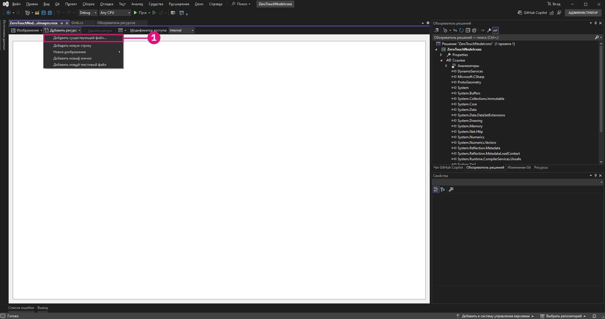
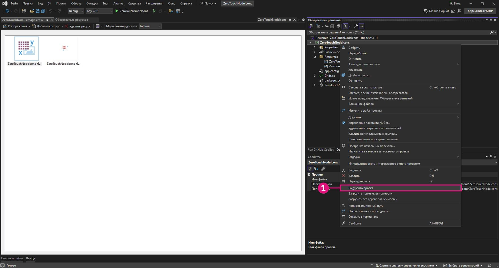

# 進階 Dynamo 節點自訂

我們已經具備 ZeroTouch 的基礎知識，本節將深入探討自訂 Dynamo 節點來增強功能和使用者體驗的優點。透過增加警告訊息、資訊訊息和自訂圖示等功能，您可以建立更直覺、資訊量更大、視覺上更吸引人的節點。這些自訂功能不僅能協助使用者瞭解潛在的問題或最佳化其工作流程，還能讓您的節點脫穎而出，成為專業且容易使用的工具。

自訂節點是一種絕佳方式，能確保您的解決方案清晰、可靠，專門為滿足特定專案需求而量身打造。

## 使用 OnLogWarningMessage 產生自訂警告訊息 <a href="#generating-custom-warning-messages-using-onlogwarningmessage" id="generating-custom-warning-messages-using-onlogwarningmessage"></a>

在 Dynamo 中，`OnLogWarningMessage` 方法提供一種將警告訊息直接記錄到 Dynamo 主控台的方法。這是一項強大的功能，尤其是對於 Zero Touch 節點，因為它允許開發人員在輸入或參數出現可能導致非預期行為的問題時提醒使用者。本指南將教您如何在任何 Zero Touch 節點中實施 `OnLogWarningMessage`。

### `OnLogWarningMessage` 的實施步驟 <a href="#implementation-step-for-onlogwarningmessage" id="implementation-step-for-onlogwarningmessage"></a>

#### 步驟 1：匯入所需的名稱空間 <a href="#import-the-required-namespace" id="import-the-required-namespace"></a>

`OnLogWarningMessage` 屬於 `DynamoServices` 名稱空間，因此請先將其加入專案檔。

```
using DynamoServices;
```

#### 步驟 2：找出何時記錄警告 <a href="#identify-when-to-log-warnings" id="identify-when-to-log-warnings"></a>

在加入警告訊息之前，請考慮方法中的邏輯：

* 哪些條件可能會導致不正確或意外的結果？
* 方法是否需要特定的輸入值或參數才能正確運作？

要檢查的條件範例：

* **超出範圍值** (例如 `if (inputValue < 0)`)。
* **空值或空集合** (例如 `if (list == null || list.Count == 0)`)。
* **資料類型不相符** (例如，檔案類型不受支援時)。

#### 步驟 3：使用 `OnLogWarningMessage` 記錄警告 <a href="#use-onlogwarningmessage-to-log-the-warning" id="use-onlogwarningmessage-to-log-the-warning"></a>

在偵測到可能導致問題的位置進行 `OnLogWarningMessage` 呼叫。當滿足條件時，記錄一則警告訊息，向使用者提供明確的指導意見。

### `OnLogWarningMessage` 的語法 <a href="#syntax-for-onlogwarningmessage" id="syntax-for-onlogwarningmessage"></a>

```
LogWarningMessageEvents.OnLogWarningMessage("Your warning message here.");
```

### `OnLogWarningMessage` 的範例實施 <a href="#example-implementations-of-onlogwarningmessage" id="example-implementations-of-onlogwarningmessage"></a>

為了實際示範 `OnLogWarningMessage`，下面是您在建置 Zero Touch 節點時可能會遇到的不同情境。

#### 範例 1：驗證數字輸入 <a href="#example-1-validating-numeric-inputs" id="example-1-validating-numeric-inputs"></a>

在此範例中，我們將以上一個「**Zero-Touch 案例研究 - 網格節點**」中建立的自訂節點為基礎；一個名為 `RectangularGrid` 的方法會根據 `xCount` 和 `yCount` 輸入產生矩形格線。我們將逐步測試某個輸入是否無效，然後使用 `OnLogWarningMessage` 記錄警告並停止處理。


##### 使用 `OnLogWarningMessage` 進行輸入驗證 <a href="#using-onlogwarningmessage-for-input-validation" id="using-onlogwarningmessage-for-input-validation"></a>

根據 `xCount` 和 `yCount` 產生格線時。在繼續操作之前，您希望確保兩個值都是正整數。

```
public static List<Rectangle> CreateGrid(int xCount, int yCount)
{
    // Check if xCount and yCount are positive
    if (xCount <= 0 || yCount <= 0)
    {
        LogWarningMessageEvents.OnLogWarningMessage("Grid count values must be positive integers.");
        return new List<Rectangle>();  // Return an empty list if inputs are invalid
    }
    // Proceed with grid creation...
}
```

在本範例中：

* **條件**：如果 `xCount` 或 `yCount` 小於或等於零。
* **訊息**：`"Grid count values must be positive integers."`

如果使用者輸入零或負值，將在 Dynamo 中顯示警告，以協助他們瞭解預期的輸入。 

現在我們知道運作方式，可以將其實施到 Grids 範例節點中：

```
using Autodesk.DesignScript.Geometry;
using DynamoServices;

namespace CustomNodes
{
    public class Grids
    {
        // The empty private constructor.
        // This will not be imported into Dynamo.
        private Grids() { }

        /// <summary>
        /// This method creates a rectangular grid from an X and Y count.
        /// </summary>
        /// <param name="xCount">Number of grid cells in the X direction</param>
        /// <param name="yCount">Number of grid cells in the Y direction</param>
        /// <returns>A list of rectangles</returns>
        /// <search>grid, rectangle</search>
        public static List<Rectangle> RectangularGrid(int xCount = 10, int yCount = 10)
        {
            // Check for valid input values
            if (xCount <= 0 || yCount <= 0)
            {
                // Log a warning message if the input values are invalid
                LogWarningMessageEvents.OnLogWarningMessage("Grid count values must be positive integers.");
                return new List<Rectangle>(); // Return an empty list if inputs are invalid
            }

            double x = 0;
            double y = 0;

            var pList = new List<Rectangle>();

            for (int i = 0; i < xCount; i++)
            {
                y++;
                x = 0;
                for (int j = 0; j < yCount; j++)
                {
                    x++;
                    Point pt = Point.ByCoordinates(x, y);
                    Vector vec = Vector.ZAxis();
                    Plane bP = Plane.ByOriginNormal(pt, vec);
                    Rectangle rect = Rectangle.ByWidthLength(bP, 1, 1);
                    pList.Add(rect);
                    Point cPt = rect.Center();
                }
            }

            return pList;
        }
    }
}
```

##### 範例 2：檢查空值或空集合 <a href="#example-2-checking-for-null-or-empty-collections" id="example-2-checking-for-null-or-empty-collections"></a>

如果您的方法需要一個點清單，但使用者傳入空白或空值清單，您可以使用 `OnLogWarningMessage` 通知他們有這個問題。


```
public static Polygon CreatePolygonFromPoints(List<Point> points)
{
    if (points == null || points.Count < 3)
    {
        LogWarningMessageEvents.OnLogWarningMessage("Point list cannot be null or have fewer than three points.");
        return null;  // Return null if the input list is invalid
    }
    // Proceed with polygon creation...
}
```

在本範例中：

* **條件**：如果 `points` 清單為空值或包含少於三個點。
* **訊息**：`"Point list cannot be null or have fewer than three points."`

這會警告使用者，他們需要傳入至少包含三個點的有效清單才能形成一個多邊形。

---

##### 範例 3：驗證檔案類型相容性 <a href="#example-3-verifying-file-type-compatibility" id="example-3-verifying-file-type-compatibility"></a>

如果是處理檔案路徑的節點，您可能希望確保只允許某些檔案類型。如果偵測到不支援的檔案類型，則記錄警告。


```
public static void ProcessFile(string filePath)
{
    if (!filePath.EndsWith(".csv"))
    {
        LogWarningMessageEvents.OnLogWarningMessage("Only CSV files are supported.");
        return;
    }
    // Proceed with file processing...
}
```

在本範例中：

* **條件**：如果檔案路徑不是以「.csv」結尾。
* **訊息**：`"Only CSV files are supported."`

這會警告使用者，確保他們傳入的是 CSV 檔，有助於防止出現與檔案格式不相容相關的問題。

## 使用 `OnLogInfoMessage` 新增資訊訊息 <a href="#adding-informational-messages-with-onloginfomessage" id="adding-informational-messages-with-onloginfomessage"></a>

在 Dynamo 中，`DynamoServices` 名稱空間中的 `OnLogInfoMessage` 可讓開發人員將資訊訊息直接記錄到 Dynamo 的主控台。這有助於確認運算成功、傳達進度或提供有關節點動作的其他見解。本指南將教您如何在任何 Zero Touch 節點中加入 `OnLogInfoMessage`，以增強回饋並改善使用者體驗。

### `OnLogInfoMessage` 的實施步驟 <a href="#implementation-steps-for-onloginfomessage" id="implementation-steps-for-onloginfomessage"></a>
#### 步驟 1：匯入所需的名稱空間 <a href="#step-1-import-the-required-namespace" id="step-1-import-the-required-namespace"></a>

`OnLogInfoMessage` 屬於 `DynamoServices` 名稱空間，因此請先將其加入專案檔。

#### 步驟 2：找出何時記錄資訊 <a href="#step-2-identify-when-to-log-information" id="step-2-identify-when-to-log-information"></a>

在加入資訊訊息之前，請考慮方法的用途：

* 動作完成後，要確認哪些資訊有用？
* 方法中是否有使用者可能想要瞭解的關鍵步驟或里程碑？

有用的確認範例：

* **完成訊息** (例如，當網格或模型完全建立好時)。
* **已處理資料的詳細資料** (例如，「已成功處理 10 個項目」)。
* **執行摘要** (例如，過程中使用的參數)。

#### 步驟 3：使用 `OnLogInfoMessage` 記錄資訊訊息 <a href="#step-3-use-onloginfomessage-to-log-informational-message" id="step-3-use-onloginfomessage-to-log-informational-message"></a>

在方法中有意義的點進行 `OnLogInfoMessage` 呼叫。發生關鍵步驟或完成動作時，記錄一則資訊訊息，向使用者更新發生的情況。

### `OnLogInfoMessage` 的語法 <a href="#syntax-for-onloginfomessage" id="syntax-for-onloginfomessage"></a>

```
LogWarningMessageEvents.OnLogInfoMessage("Your info message here.");
```

### `OnLogInfoMessage` 的範例實施 <a href="#example-implementations-of-onloginfomessage" id="example-implementations-of-onloginfomessage"></a>

以下是幾個不同情境，示範如何在 Zero Touch 節點中使用 `OnLogInfoMessage`。

#### 範例 1：驗證數字輸入 <a href="#example-1-validating-numeric-inputs" id="example-1-validating-numeric-inputs"></a>

在此範例中，我們將以上一個「**Zero-Touch 案例研究 - 網格節點**」中建立的自訂節點為基礎；一個名為 `RectangularGrid` 的方法會根據 `xCount` 和 `yCount` 輸入產生矩形格線。我們將逐步測試某個輸入是否無效，然後在節點完成其執行時使用 `OnLogInfoMessage` 提供資訊。


###### 使用 `OnLogInfoMessage` 進行輸入驗證 <a href="#using-onloginfomessage-for-unput-validation" id="using-onloginfomessage-for-unput-validation"></a>

根據 `xCount` 和 `yCount` 產生格線時。產生網格後，您希望透過記錄網格尺寸的資訊訊息來確認其建立完成。

```
public static List<Rectangle> CreateGrid(int xCount, int yCount)
{
    var pList = new List<Rectangle>();
    // Grid creation code here...

    // Confirm successful grid creation
    LogWarningMessageEvents.OnLogInfoMessage($"Successfully created a grid with dimensions {xCount}x{yCount}.");

    return pList;
}
```

在本範例中：

* **條件**：網格建立程序已經完成。
* **訊息**：`"Successfully created a grid with dimensions {xCount}x{yCount}."`

此訊息將通知使用者，網格已依指定方式建立，協助他們確認節點如預期般運作。

現在我們知道運作方式，可以將其實施到 Grids 範例節點中：

```
using Autodesk.DesignScript.Geometry;
using DynamoServices;

namespace CustomNodes
{
    public class Grids
    {
        // The empty private constructor.
        // This will not be imported into Dynamo.
        private Grids() { }

        /// <summary>
        /// This method creates a rectangular grid from an X and Y count.
        /// </summary>
        /// <param name="xCount">Number of grid cells in the X direction</param>
        /// <param name="yCount">Number of grid cells in the Y direction</param>
        /// <returns>A list of rectangles</returns>
        /// <search>grid, rectangle</search>
        public static List<Rectangle> RectangularGrid(int xCount = 10, int yCount = 10)
        {
            double x = 0;
            double y = 0;

            var pList = new List<Rectangle>();

            for (int i = 0; i < xCount; i++)
            {
                y++;
                x = 0;
                for (int j = 0; j < yCount; j++)
                {
                    x++;
                    Point pt = Point.ByCoordinates(x, y);
                    Vector vec = Vector.ZAxis();
                    Plane bP = Plane.ByOriginNormal(pt, vec);
                    Rectangle rect = Rectangle.ByWidthLength(bP, 1, 1);
                    pList.Add(rect);
                    Point cPt = rect.Center();
                }
            }

            // Log an info message indicating the grid was successfully created
            LogWarningMessageEvents.OnLogInfoMessage($"Successfully created a grid with dimensions {xCount}x{yCount}.");

            return pList;
        }
    }
}
```

#### 範例 2：提供資料計數資訊 <a href="#example-2-providing-data-count-information" id="example-2-providing-data-count-information"></a>

如果要建立處理點清單的節點，可能需要記錄成功處理的點數。這對於大型資料集非常有用。


```
public static List<Point> ProcessPoints(List<Point> points)
{
    var processedPoints = new List<Point>();
    foreach (var point in points)
    {
        // Process each point...
        processedPoints.Add(point);
    }

    // Log info about the count of processed points
    LogWarningMessageEvents.OnLogInfoMessage($"{processedPoints.Count} points were processed successfully.");

    return processedPoints;
}
```

在本範例中：

* **條件**：迴圈完成後，顯示已處理項目的計數。
* **訊息**：`"6 points were processed successfully."`

此訊息將協助使用者瞭解處理結果，並確認所有點都已處理。


#### 範例 3：彙總使用的參數 <a href="#example-3-summarizing-parameters-used" id="example-3-summarizing-parameters-used"></a>

在某些情況下，確認節點用於完成動作的輸入參數會很有用。例如，如果您的節點將資料匯出到某個檔案，則記錄檔名和路徑可以讓使用者放心使用了正確的檔案。


```
public static void ExportData(string filePath, List<string> data)
{
    // Code to write data to the specified file path...

    // Log the file path used for export
    LogWarningMessageEvents.OnLogInfoMessage($"Data exported successfully to {filePath}.");

}
```

在本範例中：

* **條件**：匯出程序成功完成。
* **訊息**：`"Data exported successfully to {filePath}."`

此訊息向使用者確認匯出已完成，並顯示確切的檔案路徑，可協助避免檔案位置混淆。

## 建立自訂文件並新增到節點

### 自訂節點文件
從歷史上看，套件作者如何在 Dynamo 中為其節點提供文件一直存在限制。自訂節點的作者受到限制，只允許在節點的工具提示中顯示簡短描述，或只允許在套件中加入大量註解的範例圖表。


### 一種新方式
Dynamo 現在為套件作者提供一套改進的系統，讓您可以為自訂節點提供更好、更清楚的文件。這種新方法利用友善的 Markdown 語言進行文字撰寫，並使用「文件瀏覽器」視圖延伸功能在 Dynamo 中顯示 Markdown。使用 Markdown 為套件作者在記錄自訂節點時提供多種新的可能性。 

#### 什麼是 Markdown？
Markdown 是一種輕量標記語言，可用於格式化純文字文件。Markdown 自 2004 年創造出來後，其受歡迎程度日益增加，現在已經是世界上其中一種最受歡迎的標記語言。

#### 開始使用 Markdown
開始製作 Markdown 檔案很容易 - 您只需要一個簡單的文字編輯器 (例如記事本)，就可以開始。但是，有比使用記事本更容易撰寫 Markdown 的方法。有幾個線上編輯器，例如 [Dillinger](https://dillinger.io/)，可讓您在撰寫時即時看到變更。另一種編輯 Markdown 檔案的常用方式，是使用程式碼編輯器，例如 [Visual Studio Code](https://code.visualstudio.com/)。

#### Markdown 能做什麼？
Markdown 非常靈活，可以提供足夠的功能來輕鬆建立良好的文件 - 這包括：增加媒體檔 (如影像或影片)，建立具有不同內容形式的表格，當然還有簡單的文字格式化功能，例如讓文字變成**粗體**或*斜體*。在撰寫 Markdown 文件時，可以獲得上述所有功能，甚至是更多功能。如需更多資訊，請查看本指南中的[基本 Markdown 語法](https://www.Markdownguide.org/basic-syntax/)。

### 在節點中新增延伸文件
在節點中新增文件非常容易。您可以將文件加到所有類型的自訂節點，包括：
* 現成的 Dynamo 節點
* 自訂節點 (.dyf) - 現成和/或其他套件節點的集合。
* 自訂 C# 套件節點 (也稱為 Zerotouch。這些自訂節點看起來像現成節點)
* NodeModel 節點 (包含特殊使用者介面功能 (如下拉式清單或選取按鈕) 的節點)
* 具有自訂使用者介面的 NodeModel 節點 (包含獨特的使用者介面功能 (如節點上有圖形) 的節點)

請按照以下幾個步驟，讓 Markdown 檔案顯示在 Dynamo 內。

#### 在 Dynamo 中開啟文件檔案
Dynamo 使用「文件瀏覽器」視圖延伸來顯示節點文件。若要開啟節點文件，請在節點上按一下右鍵，然後選取「說明」。這會開啟「文件瀏覽器」，並顯示與該節點關聯的 Markdown (如果有)。


「文件瀏覽器」中顯示的文件由兩個部分組成。第一個是「`Node Info`」部分，這是由節點中提取的資訊自動產生而成，例如輸入/輸出、節點品類、節點名稱/名稱空間和節點簡短描述。第二部分展示自訂節點文件，這是用來記錄節點的 Markdown 檔案。


#### 套件文件資料夾
若要將文件檔案加到 Dynamo 中的節點，請在套件目錄中建立一個名為 `/doc` 的新資料夾。載入套件後，Dynamo 會掃描此目錄，並取得當中所有的 文件 Markdown 檔案。

#### 命名 Markdown 檔案
為了確保 Dynamo 知道當要求時要為特定節點開啟哪個檔案，Markdown 檔案的命名必須依照特定格式。您的 Markdown 檔案應該根據其記錄的節點名稱空間來命名。如果您不確定節點的名稱空間為何，請查看「`Node Info`」部分，當您在節點上按「`Help`」時，在節點名稱下會看到所選節點的完整名稱空間。 

此名稱空間應該是該特定節點的 Markdown 檔案名稱。例如，上圖中 `CustomNodeExample` 的名稱空間是 `TestPackage.TestCategory.CustomNodeExample`，因此此節點的 Markdown 檔案應命名為 `TestPackage.TestCategory.CustomNodeExample.md`

在節點多載 (節點的名稱相同但輸入不同) 的特殊情況下，您必須在節點名稱空間之後的 `()` 加上輸入名稱。例如，內建節點 `Geometry.Translate` 有多個多載。在此案例中，我們會將以下節點的 Markdown 檔案命名為：`Autodesk.DesignScript.Geometry.Geometry.Translate(geometry,direction).md` `Autodesk.DesignScript.Geometry.Geometry.Translate(geometry,direction,distance).md`


#### 在 Dynamo 中開啟時修改 Markdown 檔案
為了方便修改文件檔案，「文件瀏覽器」對開啟的文件檔案實作一個「檔案監看器」。您可以對 Markdown 檔案進行變更，在 Dynamo 中會立即看到修改的內容。 


在 Dynamo 開啟時，也可以新增文件檔案。只要在 `/doc` 資料夾中新增一個 Markdown 檔案，其名稱對應到其記錄的節點即可。

## 將自訂圖示加入 Zero Touch 節點

### 概述

Dynamo 中 Zero Touch 節點的自訂圖示，可讓您的節點在視覺上與眾不同，也更容易在資源庫中辨識。透過增加自訂圖示，您可以讓節點脫穎而出，讓使用者在清單中快速識別。

本指南將向您展示如何將圖示加入 Zero Touch 節點。


### 新增自訂節點圖示的步驟

#### 步驟 1：設定專案

首先，為您的 Zero Touch 節點建立一個 Visual Studio 類別程式庫 (.NET Framework) 專案。如果您還沒有專案，請參閱**入門**一節，以取得建立專案的逐步指示。


請確保您至少有一個功能性的 Zero Touch 節點，因為只能將圖示加到既有節點中。如需指導意見，請參閱 **Zero Touch 案例研究 - 網格節點**。


#### 步驟 2：建立圖示影像

建立自訂圖示：

1. **設計圖示**：使用影像編輯器為節點建立簡單清晰的圖示。
2. **影像規格**：
    * **小圖示**：32x32 像素 (用於資源庫的側邊欄和節點本身)。
    * **大圖示**：128x128 像素 (將游標懸停在資源庫中的節點上時用於節點性質)。
3. **檔案命名慣例**：
    * 檔名必須符合以下格式，才能將其與正確的節點關聯：
        * **`<ProjectName>.<ClassName>.<MethodName>.Small.png`** (用於小圖示)。
        * **`<ProjectName>.<ClassName>.<MethodName>.Large.png`** (用於大圖示)。

**範例**：如果您的專案是 `ZeroTouchNodeIcons`，您的類別是 `Grids`，且您的方法是 `RectangularGrid`，則檔案將命名為：

* `ZeroTouchNodeIcons.Grids.RectangularGrid.Small.png`
* `ZeroTouchNodeIcons.Grids.RectangularGrid.Large.png`

> 秘訣：對所有圖示使用一致的設計主題，可賦予專業的觀感。


#### 步驟 3：將資源檔加到專案中

若要將圖示嵌入 `.dll` 中，請建立一個資源檔：

1. **新增資源檔**：

  * 在**「方案總管」**中以右鍵按一下您的專案。


  * 移至**「新增」>「新項目」**，然後選取**「資源檔」**。


  * 將檔案命名為 `<ProjectName>Images.resx`。例如 `ZeroTouchNodeIconsImages.resx`。

2. **清除自訂工具屬性**：
    * 在**「方案總管」**中選取資源檔。
    * 在**「屬性」**面板中，透過移除 `ResXFileCodeGenerator` 值來清除「`Custom Tool`」欄位。


> *注意：如果沒有清除「自訂工具」欄位，會導致 Visual Studio 將資源名稱中的句點轉換為底線。請在建置之前，確認您的資源名稱是以句點 (而不是底線) 分隔類別名稱。*


#### 步驟 4：將影像新增為資源

1. 使用**「受控資源編輯器 (舊版)」**開啟資源檔：
    * 如果使用 Visual Studio 17.11 或更高版本，請以右鍵按一下資源檔，選擇**「開啟方式」**，然後選取**「受控資源編輯器 (舊版)」**。
    * 如果使用 17.11 之前的 Visual Studio 版本，請按兩下資源檔以使用「資源編輯器」開啟 (在您的 Visual Studio 版本中，此編輯器尚未成為舊版)。


2. 新增您的影像：
    * 將影像檔拖放到編輯器中，或使用**「新增現有檔案」**選項。



3. 更新持續性：
    * 在「資源編輯器」中選取影像 (如果在「方案總管」中選取影像，此動作將沒有作用)，將**「屬性」**面板中的**「持續性」**屬性變更為「`Embedded in .resx`」。這可確保影像包含在 `.dll` 中。


#### 步驟 5：將專案轉換為 SDK 型

如果您的專案還不是 SDK 型 (嵌入資源需要)，請加以轉換：

1. 從 Visual Studio 的**「延伸模組」>「管理延伸模組」**功能表安裝 `.NET Upgrade Assistant` 延伸模組。


2. 在**「方案總管」**中的專案上按一下右鍵，然後選取**「升級」>「將專案轉換為 SDK 型」**。


3. 等待轉換完成。


#### 步驟 6：新增要嵌入資源的建置後指令碼

1. 卸載專案：
    * 在**「方案總管」**中的專案上按一下右鍵，然後選取**「卸載專案」**。



2. 編輯 `.csproj` 檔案：
    * 在 `</ItemGroup>` 和 `</Project>` 之間加入以下 `<Target>` 元素：

```
<Target Name="CreateNodeIcons" AfterTargets="PostBuildEvent">
		<!-- Get System.Drawing.dll     -->
		<GetReferenceAssemblyPaths TargetFrameworkMoniker=".NETFramework, Version=v4.8">
			<Output TaskParameter="FullFrameworkReferenceAssemblyPaths" PropertyName="FrameworkAssembliesPath" />
		</GetReferenceAssemblyPaths>
		<!-- Get assembly -->
		<GetAssemblyIdentity AssemblyFiles="$(OutDir)$(TargetName).dll">
			<Output TaskParameter="Assemblies" ItemName="AssemblyInfo" />
		</GetAssemblyIdentity>
		<!-- Generate customization dll -->
		<GenerateResource SdkToolsPath="$(TargetFrameworkSDKToolsDirectory)" UseSourcePath="true" Sources="$(ProjectDir)ZeroTouchNodeIconsImages.resx" OutputResources="$(ProjectDir)ZeroTouchNodeIconsImages.resources" References="$(FrameworkAssembliesPath)System.Drawing.dll" />
		<AL SdkToolsPath="$(TargetFrameworkSDKToolsDirectory)" TargetType="library" EmbedResources="$(ProjectDir)ZeroTouchNodeIconsImages.resources" OutputAssembly="$(OutDir)ZeroTouchNodeIcons.customization.dll" Version="%(AssemblyInfo.Version)" />
	</Target>
```

1. 將 `ZeroTouchNodeIcons` 的所有例證取代為您的專案名稱。
2. 重新載入專案：
    * 在已卸載的專案上按一下右鍵，然後選取**「重新載入專案」**。


#### 步驟 7：建置 .dll 並將其載入到 Dynamo

1. 建置專案：
    * 新增建置後指令碼後，在 Visual Studio 中建置專案。


2. 檢查輸出檔案：
    * 確保您的 `.dll` 和 `.customization.dll` 位於 `bin` 資料夾中。
3. 將 `.dll` 加入 Dynamo：
    * 在 Dynamo 中，使用「匯入資源庫」按鈕將 .dll 匯入到 Dynamo。


4. 您的自訂節點現在應該會與其各自的圖示一起顯示。