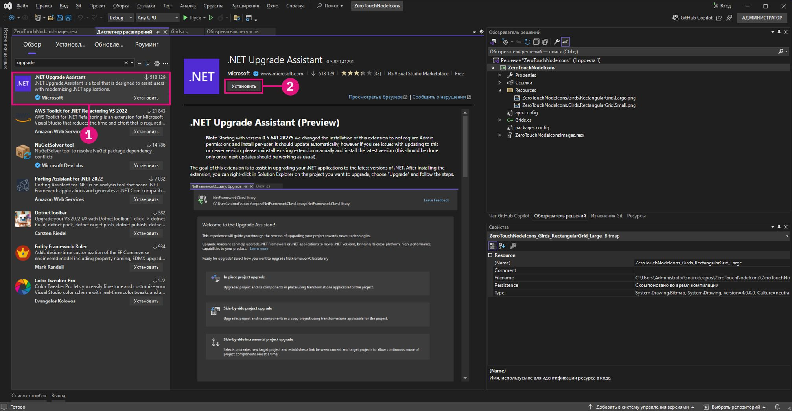

# Pokročilé přizpůsobení uzlů aplikace Dynamo

Se základními znalostmi ZeroTouch se v této části seznámíme s výhodami přizpůsobení uzlů aplikace Dynamo za účelem zlepšení funkčnosti i usnadnění práce uživatelům. Přidáním funkcí, jako jsou varovné zprávy, informační zprávy a vlastní ikony, můžete vytvářet uzly, které jsou intuitivnější, informativnější a vizuálně poutavější. Tato přizpůsobení nejen pomáhají uživatelům porozumět potenciálním problémům nebo optimalizovat jejich pracovní postupy, ale také díky nim vaše uzly vyniknou jako profesionální a uživatelsky přívětivé nástroje.

Přizpůsobení uzlů je vynikající způsob, jak zajistit, aby vaše řešení byla jasná, spolehlivá a přizpůsobená konkrétním potřebám projektu.

## Generování vlastních zpráv s upozorněním pomocí metody OnLogWarningMessage <a href="#generating-custom-warning-messages-using-onlogwarningmessage" id="generating-custom-warning-messages-using-onlogwarningmessage"></a>

Metoda `OnLogWarningMessage` v aplikaci Dynamo umožňuje protokolovat upozornění přímo do konzole aplikace Dynamo. Jedná se o velmi užitečnou funkci, zejména pro uzly Zero Touch, protože umožňuje vývojářům upozornit uživatele na problémy se vstupy nebo parametry, které by mohly vést k neočekávanému chování. V této příručce se dozvíte, jak implementovat metodu `OnLogWarningMessage` v libovolném uzlu Zero Touch.

### Postup implementace metody `OnLogWarningMessage` <a href="#implementation-step-for-onlogwarningmessage" id="implementation-step-for-onlogwarningmessage"></a>

#### Krok 1: Importujte požadovaný jmenný prostor <a href="#import-the-required-namespace" id="import-the-required-namespace"></a>

Metoda `OnLogWarningMessage` je součástí jmenného prostoru `DynamoServices`, takže začněte tím, že ji přidáte do souboru projektu.

```
using DynamoServices;
```

#### Krok 2: Určete, kdy protokolovat upozornění <a href="#identify-when-to-log-warnings" id="identify-when-to-log-warnings"></a>

Před přidáním zprávy s upozorněním zvažte logiku své metody:

* Jaké podmínky mohou způsobit nesprávné nebo neočekávané výsledky?
* Existují specifické vstupní hodnoty nebo parametry, které metoda vyžaduje ke správnému fungování?

Příklady podmínek ke kontrole:

* **Hodnoty mimo rozsah** (např. `if (inputValue < 0)`).
* **Kolekce s hodnotou null nebo prázdné kolekce ** (např. `if (list == null || list.Count == 0)`).
* **Neshody datových typů** (např. pokud typ souboru není podporován).

#### Krok 3: Použijte metodu `OnLogWarningMessage` k protokolování upozornění <a href="#use-onlogwarningmessage-to-log-the-warning" id="use-onlogwarningmessage-to-log-the-warning"></a>

Umístěte volání `OnLogWarningMessage` tam, kde zjistíte podmínky, které by mohly způsobit problémy. Pokud je splněna podmínka, zaprotokolujte zprávu s upozorněním, která uživateli poskytne jasné pokyny.

### Syntaxe pro metodu `OnLogWarningMessage` <a href="#syntax-for-onlogwarningmessage" id="syntax-for-onlogwarningmessage"></a>

```
LogWarningMessageEvents.OnLogWarningMessage("Your warning message here.");
```

### Příklady implementací metody `OnLogWarningMessage` <a href="#example-implementations-of-onlogwarningmessage" id="example-implementations-of-onlogwarningmessage"></a>

Pro demonstraci možností použití metody `OnLogWarningMessage` naleznete níže různé scénáře, se kterými se můžete setkat při vytváření uzlu Zero Touch.

#### Příklad 1: Ověření číselných vstupů <a href="#example-1-validating-numeric-inputs" id="example-1-validating-numeric-inputs"></a>

V tomto příkladu budeme vycházet z vlastního uzlu vytvořeném v předchozí části **Případová studie funkce Zero-Touch – uzel osnovy**; metody pojmenované `RectangularGrid`, která generuje osnovu obdélníků na základě vstupů `xCount` a `yCount`. Otestujeme, zda je vstup neplatný a pak pomocí metody `OnLogWarningMessage` zaprotokolujeme upozornění a zastavíme zpracování.


**Použití metody `OnLogWarningMessage` k ověření vstupu**

Chcete vygenerovat osnovu založenou na vstupech `xCount` a `yCount`. Než budete pokračovat, ujistěte se, že obě hodnoty jsou kladná celá čísla.

```
public static List<Rectangle> CreateGrid(int xCount, int yCount)
{
    // Check if xCount and yCount are positive
    if (xCount <= 0 || yCount <= 0)
    {
        LogWarningMessageEvents.OnLogWarningMessage("Grid count values must be positive integers.");
        return new List<Rectangle>();  // Return an empty list if inputs are invalid
    }
    // Proceed with grid creation...
}
```

V tomto příkladu:

* **Podmínka**: Pokud je hodnota `xCount` nebo `yCount` menší nebo rovna nule.
* **Zpráva**: `"Grid count values must be positive integers."`

Pokud uživatel zadá nulové nebo záporné hodnoty, zobrazí se v aplikaci Dynamo upozornění, které mu pomůže pochopit očekávaný vstup.

Když nyní víme, jak zprávu vytvořit, můžeme ji implementovat do ukázkového uzlu Grids:

```
using Autodesk.DesignScript.Geometry;
using DynamoServices;

namespace CustomNodes
{
    public class Grids
    {
        // The empty private constructor.
        // This will not be imported into Dynamo.
        private Grids() { }

        /// <summary>
        /// This method creates a rectangular grid from an X and Y count.
        /// </summary>
        /// <param name="xCount">Number of grid cells in the X direction</param>
        /// <param name="yCount">Number of grid cells in the Y direction</param>
        /// <returns>A list of rectangles</returns>
        /// <search>grid, rectangle</search>
        public static List<Rectangle> RectangularGrid(int xCount = 10, int yCount = 10)
        {
            // Check for valid input values
            if (xCount <= 0 || yCount <= 0)
            {
                // Log a warning message if the input values are invalid
                LogWarningMessageEvents.OnLogWarningMessage("Grid count values must be positive integers.");
                return new List<Rectangle>(); // Return an empty list if inputs are invalid
            }

            double x = 0;
            double y = 0;

            var pList = new List<Rectangle>();

            for (int i = 0; i < xCount; i++)
            {
                y++;
                x = 0;
                for (int j = 0; j < yCount; j++)
                {
                    x++;
                    Point pt = Point.ByCoordinates(x, y);
                    Vector vec = Vector.ZAxis();
                    Plane bP = Plane.ByOriginNormal(pt, vec);
                    Rectangle rect = Rectangle.ByWidthLength(bP, 1, 1);
                    pList.Add(rect);
                    Point cPt = rect.Center();
                }
            }

            return pList;
        }
    }
}
```

**Příklad 2: Kontrola prázdných kolekcí nebo kolekcí s hodnotou null**

Pokud vaše metoda vyžaduje seznam bodů, ale uživatel předá prázdný nebo nulový seznam, můžete ho o problému informovat pomocí metody `OnLogWarningMessage`.


```
public static Polygon CreatePolygonFromPoints(List<Point> points)
{
    if (points == null || points.Count < 3)
    {
        LogWarningMessageEvents.OnLogWarningMessage("Point list cannot be null or have fewer than three points.");
        return null;  // Return null if the input list is invalid
    }
    // Proceed with polygon creation...
}
```

V tomto příkladu:

* **Podmínka**: Pokud má seznam `points` hodnotu null nebo obsahuje méně než tři body.
* **Zpráva**: `"Point list cannot be null or have fewer than three points."`

Tato zpráva uživatele upozorní, že k vytvoření mnohoúhelníku je třeba předat platný seznam s alespoň třemi body.

***

**Příklad 3: Ověření kompatibility typů souborů**

U uzlu, který zpracovává cesty k souborům, můžete chtít zajistit, že budou povoleny pouze určité typy souborů. Pokud bude zjištěn nepodporovaný typ souboru, bude zaprotokolováno upozornění.


```
public static void ProcessFile(string filePath)
{
    if (!filePath.EndsWith(".csv"))
    {
        LogWarningMessageEvents.OnLogWarningMessage("Only CSV files are supported.");
        return;
    }
    // Proceed with file processing...
}
```

V tomto příkladu:

* **Podmínka**: Pokud cesta k souboru nekončí příponou .csv.
* **Zpráva**: `"Only CSV files are supported."`

Tato zpráva uživatele upozorňuje, aby se ujistili, že předávají soubor CSV, což pomáhá předcházet problémům souvisejícím s nekompatibilními formáty souborů.

## Přidávání informačních zpráv pomocí metody `OnLogInfoMessage` <a href="#adding-informational-messages-with-onloginfomessage" id="adding-informational-messages-with-onloginfomessage"></a>

Metoda `OnLogInfoMessage` z jmenného prostoru `DynamoServices` v aplikaci Dynamo umožňuje vývojářům protokolovat informační zprávy přímo do konzole aplikace Dynamo. To se hodí k potvrzování úspěšných operací, sdělování informací o průběhu nebo poskytování dalších přehledů o akcích uzlů. V této příručce se dozvíte, jak přidat metodu `OnLogInfoMessage` do libovolného uzlu Zero Touch, abyste zlepšili zpětnou vazbu a usnadnili uživatelům práci.

### Postup implementace metody `OnLogInfoMessage` <a href="#implementation-steps-for-onloginfomessage" id="implementation-steps-for-onloginfomessage"></a>

#### Krok 1: Importujte požadovaný jmenný prostor <a href="#step-1-import-the-required-namespace" id="step-1-import-the-required-namespace"></a>

Metoda `OnLogInfoMessage` je součástí jmenného prostoru `DynamoServices`, takže začněte tím, že ji přidáte do souboru projektu.

#### Krok 2: Určete, kdy protokolovat informace <a href="#step-2-identify-when-to-log-information" id="step-2-identify-when-to-log-information"></a>

Před přidáním informační zprávy se zamyslete nad účelem vaší metody:

* Jaké informace by bylo užitečné potvrdit po dokončení akce?
* Existují v rámci metody klíčové kroky nebo milníky, o kterých by uživatelé mohli chtít vědět?

Příklady užitečných potvrzení:

* **Zprávy o dokončení** (např. při úplném vytvoření osnovy nebo modelu).
* **Podrobnosti o zpracovávaných údajích** (např. „10 úspěšně zpracovaných položek“).
* **Souhrnné informace o provedení** (např. parametry použité v procesu).

#### Krok 3: Použijte metodu `OnLogInfoMessage` k protokolování informačních zpráv <a href="#step-3-use-onloginfomessage-to-log-informational-message" id="step-3-use-onloginfomessage-to-log-informational-message"></a>

Umístěte volání `OnLogInfoMessage` ve smysluplných bodech metody. V klíčovém kroku nebo při dokončení zaprotokolujte informační zprávu, která uživatele informuje o tom, co se stalo.

### Syntaxe pro metodu `OnLogInfoMessage` <a href="#syntax-for-onloginfomessage" id="syntax-for-onloginfomessage"></a>

```
LogWarningMessageEvents.OnLogInfoMessage("Your info message here.");
```

### Příklady implementací metody `OnLogInfoMessage` <a href="#example-implementations-of-onloginfomessage" id="example-implementations-of-onloginfomessage"></a>

Níže jsou uvedeny různé scénáře demonstrující použití metody `OnLogInfoMessage` v uzlech Zero Touch.

#### Příklad 1: Ověření číselných vstupů <a href="#example-1-validating-numeric-inputs" id="example-1-validating-numeric-inputs"></a>

V tomto příkladu budeme vycházet z vlastního uzlu vytvořeném v předchozí části **Případová studie funkce Zero-Touch – uzel osnovy**; metody pojmenované `RectangularGrid`, která generuje osnovu obdélníků na základě vstupů `xCount` a `yCount`. Otestujeme, zda je vstup neplatný a pak pomocí metody `OnLogInfoMessage` poskytneme informace po dokončení spuštění uzlu.


**Použití metody `OnLogInfoMessage` k ověření vstupu**

Chcete vygenerovat osnovu založenou na vstupech `xCount` a `yCount`. Po vygenerování osnovy chcete její vytvoření potvrdit zaprotokolováním informační zprávy s rozměry osnovy.

```
public static List<Rectangle> CreateGrid(int xCount, int yCount)
{
    var pList = new List<Rectangle>();
    // Grid creation code here...

    // Confirm successful grid creation
    LogWarningMessageEvents.OnLogInfoMessage($"Successfully created a grid with dimensions {xCount}x{yCount}.");

    return pList;
}
```

V tomto příkladu:

* **Podmínka**: Proces vytváření osnovy byl dokončen.
* **Zpráva**: `"Successfully created a grid with dimensions {xCount}x{yCount}."`

Tato zpráva uživatele informuje, že osnova byla vytvořena podle zadání, a pomůže jim potvrdit, že uzel fungoval podle očekávání.

Když nyní víme, jak zprávu vytvořit, můžeme ji implementovat do ukázkového uzlu Grids:

```
using Autodesk.DesignScript.Geometry;
using DynamoServices;

namespace CustomNodes
{
    public class Grids
    {
        // The empty private constructor.
        // This will not be imported into Dynamo.
        private Grids() { }

        /// <summary>
        /// This method creates a rectangular grid from an X and Y count.
        /// </summary>
        /// <param name="xCount">Number of grid cells in the X direction</param>
        /// <param name="yCount">Number of grid cells in the Y direction</param>
        /// <returns>A list of rectangles</returns>
        /// <search>grid, rectangle</search>
        public static List<Rectangle> RectangularGrid(int xCount = 10, int yCount = 10)
        {
            double x = 0;
            double y = 0;

            var pList = new List<Rectangle>();

            for (int i = 0; i < xCount; i++)
            {
                y++;
                x = 0;
                for (int j = 0; j < yCount; j++)
                {
                    x++;
                    Point pt = Point.ByCoordinates(x, y);
                    Vector vec = Vector.ZAxis();
                    Plane bP = Plane.ByOriginNormal(pt, vec);
                    Rectangle rect = Rectangle.ByWidthLength(bP, 1, 1);
                    pList.Add(rect);
                    Point cPt = rect.Center();
                }
            }

            // Log an info message indicating the grid was successfully created
            LogWarningMessageEvents.OnLogInfoMessage($"Successfully created a grid with dimensions {xCount}x{yCount}.");

            return pList;
        }
    }
}
```

#### Příklad 2: Poskytnutí informací o počtu dat <a href="#example-2-providing-data-count-information" id="example-2-providing-data-count-information"></a>

Pokud vytváříte uzel, který zpracovává seznam bodů, můžete chtít zaznamenat, kolik bodů bylo úspěšně zpracováno. To může být užitečné u velkých datových sad.


```
public static List<Point> ProcessPoints(List<Point> points)
{
    var processedPoints = new List<Point>();
    foreach (var point in points)
    {
        // Process each point...
        processedPoints.Add(point);
    }

    // Log info about the count of processed points
    LogWarningMessageEvents.OnLogInfoMessage($"{processedPoints.Count} points were processed successfully.");

    return processedPoints;
}
```

V tomto příkladu:

* **Podmínka**: Po dokončení smyčky se zobrazí počet zpracovaných položek.
* **Zpráva**: `"6 points were processed successfully."`

Tato zpráva pomůže uživatelům pochopit výsledek zpracování a potvrdí, že byly zpracovány všechny body.

#### Příklad 3: Souhrn použitých parametrů <a href="#example-3-summarizing-parameters-used" id="example-3-summarizing-parameters-used"></a>

V některých případech je užitečné potvrdit vstupní parametry, které uzel použil k dokončení akce. Pokud například uzel exportuje data do souboru, můžete zaprotokolováním názvu souboru a cesty uživatele ujistit, že byl použit správný soubor.


```
public static void ExportData(string filePath, List<string> data)
{
    // Code to write data to the specified file path...

    // Log the file path used for export
    LogWarningMessageEvents.OnLogInfoMessage($"Data exported successfully to {filePath}.");

}
```

V tomto příkladu:

* **Podmínka**: Proces exportu byl úspěšně dokončen.
* **Zpráva**: `"Data exported successfully to {filePath}."`

Tato zpráva uživatelům potvrdí, že export proběhl, a zobrazí přesnou cestu k souboru, aby nedocházelo k nejasnostem ohledně umístění souborů.

## Vytváření a přidávání vlastní dokumentace k uzlům

### Dokumentace k vlastním uzlům

V minulosti existovala v aplikaci Dynamo omezení, pokud jde o způsob, jakým mohli autoři balíčků poskytovat dokumentaci ke svým uzlům. Autoři vlastních uzlů mohli pouze zadat krátký popis, který se zobrazí v popisku uzlu, nebo dodat balíček s ukázkovými grafy s velkým množstvím poznámek.


### Nový způsob

Aplikace Dynamo nyní autorům balíčků nabízí vylepšený systém, který umožňuje poskytovat lepší a podrobnější dokumentaci k vlastním uzlům. Tento nový přístup využívá uživatelsky přívětivý jazyk Markdown pro psaní textu a rozšíření pohledu Prohlížeče dokumentace k zobrazení jazyka Markdown v aplikaci Dynamo. Použití jazyka Markdown poskytuje autorům balíčků širokou škálu nových možností při tvorbě dokumentace k vlastním uzlům.

#### Co je jazyk Markdown?

Markdown je odlehčený značkovací jazyk, který slouží k formátování textových dokumentů ve formátu prostého textu. Od roku 2004, kdy byl jazyk Markdown vytvořen, jeho popularita neustále roste a nyní je jedním z nejoblíbenějších značkovacích jazyků na světě.

#### Začínáme s jazykem Markdown

Vytváření souborů Markdown je snadné – potřebujete pouze jednoduchý textový editor, například Poznámkový blok, a můžete začít. Existují však jednodušší způsoby, jak psát v jazyce Markdown, než pomocí Poznámkového bloku. Existuje několik online editorů, jako je [Dillinger](https://dillinger.io/), které umožňují zobrazit změny v reálném čase, jakmile je provedete. Dalším oblíbeným způsobem úprav souborů Markdown je použití editoru kódu, jako je [Visual Studio Code](https://code.visualstudio.com/).

#### Jaké jsou možnosti jazyka Markdown?

Markdown je velmi flexibilní jazyk, který poskytuje dostatek funkcí pro snadnou tvorbu dobré dokumentace, a to včetně přidávání mediálních souborů, jako jsou obrázky nebo videa, vytváření tabulek s různými formami obsahu a samozřejmě jednoduché funkce formátování textu, jako je **tučné** písmo nebo _kurzíva_. To vše a mnohem více je možné při psaní dokumentů v jazyce Markdown. Další informace najdete v této příručce, v níž je popsána [základní syntaxe jazyka Markdown](https://www.markdownguide.org/basic-syntax/).

### Přidání rozšířené dokumentace k uzlům

Přidání dokumentace k uzlům je snadné. Dokumentaci lze přidat do všech variant vlastních uzlů, které zahrnují:

* Přednastavené uzly aplikace Dynamo.
* Vlastní uzly (.dyf) – kolekce předem připravených uzlů nebo uzlů jiných balíčků.
* Vlastní uzly balíčků v jazyce C#. (Označované také jako uzly Zero Touch. Tyto vlastní uzly vypadají jako předem připravené uzly.)
* Uzly NodeModel (uzly, které obsahují speciální funkce uživatelského rozhraní, například rozevírací seznamy nebo tlačítka výběru).
* Uzly NodeModel s vlastním uživatelským rozhraním (uzly, které obsahují jedinečné funkce uživatelského rozhraní, například grafiku na uzlu).

Postupujte podle následujících několika kroků, aby se soubory Markdown zobrazily v aplikaci Dynamo.

#### Otevírání souborů dokumentace v aplikaci Dynamo

Dynamo používá k zobrazení dokumentace uzlů rozšíření pohledu Prohlížeče dokumentace. Chcete-li otevřít dokumentaci uzlů, klikněte pravým tlačítkem na uzel a vyberte nápovědu. Tím se otevře Prohlížeč dokumentace a zobrazí se soubor Markdown přiřazený k danému uzlu, pokud je k dispozici.


Dokumentace zobrazená v Prohlížeči dokumentace se skládá ze dvou částí. První je část `Node Info`, která je automaticky generována z informací extrahovaných z uzlu, jako jsou vstupy/výstupy, kategorie uzlu, název/jmenný prostor uzlu a krátký popis uzlů. Druhá část zobrazuje dokumentaci vlastních uzlů, což je soubor Markdown, který je poskytován k dokumentaci uzlu.


#### Složka doc balíčku

Chcete-li přidat soubory dokumentace ke svým uzlům v aplikaci Dynamo, vytvořte v adresáři balíčku novou složku s názvem `/doc`. Po načtení balíčku Dynamo tento adresář prohledá a získá všechny soubory dokumentace v jazyce Markdown, které se v něm nacházejí.

#### Pojmenování souborů Markdown

Aby aplikace Dynamo poznala, který soubor má při požadavku na konkrétní uzel otevřít, musí být název souboru Markdown v určitém formátu. Soubor Markdown by měl být pojmenován podle jmenného prostoru uzlu, který dokumentuje. Pokud si nejste jisti jmenným prostorem uzlu, podívejte se po kliknutí na tlačítko `Help` na uzlu do části `Node Info` a pod názvem uzlu uvidíte celý jmenný prostor vybraného uzlu.

Tento jmenný prostor by měl být název souboru Markdown pro daný uzel. Například jmenný prostor uzlu `CustomNodeExample` z obrázků výše je `TestPackage.TestCategory.CustomNodeExample`, proto by měl být soubor Markdown pro tento uzel pojmenován jako `TestPackage.TestCategory.CustomNodeExample.md`

Ve speciálních případech s přetížením uzlů (uzly se stejným názvem, ale různými vstupy), budete nutné přidat názvy vstupů do `()` za jmenný prostor uzlu. Například vestavěný uzel `Geometry.Translate` má několik přetížení. V tomto případě bychom soubory Markdown pro níže uvedené uzly pojmenovali následujícím způsobem: `Autodesk.DesignScript.Geometry.Geometry.Translate(geometry,direction).md` `Autodesk.DesignScript.Geometry.Geometry.Translate(geometry,direction,distance).md`


#### Úpravy souborů Markdown při otevření v aplikaci Dynamo

Aby bylo možné soubory dokumentace snadno upravovat, implementuje Prohlížeč dokumentace do otevřeného souboru dokumentace nástroj pro sledování souboru. Díky tomu můžete provádět změny v souboru Markdown, přičemž tyto změny okamžitě uvidíte v aplikaci Dynamo.


Přidání nových souborů dokumentace lze provést i v případě, kdy je aplikace Dynamo otevřená. Jednoduše přidejte do složky `/doc` nový soubor Markdown s názvem odpovídajícím uzlu, který dokumentuje.

## Přidání vlastních ikon do uzlů Zero Touch

### Přehled

Díky vlastním ikonám uzlů Zero Touch budou vaše uzly v aplikaci Dynamo vizuálně rozlišitelné a snadněji rozpoznatelné v knihovně. Přidáním ikon na míru můžete své uzly odlišit od ostatních a umožnit uživatelům jejich rychlou identifikaci v seznamu.

V této příručce se dozvíte, jak přidat ikony do uzlů Zero Touch.

### Postup přidání vlastních ikon uzlů

#### Krok 1: Nastavte projekt

Začněte tím, že vytvoříte projekt knihovny tříd aplikace Visual Studio (.NET Framework) pro své uzly Zero Touch. Pokud projekt ještě nemáte, přečtěte si část **Začínáme**, ve které najdete podrobné pokyny k jeho vytvoření.


Ujistěte se, že máte alespoň jeden funkční uzel Zero Touch, protože ikony lze přidávat pouze do existujících uzlů. Pokyny najdete v části **Případová studie funkce Zero-Touch – uzel osnovy**.

#### Krok 2: Vytvořte obrázky ikon

Vytvoření vlastních ikon:

1. **Navrhněte své ikony**: Pomocí editoru obrázků vytvořte jednoduché a vizuálně zřetelné ikony uzlů.
2. **Specifikace obrázku**:
   * **Malá ikona**: 32×32 pixelů (používá se na bočním panelu knihovny a na samotném uzlu).
   * **Velká ikona**: 128×128 pixelů (používá se ve vlastnostech uzlu při umístění kurzoru nad uzel v knihovně).
3. **Konvence pojmenování souboru**:
   * Názvy souborů musí odpovídat níže uvedenému formátu, aby byly přiřazeny ke správnému uzlu:
     * **`<ProjectName>.<ClassName>.<MethodName>.Small.png`** (pro malou ikonu).
     * **`<ProjectName>.<ClassName>.<MethodName>.Large.png`** (pro velkou ikonu).

**Příklad**: Pokud je projekt `ZeroTouchNodeIcons`, třída je `Grids` a metoda je `RectangularGrid`, soubory by měly být pojmenovány následovně:

* `ZeroTouchNodeIcons.Grids.RectangularGrid.Small.png`
* `ZeroTouchNodeIcons.Grids.RectangularGrid.Large.png`

> Tip: U všech ikon zachovejte jednotný motiv designu, abyste dosáhli profesionálního vzhledu.

#### Krok 3: Přidejte soubor zdrojů do projektu

Pokud chcete vložit ikony do `.dll`, vytvořte soubor zdrojů:

1. **Přidejte nový soubor zdrojů**:

* Klikněte pravým tlačítkem myši na projekt v nástroji **Solution Explorer**.


* Přejděte do nabídky **Add > New Item** a vyberte možnost **Resources File**.


* Pojmenujte soubor jako `<ProjectName>Images.resx`. Příklad: `ZeroTouchNodeIconsImages.resx`.

2. **Zrušte zaškrtnutí vlastnosti Custom Tool**:
   * Vyberte soubor zdrojů v nástroji **Solution Explorer**.
   * Na panelu **Properties** vymažte pole `Custom Tool` odebráním hodnoty `ResXFileCodeGenerator`.


> _POZNÁMKA: Pokud se nepodaří vymazat pole Custom Tool, Visual Studio převede v názvech zdrojů tečky na podtržítka. Před sestavením ověřte, že názvy zdrojů mají tečky oddělující názvy tříd, nikoli podtržítka._

#### Krok 4: Přidejte obrázky jako zdroje

1. Otevřete soubor zdrojů pomocí nástroje **Managed Resources Editor (Legacy)**:
   * Pokud používáte aplikaci Visual Studio 17.11 nebo novější, klikněte pravým tlačítkem myši na soubor prostředků, zvolte **Open With** a vyberte položku **Managed Resources Editor (Legacy)**.
   * Pokud používáte verzi aplikace Visual Studio starší než 17.11, dvojím kliknutím na soubor zdrojů jej otevřete v nástroji Resources Editor (který ve vaší verzi aplikace Visual Studio ještě není starší verzí).


2. Přidejte obrázky:
   * Přetáhněte soubory obrázků do editoru nebo použijte možnost **Add Existing File**.


3. Aktualizace vlastnosti Persistence:
   * Vyberte obrázky v nástroji Resources Editor (pokud je vyberete v nástroji Solution Explorer, nebude to fungovat) a změňte vlastnost **Persistence** na panelu **Properties** na `Embedded in .resx`. Tím zajistíte, že obrázky budou zahrnuty do vaší knihovny `.dll`.


#### Krok 5: Převeďte projekt do stylu SDK

Pokud váš projekt ještě není ve stylu SDK (nutné pro vkládání prostředků), převeďte ho:

1. V aplikaci Visual Studio nainstalujte rozšíření `.NET Upgrade Assistant` z nabídky **Extensions > Manage Extensions**.




2. Klikněte pravým tlačítkem myši na projekt v nástroji **Solution Explorer** a vyberte možnost **Upgrade > Convert project to SDK-style**.


3. Počkejte na dokončení převodu.


#### Krok 6: Přidejte skript po sestavení pro vložení zdrojů

1. Uvolněte projekt:
   * Klikněte pravým tlačítkem myši na projekt v nástroji **Solution Explorer** a vyberte možnost **Unload Project**.


2. Upravte soubor `.csproj`:
   * Mezi `</ItemGroup>` a `</Project>` přidejte následující prvek `<Target>`:

```
<Target Name="CreateNodeIcons" AfterTargets="PostBuildEvent">
		<!-- Get System.Drawing.dll     -->
		<GetReferenceAssemblyPaths TargetFrameworkMoniker=".NETFramework, Version=v4.8">
			<Output TaskParameter="FullFrameworkReferenceAssemblyPaths" PropertyName="FrameworkAssembliesPath" />
		</GetReferenceAssemblyPaths>
		<!-- Get assembly -->
		<GetAssemblyIdentity AssemblyFiles="$(OutDir)$(TargetName).dll">
			<Output TaskParameter="Assemblies" ItemName="AssemblyInfo" />
		</GetAssemblyIdentity>
		<!-- Generate customization dll -->
		<GenerateResource SdkToolsPath="$(TargetFrameworkSDKToolsDirectory)" UseSourcePath="true" Sources="$(ProjectDir)ZeroTouchNodeIconsImages.resx" OutputResources="$(ProjectDir)ZeroTouchNodeIconsImages.resources" References="$(FrameworkAssembliesPath)System.Drawing.dll" />
		<AL SdkToolsPath="$(TargetFrameworkSDKToolsDirectory)" TargetType="library" EmbedResources="$(ProjectDir)ZeroTouchNodeIconsImages.resources" OutputAssembly="$(OutDir)ZeroTouchNodeIcons.customization.dll" Version="%(AssemblyInfo.Version)" />
	</Target>
```


1. Nahraďte všechny instance `ZeroTouchNodeIcons` názvem projektu.
2. Znovu načtěte projekt:
   * Klikněte pravým tlačítkem myši na uvolněný projekt a vyberte možnost **Reload Project**.


#### Krok 7: Sestavte svou knihovnu .dll a načtěte ji do aplikace Dynamo

1. Sestavení projektu:
   * Po přidání skriptu po sestavení sestavte projekt v aplikaci Visual Studio.


2. Kontrola výstupních souborů:
   * Ujistěte se, že vaše knihovny `.dll` a `.customization.dll` jsou ve složce `bin`.
3. Přidejte knihovnu `.dll` do aplikace Dynamo:
   * V aplikaci Dynamo importujte svou knihovnu .dll pomocí tlačítka Importovat knihovnu.


4. Vaše vlastní uzly by se nyní měly zobrazit s příslušnými ikonami.
