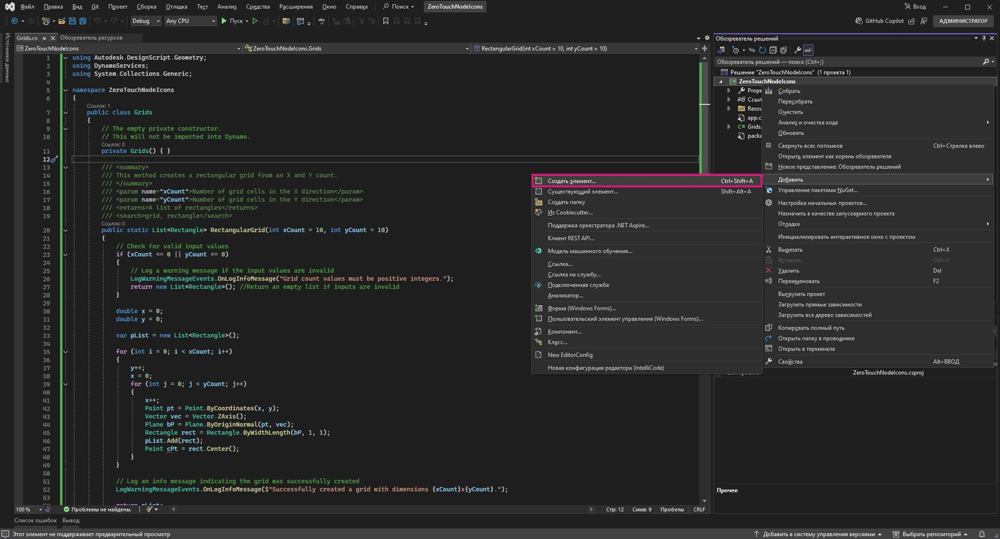

# Dynamo ノードの高度なカスタマイズ

Zero-Touch の基礎知識についてはすでに説明されているため、このセクションでは、機能性とユーザの操作性の両方を向上させるために、Dynamo ノードをカスタマイズする利点を詳しく説明します。警告メッセージ、情報メッセージ、カスタム アイコンなどの機能を追加することで、より直感的で情報量が多く、視覚的に魅力のあるノードを作成できます。カスタマイズすることにより、ユーザが潜在的な問題を理解したり、ワークフローを最適化したりするのに役立つだけではなく、ノードの専門性を際立たせたわかりやすいノードにすることができます。

ノードのカスタマイズは、ソリューションが明確で信頼性が高く、特定のプロジェクト ニーズを満たすように調整されていることを確認するための優れた方法です。

## OnLogWarningMessage を使用したカスタム警告メッセージを生成する <a href="#generating-custom-warning-messages-using-onlogwarningmessage" id="generating-custom-warning-messages-using-onlogwarningmessage"></a>

Dynamo では、`OnLogWarningMessage` メソッドは、警告メッセージを Dynamo のコンソールのログに直接記録する手段を提供します。これは、予期しない動作につながる可能性のある入力やパラメータに問題があるときに、開発者がユーザに警告できるため、特に Zero-Touch ノードにとって強力な機能です。このガイドでは、任意の Zero-Touch ノードに `OnLogWarningMessage` を実装する方法について説明します。

### `OnLogWarningMessage` の実装手順 <a href="#implementation-step-for-onlogwarningmessage" id="implementation-step-for-onlogwarningmessage"></a>

#### 手順 1: 必要な名前空間を読み込む <a href="#import-the-required-namespace" id="import-the-required-namespace"></a>

`OnLogWarningMessage` は `DynamoServices` 名前空間の一部であるため、まずプロジェクト ファイルに追加するところから始めます。

```
using DynamoServices;
```

#### 手順 2: 警告をログに記録するタイミングを特定する <a href="#identify-when-to-log-warnings" id="identify-when-to-log-warnings"></a>

警告メッセージを追加する前に、メソッド内のロジックを検討します。

* どのような条件で、不正確または予期しない結果が生じる可能性が生じるか。
* メソッドが正しく機能するために必要な特定の入力値またはパラメータは存在するか。

確認する条件の例:

* **範囲外の値**(例: `if (inputValue < 0)`)。
* **null または空のコレクション**(例: `if (list == null || list.Count == 0)`)。
* **データ タイプの不一致**(ファイルの種類がサポートされていない場合など)。

#### 手順 3: `OnLogWarningMessage` を使用して警告をログに記録する <a href="#use-onlogwarningmessage-to-log-the-warning" id="use-onlogwarningmessage-to-log-the-warning"></a>

問題を引き起こす可能性のある条件を検出する `OnLogWarningMessage` 呼び出しを実行します。条件が満たされた場合、ユーザに明確なガイダンスを提供する警告メッセージをログに記録します。

### `OnLogWarningMessage` の構文 <a href="#syntax-for-onlogwarningmessage" id="syntax-for-onlogwarningmessage"></a>

```
LogWarningMessageEvents.OnLogWarningMessage("Your warning message here.");
```

### `OnLogWarningMessage` の実装例 <a href="#example-implementations-of-onlogwarningmessage" id="example-implementations-of-onlogwarningmessage"></a>

実際の `OnLogWarningMessage` の動作を示すために、ここで Zero-Touch ノードをビルドする際に遭遇する可能性のあるさまざまなシナリオを示します。

#### 例 1: 数値入力の検証 <a href="#example-1-validating-numeric-inputs" id="example-1-validating-numeric-inputs"></a>

この例では、以前の「**Zero-Touch ケース スタディ - グリッド ノード**」で作成したカスタム ノードに基づいてビルドします。`xCount` 入力と `yCount` 入力に基づいて長方形のグリッドを生成する `RectangularGrid` という名前のメソッドです。入力が無効かどうかをテストし、次に `OnLogWarningMessage` を使用して警告をログに記録し、処理を停止する手順を説明します。


**入力の検証に `OnLogWarningMessage` を使用する**

`xCount` と `yCount` に基づいてグリッドを生成する場合です。続行する前に、両方の値が正の整数であることを確認します。

```
public static List<Rectangle> CreateGrid(int xCount, int yCount)
{
    // Check if xCount and yCount are positive
    if (xCount <= 0 || yCount <= 0)
    {
        LogWarningMessageEvents.OnLogWarningMessage("Grid count values must be positive integers.");
        return new List<Rectangle>();  // Return an empty list if inputs are invalid
    }
    // Proceed with grid creation...
}
```

この例の場合は、次のようになります。

* **条件**: `xCount` または `yCount` が 0 以下の場合。
* **メッセージ**: `"Grid count values must be positive integers."`

これにより、ユーザーがゼロまたは負の値を入力した場合に Dynamo に警告が表示され、必要な入力を理解しやすくなります。

ここで、Grids サンプル ノードの実装に進みます。

```
using Autodesk.DesignScript.Geometry;
using DynamoServices;

namespace CustomNodes
{
    public class Grids
    {
        // The empty private constructor.
        // This will not be imported into Dynamo.
        private Grids() { }

        /// <summary>
        /// This method creates a rectangular grid from an X and Y count.
        /// </summary>
        /// <param name="xCount">Number of grid cells in the X direction</param>
        /// <param name="yCount">Number of grid cells in the Y direction</param>
        /// <returns>A list of rectangles</returns>
        /// <search>grid, rectangle</search>
        public static List<Rectangle> RectangularGrid(int xCount = 10, int yCount = 10)
        {
            // Check for valid input values
            if (xCount <= 0 || yCount <= 0)
            {
                // Log a warning message if the input values are invalid
                LogWarningMessageEvents.OnLogWarningMessage("Grid count values must be positive integers.");
                return new List<Rectangle>(); // Return an empty list if inputs are invalid
            }

            double x = 0;
            double y = 0;

            var pList = new List<Rectangle>();

            for (int i = 0; i < xCount; i++)
            {
                y++;
                x = 0;
                for (int j = 0; j < yCount; j++)
                {
                    x++;
                    Point pt = Point.ByCoordinates(x, y);
                    Vector vec = Vector.ZAxis();
                    Plane bP = Plane.ByOriginNormal(pt, vec);
                    Rectangle rect = Rectangle.ByWidthLength(bP, 1, 1);
                    pList.Add(rect);
                    Point cPt = rect.Center();
                }
            }

            return pList;
        }
    }
}
```

**例 2: null または空のコレクションを確認する**

点のリストが必要なメソッドであるにも関わらず、ユーザが空または null のリストを渡した場合は、`OnLogWarningMessage` を使用して問題を通知できます。


```
public static Polygon CreatePolygonFromPoints(List<Point> points)
{
    if (points == null || points.Count < 3)
    {
        LogWarningMessageEvents.OnLogWarningMessage("Point list cannot be null or have fewer than three points.");
        return null;  // Return null if the input list is invalid
    }
    // Proceed with polygon creation...
}
```

この例の場合は、次のようになります。

* **条件**: `points` リストが null または含まれる点が 3 つ未満の場合。
* **メッセージ**: `"Point list cannot be null or have fewer than three points."`

これは、ポリゴンを形成するには少なくとも 3 つの点を含む有効なリストを渡す必要があることをユーザに警告しています。

***

**例 3: ファイル タイプの互換性を検証する**

ファイル・パスを処理するノードでは、特定のファイル・タイプのみが許可されるようにしたい場合があります。サポートされていないファイル タイプが検出された場合は、警告をログに記録します。


```
public static void ProcessFile(string filePath)
{
    if (!filePath.EndsWith(".csv"))
    {
        LogWarningMessageEvents.OnLogWarningMessage("Only CSV files are supported.");
        return;
    }
    // Proceed with file processing...
}
```

この例の場合は、次のようになります。

* **条件**: ファイル パスが「.csv」で終わらない場合。
* **メッセージ**: `"Only CSV files are supported."`

これにより、CSV ファイルを確実に渡すようにユーザに警告し、互換性のないファイル形式に関連する問題を防ぐことができます。

## `OnLogInfoMessage` による情報メッセージを追加する <a href="#adding-informational-messages-with-onloginfomessage" id="adding-informational-messages-with-onloginfomessage"></a>

Dynamo では、`DynamoServices` 名前空間の `OnLogInfoMessage` により、開発者は情報メッセージを Dynamo のコンソールに直接記録できます。これは、操作が成功したことの確認、進行状況の伝達、またはノード アクションに関する追加の分析情報の提供に役立ちます。このガイドでは、Zero-Touch ノードに `OnLogInfoMessage` を追加してフィードバックを強化し、ユーザの操作性を向上させる方法を説明します。

### `OnLogInfoMessage` の実装手順 <a href="#implementation-steps-for-onloginfomessage" id="implementation-steps-for-onloginfomessage"></a>

#### 手順 1: 必要な名前空間を読み込む <a href="#step-1-import-the-required-namespace" id="step-1-import-the-required-namespace"></a>

`OnLogInfoMessage` は `DynamoServices` 名前空間の一部であるため、まずプロジェクト ファイルに追加するところから始めます。

#### 手順 2: 情報をログに記録するタイミングを特定する <a href="#step-2-identify-when-to-log-information" id="step-2-identify-when-to-log-information"></a>

情報メッセージを追加する前に、メソッドの目的について検討します。

* アクションが完了後に確認すると役立つ情報とは何か。
* ユーザが知りたいと思うような重要な手順やマイルストーンがメソッド内に存在するか。

役立つ確認の例:

* **完了メッセージ**(例: グリッドまたはモデルが完全に作成されたとき)。
* **処理されたデータの詳細**(例:「10 項目が正常に処理されました」)。
* **実行の要約**(例: プロセスで使用されたパラメータ)。

#### 手順 3: `OnLogInfoMessage` を使用して情報メッセージをログに記録する <a href="#step-3-use-onloginfomessage-to-log-informational-message" id="step-3-use-onloginfomessage-to-log-informational-message"></a>

メソッド内の意味のあるポイントに `OnLogInfoMessage` 呼び出しを実行します。主要な手順または完了が発生したら、何が起こったかをユーザに知らせるために情報メッセージをログに記録します。

### `OnLogInfoMessage` の構文 <a href="#syntax-for-onloginfomessage" id="syntax-for-onloginfomessage"></a>

```
LogWarningMessageEvents.OnLogInfoMessage("Your info message here.");
```

### `OnLogInfoMessage` の実装例 <a href="#example-implementations-of-onloginfomessage" id="example-implementations-of-onloginfomessage"></a>

ここでは、Zero-Touch ノードで `OnLogInfoMessage` を使用する際の異なるシナリオを示します。

#### 例 1: 数値入力の検証 <a href="#example-1-validating-numeric-inputs" id="example-1-validating-numeric-inputs"></a>

この例では、以前の「**Zero-Touch ケース スタディ - グリッド ノード**」で作成したカスタム ノードに基づいてビルドします。`xCount` 入力と `yCount` 入力に基づいて長方形のグリッドを生成する `RectangularGrid` という名前のメソッドです。入力が無効かどうかをテストし、ノードの実行が完了した後に、`OnLogInfoMessage` を使用して情報を提供する方法について説明します。


**入力の検証に `OnLogInfoMessage` を使用する**

`xCount` と `yCount` に基づいてグリッドを生成する場合です。グリッドを生成した後、グリッドの寸法を含む情報メッセージをログに記録して、グリッドの作成を確認します。

```
public static List<Rectangle> CreateGrid(int xCount, int yCount)
{
    var pList = new List<Rectangle>();
    // Grid creation code here...

    // Confirm successful grid creation
    LogWarningMessageEvents.OnLogInfoMessage($"Successfully created a grid with dimensions {xCount}x{yCount}.");

    return pList;
}
```

この例の場合は、次のようになります。

* **条件**: グリッドの作成処理が完了している。
* **メッセージ**: `"Successfully created a grid with dimensions {xCount}x{yCount}."`

このメッセージで、グリッドが指定どおりに作成されたことをユーザに通知し、ノードが想定どおりに機能したことを確認することができます。

ここで、Grids サンプル ノードの実装に進みます。

```
using Autodesk.DesignScript.Geometry;
using DynamoServices;

namespace CustomNodes
{
    public class Grids
    {
        // The empty private constructor.
        // This will not be imported into Dynamo.
        private Grids() { }

        /// <summary>
        /// This method creates a rectangular grid from an X and Y count.
        /// </summary>
        /// <param name="xCount">Number of grid cells in the X direction</param>
        /// <param name="yCount">Number of grid cells in the Y direction</param>
        /// <returns>A list of rectangles</returns>
        /// <search>grid, rectangle</search>
        public static List<Rectangle> RectangularGrid(int xCount = 10, int yCount = 10)
        {
            double x = 0;
            double y = 0;

            var pList = new List<Rectangle>();

            for (int i = 0; i < xCount; i++)
            {
                y++;
                x = 0;
                for (int j = 0; j < yCount; j++)
                {
                    x++;
                    Point pt = Point.ByCoordinates(x, y);
                    Vector vec = Vector.ZAxis();
                    Plane bP = Plane.ByOriginNormal(pt, vec);
                    Rectangle rect = Rectangle.ByWidthLength(bP, 1, 1);
                    pList.Add(rect);
                    Point cPt = rect.Center();
                }
            }

            // Log an info message indicating the grid was successfully created
            LogWarningMessageEvents.OnLogInfoMessage($"Successfully created a grid with dimensions {xCount}x{yCount}.");

            return pList;
        }
    }
}
```

#### 例 2: データ カウント情報を提供する <a href="#example-2-providing-data-count-information" id="example-2-providing-data-count-information"></a>

点のリストを処理するノードを作成するときに、正常に処理された点の数をログに記録したい場合があります。これは、大規模なデータセットに役立ちます。


```
public static List<Point> ProcessPoints(List<Point> points)
{
    var processedPoints = new List<Point>();
    foreach (var point in points)
    {
        // Process each point...
        processedPoints.Add(point);
    }

    // Log info about the count of processed points
    LogWarningMessageEvents.OnLogInfoMessage($"{processedPoints.Count} points were processed successfully.");

    return processedPoints;
}
```

この例の場合は、次のようになります。

* **条件**: ループが完了した後、処理された項目の数を表示する。
* **メッセージ**: `"6 points were processed successfully."`

このメッセージは、ユーザが処理の結果を理解し、すべての点が処理されたことを確認するのに役立ちます。

#### 例 3: 使用されたパラメータを要約する <a href="#example-3-summarizing-parameters-used" id="example-3-summarizing-parameters-used"></a>

場合によっては、ノードがアクションを完了するために使用した入力パラメータを確認すると有効なことがあります。たとえば、ノードがデータをファイルにエクスポートする場合、ファイル名とパスをログに記録することで、正しいファイルが使用されたことをユーザに知らせることができます。


```
public static void ExportData(string filePath, List<string> data)
{
    // Code to write data to the specified file path...

    // Log the file path used for export
    LogWarningMessageEvents.OnLogInfoMessage($"Data exported successfully to {filePath}.");

}
```

この例の場合は、次のようになります。

* **条件**: エクスポート処理が正常に完了している。
* **メッセージ**: `"Data exported successfully to {filePath}."`

このメッセージは、エクスポートが機能したことをユーザに知らせて正確なファイル パスを表示するため、ファイルの場所に関する混乱を避けることができます。

## カスタム ドキュメントを作成してノードに追加する

### カスタム ノードのドキュメント

これまで、Dynamo では、パッケージ作成者がノードのドキュメントを提供する方法に制限がありました。カスタム ノードの作成者は、ノードのツールチップに表示する簡単な説明のみが許可されていたり、大量の注釈が付いたサンプル グラフを含むパッケージを出荷するように制限されていました。


### 新しい方式

Dynamo のシステムが改善され、パッケージ作成者はカスタム ノードに関してより適切で詳細なドキュメントを提供できるようになりました。この新しいアプローチでは、テキストのオーサリングに使いやすい Markdown 言語を使用し、Dynamo で Markdown を表示するためのドキュメント ブラウザのビュー拡張機能を利用します。Markdown を使用すると、パッケージ作成者はカスタム ノードをドキュメント化する際の可能性が広がります。

#### Markdown とは?

Markdown は、プレーンテキスト ドキュメントの書式設定に使用できる軽量のマークアップ言語です。Markdown が 2004 年に作成されて以来、その人気は高まり続け、現在では世界で最も人気のあるマークアップ言語の 1 つとなっています。

#### Markdown を使用するには

Markdown ファイルの作成を開始するのは簡単です。準備に必要なのはメモ帳などのシンプルなテキスト エディタのみです。ただし、メモ帳を使用するよりも簡単な Markdown の記述方法があります。[Dillinger](https://dillinger.io/) などのオンライン エディタを使用すると、変更しながらリアルタイムでその内容を確認できます。Markdown ファイルを編集するもう 1 つの一般的な方法は、[Visual Studio Code](https://code.visualstudio.com/) などのコード エディタを使用することです。

#### Markdown で何ができるか

Markdown は非常に柔軟性が高く、優れたドキュメントを簡単に作成するのに十分な機能を備えています。画像やビデオなどのメディア ファイルの追加や、さまざまな形式のコンテンツを含むテーブルの作成が可能です。もちろん、テキストに**太字**や_斜体_の書式を設定するシンプルな機能もあります。Markdown ドキュメントを記述する際は、これらすべて、およびさらに多くのことができますが、詳細については、[基本的な Markdown 構文](https://www.markdownguide.org/basic-syntax/)を説明しているこちらのガイドをご覧ください。

### ノードに拡張ドキュメントを追加する

ノードにドキュメントを追加するのは簡単です。ドキュメントは、すべての種類のカスタム ノードに追加可能で、以下の内容に対応します。

* すぐに使用できる Dynamo ノード。
* カスタム ノード(.dyf) - すぐに使用できるノードやその他のパッケージ ノードのコレクション。
* カスタム C# パッケージ ノード(Zero-Touch とも呼ばれます。これらのカスタム ノードは、初期設定のままのノードと同様に見えます)。
* NodeModel ノード(ドロップ ダウンや選択ボタンなどの特殊な UI 機能を含むノード)。
* カスタム UI を持つ NodeModel ノード(ノード上のグラフィックスなど固有の UI 機能を含むノード)。

Markdown ファイルを Dynamo 内に表示するには、次の手順に従います。

#### Dynamo でドキュメント ファイルを開く

Dynamo では、ドキュメント ブラウザのビュー拡張機能を使用してノード ドキュメントを表示します。ノードのドキュメントを開くには、ノードを右クリックして[ヘルプ]を選択します。これによりドキュメント ブラウザが開き、そのノードに関連付けられている Markdown があれば表示されます。


ドキュメント ブラウザに表示されるドキュメントは 2 つの部分から構成されています。1 つ目は `Node Info` セクションで、入力/出力、ノード カテゴリ、ノード名/名前空間、ノードの簡単な説明など、ノードから抽出された情報から自動生成されます。2 つ目には、ノードをドキュメント化するために提供される Markdown ファイルであるカスタム ノードのドキュメントが表示されます。


#### パッケージのドキュメント フォルダ

Dynamo のノードにドキュメント ファイルを追加するには、パッケージ フォルダに `/doc` という名前の新しいフォルダを作成します。パッケージがロードされると、Dynamo によってこのフォルダがスキャンされ、すべてのドキュメントの Markdown ファイルが取得されます。

#### Markdown ファイルに名前を付ける

特定のノードに対して要求されたときに開くファイルを Dynamo が認識できるようにするには、Markdown ファイルに特定の形式で名前を付ける必要があります。Markdown ファイルには、ドキュメント化されたノードの名前空間に従って名前を付ける必要があります。ノードの名前空間が不明な場合は、ノード上で `Help` を押して `Node Info` セクションを開きます。ノード名の下に、選択したノードの完全な名前空間が表示されます。

この名前空間は、その特定のノードの Markdown ファイルの名前です。たとえば、上の画像の `CustomNodeExample` の名前空間は `TestPackage.TestCategory.CustomNodeExample` であるため、このノードの Markdown ファイルの名前は `TestPackage.TestCategory.CustomNodeExample.md` になります。

ノード(同じ名前で入力が異なるノード)のオーバーロードがあるといった特殊なケースにおいては、ノードの名前空間の後に入力名を `()` で囲んで追加する必要があります。たとえば、組み込みノード `Geometry.Translate` に複数のオーバーロードがあるとします。この場合、以下に示すノードの Markdown ファイルの名前は次のようになります。`Autodesk.DesignScript.Geometry.Geometry.Translate(geometry,direction).md` `Autodesk.DesignScript.Geometry.Geometry.Translate(geometry,direction,distance).md`


#### Dynamo で Markdown ファイルを開いているときに修正する

ドキュメント ファイルを簡単に変更できるように、ドキュメント ブラウザには、開いているドキュメント ファイルに対するファイル ウォッチャーが実装されています。これにより、Markdown ファイルに変更を加え、その変更を Dynamo ですぐに確認できます。


新しいドキュメント ファイルの追加は、Dynamo が開いているときにも行うことができます。新しい Markdown ファイルを `/doc` フォルダに追加し、ドキュメント化されたノードに対応する名前を付けるだけです。

## Zero-Touch ノードにカスタム アイコンを追加する

### 概要

Dynamo の Zero-Touch ノードのカスタム アイコンを使用すると、ノードを視覚的に区別し、ライブラリで認識しやすくなります。カスタムのアイコンを追加することで、ノードを他のノードよりも目立たせることができ、ユーザはリストでノードをすばやく識別できるようになります。

このガイドでは、Zero-Touch ノードにアイコンを追加する方法について説明します。

### カスタム ノード アイコンを追加する手順

#### 手順 1: プロジェクトを設定する

まず、Zero-Touch ノード用の Visual Studio クラス ライブラリ(.NET Framework)プロジェクトを作成します。プロジェクトがまだ作成されていない場合は、「**スタートアップ**」セクションを参照して、プロジェクトを作成するための手順ごとの説明を確認してください。


アイコンは既存のノードにのみ追加できるため、機能する Zero-Touch ノードが少なくとも 1 つあることを確認してください。ガイダンスについては、「**Zero-Touch ケース スタディ - グリッド ノード**」を参照してください。

#### 手順 2: アイコン画像を作成する

カスタム アイコンを作成する手順は次のとおりです。

1. **アイコンを設計する**: 画像エディタを使用して、シンプルで視覚的にわかりやすいノードのアイコンを作成します。
2. **画像の仕様**:
   * **小さいアイコン**: 32 x 32 ピクセル(ライブラリのサイドバーとノード自体で使用)。
   * **大きいアイコン**: 128 x 128 ピクセル(ライブラリ内のノードにカーソルを合わせる際にノード プロパティで使用)。
3. **ファイル命名規則**:
   * ファイル名を正しいノードに関連付けるには、ファイル名が次の形式と一致している必要があります。
     * **`<ProjectName>.<ClassName>.<MethodName>.Small.png`** (小さいアイコンの場合)。
     * **`<ProjectName>.<ClassName>.<MethodName>.Large.png`** (大きいアイコンの場合)。

**例**: プロジェクトが `ZeroTouchNodeIcons`、クラスが `Grids`、メソッドが `RectangularGrid` の場合、ファイル名は次のようになります。

* `ZeroTouchNodeIcons.Grids.RectangularGrid.Small.png`
* `ZeroTouchNodeIcons.Grids.RectangularGrid.Large.png`

> ヒント: 専門性の高い外観にするには、すべてのアイコンで一貫した設計テーマを使用してください。

#### 手順 3: プロジェクトにリソース ファイルを追加する

アイコンを `.dll` に埋め込むには、リソース ファイルを作成します。

1. **新しいリソース ファイルを追加する**:

* [**ソリューション エクスプローラ**]でプロジェクトを右クリックします。



* **[追加] > [新規アイテム]** に移動し、[ **リソース ファイル** ]を選択します。


* ファイル名を `<ProjectName>Images.resx` にします。たとえば、`ZeroTouchNodeIconsImages.resx` などです。

2. **カスタム ツールのプロパティをクリア**する:
   * [**ソリューション エクスプローラ**]でリソース ファイルを選択します。
   * [**プロパティ**]パネルで、`ResXFileCodeGenerator` 値を削除して `Custom Tool` フィールドをクリアします。


> _注: [カスタム ツール]フィールドをクリアしないと、Visual Studio によってリソース名のピリオドがアンダースコアに変換されます。ビルドする前に、リソース名にアンダースコアではなくクラス名を区切るピリオドが含まれていることを確認してください。_

#### 手順 4: 画像をリソースとして追加する

1. [**リソース エディタを管理（旧式)**]を使用してリソース ファイルを開きます。
   * Visual Studio 17.11 以降を使用している場合は、リソース ファイルを右クリックし、[**開く**]を選択し、[**リソース エディタを管理(旧式)**]を選択します。
   * 17.11 より前のバージョンの Visual Studio を使用している場合は、リソース ファイルをダブル クリックして、リソース エディタで開きます(Visual Studio のバージョンではまだ旧式になっていません)。

![[開く...]を使用する](images/zerotouchicons-open-resource-editor.jpg)


2. 画像を追加します。
   * イメージ ファイルをエディタにドラッグしてドロップするか、[**既存のファイルを追加**]オプションを使用します。


3. パーシスタンスを更新します。
   * リソース エディタ内から画像を選択し(ソリューション エクスプローラから画像を選択した場合は機能しません)、[**プロパティ**]パネルの[**パーシスタンス**]プロパティを `Embedded in .resx` に変更します。これにより、画像が確実に `.dll` に含まれるようになります。


#### 手順 5: プロジェクトを SDK スタイルに変換する

プロジェクトがまだ SDK スタイルではない場合は、リソースの埋め込みに必要なため変換します。

1. Visual Studio の **[拡張機能] > [拡張機能の管理]** メニューから `.NET Upgrade Assistant` 拡張機能をインストールします。

![[拡張機能を管理]](images/zerotouchicons-manage-extensions.jpg)


2. [**ソリューション エクスプローラ**]でプロジェクトを右クリックし、[**アップグレード] > [プロジェクトを SDK スタイルに変換**]を選択します。


3. 変換が完了するのを待ちます。


#### 手順 6: リソースを埋め込むためのビルド後スクリプトを追加する

1. プロジェクトをロード解除します。
   * [**ソリューション エクスプローラ**]でプロジェクトを右クリックし、[**プロジェクトをロード解除**]を選択します。


2. `.csproj` ファイルを編集します。
   * `</ItemGroup>` と `</Project>` の間に次の `<Target>` 要素を追加します。

```
<Target Name="CreateNodeIcons" AfterTargets="PostBuildEvent">
		<!-- Get System.Drawing.dll     -->
		<GetReferenceAssemblyPaths TargetFrameworkMoniker=".NETFramework, Version=v4.8">
			<Output TaskParameter="FullFrameworkReferenceAssemblyPaths" PropertyName="FrameworkAssembliesPath" />
		</GetReferenceAssemblyPaths>
		<!-- Get assembly -->
		<GetAssemblyIdentity AssemblyFiles="$(OutDir)$(TargetName).dll">
			<Output TaskParameter="Assemblies" ItemName="AssemblyInfo" />
		</GetAssemblyIdentity>
		<!-- Generate customization dll -->
		<GenerateResource SdkToolsPath="$(TargetFrameworkSDKToolsDirectory)" UseSourcePath="true" Sources="$(ProjectDir)ZeroTouchNodeIconsImages.resx" OutputResources="$(ProjectDir)ZeroTouchNodeIconsImages.resources" References="$(FrameworkAssembliesPath)System.Drawing.dll" />
		<AL SdkToolsPath="$(TargetFrameworkSDKToolsDirectory)" TargetType="library" EmbedResources="$(ProjectDir)ZeroTouchNodeIconsImages.resources" OutputAssembly="$(OutDir)ZeroTouchNodeIcons.customization.dll" Version="%(AssemblyInfo.Version)" />
	</Target>
```


1. `ZeroTouchNodeIcons` のすべてのインスタンスをプロジェクト名に置き換えます。
2. プロジェクトを再ロードします。
   * ロードされていないプロジェクトを右クリックし、[**プロジェクトを再ロード**]を選択します。


#### 手順 7: .dll をビルドして Dynamo にロードする

1. プロジェクトをビルドします。
   * ビルド後のスクリプトを追加したら、Visual Studio でプロジェクトをビルドします。


2. 出力ファイルを確認します。
   * `.dll` と `.customization.dll` が `bin` フォルダにあることを確認します。
3. `.dll` を Dynamo に追加します。
   * Dynamo では、[ライブラリを読み込む]ボタンを使用して、.dll を Dynamo に読み込みます。

![[ライブラリを読み込む]ボタン](images/zerotouchicons-icon-in-dynamo.jpg)

4. カスタム ノードがそれぞれのアイコンとともに表示されるはずです。
