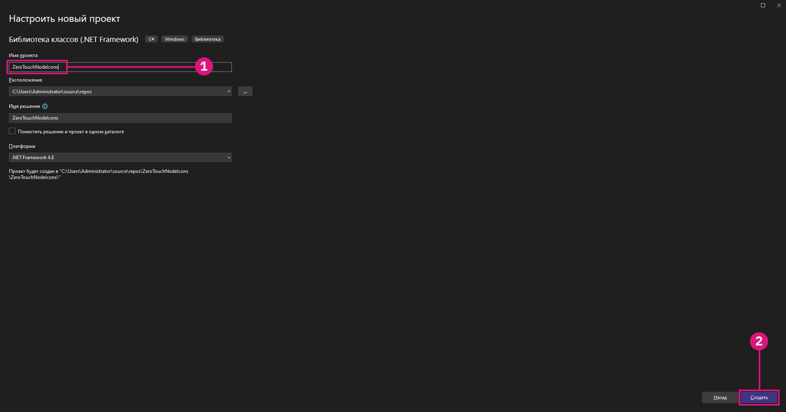

# Personalizzazione avanzata dei nodi di Dynamo

Con una conoscenza di base del concetto di zero-touch già acquisita, questa sezione approfondisce i vantaggi della personalizzazione dei nodi Dynamo per migliorare sia le funzionalità che l'esperienza utente. Aggiungendo funzionalità come messaggi di avviso, messaggi informativi e icone personalizzate, è possibile creare nodi più intuitivi, informativi e visivamente accattivanti. Questi tipi di personalizzazione non solo aiutano gli utenti a capire i potenziali problemi o a ottimizzare i loro workflow, ma rendono i nodi strumenti professionali e di facile utilizzo.

La personalizzazione dei nodi è un modo eccellente per garantire che le soluzioni siano chiare, affidabili e su misura per soddisfare le esigenze specifiche del progetto.

## Generazione di messaggi di avviso personalizzati mediante OnLogWarningMessage <a href="#generating-custom-warning-messages-using-onlogwarningmessage" id="generating-custom-warning-messages-using-onlogwarningmessage"></a>

In Dynamo, il metodo `OnLogWarningMessage` fornisce un modo per registrare i messaggi di avviso direttamente nella console di Dynamo. Si tratta di una funzionalità potente, soprattutto per i nodi zero-touch, in quanto consente agli sviluppatori di avvisare gli utenti in caso di problemi con input o parametri che potrebbero portare ad un comportamento imprevisto. In questa guida verrà illustrato come implementare `OnLogWarningMessage` in qualsiasi nodo zero-touch.

### Fasi di implementazione per `OnLogWarningMessage` <a href="#implementation-step-for-onlogwarningmessage" id="implementation-step-for-onlogwarningmessage"></a>

#### Passaggio 1: importare lo spazio dei nomi richiesto <a href="#import-the-required-namespace" id="import-the-required-namespace"></a>

`OnLogWarningMessage` fa parte dello spazio dei nomi `DynamoServices`, quindi iniziare aggiungendolo al file di progetto.

```
using DynamoServices;
```

#### Passaggio 2: identificare il momento in cui registrare gli avvisi <a href="#identify-when-to-log-warnings" id="identify-when-to-log-warnings"></a>

Prima di aggiungere un messaggio di avviso, considerare la logica del metodo:

* Quali condizioni potrebbero causare risultati errati o imprevisti?
* Esistono parametri o valori di input specifici che il metodo richiede per funzionare correttamente?

Esempi di condizioni da verificare:

* **Valori non compresi nell'intervallo** (ad es., `if (inputValue < 0)`).
* **Raccolte nulle o vuote** (ad es., `if (list == null || list.Count == 0)`).
* **Tipi di dati non corrispondenti** (ad es., se un tipo di file non è supportato).

#### Passaggio 3: utilizzare `OnLogWarningMessage` per registrare l'avviso <a href="#use-onlogwarningmessage-to-log-the-warning" id="use-onlogwarningmessage-to-log-the-warning"></a>

Effettuare chiamate `OnLogWarningMessage` in cui vengono rilevate condizioni che potrebbero causare problemi. Quando la condizione è soddisfatta, registrare un messaggio di avviso che fornisce indicazioni chiare all'utente.

### Sintassi per `OnLogWarningMessage` <a href="#syntax-for-onlogwarningmessage" id="syntax-for-onlogwarningmessage"></a>

```
LogWarningMessageEvents.OnLogWarningMessage("Your warning message here.");
```

### Esempi di implementazioni di `OnLogWarningMessage` <a href="#example-implementations-of-onlogwarningmessage" id="example-implementations-of-onlogwarningmessage"></a>

Per dimostrare `OnLogWarningMessage` in azione, ecco diversi scenari che potresti incontrare durante la creazione di un nodo zero-touch.

#### Esempio 1: convalida degli input numerici <a href="#example-1-validating-numeric-inputs" id="example-1-validating-numeric-inputs"></a>

In questo esempio, ci baseremo sul nodo personalizzato creato nel precedente **"Case study zero-touch - Nodo griglia";** un metodo denominato `RectangularGrid` che genera una griglia di rettangoli basati sugli input `xCount` e `yCount`. Verificheremo se un input non è valido e quindi verrà utilizzeremo `OnLogWarningMessage` per registrare un avviso e interrompere l'elaborazione.


**Utilizzo di `OnLogWarningMessage` per la convalida dell'input**

Quando si genera una griglia basata su `xCount` e `yCount`. Assicurarsi che entrambi i valori siano numeri interi positivi prima di procedere.

```
public static List<Rectangle> CreateGrid(int xCount, int yCount)
{
    // Check if xCount and yCount are positive
    if (xCount <= 0 || yCount <= 0)
    {
        LogWarningMessageEvents.OnLogWarningMessage("Grid count values must be positive integers.");
        return new List<Rectangle>();  // Return an empty list if inputs are invalid
    }
    // Proceed with grid creation...
}
```

In questo esempio:

* **Condizione**: se `xCount` o `yCount` è minore di o uguale a zero.
* **Messaggio**: `"Grid count values must be positive integers."`

In questo modo in Dynamo verrà mostrato l'avviso se un utente immette valori zero o negativi, consentendogli di capire l'input previsto.

Ora che sappiamo come appare, possiamo implementarlo nel nodo di esempio Griglie:

```
using Autodesk.DesignScript.Geometry;
using DynamoServices;

namespace CustomNodes
{
    public class Grids
    {
        // The empty private constructor.
        // This will not be imported into Dynamo.
        private Grids() { }

        /// <summary>
        /// This method creates a rectangular grid from an X and Y count.
        /// </summary>
        /// <param name="xCount">Number of grid cells in the X direction</param>
        /// <param name="yCount">Number of grid cells in the Y direction</param>
        /// <returns>A list of rectangles</returns>
        /// <search>grid, rectangle</search>
        public static List<Rectangle> RectangularGrid(int xCount = 10, int yCount = 10)
        {
            // Check for valid input values
            if (xCount <= 0 || yCount <= 0)
            {
                // Log a warning message if the input values are invalid
                LogWarningMessageEvents.OnLogWarningMessage("Grid count values must be positive integers.");
                return new List<Rectangle>(); // Return an empty list if inputs are invalid
            }

            double x = 0;
            double y = 0;

            var pList = new List<Rectangle>();

            for (int i = 0; i < xCount; i++)
            {
                y++;
                x = 0;
                for (int j = 0; j < yCount; j++)
                {
                    x++;
                    Point pt = Point.ByCoordinates(x, y);
                    Vector vec = Vector.ZAxis();
                    Plane bP = Plane.ByOriginNormal(pt, vec);
                    Rectangle rect = Rectangle.ByWidthLength(bP, 1, 1);
                    pList.Add(rect);
                    Point cPt = rect.Center();
                }
            }

            return pList;
        }
    }
}
```

**Esempio 2: controllo per verificare la presenza di raccolte nulle o vuote**

Se il metodo richiede un elenco di punti ma un utente fornisce un elenco vuoto o nullo, è possibile utilizzare `OnLogWarningMessage` per informarlo del problema.


```
public static Polygon CreatePolygonFromPoints(List<Point> points)
{
    if (points == null || points.Count < 3)
    {
        LogWarningMessageEvents.OnLogWarningMessage("Point list cannot be null or have fewer than three points.");
        return null;  // Return null if the input list is invalid
    }
    // Proceed with polygon creation...
}
```

In questo esempio:

* **Condizione**: se l'elenco di `points` è nullo o contiene meno di tre punti.
* **Messaggio**: `"Point list cannot be null or have fewer than three points."`

In questo modo gli utenti vengono avvisati che devono fornire un elenco valido con almeno tre punti per formare un poligono.

***

**Esempio 3: verifica della compatibilità dei tipi di file**

Per un nodo che elabora i percorsi dei file, è possibile assicurarsi che siano consentiti solo determinati tipi di file. Se viene rilevato un tipo di file non supportato, registrare un avviso.


```
public static void ProcessFile(string filePath)
{
    if (!filePath.EndsWith(".csv"))
    {
        LogWarningMessageEvents.OnLogWarningMessage("Only CSV files are supported.");
        return;
    }
    // Proceed with file processing...
}
```

In questo esempio:

* **Condizione**: se il percorso del file non termina con ".csv".
* **Messaggio**: `"Only CSV files are supported."`

In questo modo gli utenti vengono avvisati che devono fornire un file CSV, il che aiuta a prevenire problemi legati a formati di file incompatibili.

## Aggiunta di messaggi informativi con `OnLogInfoMessage` <a href="#adding-informational-messages-with-onloginfomessage" id="adding-informational-messages-with-onloginfomessage"></a>

In Dynamo, `OnLogInfoMessage` dello spazio dei nomi `DynamoServices` consente agli sviluppatori di registrare i messaggi informativi direttamente nella console di Dynamo. Ciò è utile per confermare le operazioni riuscite, comunicare lo stato di avanzamento o fornire informazioni aggiuntive sulle azioni dei nodi. In questa guida verrà illustrato come aggiungere `OnLogInfoMessage` in qualsiasi nodo zero-touch per migliorare il feedback e l'esperienza utente.

### Fasi di implementazione per `OnLogInfoMessage` <a href="#implementation-steps-for-onloginfomessage" id="implementation-steps-for-onloginfomessage"></a>

#### Passaggio 1: importare lo spazio dei nomi richiesto <a href="#step-1-import-the-required-namespace" id="step-1-import-the-required-namespace"></a>

`OnLogInfoMessage` fa parte dello spazio dei nomi `DynamoServices`, quindi iniziare aggiungendolo al file di progetto.

#### Passaggio 2: identificare il momento in cui registrare le informazioni <a href="#step-2-identify-when-to-log-information" id="step-2-identify-when-to-log-information"></a>

Prima di aggiungere un messaggio informativo, pensare allo scopo del metodo:

* Quali informazioni è utile confermare dopo il completamento di un'azione?
* Ci sono passaggi chiave o attività cardine all'interno del metodo che gli utenti potrebbero voler conoscere?

Esempi di conferme utili:

* **Messaggi di completamento** (ad es., quando una griglia o un modello è completamente creato).
* **Dettagli di dati elaborati** (ad es., "10 articoli elaborati correttamente").
* **Riepiloghi dell'esecuzione** (ad es., parametri utilizzati nel processo).

#### Passaggio 3: utilizzare `OnLogInfoMessage` per registrare i messaggi informativi <a href="#step-3-use-onloginfomessage-to-log-informational-message" id="step-3-use-onloginfomessage-to-log-informational-message"></a>

Effettuare chiamate `OnLogInfoMessage` in corrispondenza di punti significativi del metodo. Quando si verifica un completamento o un passaggio chiave, registrare un messaggio informativo per aggiornare l'utente sull'accaduto.

### Sintassi per `OnLogInfoMessage` <a href="#syntax-for-onloginfomessage" id="syntax-for-onloginfomessage"></a>

```
LogWarningMessageEvents.OnLogInfoMessage("Your info message here.");
```

### Esempi di implementazioni di `OnLogInfoMessage` <a href="#example-implementations-of-onloginfomessage" id="example-implementations-of-onloginfomessage"></a>

Di seguito sono riportati diversi scenari per dimostrare l'utilizzo di `OnLogInfoMessage` nei nodi zero-touch.

#### Esempio 1: convalida degli input numerici <a href="#example-1-validating-numeric-inputs" id="example-1-validating-numeric-inputs"></a>

In questo esempio, ci baseremo sul nodo personalizzato creato nel precedente **"Case study zero-touch - Nodo griglia";** un metodo denominato `RectangularGrid` che genera una griglia di rettangoli basati sugli input `xCount` e `yCount`. Verificheremo se un input non è valido e quindi verrà utilizzeremo `OnLogInfoMessage` per fornire informazioni dopo il completamento dell'esecuzione del nodo.


**Utilizzo di `OnLogInfoMessage` per la convalida dell'input**

Quando si genera una griglia basata su `xCount` e `yCount`. Dopo aver generato la griglia, si desidera confermarne la creazione registrando un messaggio informativo con le quote della griglia.

```
public static List<Rectangle> CreateGrid(int xCount, int yCount)
{
    var pList = new List<Rectangle>();
    // Grid creation code here...

    // Confirm successful grid creation
    LogWarningMessageEvents.OnLogInfoMessage($"Successfully created a grid with dimensions {xCount}x{yCount}.");

    return pList;
}
```

In questo esempio:

* **Condizione**: Il processo di creazione della griglia è stato completato.
* **Messaggio**: `"Successfully created a grid with dimensions {xCount}x{yCount}."`

Questo messaggio informerà gli utenti che la griglia è stata creata come specificato, consentendogli di verificare che il nodo abbia funzionato come previsto.

Ora che sappiamo come appare, possiamo implementarlo nel nodo di esempio Griglie:

```
using Autodesk.DesignScript.Geometry;
using DynamoServices;

namespace CustomNodes
{
    public class Grids
    {
        // The empty private constructor.
        // This will not be imported into Dynamo.
        private Grids() { }

        /// <summary>
        /// This method creates a rectangular grid from an X and Y count.
        /// </summary>
        /// <param name="xCount">Number of grid cells in the X direction</param>
        /// <param name="yCount">Number of grid cells in the Y direction</param>
        /// <returns>A list of rectangles</returns>
        /// <search>grid, rectangle</search>
        public static List<Rectangle> RectangularGrid(int xCount = 10, int yCount = 10)
        {
            double x = 0;
            double y = 0;

            var pList = new List<Rectangle>();

            for (int i = 0; i < xCount; i++)
            {
                y++;
                x = 0;
                for (int j = 0; j < yCount; j++)
                {
                    x++;
                    Point pt = Point.ByCoordinates(x, y);
                    Vector vec = Vector.ZAxis();
                    Plane bP = Plane.ByOriginNormal(pt, vec);
                    Rectangle rect = Rectangle.ByWidthLength(bP, 1, 1);
                    pList.Add(rect);
                    Point cPt = rect.Center();
                }
            }

            // Log an info message indicating the grid was successfully created
            LogWarningMessageEvents.OnLogInfoMessage($"Successfully created a grid with dimensions {xCount}x{yCount}.");

            return pList;
        }
    }
}
```

#### Esempio 2: fornitura di informazioni sul conteggio dei dati <a href="#example-2-providing-data-count-information" id="example-2-providing-data-count-information"></a>

Se si sta creando un nodo che elabora un elenco di punti, è possibile registrare il numero di punti elaborati correttamente. Ciò può essere utile per set di dati di grandi dimensioni.


```
public static List<Point> ProcessPoints(List<Point> points)
{
    var processedPoints = new List<Point>();
    foreach (var point in points)
    {
        // Process each point...
        processedPoints.Add(point);
    }

    // Log info about the count of processed points
    LogWarningMessageEvents.OnLogInfoMessage($"{processedPoints.Count} points were processed successfully.");

    return processedPoints;
}
```

In questo esempio:

* **Condizione**: al termine del ciclo, mostra il conteggio degli elementi elaborati.
* **Messaggio**: `"6 points were processed successfully."`

Questo messaggio aiuterà gli utenti a comprendere il risultato dell'elaborazione e a confermare che tutti i punti sono stati elaborati.

#### Esempio 3: riepilogo dei parametri utilizzati <a href="#example-3-summarizing-parameters-used" id="example-3-summarizing-parameters-used"></a>

In alcuni casi, è utile confermare i parametri di input utilizzati da un nodo per completare un'azione. Ad esempio, se il nodo esporta i dati in un file, registrando il nome e il percorso del file si possono rassicurare gli utenti sul fatto che sia stato utilizzato il file corretto.


```
public static void ExportData(string filePath, List<string> data)
{
    // Code to write data to the specified file path...

    // Log the file path used for export
    LogWarningMessageEvents.OnLogInfoMessage($"Data exported successfully to {filePath}.");

}
```

In questo esempio:

* **Condizione**: Il processo di esportazione è stato completato correttamente.
* **Messaggio**: `"Data exported successfully to {filePath}."`

Questo messaggio conferma agli utenti che l'esportazione ha funzionato e mostra il percorso esatto del file, contribuendo a evitare confusione sulle posizioni dei file.

## Creazione e aggiunta di documentazione ai nodi personalizzati

### Documentazione dei nodi personalizzati

Storicamente, in Dynamo ci sono state limitazioni nel modo in cui gli autori dei pacchetti potevano fornire la documentazione per i loro nodi. Gli autori di nodi personalizzati hanno potuto limitarsi a consentire solo una breve descrizione che viene visualizzata nella descrizione comando del nodo o a inviare il pacchetto con grafici di esempio ricchi di annotazioni.


### Un nuovo modo

Dynamo ora offre un sistema migliorato per gli autori di pacchetti, che consente di fornire una documentazione migliore e più esplicativa per i nodi personalizzati. Questo nuovo approccio utilizza il linguaggio Markdown, facile da usare, per la creazione di testo e l'estensione della vista del Browser della documentazione per visualizzare Markdown in Dynamo. Con Markdown gli autori dei pacchetti hanno a disposizione un'ampia gamma di nuove possibilità per documentare i loro nodi personalizzati.

#### Che cos'è Markdown?

Markdown è un linguaggio di markup leggero che è possibile utilizzare per formattare documenti di testo normale. Da quando Markdown è stato creato nel 2004, la sua popolarità non ha fatto che aumentare e oggi è uno dei linguaggi di markup più diffusi al mondo.

#### Introduzione a Markdown

È facile iniziare a creare file in Markdown: tutto ciò che serve è un semplice editor di testo, come Blocco note, e si è pronti a cominciare. Tuttavia, ci sono modi più semplici per scrivere Markdown rispetto al Blocco note. Ci sono diversi editor online, come [Dillinger](https://dillinger.io/), che consentono di vedere le modifiche in tempo reale mentre vengono effettuate. Un altro modo comune per modificare i file Markdown è l'utilizzo di un editor di codice come [Visual Studio Code](https://code.visualstudio.com/).

#### Cosa può fare Markdown?

Markdown è molto flessibile e dovrebbe fornire funzionalità sufficienti per creare facilmente una buona documentazione, tra cui l'aggiunta di file multimediali come immagini o video, la creazione di tabelle con diverse forme di contenuto e, naturalmente, semplici funzionalità di formattazione del testo come il **grassetto** o il _corsivo_. La scrittura di documenti in Markdown consente di ottenere tutto questo e molto altro ancora; per ulteriori informazioni, consultare questa guida che illustra la [sintassi di Markdown di base](https://www.markdownguide.org/basic-syntax/).

### Aggiunta di documentazione estesa ai nodi

Aggiungere la documentazione ai nodi è semplice. La documentazione può essere aggiunta a tutti i tipi di nodi personalizzati e comprende:

* Nodi di Dynamo predefiniti.
* Nodi personalizzati (.dyf): raccolte di nodi predefiniti e/o di altri pacchetti.
* Nodi del pacchetto C# personalizzati (noti anche come zero-touch; questi nodi personalizzati sono uguali ai nodi predefiniti).
* Nodi NodeModel (nodi che contengono funzionalità speciali dell'interfaccia utente, ad esempio menu a discesa o pulsanti di selezione).
* Nodi NodeModel con interfaccia utente personalizzata (nodi che contengono funzionalità univoche dell'interfaccia utente, ad esempio la grafica sul nodo).

Per visualizzare i file in Markdown all'interno di Dynamo, seguire questi pochi passaggi.

#### Apertura di file di documentazione in Dynamo

In Dynamo si utilizza l'estensione della vista Browser della documentazione per visualizzare la documentazione dei nodi. Per aprire la documentazione dei nodi, fare clic con il pulsante destro del mouse sul nodo e selezionare ?. In questo modo si aprirà il Browser della documentazione e verrà visualizzato il linguaggio Markdown associato a tale nodo, se eventualmente fornito.


La documentazione visualizzata nel Browser della documentazione è costituita da due parti. La prima è la sezione `Node Info`, che viene generata automaticamente dalle informazioni estratte dal nodo, come gli input/output, la categoria del nodo, il nome/lo spazio dei nomi del nodo e la descrizione breve dei nodi. La seconda parte mostra la documentazione dei nodi personalizzati, che è il file in Markdown fornito per documentare il nodo.


#### Cartella /doc del pacchetto

Per aggiungere i file della documentazione ai nodi in Dynamo, creare una nuova cartella nella directory del pacchetto denominata `/doc`. Quando il pacchetto viene caricato, in Dynamo viene analizzata questa directory per ottenere tutti i file in Markdown della documentazione in essa contenuti.

#### Denominazione dei file in Markdown

Per assicurarsi che in Dynamo venga identificato il file da aprire quando viene richiesto per un nodo specifico, la denominazione del file in Markdown deve essere in un formato specifico. Il file in Markdown deve essere denominato in base allo spazio dei nomi del nodo che documenta. Se non si è sicuri dello spazio dei nomi del nodo, esaminare la sezione `Node Info` quando si preme `Help` sul nodo e sotto il nome del nodo verrà visualizzato lo spazio dei nomi completo del nodo selezionato.

Questo spazio dei nomi deve essere il nome del file in Markdown per quel particolare nodo. Ad esempio, lo spazio dei nomi di `CustomNodeExample` delle immagini precedenti è `TestPackage.TestCategory.CustomNodeExample`, quindi il file in Markdown per questo nodo dovrebbe essere nominato `TestPackage.TestCategory.CustomNodeExample.md`.

In casi speciali di overload dei nodi (nodi con lo stesso nome, ma input diversi), sarà necessario aggiungere i nomi di input in `()` dopo lo spazio dei nomi del nodo. Ad esempio, il nodo incorporato `Geometry.Translate` presenta più overload. In questo caso, denomineremo i file in Markdown per i nodi sottostanti come segue: `Autodesk.DesignScript.Geometry.Geometry.Translate(geometry,direction).md` `Autodesk.DesignScript.Geometry.Geometry.Translate(geometry,direction,distance).md`


#### Modifica di file in Markdown aperti in Dynamo

Per facilitare la modifica dei file della documentazione, nel Browser della documentazione viene implementato un File Watcher sul file aperto. Ciò consente di apportare modifiche al file in Markdown e le modifiche verranno visualizzate immediatamente in Dynamo.


È possibile aggiungere nuovi file della documentazione anche mentre Dynamo è aperto. È sufficiente aggiungere un nuovo file in Markdown alla cartella `/doc`, con un nome che corrisponda al nodo che documenta.

## Aggiunta di icone personalizzate ai nodi zero-touch

### Panoramica

Le icone personalizzate per i nodi zero-touch in Dynamo rendono i nodi visivamente distinti e più facili da riconoscere nella Libreria. Aggiungendo icone personalizzate, è possibile far risaltare i nodi rispetto agli altri, consentendo agli utenti di identificarli rapidamente in un elenco.

In questa guida viene illustrato come aggiungere icone ai nodi zero-touch.

### Passaggi per aggiungere icone personalizzate dei nodi

#### Passaggio 1: impostare il progetto

Per iniziare, creare un progetto della libreria di classi di Visual Studio (.NET Framework) per i nodi zero-touch. Se non si dispone già di un progetto, fare riferimento alla sezione **Guida introduttiva** per istruzioni dettagliate su come crearne uno.




Assicurarsi di avere almeno un nodo zero-touch funzionante, poiché le icone possono essere aggiunte solo ai nodi esistenti. Per indicazioni, vedere **Case study zero-touch - Nodo griglia**.

#### Passaggio 2: creare immagini delle icone personalizzate

Per creare icone personalizzate:

1. **Progettare icone personalizzare**: utilizzare un editor di immagini per creare icone semplici e visivamente chiare per i nodi.
2. **Specifiche delle immagini**:
   * **Icona piccola**: 32x32 pixel (utilizzata sulla barra laterale della Libreria e sul nodo stesso).
   * **Icona grande**: 128x128 pixel (utilizzata nelle proprietà del nodo quando si posiziona il cursore sul nodo nella libreria).
3. **Convenzione di denominazione dei file**:
   * I nomi di file devono corrispondere al formato seguente per associarli al nodo corretto:
     * **`<ProjectName>.<ClassName>.<MethodName>.Small.png`** (per l'icona piccola).
     * **`<ProjectName>.<ClassName>.<MethodName>.Large.png`** (per l'icona grande).

**Esempio**: se il progetto è `ZeroTouchNodeIcons`, la classe è `Grids` e il metodo è `RectangularGrid`, i file saranno denominati:

* `ZeroTouchNodeIcons.Grids.RectangularGrid.Small.png`
* `ZeroTouchNodeIcons.Grids.RectangularGrid.Large.png`

> Suggerimento Per conferire un aspetto professionale, attenersi ad un tema di progettazione coerente per tutte le icone.

#### Passaggio 3: aggiungere un file di risorse al progetto

Per incorporare le icone nel file `.dll`, creare un file di risorse:

1. **Aggiungere un nuovo file di risorse**:

* Fare clic con il pulsante destro del mouse sul progetto in **Solution Explorer**.


* Accedere ad **Add > New Item** e selezionare **Resources File**.


* Assegnare un nome al file `<ProjectName>Images.resx`. Ad esempio, `ZeroTouchNodeIconsImages.resx`.

2. **Deselezionare la proprietà Custom Tool**:
   * Selezionare il file di risorse in **Solution Explorer**.
   * Nel pannello **Properties**, deselezionare il campo `Custom Tool` rimuovendo il valore `ResXFileCodeGenerator`.


> _NOTA La mancata cancellazione del campo Custom Tool comporterà in Visual Studio la conversione dei punti in caratteri di sottolineatura nei nomi delle risorse. Please verify before Building that your resource names have periods separating class names rather than underscores._

#### Passaggio 4: aggiungere immagini personalizzate come risorse

1. Aprire il file di risorse utilizzando **Managed Resources Editor (Legacy)**:
   * Se si utilizza Visual Studio 17.11 o versione successiva, fare clic con il pulsante destro del mouse sul file di risorse, scegliere **Open With** e selezionare **Managed Resources Editor (Legacy)**.
   * Se si utilizza una versione di Visual Studio precedente alla 17.11, fare doppio clic sul file di risorse da aprire con Resources Editor (che nella versione di Visual Studio in uso non è ancora obsoleto).


2. Aggiungere le immagini personalizzate:
   * Trascinare e rilasciare i file di immagine nell'editor o utilizzare l'opzione **Add Existing File**.


3. Aggiornare la persistenza:
   * Selezionare le immagini dall'interno di Resources Editor (questa operazione non funzionerà se le si seleziona da Solution Explorer), modificare la proprietà **Persistence** nel pannello **Properties** in `Embedded in .resx`. In questo modo si garantisce che le immagini vengano incluse nel file `.dll`.


#### Passaggio 5: convertire il progetto in stile SDK

Se il progetto non è già in stile SDK (necessario per l'incorporamento delle risorse), convertirlo:

1. Installare l'estensione `.NET Upgrade Assistant` dal menu **Extensions > Manage Extensions** di Visual Studio.


2. Fare clic con il pulsante destro del mouse sul progetto in **Solution Explorer** e scegliere **Upgrade > Convert project to SDK-style**.


3. Attendere il completamento della conversione.


#### Passaggio 6: aggiungere uno script post-compilazione per incorporare le risorse

1. Scaricare il progetto:
   * Fare clic con il pulsante destro del mouse sul progetto in **Solution Explorer** e scegliere **Unload Project**.


2. Modificare il file `.csproj`:
   * Aggiungere il seguente elemento `<Target>` tra `</ItemGroup>` e `</Project>`:

```
<Target Name="CreateNodeIcons" AfterTargets="PostBuildEvent">
		<!-- Get System.Drawing.dll     -->
		<GetReferenceAssemblyPaths TargetFrameworkMoniker=".NETFramework, Version=v4.8">
			<Output TaskParameter="FullFrameworkReferenceAssemblyPaths" PropertyName="FrameworkAssembliesPath" />
		</GetReferenceAssemblyPaths>
		<!-- Get assembly -->
		<GetAssemblyIdentity AssemblyFiles="$(OutDir)$(TargetName).dll">
			<Output TaskParameter="Assemblies" ItemName="AssemblyInfo" />
		</GetAssemblyIdentity>
		<!-- Generate customization dll -->
		<GenerateResource SdkToolsPath="$(TargetFrameworkSDKToolsDirectory)" UseSourcePath="true" Sources="$(ProjectDir)ZeroTouchNodeIconsImages.resx" OutputResources="$(ProjectDir)ZeroTouchNodeIconsImages.resources" References="$(FrameworkAssembliesPath)System.Drawing.dll" />
		<AL SdkToolsPath="$(TargetFrameworkSDKToolsDirectory)" TargetType="library" EmbedResources="$(ProjectDir)ZeroTouchNodeIconsImages.resources" OutputAssembly="$(OutDir)ZeroTouchNodeIcons.customization.dll" Version="%(AssemblyInfo.Version)" />
	</Target>
```


1. Sostituire tutte le istanze di `ZeroTouchNodeIcons` con il nome del progetto.
2. Ricaricare il progetto:
   * Fare clic con il pulsante destro del mouse sul progetto scaricato e selezionare **Reload Project**.


#### Passaggio 7: creare e caricare il file .dll in Dynamo

1. Creare il progetto:
   * Dopo aver aggiunto lo script post-compilazione, compilare il progetto in Visual Studio.


2. Controllare per verificare la presenza di file di output:
   * Verificare che il file `.dll` e `.customization.dll` si trovino nella cartella `bin`.
3. Aggiungere il file `.dll` a Dynamo:
   * In Dynamo, utilizzare il pulsante Importa libreria per importare il file .dll in Dynamo.


4. I nodi personalizzati dovrebbero ora essere visualizzati con le rispettive icone.
