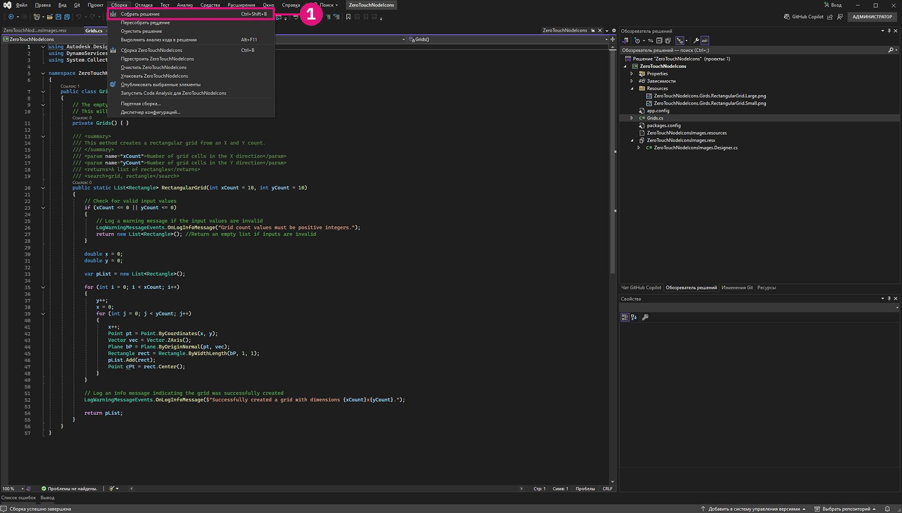

# 고급 Dynamo 노드 사용자 정의

이 섹션에서는 ZeroTouch에 대한 기본 지식이 이미 확립되어 있음을 전제로, Dynamo 노드를 사용자 정의하여 기능과 사용자 환경을 모두 향상시키는 이점에 대해 알아봅니다. 경고 메시지, 정보 메시지, 사용자 정의 아이콘과 같은 기능을 추가하면 더 직관적이고 정보 전달에 효과적이며 시각적으로 매력적인 노드를 생성할 수 있습니다. 이러한 사용자 정의는 사용자가 잠재적인 문제를 이해하거나 워크플로우를 최적화하는 데 도움이 될 뿐만 아니라 노드를 전문적이고 사용자 친화적인 도구로 돋보이게 만듭니다.

노드를 사용자 정의하는 것은 솔루션의 명확성과 신뢰성을 보장하며 특정 프로젝트 요구 사항을 충족하도록 조정하는 훌륭한 방법입니다.

## OnLogWarningMessage를 사용하여 사용자 정의 경고 메시지 생성 <a href="#generating-custom-warning-messages-using-onlogwarningmessage" id="generating-custom-warning-messages-using-onlogwarningmessage"></a>

Dynamo에서 `OnLogWarningMessage` 메서드는 경고 메시지를 Dynamo의 콘솔에 직접 기록할 수 있는 방법을 제공합니다. 이 기능은 특히 Zero Touch 노드에서 강력한 기능으로, 입력이나 매개변수에 문제가 있어 예기치 않은 동작이 초래될 수 있을 때 개발자가 사용자에게 경고를 전달할 수 있게 해줍니다. 이 가이드는 `OnLogWarningMessage`를 Zero Touch 노드에 구현할 수 있는 방법에 대해 설명합니다.

### `OnLogWarningMessage`를 구현하는 단계 <a href="#implementation-step-for-onlogwarningmessage" id="implementation-step-for-onlogwarningmessage"></a>

#### 1단계: 필요한 네임스페이스 가져오기 <a href="#import-the-required-namespace" id="import-the-required-namespace"></a>

`OnLogWarningMessage`는 `DynamoServices` 네임스페이스의 일부이므로, 먼저 이를 프로젝트 파일에 추가합니다.

```
using DynamoServices;
```

#### 2단계: 경고를 기록할 시점 식별 <a href="#identify-when-to-log-warnings" id="identify-when-to-log-warnings"></a>

경고 메시지를 추가하기 전에 다음과 같은 메서드의 논리를 고려합니다.

* 잘못되거나 예기치 않은 결과를 일으킬 수 있는 조건은 무엇입니까?
* 메서드가 제대로 작동하는 데 필요한 특정 입력 값 또는 매개변수가 있습니까?

확인할 조건의 예는 다음과 같습니다.

* **범위를 벗어난 값**(예: `if (inputValue < 0)`).
* **null 또는 빈 컬렉션**(예: `if (list == null || list.Count == 0)`).
* **데이터 유형 불일치**(예: 파일 유형이 지원되지 않는 경우).

#### 3단계: `OnLogWarningMessage`를 사용하여 경고 기록 <a href="#use-onlogwarningmessage-to-log-the-warning" id="use-onlogwarningmessage-to-log-the-warning"></a>

문제를 일으킬 수 있는 조건을 감지한 곳에 `OnLogWarningMessage` 호출을 배치합니다. 조건이 충족되면 사용자에게 명확한 안내를 제공하는 경고 메시지를 기록합니다.

### `OnLogWarningMessage`의 문법 <a href="#syntax-for-onlogwarningmessage" id="syntax-for-onlogwarningmessage"></a>

```
LogWarningMessageEvents.OnLogWarningMessage("Your warning message here.");
```

### `OnLogWarningMessage`의 구현 예제 <a href="#example-implementations-of-onlogwarningmessage" id="example-implementations-of-onlogwarningmessage"></a>

`OnLogWarningMessage`가 작동하는 예제를 보여주기 위해 Zero Touch 노드를 만들 때 직면할 수 있는 다양한 시나리오를 소개합니다.

#### 예제 1: 숫자 입력의 유효성 검사 <a href="#example-1-validating-numeric-inputs" id="example-1-validating-numeric-inputs"></a>

이 예제에서는 이전의 "**Zero-Touch 사례 연구 - 그리드 노드"**에서 생성한 사용자 정의 노드를 기반으로 구축할 것입니다. 그리도 노드는 `xCount` 및 `yCount` 입력을 바탕으로 직사각형 그리드를 생성하는 `RectangularGrid`라는 메서드를 포함합니다. 입력이 유효하지 않은지를 테스트한 다음, `OnLogWarningMessage`를 사용하여 경고를 기록하고 처리를 중지하는 과정을 살펴보겠습니다.


##### 입력 유효성 검사에 `OnLogWarningMessage` 사용 <a href="#using-onlogwarningmessage-for-input-validation" id="using-onlogwarningmessage-for-input-validation"></a>

`xCount` 및 `yCount`를 바탕으로 그리드를 생성할 때, 계속 진행하기 전에 두 값이 모두 양의 정수인지 확인하고자 합니다.

```
public static List<Rectangle> CreateGrid(int xCount, int yCount)
{
    // Check if xCount and yCount are positive
    if (xCount <= 0 || yCount <= 0)
    {
        LogWarningMessageEvents.OnLogWarningMessage("Grid count values must be positive integers.");
        return new List<Rectangle>();  // Return an empty list if inputs are invalid
    }
    // Proceed with grid creation...
}
```

이 예제에서는 다음과 같습니다.

* **조건**: `xCount` 또는 `yCount`가 0보다 작거나 같은 경우.
* **메시지**: `"Grid count values must be positive integers."`

이 예제는 사용자가 0 또는 음수 값을 입력하면 Dynamo에 경고가 표시되는 것을 보여줍니다. 이는 예상되는 입력을 이해하는 데 도움이 됩니다. 

이제 경고가 어떻게 표시되는지 알았으므로 이 기능을 그리드 예제 노드에 구현할 수 있습니다.

```
using Autodesk.DesignScript.Geometry;
using DynamoServices;

namespace CustomNodes
{
    public class Grids
    {
        // The empty private constructor.
        // This will not be imported into Dynamo.
        private Grids() { }

        /// <summary>
        /// This method creates a rectangular grid from an X and Y count.
        /// </summary>
        /// <param name="xCount">Number of grid cells in the X direction</param>
        /// <param name="yCount">Number of grid cells in the Y direction</param>
        /// <returns>A list of rectangles</returns>
        /// <search>grid, rectangle</search>
        public static List<Rectangle> RectangularGrid(int xCount = 10, int yCount = 10)
        {
            // Check for valid input values
            if (xCount <= 0 || yCount <= 0)
            {
                // Log a warning message if the input values are invalid
                LogWarningMessageEvents.OnLogWarningMessage("Grid count values must be positive integers.");
                return new List<Rectangle>(); // Return an empty list if inputs are invalid
            }

            double x = 0;
            double y = 0;

            var pList = new List<Rectangle>();

            for (int i = 0; i < xCount; i++)
            {
                y++;
                x = 0;
                for (int j = 0; j < yCount; j++)
                {
                    x++;
                    Point pt = Point.ByCoordinates(x, y);
                    Vector vec = Vector.ZAxis();
                    Plane bP = Plane.ByOriginNormal(pt, vec);
                    Rectangle rect = Rectangle.ByWidthLength(bP, 1, 1);
                    pList.Add(rect);
                    Point cPt = rect.Center();
                }
            }

            return pList;
        }
    }
}
```

##### 예제 2: Null 또는 빈 컬렉션 확인 <a href="#example-2-checking-for-null-or-empty-collections" id="example-2-checking-for-null-or-empty-collections"></a>

메서드에 점의 리스트가 필요하지만 사용자가 빈 리스트 또는 null 리스트를 전달하면 `OnLogWarningMessage`를 사용하여 문제를 사용자에게 알릴 수 있습니다.


```
public static Polygon CreatePolygonFromPoints(List<Point> points)
{
    if (points == null || points.Count < 3)
    {
        LogWarningMessageEvents.OnLogWarningMessage("Point list cannot be null or have fewer than three points.");
        return null;  // Return null if the input list is invalid
    }
    // Proceed with polygon creation...
}
```

이 예제에서는 다음과 같습니다.

* **조건**: `points` 리스트가 null이거나 3개 미만의 점을 포함하는 경우.
* **메시지**: `"Point list cannot be null or have fewer than three points."`

이 경고는 다각형을 형성하려면 사용자가 최소한 세 개의 점이 포함된 유효한 리스트를 전달해야 한다는 것을 알립니다.

---

##### 예제 3: 파일 유형 호환성 확인 <a href="#example-3-verifying-file-type-compatibility" id="example-3-verifying-file-type-compatibility"></a>

파일 경로를 처리하는 노드의 경우 특정 파일 유형만 허용되도록 하고자 할 수 있습니다. 지원되지 않는 파일 유형이 감지되면 경고를 기록합니다.


```
public static void ProcessFile(string filePath)
{
    if (!filePath.EndsWith(".csv"))
    {
        LogWarningMessageEvents.OnLogWarningMessage("Only CSV files are supported.");
        return;
    }
    // Proceed with file processing...
}
```

이 예제에서는 다음과 같습니다.

* **조건**: 파일 경로가 ".csv"로 끝나지 않는 경우.
* **메시지**: `"Only CSV files are supported."`

이 경고는 사용자가 CSV 파일을 전달하고 있는지 확인하도록 경고하여, 호환되지 않는 파일 형식과 관련된 문제를 방지하는 데 도움이 됩니다.

## `OnLogInfoMessage` <a href="#adding-informational-messages-with-onloginfomessage" id="adding-informational-messages-with-onloginfomessage"></a>로 정보 메시지 추가

Dynamo에서 `DynamoServices` 네임스페이스의 `OnLogInfoMessage`는 개발자가 정보 메시지를 Dynamo의 콘솔에 직접 기록할 수 있도록 해줍니다. 이는 작업의 성공을 확인하거나 진행 상황을 전달하거나 노드 작업에 대한 추가적인 정보를 제공하는 데 유용합니다. 이 가이드에서는 Zero Touch 노드에 `OnLogInfoMessage`를 추가하여 피드백을 개선하고 사용자 경험을 향상하는 방법을 설명합니다.

### `OnLogInfoMessage`를 구현하는 단계 <a href="#implementation-steps-for-onloginfomessage" id="implementation-steps-for-onloginfomessage"></a>
#### 1단계: 필요한 네임스페이스 가져오기 <a href="#step-1-import-the-required-namespace" id="step-1-import-the-required-namespace"></a>

`OnLogInfoMessage`는 `DynamoServices` 네임스페이스의 일부이므로, 먼저 이를 프로젝트 파일에 추가합니다.

#### 2단계: 정보를 기록할 시점 식별 <a href="#step-2-identify-when-to-log-information" id="step-2-identify-when-to-log-information"></a>

정보 메시지를 추가하기 전에 메서드의 목적에 대해 생각해 보십시오.

* 작업이 완료된 후 확인하는 데 유용한 정보는 무엇입니까?
* 사용자가 알고 싶어할 수 있는 메서드 내의 주요 단계나 중요한 이정표가 있습니까?

유용한 확인의 예제:

* **완료 메시지**(예: 그리드 또는 모델이 완전히 생성되었을 때).
* **처리된 데이터의 상세 정보**(예: "10개의 항목이 성공적으로 처리됨").
* **실행 요약**(예: 프로세스에 사용된 매개변수).

#### 3단계: `OnLogInfoMessage`를 사용하여 정보 메시지 기록 <a href="#step-3-use-onloginfomessage-to-log-informational-message" id="step-3-use-onloginfomessage-to-log-informational-message"></a>

메서드의 중요한 지점에 `OnLogInfoMessage` 호출을 배치합니다. 주요 단계 또는 완료가 발생할 때 사용자에게 발생한 상황을 업데이트하는 정보 메시지를 기록합니다.

### `OnLogInfoMessage`의 문법 <a href="#syntax-for-onloginfomessage" id="syntax-for-onloginfomessage"></a>

```
LogWarningMessageEvents.OnLogInfoMessage("Your info message here.");
```

### `OnLogInfoMessage`의 구현 예제 <a href="#example-implementations-of-onloginfomessage" id="example-implementations-of-onloginfomessage"></a>

아래에 Zero Touch 노드에서 `OnLogInfoMessage`를 사용하는 모습을 보여주는 여러 개의 시나리오가 나와 있습니다.

#### 예제 1: 숫자 입력의 유효성 검사 <a href="#example-1-validating-numeric-inputs" id="example-1-validating-numeric-inputs"></a>

이 예제에서는 이전의 "**Zero-Touch 사례 연구 - 그리드 노드"**에서 생성한 사용자 정의 노드를 기반으로 구축할 것입니다. 그리도 노드는 `xCount` 및 `yCount` 입력을 바탕으로 직사각형 그리드를 생성하는 `RectangularGrid`라는 메서드를 포함합니다. 입력이 유효하지 않은지를 테스트한 다음, 노드 실행이 완료된 후 `OnLogInfoMessage`를 사용하여 정보를 제공하는 과정을 살펴보겠습니다.


###### 입력 유효성 검사에 `OnLogInfoMessage` 사용 <a href="#using-onloginfomessage-for-unput-validation" id="using-onloginfomessage-for-unput-validation"></a>

`xCount` 및 `yCount`를 바탕으로 그리드를 생성할 때, 그리드 생성 후 그리드의 크기를 포함한 정보 메시지를 기록하여 그리드 생성이 완료되었음을 확인하고자 합니다.

```
public static List<Rectangle> CreateGrid(int xCount, int yCount)
{
    var pList = new List<Rectangle>();
    // Grid creation code here...

    // Confirm successful grid creation
    LogWarningMessageEvents.OnLogInfoMessage($"Successfully created a grid with dimensions {xCount}x{yCount}.");

    return pList;
}
```

이 예제에서는 다음과 같습니다.

* **조건**: 그리드 생성 프로세스가 완료되었습니다.
* **메시지**: `"Successfully created a grid with dimensions {xCount}x{yCount}."`

이 메시지는 그리드가 지정한 대로 생성되었음을 사용자에게 알리며, 노드가 예상대로 작동했음을 확인하는 데 도움이 됩니다.

이제 경고가 어떻게 표시되는지 알았으므로 이 기능을 그리드 예제 노드에 구현할 수 있습니다.

```
using Autodesk.DesignScript.Geometry;
using DynamoServices;

namespace CustomNodes
{
    public class Grids
    {
        // The empty private constructor.
        // This will not be imported into Dynamo.
        private Grids() { }

        /// <summary>
        /// This method creates a rectangular grid from an X and Y count.
        /// </summary>
        /// <param name="xCount">Number of grid cells in the X direction</param>
        /// <param name="yCount">Number of grid cells in the Y direction</param>
        /// <returns>A list of rectangles</returns>
        /// <search>grid, rectangle</search>
        public static List<Rectangle> RectangularGrid(int xCount = 10, int yCount = 10)
        {
            double x = 0;
            double y = 0;

            var pList = new List<Rectangle>();

            for (int i = 0; i < xCount; i++)
            {
                y++;
                x = 0;
                for (int j = 0; j < yCount; j++)
                {
                    x++;
                    Point pt = Point.ByCoordinates(x, y);
                    Vector vec = Vector.ZAxis();
                    Plane bP = Plane.ByOriginNormal(pt, vec);
                    Rectangle rect = Rectangle.ByWidthLength(bP, 1, 1);
                    pList.Add(rect);
                    Point cPt = rect.Center();
                }
            }

            // Log an info message indicating the grid was successfully created
            LogWarningMessageEvents.OnLogInfoMessage($"Successfully created a grid with dimensions {xCount}x{yCount}.");

            return pList;
        }
    }
}
```

#### 예제 2: 데이터 개수 정보 제공 <a href="#example-2-providing-data-count-information" id="example-2-providing-data-count-information"></a>

점 리스트를 처리하는 노드를 생성하는 경우 성공적으로 처리된 점의 수를 기록하고자 할 수 있습니다. 이는 대규모 데이터 세트에 유용할 수 있습니다.


```
public static List<Point> ProcessPoints(List<Point> points)
{
    var processedPoints = new List<Point>();
    foreach (var point in points)
    {
        // Process each point...
        processedPoints.Add(point);
    }

    // Log info about the count of processed points
    LogWarningMessageEvents.OnLogInfoMessage($"{processedPoints.Count} points were processed successfully.");

    return processedPoints;
}
```

이 예제에서는 다음과 같습니다.

* **조건**: 루프가 완료된 후 처리된 항목 수를 표시합니다.
* **메시지**: `"6 points were processed successfully."`

이 메시지는 사용자가 처리 결과를 이해하고 모든 점이 처리되었음을 확인하는 데 도움이 됩니다.


#### 예제 3: 사용된 매개변수 요약 <a href="#example-3-summarizing-parameters-used" id="example-3-summarizing-parameters-used"></a>

어떤 경우에는 노드가 작업을 완료하기 위해 사용한 입력 매개 변수를 확인하는 것이 유용할 수 있습니다. 예를 들어, 노드가 데이터를 파일로 내보낼 경우 파일 이름과 경로를 기록하면 사용자가 올바른 파일이 사용되었음을 확인할 수 있습니다.


```
public static void ExportData(string filePath, List<string> data)
{
    // Code to write data to the specified file path...

    // Log the file path used for export
    LogWarningMessageEvents.OnLogInfoMessage($"Data exported successfully to {filePath}.");

}
```

이 예제에서는 다음과 같습니다.

* **조건**: 내보내기 프로세스가 성공적으로 완료되었습니다.
* **메시지**: `"Data exported successfully to {filePath}."`

이 메시지는 내보내기가 성공적으로 이루어졌음을 사용자에게 확인해 주고 정확한 파일 경로를 보여줍니다. 이를 통해 파일 위치에 대한 혼동을 방지할 수 있습니다.

## 사용자 지정 문서 작성 및 노드에 추가

### 사용자 지정 노드 문서
과거에 Dynamo에서는 패키지 작성자가 노드에 대한 문서를 제공할 수 있는 방법에 대한 제한이 있었습니다. 사용자 지정 노드 작성자는 노드의 툴팁에 표시되는 간단한 설명만 추가하거나 패키지를 주석이 많이 달린 샘플 그래프와 함께 패키지를 배포할 수 밖에 없었습니다.


### 새로운 방법
Dynamo는 이제 패키지 작성자가 사용자 지정 노드에 대해 더 자세한 문서를 효율적으로 제공할 수 있는 개선된 시스템을 제공합니다 이 새로운 접근 방식은 사용자 친화적인 Markdown 언어를 사용하여 텍스트를 작성하고, 문서 탐색기 뷰 확장을 통해 Dynamo에서 Markdown을 표시합니다. Markdown을 사용하면 패키지 작성자는 새롭고 다양한 방식으로 사용자 지정 노드를 문서화할 수 있습니다. 

#### Markdown이란?
Markdown은 일반 텍스트 문서의 형식을 지정하는 데 사용할 수 있는 경량 마크업 언어입니다. Markdown은 2004년에 만들어진 이래로 그 인기가 계속 증가하여 현재는 세계에서 가장 많이 사용되는 마크업 언어 중 하나입니다.

#### Markdown 시작하기
Markdown 파일을 만드는 것은 쉽습니다. 메모장과 같은 간단한 텍스트 편집기만 있으면 바로 만들 수 있습니다. 하지만 메모장을 사용하는 것보다 Markdown을 작성하는 더 쉬운 방법이 있습니다. [Dillinger](https://dillinger.io/)와 같은 여러 온라인 편집기는 변경 사항을 실시간으로 확인할 수 있게 해줍니다. Markdown 파일을 편집하는 또 다른 인기 있는 방법은 [Visual Studio 코드](https://code.visualstudio.com/)와 같은 코드 편집기를 사용하는 것입니다.

#### Markdown으로 할 수 있는 작업
Markdown은 매우 유연하며, 훌륭한 문서를 쉽게 만들 수 있는 충분한 기능을 제공합니다. 여기에는 이미지나 비디오와 같은 미디어 파일 추가, 다양한 형태의 콘텐츠로 표 만들기, 텍스트를 **굵게** 또는 *기울임꼴*로 표시하는 것과 같은 간단한 텍스트 서식 지정 기능이 포함됩니다. 이 모든 기능과 더불어 더 많은 기능을 Markdown 문서를 작성할 때 사용할 수 있습니다. 자세한 내용은 [기본 Markdown 문법](https://www.Markdownguide.org/basic-syntax/)을 설명하는 이 가이드를 참고하십시오.

### 노드에 확장된 문서 추가
노드에 문서를 추가하는 것은 간단합니다. 문서는 다음을 포함하여 모든 유형의 사용자 지정 노드에 추가될 수 있습니다.
* 기본 제공 Dynamo 노드
* 사용자 지정 노드(.dyf) - 기본 제공 노드 및/또는 다른 패키지 노드의 모음
* 사용자 지정 C# 패키지 노드(Zerotouch라고도 함. 이러한 사용자 지정 노드는 기본 제공 노드와 비슷함)
* NodeModel 노드(드롭다운 또는 선택 버튼과 같은 특별한 UI 기능을 포함하고 있는 노드)
* 사용자 지정 UI가 있는 NodeModel 노드(노드에 있는 그래픽과 같은 고유한 UI 기능을 포함하고 있는 노드)

다음 몇 단계를 수행하여 Markdown 파일이 Dynamo 내에 표시되도록 합니다.

#### Dynamo에서 문서 파일 열기
Dynamo는 문서 탐색기 뷰 확장을 사용하여 노드 문서를 표시합니다. 노드 문서를 열려면 노드를 마우스 오른쪽 버튼으로 클릭하고 도움말을 선택합니다. 그러면 문서 탐색기가 열리고 해당 노드와 연결된 Markdown이 표시됩니다(제공된 경우).


문서 탐색기에 표시되는 문서는 두 부분으로 구성됩니다. 첫 번째는 `Node Info` 섹션으로, 입력/출력, 노드 카테고리, 노드 이름/네임스페이스, 노드의 간단한 설명과 같이 노드에서 추출된 정보에서 자동으로 생성됩니다. 두 번째 부분은 노드를 문서화하기 위해 제공된 Markdown 파일인 사용자 지정 노드 문서를 보여줍니다.


#### 패키지 doc 폴더
Dynamo에서 노드에 문서 파일을 추가하려면 패키지 디렉터리에 `/doc`라는 새 폴더를 만듭니다. 패키지가 로드되면 Dynamo는 이 디렉토리를 스캔하고 그 안에 있는 모든 문서 Markdown 파일을 가져옵니다.

#### Markdown 파일 명명
Dynamo가 특정 노드에 대해 요청을 받을 때 어떤 파일을 열어야 할지 알 수 있도록 Markdown 파일의 이름을 특정 형식으로 지정해야 합니다. Markdown 파일은 문서화하려는 노드의 네임스페이스에 맞게 이름을 지정해야 합니다. 노드의 네임스페이스가 확실하지 않다면 노드에서 `Help`을 누른 후 `Node Info` 섹션을 살펴봅니다. 그러면 노드 이름 아래에서 선택한 노드의 전체 네임스페이스를 확인할 수 있습니다. 

이 네임스페이스는 해당 특정 노드에 대한 Markdown 파일의 이름이어야 합니다. 예를 들어 위 이미지에서 `CustomNodeExample` 네임스페이스는 `TestPackage.TestCategory.CustomNodeExample`이므로 이 노드의 Markdown 파일 이름은 `TestPackage.TestCategory.CustomNodeExample.md`여야 합니다

노드에 오버로드가 있는 특별한 경우(이름은 같지만 입력이 다른 노드) 노드 네임스페이스 뒤의 `()`에 입력 이름을 추가해야 합니다. 예를 들어, 기본 제공 노드 `Geometry.Translate`에는 여러 오버로드가 있습니다. 이 경우 아래 노드의 Markdown 파일 이름은 다음과 같이 지정합니다. `Autodesk.DesignScript.Geometry.Geometry.Translate(geometry,direction).md` `Autodesk.DesignScript.Geometry.Geometry.Translate(geometry,direction,distance).md`


#### Dynamo에서 열려 있는 Markdown 파일 수정
문서 파일을 쉽게 수정할 수 있도록 문서 탐색기는 열려 있는 문서 파일에 File Watcher(파일 감시자)를 구현했습니다. 이를 통해 Markdown 파일을 변경하면 Dynamo에서 즉시 변경 사항을 확인할 수 있습니다. 


Dynamo가 열려 있는 동안에도 새 문서 파일을 추가할 수 있습니다. `/doc` 폴더에 문서화할 노드에 해당하는 이름으로 새 Markdown 파일을 추가하기만 하면 됩니다.

## Zero Touch 노드에 사용자 정의 아이콘 추가

### 개요

Dynamo에서 Zero Touch 노드에 사용자 정의 아이콘을 추가하면 노드를 시각적으로 구별할 수 있게 되어 라이브러리에서 더 쉽게 인식할 수 있습니다. 맞춤형 아이콘을 추가하면 노드를 다른 노드보다 돋보이게 만들어 사용자가 리스트에서 빠르게 식별할 수 있도록 할 수 있습니다.

이 가이드에서는 Zero Touch 노드에 아이콘을 추가하는 방법을 보여줍니다.


### 사용자 정의 노드 아이콘을 추가하는 단계

#### 1단계: 프로젝트 설정

시작하려면 Zero Touch 노드에 대한 Visual Studio 클래스 라이브러리(.NET Framework) 프로젝트를 생성합니다. 생성한 프로젝트가 아직 없는 경우 **시작하기** 섹션에서 프로젝트 생성에 대한 단계별 지침을 참조하십시오.


작동하는 Zero Touch 노드가 하나 이상 있어야 합니다. 그 이유는 기존 노드에만 아이콘을 추가할 수 있기 때문입니다. 자세한 내용은 **Zero Touch 사례 연구 - 그리드 노드**를 참조하십시오.


#### 2단계: 아이콘 이미지 생성

사용자 정의 아이콘을 생성하려면 다음을 수행합니다.

1. **아이콘 디자인**: 이미지 편집기를 사용하여 노드에 사용할 간단하고 시각적으로 명확한 아이콘을 만듭니다.
2. **이미지 사양**:
    * **작은 아이콘**: 32x32픽셀(라이브러리의 사이드바 및 노드 자체에 사용됨).
    * **큰 아이콘**: 128x128픽셀(라이브러리의 노드 위에 마우스 커서를 놓으면 표시되는 노드 특성에 사용됨)
3. **파일 명명 규칙**:
    * 파일 이름은 올바른 노드와 연결되도록 아래 형식을 따라야 합니다.
        * **`<ProjectName>.<ClassName>.<MethodName>.Small.png`**(작은 아이콘의 경우).
        * **`<ProjectName>.<ClassName>.<MethodName>.Large.png`**(큰 아이콘의 경우).

**예**: 프로젝트가 `ZeroTouchNodeIcons`이고 클래스가 `Grids`이고 메서드가 `RectangularGrid`인 경우 파일 이름은 다음과 같습니다.

* `ZeroTouchNodeIcons.Grids.RectangularGrid.Small.png`
* `ZeroTouchNodeIcons.Grids.RectangularGrid.Large.png`

> 팁: 전문적인 느낌을 위해 모든 아이콘의 디자인 테마를 일관되게 유지하십시오.


#### 3단계: 프로젝트에 리소스 파일 추가

아이콘을 `.dll`에 포함하려면 다음과 같이 리소스 파일을 만듭니다.

1. **새 리소스 파일 추가**:

  * **솔루션 탐색기**에서 프로젝트를 마우스 오른쪽 버튼으로 클릭합니다.


  * **추가 > 새 항목**으로 이동하고 **리소스 파일**을 선택합니다.


  * 파일 이름을 `<ProjectName>Images.resx`로 지정합니다. `ZeroTouchNodeIconsImages.resx`를 예로 들 수 있습니다.

2. **사용자 정의 도구 특성 지우기**:
    * **솔루션 탐색기**에서 리소스 파일을 선택합니다.
    * **특성** 패널에서 `ResXFileCodeGenerator` 값을 제거하여 `Custom Tool` 필드를 지웁니다.


> *참고: "사용자 정의 도구" 필드를 지우지 않으면 Visual Studio가 리소스 이름의 마침표를 밑줄로 변환합니다. 빌드하기 전에 클래스 이름을 구분하는 데 밑줄이 아닌 마침표가 사용되었는지 리소스 이름을 확인하십시오.*


#### 4단계: 이미지를 리소스로 추가

1. **관리되는 리소스 편집기(레거시)**를 사용하여 리소스 파일을 엽니다.
    * Visual Studio 17.11 이상을 사용하는 경우 리소스 파일을 마우스 오른쪽 버튼으로 클릭하고, **연결 프로그램**을 선택하고, **관리되는 리소스 편집기(레거시)**를 선택합니다.
    * 17.11 이전 버전의 Visual Studio를 사용하는 경우 리소스 파일을 두 번 클릭하여 리소스 편집기로 엽니다(해당 버전의 Visual Studio에서는 아직 레거시로 전환되지 않았음).


2. 다음과 같이 이미지를 추가합니다.
    * 이미지 파일을 편집기로 끌어 놓거나 **기존 파일 추가** 옵션을 사용합니다.


3. 다음과 같이 지속성을 업데이트합니다.
    * 리소스 편집기 내에서 이미지를 선택하고(솔루션 탐색기에서 선택하면 작동하지 않음) **특성** 패널에서 **지속성** 특성을 `Embedded in .resx`로 변경합니다. 이렇게 하면 이미지가 `.dll`에 포함됩니다.


#### 5단계: 프로젝트를 SDK 스타일로 변환

프로젝트가 아직 SDK 스타일(리소스를 포함하는 데 필요)이 아닌 경우 다음과 같이 변환합니다.

1. Visual Studio의 **확장 > 확장 관리** 메뉴에서 `.NET Upgrade Assistant` 확장을 설치합니다.


2. **솔루션 탐색기**에서 프로젝트를 마우스 오른쪽 버튼으로 클릭하고 **업그레이드 > 프로젝트를 SDK 스타일로 변환**을 선택합니다.


3. 변환이 완료될 때까지 기다립니다.


#### 6단계: 리소스를 포함시키기 위해 After-Build 스크립트 추가

1. 다음과 같이 프로젝트를 언로드합니다.
    * **솔루션 탐색기**에서 프로젝트를 마우스 오른쪽 버튼으로 클릭하고 **프로젝트 언로드**를 선택합니다.


2. 다음과 같이 `.csproj` 파일을 편집합니다.
    * `</ItemGroup>`과 `</Project>` 사이에 다음 `<Target>` 요소를 추가합니다.

```
<Target Name="CreateNodeIcons" AfterTargets="PostBuildEvent">
		<!-- Get System.Drawing.dll     -->
		<GetReferenceAssemblyPaths TargetFrameworkMoniker=".NETFramework, Version=v4.8">
			<Output TaskParameter="FullFrameworkReferenceAssemblyPaths" PropertyName="FrameworkAssembliesPath" />
		</GetReferenceAssemblyPaths>
		<!-- Get assembly -->
		<GetAssemblyIdentity AssemblyFiles="$(OutDir)$(TargetName).dll">
			<Output TaskParameter="Assemblies" ItemName="AssemblyInfo" />
		</GetAssemblyIdentity>
		<!-- Generate customization dll -->
		<GenerateResource SdkToolsPath="$(TargetFrameworkSDKToolsDirectory)" UseSourcePath="true" Sources="$(ProjectDir)ZeroTouchNodeIconsImages.resx" OutputResources="$(ProjectDir)ZeroTouchNodeIconsImages.resources" References="$(FrameworkAssembliesPath)System.Drawing.dll" />
		<AL SdkToolsPath="$(TargetFrameworkSDKToolsDirectory)" TargetType="library" EmbedResources="$(ProjectDir)ZeroTouchNodeIconsImages.resources" OutputAssembly="$(OutDir)ZeroTouchNodeIcons.customization.dll" Version="%(AssemblyInfo.Version)" />
	</Target>
```

1. `ZeroTouchNodeIcons`의 모든 인스턴스를 프로젝트 이름으로 바꿉니다.
2. 다음과 같이 프로젝트를 다시 로드합니다.
    * 언로드된 프로젝트를 마우스 오른쪽 버튼으로 클릭하고 **프로젝트 다시 로드**를 선택합니다.


#### 7단계: .dll을 빌드한 후 Dynamo에 로드

1. 다음과 같이 프로젝트를 빌드합니다.
    * After-Build 스크립트를 추가한 후 Visual Studio에서 프로젝트를 빌드합니다.



2. 다음과 같이 출력 파일을 확인합니다.
    * `.dll`과 `.customization.dll`이 `bin` 폴더에 있는지 확인합니다.
3. Dynamo에 `.dll`을 추가합니다.
    * Dynamo에서 라이브러리 가져오기 버튼을 사용하여 .dll을 Dynamo로 가져옵니다.


4. 이제 사용자 정의 노드가 해당 아이콘과 함께 표시됩니다.