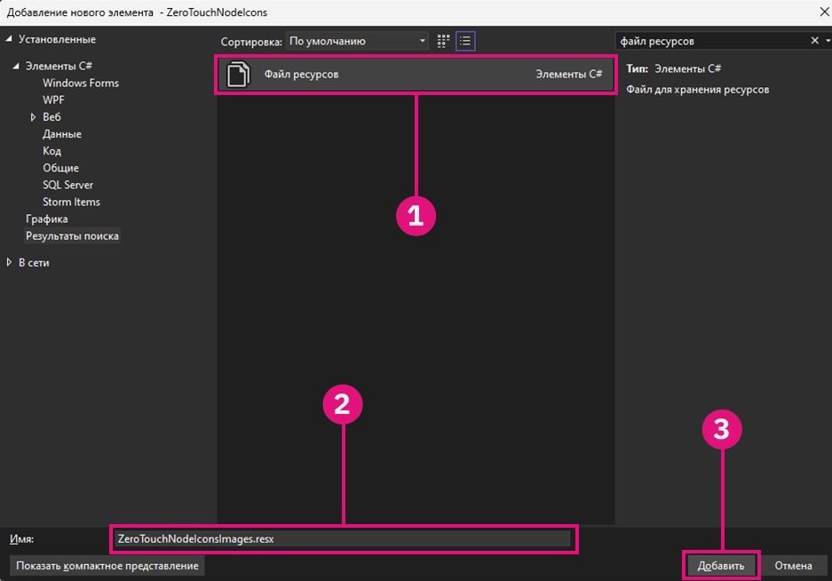
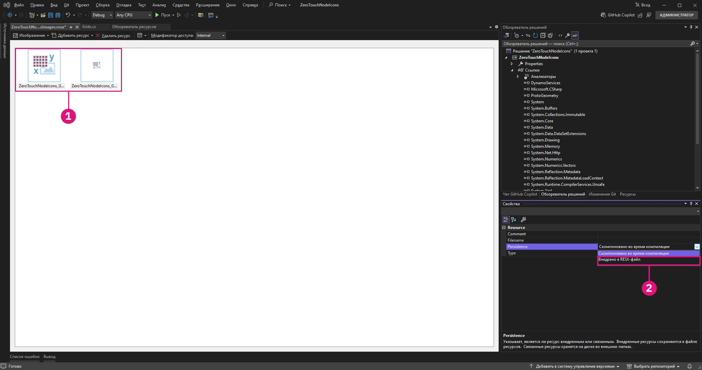
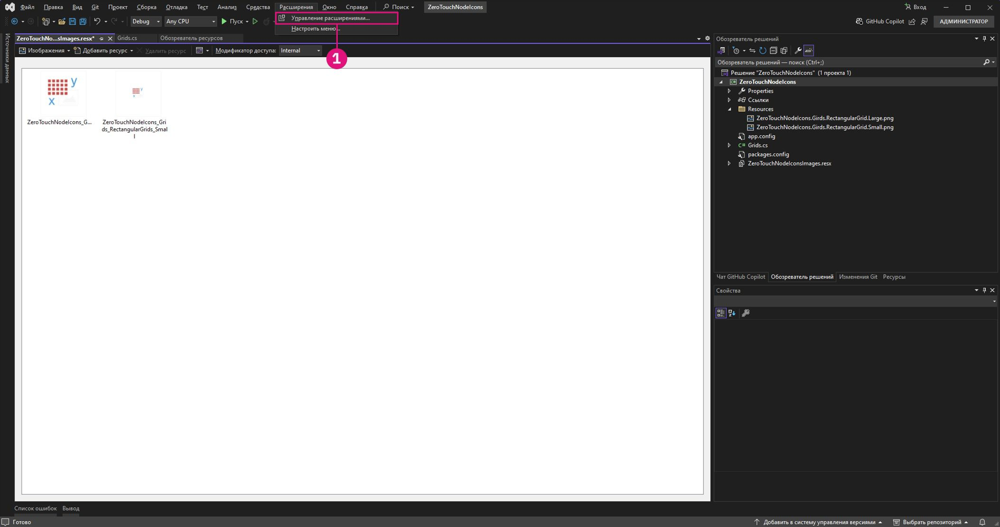
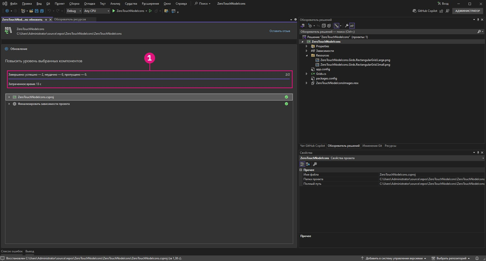

# Zaawansowane dostosowywanie węzłów dodatku Dynamo

Masz już ugruntowaną wiedzę na temat węzłów ZeroTouch. W tej sekcji omówiono zalety dostosowywania węzłów dodatku Dynamo w celu usprawniania funkcjonalności i środowiska użytkownika. Dodając funkcje, takie jak komunikaty ostrzegawcze, komunikaty informacyjne i ikony niestandardowe, można tworzyć węzły, które są bardziej intuicyjne i atrakcyjne wizualnie oraz dostarczają więcej informacji. Te dostosowania nie tylko pomagają użytkownikom zrozumieć potencjalne problemy lub zoptymalizować proces, ale sprawiają też, że węzły te wyróżniają się jako profesjonalne i przyjazne dla użytkownika narzędzia.

Dostosowywanie węzłów to doskonały sposób na zapewnienie, że rozwiązania będą przejrzyste, niezawodne i dopasowane do konkretnych potrzeb projektu.

## Generowanie niestandardowych komunikatów ostrzegawczych za pomocą metody OnLogWarningMessage <a href="#generating-custom-warning-messages-using-onlogwarningmessage" id="generating-custom-warning-messages-using-onlogwarningmessage"></a>

W dodatku Dynamo metoda `OnLogWarningMessage` umożliwia rejestrowanie komunikatów ostrzegawczych bezpośrednio w konsoli dodatku Dynamo. Jest to zaawansowana funkcja, szczególnie w przypadku węzłów Zero Touch, ponieważ umożliwia programistom ostrzeganie użytkowników o problemach z danymi wejściowymi lub parametrami, które mogą prowadzić do nieoczekiwanego zachowania. Z tego podręcznika dowiesz się, jak zaimplementować metodę `OnLogWarningMessage` w dowolnym węźle Zero-Touch.

### Kroki implementacji metody `OnLogWarningMessage` <a href="#implementation-step-for-onlogwarningmessage" id="implementation-step-for-onlogwarningmessage"></a>

#### Krok 1\. Zaimportuj wymaganą przestrzeń nazw <a href="#import-the-required-namespace" id="import-the-required-namespace"></a>

Metoda `OnLogWarningMessage` jest częścią przestrzeni nazw `DynamoServices`, więc zacznij od dodania jej do pliku projektu.

```
using DynamoServices;
```

#### Krok 2\. Określ, kiedy należy rejestrować ostrzeżenia <a href="#identify-when-to-log-warnings" id="identify-when-to-log-warnings"></a>

Przed dodaniem komunikatu ostrzegawczego należy wziąć pod uwagę logikę metody:

* Jakie warunki mogą spowodować niepoprawne lub nieoczekiwane wyniki?
* Czy istnieją określone wartości lub parametry wejściowe wymagane do poprawnego działania metody?

Przykłady warunków do sprawdzenia:

* **Wartości spoza zakresu** (np. `if (inputValue < 0)`).
* **Kolekcje o wartości null lub puste** (np. `if (list == null || list.Count == 0)`).
* **Niezgodny typ danych** (np. jeśli typ pliku nie jest obsługiwany).

#### Krok 3\. Zarejestruj ostrzeżenie za pomocą metody `OnLogWarningMessage`<a href="#use-onlogwarningmessage-to-log-the-warning" id="use-onlogwarningmessage-to-log-the-warning"></a>

Umieść wywołania metody `OnLogWarningMessage`, w których będziesz wykrywać warunki mogące powodować problemy. Gdy warunek zostanie spełniony, zarejestruj komunikat ostrzegawczy, który zawiera jasne wskazówki dla użytkownika.

### Składnia metody `OnLogWarningMessage` <a href="#syntax-for-onlogwarningmessage" id="syntax-for-onlogwarningmessage"></a>

```
LogWarningMessageEvents.OnLogWarningMessage("Your warning message here.");
```

### Przykładowe implementacje metody `OnLogWarningMessage` <a href="#example-implementations-of-onlogwarningmessage" id="example-implementations-of-onlogwarningmessage"></a>

Aby zademonstrować metodę `OnLogWarningMessage` w działaniu, poniżej przedstawiono różne scenariusze, które można napotkać podczas tworzenia węzła Zero Touch.

#### Przykład 1\. Sprawdzanie wejściowych wartości liczbowych <a href="#example-1-validating-numeric-inputs" id="example-1-validating-numeric-inputs"></a>

W tym przykładzie wykorzystaliśmy węzeł niestandardowy utworzony w poprzedniej części **„Analiza przypadku Zero-Touch — węzeł siatki”** do utworzenia metody o nazwie `RectangularGrid`, która generuje siatkę prostokątów na podstawie danych wejściowych `xCount` i `yCount`. Przeanalizujemy testowanie przypadku, w którym dane wejściowe są nieprawidłowe, i użyjemy metody `OnLogWarningMessage` do zarejestrowania ostrzeżenia oraz zatrzymamy przetwarzanie.


##### Używanie metody `OnLogWarningMessage` do weryfikowania danych wejściowych <a href="#using-onlogwarningmessage-for-input-validation" id="using-onlogwarningmessage-for-input-validation"></a>

Podczas generowania siatki na podstawie danych `xCount` i `yCount` przed kontynuowaniem należy się upewnić, że obie wartości są dodatnimi liczbami całkowitymi.

```
public static List<Rectangle> CreateGrid(int xCount, int yCount)
{
    // Check if xCount and yCount are positive
    if (xCount <= 0 || yCount <= 0)
    {
        LogWarningMessageEvents.OnLogWarningMessage("Grid count values must be positive integers.");
        return new List<Rectangle>();  // Return an empty list if inputs are invalid
    }
    // Proceed with grid creation...
}
```

W tym przykładzie:

* **Warunek**: jeśli wartość `xCount` lub `yCount` jest mniejsza niż lub równa zero.
* **Komunikat**: `"Grid count values must be positive integers."`

Spowoduje to wyświetlenie ostrzeżenia w dodatku Dynamo, jeśli użytkownik wprowadzi wartości zerowe lub ujemne, co ułatwi zrozumienie oczekiwanych danych wejściowych. 

Wiemy już, jak to wygląda, więc możemy zaimplementować to w przykładowym węźle Grids:

```
using Autodesk.DesignScript.Geometry;
using DynamoServices;

namespace CustomNodes
{
    public class Grids
    {
        // The empty private constructor.
        // This will not be imported into Dynamo.
        private Grids() { }

        /// <summary>
        /// This method creates a rectangular grid from an X and Y count.
        /// </summary>
        /// <param name="xCount">Number of grid cells in the X direction</param>
        /// <param name="yCount">Number of grid cells in the Y direction</param>
        /// <returns>A list of rectangles</returns>
        /// <search>grid, rectangle</search>
        public static List<Rectangle> RectangularGrid(int xCount = 10, int yCount = 10)
        {
            // Check for valid input values
            if (xCount <= 0 || yCount <= 0)
            {
                // Log a warning message if the input values are invalid
                LogWarningMessageEvents.OnLogWarningMessage("Grid count values must be positive integers.");
                return new List<Rectangle>(); // Return an empty list if inputs are invalid
            }

            double x = 0;
            double y = 0;

            var pList = new List<Rectangle>();

            for (int i = 0; i < xCount; i++)
            {
                y++;
                x = 0;
                for (int j = 0; j < yCount; j++)
                {
                    x++;
                    Point pt = Point.ByCoordinates(x, y);
                    Vector vec = Vector.ZAxis();
                    Plane bP = Plane.ByOriginNormal(pt, vec);
                    Rectangle rect = Rectangle.ByWidthLength(bP, 1, 1);
                    pList.Add(rect);
                    Point cPt = rect.Center();
                }
            }

            return pList;
        }
    }
}
```

##### Przykład 2\. Sprawdzanie pod kątem kolekcji o wartości null lub pustych <a href="#example-2-checking-for-null-or-empty-collections" id="example-2-checking-for-null-or-empty-collections"></a>

Jeśli metoda wymaga listy punktów, ale użytkownik przekaże listę pustą lub listę o wartości null, możesz poinformować go o problemie za pomocą metody `OnLogWarningMessage`.


```
public static Polygon CreatePolygonFromPoints(List<Point> points)
{
    if (points == null || points.Count < 3)
    {
        LogWarningMessageEvents.OnLogWarningMessage("Point list cannot be null or have fewer than three points.");
        return null;  // Return null if the input list is invalid
    }
    // Proceed with polygon creation...
}
```

W tym przykładzie:

* **Warunek**: jeśli lista `points` ma wartość null lub zawiera mniej niż trzy punkty.
* **Komunikat**: `"Point list cannot be null or have fewer than three points."`

Ostrzega to użytkowników, że muszą przekazać prawidłową listę z co najmniej trzema punktami, aby utworzyć wielokąt.

---

##### Przykład 3\. Sprawdzanie zgodności typu pliku <a href="#example-3-verifying-file-type-compatibility" id="example-3-verifying-file-type-compatibility"></a>

W przypadku węzła, który przetwarza ścieżki plików, warto zadbać o to, aby dozwolone były tylko niektóre typy plików. Jeśli zostanie wykryty nieobsługiwany typ pliku, powinno zostać zarejestrowane ostrzeżenie.


```
public static void ProcessFile(string filePath)
{
    if (!filePath.EndsWith(".csv"))
    {
        LogWarningMessageEvents.OnLogWarningMessage("Only CSV files are supported.");
        return;
    }
    // Proceed with file processing...
}
```

W tym przykładzie:

* **Warunek**: jeśli ścieżka pliku nie kończy się na „.csv”.
* **Komunikat**: `"Only CSV files are supported."`

Powoduje to zwrócenie użytkownikom ostrzeżenia, że powinni upewnić się, iż przekazują plik CSV, co pomaga zapobiegać problemom związanym z niezgodnymi formatami plików.

## Dodawanie komunikatów informacyjnych za pomocą metody `OnLogInfoMessage` <a href="#adding-informational-messages-with-onloginfomessage" id="adding-informational-messages-with-onloginfomessage"></a>

W dodatku Dynamo metoda `OnLogInfoMessage` z przestrzeni nazw `DynamoServices` umożliwia programistom rejestrowanie komunikatów informacyjnych bezpośrednio w konsoli dodatku Dynamo. Jest to przydatne do potwierdzania pomyślnych operacji, komunikowania postępu lub dostarczania dodatkowych szczegółowych informacji na temat działań węzłów. Z tego podręcznika dowiesz się, jak dodać metodę `OnLogInfoMessage` w dowolnym węźle Zero Touch w celu udoskonalenia informacji zwrotnych i poprawy środowiska użytkownika.

### Kroki implementacji metody `OnLogInfoMessage` <a href="#implementation-steps-for-onloginfomessage" id="implementation-steps-for-onloginfomessage"></a>
#### Krok 1\. Zaimportuj wymaganą przestrzeń nazw <a href="#step-1-import-the-required-namespace" id="step-1-import-the-required-namespace"></a>

Metoda `OnLogInfoMessage` jest częścią przestrzeni nazw `DynamoServices`, więc zacznij od dodania jej do pliku projektu.

#### Krok 2\. Określ, kiedy należy rejestrować komunikaty informacyjne <a href="#step-2-identify-when-to-log-information" id="step-2-identify-when-to-log-information"></a>

Przed dodaniem komunikatu informacyjnego zastanów się nad celem stosowania metody:

* Potwierdzenie jakich informacji będzie przydatne po zakończeniu operacji?
* Czy w metodzie istnieją kluczowe kroki lub kamienie milowe, o których warto poinformować użytkowników?

Przykłady przydatnych potwierdzeń:

* **Komunikaty o ukończeniu** (np. gdy siatka lub model są w pełni utworzone).
* **Szczegóły przetwarzanych danych** (np. „Pomyślnie przetworzono 10 elementów”).
* **Podsumowania wykonania** (np. parametry używane w procesie).

#### Krok 3\. Zarejestruj komunikaty informacyjne za pomocą metody `OnLogInfoMessage` <a href="#step-3-use-onloginfomessage-to-log-informational-message" id="step-3-use-onloginfomessage-to-log-informational-message"></a>

Umieść wywołania metody `OnLogInfoMessage` na znaczących etapach metody. Po wykonaniu kluczowego kroku lub ukończeniu etapu zarejestruj komunikat informacyjny, aby poinformować użytkownika o tym, co się stało.

### Składnia metody `OnLogInfoMessage` <a href="#syntax-for-onloginfomessage" id="syntax-for-onloginfomessage"></a>

```
LogWarningMessageEvents.OnLogInfoMessage("Your info message here.");
```

### Przykładowe implementacje metody `OnLogInfoMessage` <a href="#example-implementations-of-onloginfomessage" id="example-implementations-of-onloginfomessage"></a>

Poniżej przedstawiono różne scenariusze w celu zademonstrowania stosowania metody `OnLogInfoMessage` w węzłach Zero-Touch.

#### Przykład 1\. Sprawdzanie wejściowych wartości liczbowych <a href="#example-1-validating-numeric-inputs" id="example-1-validating-numeric-inputs"></a>

W tym przykładzie wykorzystaliśmy węzeł niestandardowy utworzony w poprzedniej części **„Analiza przypadku Zero-Touch — węzeł siatki”** do utworzenia metody o nazwie `RectangularGrid`, która generuje siatkę prostokątów na podstawie danych wejściowych `xCount` i `yCount`. Przeanalizujemy testowanie przypadku, w którym dane wejściowe są nieprawidłowe, i użyjemy metody `OnLogInfoMessage` do podania informacji po ukończeniu działania węzła.


###### Używanie metody `OnLogInfoMessage` do weryfikowania danych wejściowych <a href="#using-onloginfomessage-for-unput-validation" id="using-onloginfomessage-for-unput-validation"></a>

Podczas generowania siatki na podstawie danych `xCount` i `yCount` Po wygenerowaniu siatki chcesz potwierdzić jej utworzenie, rejestrując komunikat informacyjny z wymiarami siatki.

```
public static List<Rectangle> CreateGrid(int xCount, int yCount)
{
    var pList = new List<Rectangle>();
    // Grid creation code here...

    // Confirm successful grid creation
    LogWarningMessageEvents.OnLogInfoMessage($"Successfully created a grid with dimensions {xCount}x{yCount}.");

    return pList;
}
```

W tym przykładzie:

* **Warunek**: proces tworzenia siatki został zakończony.
* **Komunikat**: `"Successfully created a grid with dimensions {xCount}x{yCount}."`

Ten komunikat informuje użytkowników, że siatka została utworzona zgodnie z oczekiwaniami, co pomaga im potwierdzić, że węzeł zadziałał zgodnie z oczekiwaniami.

Wiemy już, jak to wygląda, więc możemy zaimplementować to w przykładowym węźle Grids:

```
using Autodesk.DesignScript.Geometry;
using DynamoServices;

namespace CustomNodes
{
    public class Grids
    {
        // The empty private constructor.
        // This will not be imported into Dynamo.
        private Grids() { }

        /// <summary>
        /// This method creates a rectangular grid from an X and Y count.
        /// </summary>
        /// <param name="xCount">Number of grid cells in the X direction</param>
        /// <param name="yCount">Number of grid cells in the Y direction</param>
        /// <returns>A list of rectangles</returns>
        /// <search>grid, rectangle</search>
        public static List<Rectangle> RectangularGrid(int xCount = 10, int yCount = 10)
        {
            double x = 0;
            double y = 0;

            var pList = new List<Rectangle>();

            for (int i = 0; i < xCount; i++)
            {
                y++;
                x = 0;
                for (int j = 0; j < yCount; j++)
                {
                    x++;
                    Point pt = Point.ByCoordinates(x, y);
                    Vector vec = Vector.ZAxis();
                    Plane bP = Plane.ByOriginNormal(pt, vec);
                    Rectangle rect = Rectangle.ByWidthLength(bP, 1, 1);
                    pList.Add(rect);
                    Point cPt = rect.Center();
                }
            }

            // Log an info message indicating the grid was successfully created
            LogWarningMessageEvents.OnLogInfoMessage($"Successfully created a grid with dimensions {xCount}x{yCount}.");

            return pList;
        }
    }
}
```

#### Przykład 2\. Dostarczanie informacji o liczbie pozycji danych <a href="#example-2-providing-data-count-information" id="example-2-providing-data-count-information"></a>

Jeśli tworzysz węzeł, który przetwarza listę punktów, być może warto zarejestrować, ile punktów przetworzono pomyślnie. Może to być przydatne w przypadku dużych zestawów danych.


```
public static List<Point> ProcessPoints(List<Point> points)
{
    var processedPoints = new List<Point>();
    foreach (var point in points)
    {
        // Process each point...
        processedPoints.Add(point);
    }

    // Log info about the count of processed points
    LogWarningMessageEvents.OnLogInfoMessage($"{processedPoints.Count} points were processed successfully.");

    return processedPoints;
}
```

W tym przykładzie:

* **Warunek**: po ukończeniu pętli pokazywanie liczby przetworzonych elementów.
* **Komunikat**: `"6 points were processed successfully."`

Ten komunikat pomoże użytkownikom zrozumieć wynik przetwarzania i potwierdzić, że wszystkie punkty zostały przetworzone.


#### Przykład 3\. Podsumowywanie użytych parametrów <a href="#example-3-summarizing-parameters-used" id="example-3-summarizing-parameters-used"></a>

W niektórych przypadkach przydatne jest potwierdzenie parametrów wejściowych używanych przez węzeł do ukończenia działania. Jeśli na przykład węzeł eksportuje dane do pliku, zarejestrowanie nazwy i ścieżki pliku pozwala poinformować użytkowników, że został użyty poprawny plik.


```
public static void ExportData(string filePath, List<string> data)
{
    // Code to write data to the specified file path...

    // Log the file path used for export
    LogWarningMessageEvents.OnLogInfoMessage($"Data exported successfully to {filePath}.");

}
```

W tym przykładzie:

* **Warunek**: proces eksportu został ukończony pomyślnie.
* **Komunikat**: `"Data exported successfully to {filePath}."`

Ten komunikat potwierdza użytkownikom, że eksport zadziałał, i pokazuje dokładną ścieżkę pliku, co pomaga uniknąć nieporozumień co do lokalizacji plików.

## Tworzenie i dodawanie dokumentacji niestandardowej do węzłów

### Dokumentacja węzłów niestandardowych
W przeszłości w dodatku Dynamo istniały ograniczenia dotyczące sposobu, w jaki autorzy pakietów mogli dostarczać dokumentację dla tworzonych węzłów. Autorów węzłów niestandardowych obowiązywało ograniczenie, w ramach którego mogli dodawać tylko krótki opis wyświetlany w etykiecie narzędzia węzła lub mogli dostarczać pakiet z intensywnie opisanymi wykresami przykładowymi.


### Nowy sposób
Dodatek Dynamo udostępnia teraz autorom pakietów ulepszony system, który pozwala na tworzenie lepszej i zapewniającej szersze informacje dokumentacji węzłów niestandardowych. W tym nowym podejściu wykorzystywany jest przyjazny dla użytkownika język Markdown do tworzenia tekstu i rozszerzenie widoku Przeglądarka dokumentacji do wyświetlania znaczników Markdown w dodatku Dynamo. Używanie języka Markdown zapewnia autorom pakietów szeroki wachlarz nowych możliwości podczas dokumentowania węzłów niestandardowych. 

#### Co to jest Markdown?
Markdown to lekki język znaczników, którego można używać do formatowania dokumentów w postaci zwykłego tekstu. Od czasu powstania języka Markdown w 2004 roku jego popularność tylko wzrosła i jest obecnie jednym z najpopularniejszych języków znaczników na świecie.

#### Wprowadzenie do języka Markdown
Rozpoczęcie tworzenia plików Markdown jest łatwe — wystarczy prosty edytor tekstu, taki jak Notatnik, i można zaczynać. Istnieją jednak łatwiejsze sposoby pisania treści Markdown niż korzystanie z Notatnika. Dostępnych jest kilka edytorów online, takich jak [Dillinger](https://dillinger.io/), które pozwalają zobaczyć zmiany w czasie rzeczywistym podczas ich wprowadzania. Innym popularnym sposobem edytowania plików Markdown jest używanie edytora kodu, takiego jak [Visual Studio Code](https://code.visualstudio.com/).

#### Co umożliwia język Markdown?
Język Markdown jest bardzo elastyczny i powinien zapewniać wystarczającą funkcjonalność, aby łatwo tworzyć dobrą dokumentację — w tym dodawanie plików multimedialnych, takich jak obrazy lub filmy, tworzenie tabel z różnymi formami treści i oczywiście stosowanie prostego formatowania tekstu, takiego jak **pogrubienie** lub *kursywa*. Wszystko to i wiele więcej jest możliwe podczas pisania dokumentów Markdown — aby uzyskać więcej informacji, zapoznaj się z tym przewodnikiem, w którym wyjaśniono [podstawową składnię języka Markdown](https://www.Markdownguide.org/basic-syntax/).

### Dodawanie rozszerzonej dokumentacji do węzłów
Dodawanie dokumentacji do węzłów jest łatwe. Dokumentację można dodać do wszystkich odmian węzłów niestandardowych. Obejmuje to:
* Gotowe węzły dodatku Dynamo.
* Węzły niestandardowe (.dyf) — kolekcje gotowych i/lub innych węzłów z pakietów.
* Węzły niestandardowe z pakietów języka C# (znane również jako Zerotouch; te węzły niestandardowe wyglądają jak gotowe węzły).
* Węzły NodeModel (węzły, które zawierają specjalne elementy interfejsu użytkownika, takie jak listy rozwijane lub przyciski wyboru).
* Węzły NodeModel z niestandardowym interfejsem użytkownika (węzły, które zawierają unikatowe elementy interfejsu użytkownika, takie jak grafika w węźle)

Wykonaj te kilka czynności, aby wyświetlić pliki Markdown w dodatku Dynamo.

#### Otwieranie plików dokumentacji w dodatku Dynamo
Dodatek Dynamo wyświetla dokumentację węzłów za pomocą rozszerzenia widoku Przeglądarka dokumentacji. Aby otworzyć dokumentację węzła, kliknij węzeł prawym przyciskiem myszy i wybierz polecenie Pomoc. Spowoduje to otwarcie Przeglądarki dokumentacji i wyświetlenie treści Markdown skojarzonej z tym węzłem, jeśli jest dostępna.


Dokumentacja wyświetlana w Przeglądarce dokumentacji składa się z dwóch części. Pierwszą z nich jest sekcja `Node Info`, która jest generowana automatycznie na podstawie informacji wyodrębnionych z węzła, takich jak dane wejściowe/wyjściowe, kategoria węzła, nazwa/przestrzeń nazw węzłów i krótki opis węzłów. Druga część przedstawia dokumentację węzłów niestandardowych, która jest plikiem Markdown dostarczanym w celu udokumentowania węzła.


#### Folder doc pakietu
Aby dodać pliki dokumentacji do węzłów w dodatku Dynamo, utwórz nowy folder w katalogu pakietu o nazwie `/doc`. Po wczytaniu pakietu dodatek Dynamo przeskanuje ten katalog i pobierze wszystkie znajdujące się w nim pliki Markdown dokumentacji.

#### Nazewnictwo plików Markdown
Aby dodatek Dynamo wiedział, który plik należy otworzyć na żądanie dla określonego węzła, nazwa pliku Markdown musi mieć określony format. Plik Markdown powinien być nazwany zgodnie z dokumentowaną przestrzenią nazw węzła. Jeśli nie masz pewności co do przestrzeni nazw węzła, zajrzyj do sekcji `Node Info` po naciśnięciu pozycji `Help` na węźle, a pod nazwą węzła zobaczysz pełną przestrzeń nazw wybranego węzła. 

Ta przestrzeń nazw powinna być nazwą pliku Markdown dla tego konkretnego węzła. Na przykład przestrzeń nazw `CustomNodeExample` z powyższych obrazów to `TestPackage.TestCategory.CustomNodeExample`, dlatego plik Markdown dla tego węzła powinien mieć nazwę `TestPackage.TestCategory.CustomNodeExample.md`

W szczególnych przypadkach, gdy występują przeciążenia węzłów (występują węzły o tej samej nazwie, ale różnych zestawach danych wejściowych), należy dodać nazwy pozycji danych wejściowych ujęte w `()` po przestrzeni nazw węzła. Na przykład wbudowany węzeł `Geometry.Translate` ma wiele przeciążeń. W tym przypadku plikom Markdown dla poniższych węzłów nadamy następujące nazwy: `Autodesk.DesignScript.Geometry.Geometry.Translate(geometry,direction).md` `Autodesk.DesignScript.Geometry.Geometry.Translate(geometry,direction,distance).md`


#### Modyfikowanie plików Markdown, gdy są otwarte w dodatku Dynamo
Aby ułatwić modyfikowanie plików dokumentacji, Przeglądarka dokumentacji implementuje funkcję obserwatora plików w otwartym pliku dokumentacji. Umożliwia to wprowadzanie zmian w pliku Markdown i natychmiastowe oglądanie zmian w dodatku Dynamo. 


Nowe pliki dokumentacji można również dodawać, gdy dodatek Dynamo jest otwarty. Po prostu dodaj do folderu `/doc` nowy plik Markdown o nazwie odpowiadającej węzłowi, który dokumentuje.

## Dodawanie ikon niestandardowych do węzłów Zero Touch

### Przegląd

Ikony niestandardowe dla węzłów Zero Touch w dodatku Dynamo umożliwiają wizualne wyróżnienie węzłów i ułatwienie ich rozpoznania w bibliotece. Dodając ikony niestandardowe, wyróżnisz swoje węzły na tle innych, umożliwiając użytkownikom szybkie identyfikowanie ich na liście.

Z tego podręcznika dowiesz się, jak dodawać ikony do węzłów Zero Touch.


### Kroki dodawania niestandardowych ikon węzłów

#### Krok 1\. Skonfiguruj projekt

Aby rozpocząć, utwórz projekt biblioteki klas programu Visual Studio (.NET Framework) dla węzłów Zero Touch. Jeśli nie masz jeszcze projektu, zapoznaj się z sekcją **Pierwsze kroki**, aby uzyskać instrukcje krok po kroku dotyczące jego tworzenia.


Upewnij się, że masz co najmniej jeden działający węzeł Zero Touch, ponieważ ikony można dodawać tylko do istniejących węzłów. Aby uzyskać wskazówki, zobacz **Analiza przypadku Zero-Touch — węzeł siatki**.


#### Krok 2\. Utwórz obrazy ikon

Tworzenie ikon niestandardowych:

1. **Zaprojektuj ikony**: użyj edytora obrazów, aby utworzyć proste i przejrzyste wizualnie ikony dla węzłów.
2. **Specyfikacje obrazów**:
    * **Mała ikona**: 32x32 piksele (używana na pasku bocznym Biblioteki i w samym węźle).
    * **Duża ikona**: 128x128 pikseli (używana we właściwościach węzła po umieszczeniu wskaźnika myszy na węźle w bibliotece).
3. **Konwencja nazewnictwa plików**:
    * Nazwy plików muszą być zgodne z poniższym formatem, aby można było skojarzyć je z odpowiednim węzłem:
        * **`<ProjectName>.<ClassName>.<MethodName>.Small.png`** (w przypadku małej ikony).
        * **`<ProjectName>.<ClassName>.<MethodName>.Large.png`** (w przypadku dużej ikony).

**Przykład**: jeśli projekt to `ZeroTouchNodeIcons`, klasa to `Grids`, a metoda to `RectangularGrid`, pliki będą miały nazwy:

* `ZeroTouchNodeIcons.Grids.RectangularGrid.Small.png`
* `ZeroTouchNodeIcons.Grids.RectangularGrid.Large.png`

> Wskazówka: stosuj spójny motyw projektu we wszystkich ikonach, aby uzyskać profesjonalny wygląd.


#### Krok 3\. Dodaj plik zasobów do projektu

Aby osadzić ikony w pliku `.dll`, utwórz plik zasobów:

1. **Dodaj nowy plik zasobów**:

  * Kliknij prawym przyciskiem myszy projekt w **Eksploratorze rozwiązań**.


  * Przejdź do obszaru **Dodaj > Nowy element** i wybierz opcję **Plik zasobów**.



  * Nadaj plikowi nazwę `<ProjectName>Images.resx`. Przykładowo: `ZeroTouchNodeIconsImages.resx`.

2. **Wyczyść właściwość narzędzia niestandardowego**:
    * Wybierz plik zasobów w **Eksploratorze rozwiązań**.
    * W panelu **Właściwości** wyczyść pole `Custom Tool`, usuwając wartość `ResXFileCodeGenerator`.


> *UWAGA: wyczyszczenie pola narzędzia niestandardowego (Custom Tool) spowoduje, że program Visual Studio przekonwertuje kropki na podkreślenia w nazwach zasobów. Przed rozpoczęciem kompilacji sprawdź, czy nazwy zasobów mają kropki oddzielające nazwy klas, a nie podkreślenia.*


#### Krok 4\. Dodaj obrazy jako zasoby

1. Otwórz plik zasobów za pomocą **Edytora zasobów zarządzanych (starsza wersja)**:
    * Jeśli używasz programu Visual Studio 17.11 lub nowszego, kliknij prawym przyciskiem myszy plik zasobów, wybierz pozycję **Otwórz za pomocą**, a następnie wybierz pozycję **Edytor zasobów zarządzanych (starsza wersja)**.
    * Jeśli używasz programu Visual Studio w wersji starszej niż 17.11, kliknij dwukrotnie plik zasobów, aby otworzyć go za pomocą Edytora zasobów (który w Twojej wersji programu Visual Studio nie został jeszcze oznaczony jako starsza wersja).


2. Dodaj obrazy:
    * Przeciągnij pliki obrazów do edytora i upuść je lub użyj opcji **Dodaj istniejący plik**.


3. Trwałość aktualizacji:
    * Wybierz obrazy z poziomu Edytora zasobów (to rozwiązanie nie zadziała, jeśli wybierzesz je w Eksploratorze rozwiązań), zmień właściwość **Persistence** (Trwałość) w panelu **Właściwości** na `Embedded in .resx`. Dzięki temu obrazy zostaną uwzględnione w pliku `.dll`.



#### Krok 5\. Przekonwertuj projekt na styl SDK

Jeśli projekt nie jest jeszcze w stylu zestawu SDK (co jest wymagane do osadzenia zasobów), przekonwertuj go:

1. Zainstaluj rozszerzenie `.NET Upgrade Assistant` za pomocą menu **Rozszerzenia > Zarządzaj rozszerzeniami** programu Visual Studio.




2. Kliknij prawym przyciskiem myszy projekt w **Eksploratorze rozwiązań** i wybierz polecenie **Uaktualnij > Przekonwertuj projekt na styl SDK**.


3. Poczekaj na zakończenie konwersji.




#### Krok 6\. Dodaj skrypt po kompilacji w celu osadzenia zasobów

1. Usuń projekt z pamięci:
    * Kliknij prawym przyciskiem myszy projekt w **Eksploratorze rozwiązań** i wybierz opcję **Usuń projekt**.


2. Edytuj plik `.csproj`:
    * Dodaj następujący element `<Target>` między elementami `</ItemGroup>` i `</Project>`:

```
<Target Name="CreateNodeIcons" AfterTargets="PostBuildEvent">
		<!-- Get System.Drawing.dll     -->
		<GetReferenceAssemblyPaths TargetFrameworkMoniker=".NETFramework, Version=v4.8">
			<Output TaskParameter="FullFrameworkReferenceAssemblyPaths" PropertyName="FrameworkAssembliesPath" />
		</GetReferenceAssemblyPaths>
		<!-- Get assembly -->
		<GetAssemblyIdentity AssemblyFiles="$(OutDir)$(TargetName).dll">
			<Output TaskParameter="Assemblies" ItemName="AssemblyInfo" />
		</GetAssemblyIdentity>
		<!-- Generate customization dll -->
		<GenerateResource SdkToolsPath="$(TargetFrameworkSDKToolsDirectory)" UseSourcePath="true" Sources="$(ProjectDir)ZeroTouchNodeIconsImages.resx" OutputResources="$(ProjectDir)ZeroTouchNodeIconsImages.resources" References="$(FrameworkAssembliesPath)System.Drawing.dll" />
		<AL SdkToolsPath="$(TargetFrameworkSDKToolsDirectory)" TargetType="library" EmbedResources="$(ProjectDir)ZeroTouchNodeIconsImages.resources" OutputAssembly="$(OutDir)ZeroTouchNodeIcons.customization.dll" Version="%(AssemblyInfo.Version)" />
	</Target>
```

1. Zastąp wszystkie wystąpienia `ZeroTouchNodeIcons` nazwą projektu.
2. Wczytaj ponownie projekt:
    * Kliknij prawym przyciskiem myszy projekt usunięty z pamięci i wybierz opcję **Załaduj ponownie projekt**.


#### Krok 7\. Skompiluj i wczytaj plik .dll do dodatku Dynamo

1. Skompiluj projekt:
    * Po dodaniu skryptu po kompilacji skompiluj projekt w programie Visual Studio.


2. Sprawdź pliki wyjściowe:
    * Upewnij się, że pliki `.dll` i `.customization.dll` znajdują się w folderze `bin`.
3. Dodaj plik `.dll` do dodatku Dynamo:
    * W dodatku Dynamo użyj przycisku Importuj bibliotekę, aby zaimportować plik .dll do dodatku Dynamo.


4. Węzły niestandardowe powinny być teraz wyświetlane z odpowiednimi ikonami.