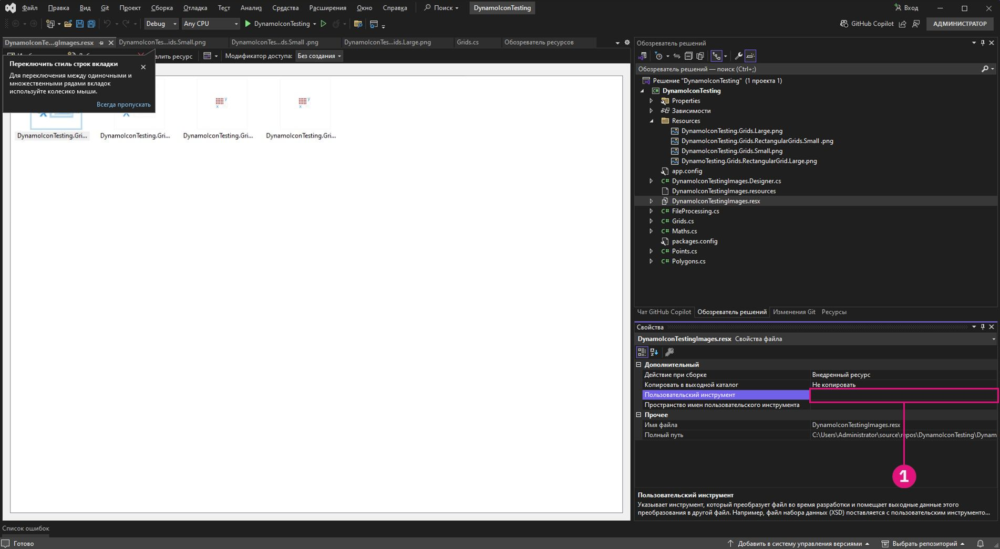
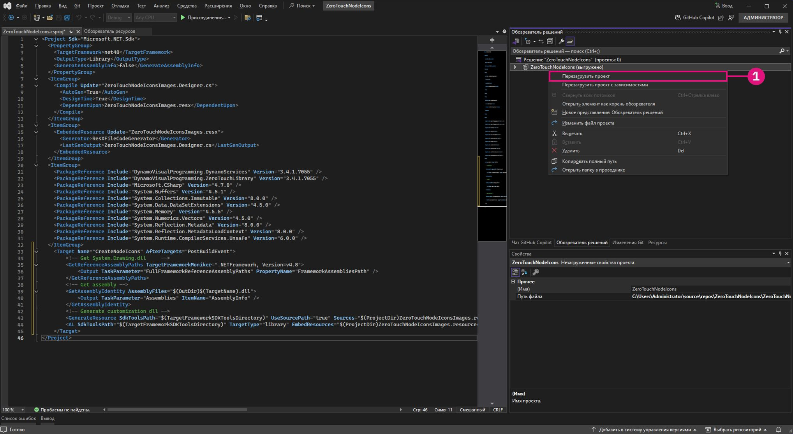

# Personnalisation avancée des nœuds Dynamo 

Après avoir établi des bases solides sur Zero-Touch, cette section passe en revue les avantages de la personnalisation des nœuds Dynamo pour améliorer à la fois la fonctionnalité et l’expérience utilisateur. En ajoutant des fonctionnalités telles que des messages d’avertissement, des messages d’information et des icônes personnalisées, vous pouvez créer des nœuds plus intuitifs, informatifs et visuellement attrayants. En plus d’aider les utilisateurs à comprendre les problèmes potentiels ou à optimiser leurs workflows, ces optimisations font de vos nœuds des outils professionnels et faciles à utiliser.

La personnalisation des nœuds est un excellent moyen de s’assurer que vos solutions sont claires, fiables et adaptées aux besoins spécifiques de chaque projet.

## Générer des messages d’avertissement personnalisés avec OnLogWarningMessage <a href="#generating-custom-warning-messages-using-onlogwarningmessage" id="generating-custom-warning-messages-using-onlogwarningmessage"></a>

Dans Dynamo, la méthode `OnLogWarningMessage` permet de consigner les messages d’avertissement directement dans la console de Dynamo. Il s’agit d’une fonctionnalité très puissante, en particulier pour les nœuds Zero Touch, car elle permet aux développeurs d’alerter les utilisateurs lorsque les entrées ou les paramètres présentent des problèmes pouvant entraîner un comportement inattendu. Ce guide vous explique comment mettre en œuvre `OnLogWarningMessage` dans n’importe quel nœud Zero Touch.

### Étapes de mise en œuvre pour `OnLogWarningMessage` <a href="#implementation-step-for-onlogwarningmessage" id="implementation-step-for-onlogwarningmessage"></a>

#### Étape 1 : importer l’espace de nom requis <a href="#import-the-required-namespace" id="import-the-required-namespace"></a>

`OnLogWarningMessage` fait partie de l’espace de nom `DynamoServices`. Commencez donc par l’ajouter au fichier de votre projet.

```
using DynamoServices;
```

#### Étape 2 : déterminer quand consigner les avertissements <a href="#identify-when-to-log-warnings" id="identify-when-to-log-warnings"></a>

Avant d’ajouter un message d’avertissement, tenez compte de la logique de votre méthode :

* Quelles sont les conditions susceptibles d’entraîner des résultats incorrects ou inattendus ?
* Existe-t-il des valeurs d’entrée ou des paramètres spécifiques dont la méthode a besoin pour fonctionner correctement ?

Exemples de conditions à vérifier :

* **Valeurs hors intervalle** (p. ex., `if (inputValue < 0)`).
* **Collections nulles ou vides** (p. ex., `if (list == null || list.Count == 0)`).
* **Non-correspondance des types de données** (p. ex., si un type de fichier n’est pas pris en charge).

#### Étape 3 : utiliser `OnLogWarningMessage` pour consigner l’avertissement <a href="#use-onlogwarningmessage-to-log-the-warning" id="use-onlogwarningmessage-to-log-the-warning"></a>

Passez des appels `OnLogWarningMessage` là où vous détectez des conditions pouvant causer des problèmes. Lorsque la condition est remplie, consignez un message d’avertissement qui fournit des indications claires à l’utilisateur.

### Syntaxe pour `OnLogWarningMessage` <a href="#syntax-for-onlogwarningmessage" id="syntax-for-onlogwarningmessage"></a>

```
LogWarningMessageEvents.OnLogWarningMessage("Your warning message here.");
```

### Exemples de mise en œuvre de `OnLogWarningMessage` <a href="#example-implementations-of-onlogwarningmessage" id="example-implementations-of-onlogwarningmessage"></a>

Pour démontrer `OnLogWarningMessage` en action, voici différents scénarios que vous pouvez rencontrer lors de la création d’un nœud Zero Touch.

#### Exemple 1 : validation des entrées numériques <a href="#example-1-validating-numeric-inputs" id="example-1-validating-numeric-inputs"></a>

Dans cet exemple, nous allons nous appuyer sur le nœud personnalisé créé dans la précédente **« Étude de cas Zero-Touch : nœud grille »,** une méthode appelée `RectangularGrid` qui génère une grille de rectangles en fonction des entrées `xCount` et `yCount`. Nous allons voir comment effectuer un test pour savoir si une entrée est invalide, puis comment utiliser `OnLogWarningMessage` pour enregistrer un avertissement et arrêter le traitement.


##### Utilisation de `OnLogWarningMessage` pour la validation des entrées <a href="#using-onlogwarningmessage-for-input-validation" id="using-onlogwarningmessage-for-input-validation"></a>

Lors de la génération d’une grille basée sur `xCount` et `yCount`, vérifiez que les deux valeurs sont des entiers positifs avant de continuer.

```
public static List<Rectangle> CreateGrid(int xCount, int yCount)
{
    // Check if xCount and yCount are positive
    if (xCount <= 0 || yCount <= 0)
    {
        LogWarningMessageEvents.OnLogWarningMessage("Grid count values must be positive integers.");
        return new List<Rectangle>();  // Return an empty list if inputs are invalid
    }
    // Proceed with grid creation...
}
```

Dans cet exemple :

* **Condition** : si `xCount` ou `yCount` est inférieur ou égal à zéro.
* **Message** : `"Grid count values must be positive integers."`

Cela affichera l’avertissement dans Dynamo si un utilisateur saisit des valeurs nulles ou négatives, ce qui l’aidera à comprendre l’entrée attendue. 

Maintenant que nous savons à quoi cela ressemble, nous pouvons le mettre en œuvre dans l’exemple de nœud Grids :

```
using Autodesk.DesignScript.Geometry;
using DynamoServices;

namespace CustomNodes
{
    public class Grids
    {
        // The empty private constructor.
        // This will not be imported into Dynamo.
        private Grids() { }

        /// <summary>
        /// This method creates a rectangular grid from an X and Y count.
        /// </summary>
        /// <param name="xCount">Number of grid cells in the X direction</param>
        /// <param name="yCount">Number of grid cells in the Y direction</param>
        /// <returns>A list of rectangles</returns>
        /// <search>grid, rectangle</search>
        public static List<Rectangle> RectangularGrid(int xCount = 10, int yCount = 10)
        {
            // Check for valid input values
            if (xCount <= 0 || yCount <= 0)
            {
                // Log a warning message if the input values are invalid
                LogWarningMessageEvents.OnLogWarningMessage("Grid count values must be positive integers.");
                return new List<Rectangle>(); // Return an empty list if inputs are invalid
            }

            double x = 0;
            double y = 0;

            var pList = new List<Rectangle>();

            for (int i = 0; i < xCount; i++)
            {
                y++;
                x = 0;
                for (int j = 0; j < yCount; j++)
                {
                    x++;
                    Point pt = Point.ByCoordinates(x, y);
                    Vector vec = Vector.ZAxis();
                    Plane bP = Plane.ByOriginNormal(pt, vec);
                    Rectangle rect = Rectangle.ByWidthLength(bP, 1, 1);
                    pList.Add(rect);
                    Point cPt = rect.Center();
                }
            }

            return pList;
        }
    }
}
```

##### Exemple 2 : recherche de collections nulles ou vides <a href="#example-2-checking-for-null-or-empty-collections" id="example-2-checking-for-null-or-empty-collections"></a>

Si une liste de points est nécessaire pour votre méthode, mais qu’un utilisateur transmet une liste vide ou nulle, vous pouvez utiliser `OnLogWarningMessage` pour l’informer du problème.


```
public static Polygon CreatePolygonFromPoints(List<Point> points)
{
    if (points == null || points.Count < 3)
    {
        LogWarningMessageEvents.OnLogWarningMessage("Point list cannot be null or have fewer than three points.");
        return null;  // Return null if the input list is invalid
    }
    // Proceed with polygon creation...
}
```

Dans cet exemple :

* **Condition** : si la liste `points` est nulle ou contient moins de trois points.
* **Message** : `"Point list cannot be null or have fewer than three points."`

Cela avertit les utilisateurs qu’ils doivent transmettre une liste valide avec au moins trois points pour former un polygone.

---

##### Exemple 3 : vérification de la compatibilité des types de fichiers <a href="#example-3-verifying-file-type-compatibility" id="example-3-verifying-file-type-compatibility"></a>

Pour un nœud qui traite les chemins d’accès aux fichiers, il pourrait être judicieux de vous assurer que seuls certains types de fichiers sont autorisés. Si un type de fichier non pris en charge est détecté, consignez un avertissement.


```
public static void ProcessFile(string filePath)
{
    if (!filePath.EndsWith(".csv"))
    {
        LogWarningMessageEvents.OnLogWarningMessage("Only CSV files are supported.");
        return;
    }
    // Proceed with file processing...
}
```

Dans cet exemple :

* **Condition** : si le chemin d’accès au fichier ne se termine pas par « .csv ».
* **Message** : `"Only CSV files are supported."`

Cela avertit les utilisateurs qu’ils doivent s’assurer de transmettre un fichier CSV pour éviter les problèmes liés aux formats de fichiers incompatibles.

## Ajout de messages d’information avec `OnLogInfoMessage` <a href="#adding-informational-messages-with-onloginfomessage" id="adding-informational-messages-with-onloginfomessage"></a>

Dans Dynamo, `OnLogInfoMessage` de l’espace de nom `DynamoServices` permet aux développeurs de consigner les messages d’information directement dans la console de Dynamo. Cela est utile pour confirmer la réussite des opérations, communiquer la progression ou fournir des informations supplémentaires sur les actions des nœuds. Dans ce guide, vous apprendrez à ajouter `OnLogInfoMessage` à n’importe quel nœud Zero-Touch pour améliorer les retours et l’expérience utilisateur.

### Étapes de mise en œuvre pour `OnLogInfoMessage` <a href="#implementation-steps-for-onloginfomessage" id="implementation-steps-for-onloginfomessage"></a>
#### Étape 1 : importer l’espace de nom requis <a href="#step-1-import-the-required-namespace" id="step-1-import-the-required-namespace"></a>

`OnLogInfoMessage` fait partie de l’espace de nom `DynamoServices`. Commencez donc par l’ajouter au fichier de votre projet.

#### Étape 2 : déterminer quand consigner les informations <a href="#step-2-identify-when-to-log-information" id="step-2-identify-when-to-log-information"></a>

Avant d’ajouter un message d’information, réfléchissez à l’objectif de votre méthode :

* Quelles informations serait-il utile de confirmer une fois une action terminée ?
* La méthode comprend-elle des étapes clés sur lesquels les utilisateurs pourraient vouloir être informés ?

Exemples de confirmations utiles :

* **Messages de réussite** (p. ex., lorsqu’une grille ou un modèle a été créé).
* **Détails sur les données traitées** (p. ex., « 10 éléments ont été traités »).
* **Résumés d’exécution** (p. ex., paramètres utilisés dans le processus).

#### Étape 3 : utiliser `OnLogInfoMessage` pour consigner les messages d’information <a href="#step-3-use-onloginfomessage-to-log-informational-message" id="step-3-use-onloginfomessage-to-log-informational-message"></a>

Passez `OnLogInfoMessage` appels à des points pertinents de votre méthode. Lorsqu’une étape clé commence ou se termine avec succès, consignez un message d’information pour informer l’utilisateur de ce qui s’est passé.

### Syntaxe pour `OnLogInfoMessage` <a href="#syntax-for-onloginfomessage" id="syntax-for-onloginfomessage"></a>

```
LogWarningMessageEvents.OnLogInfoMessage("Your info message here.");
```

### Exemples de mise en œuvre de `OnLogInfoMessage` <a href="#example-implementations-of-onloginfomessage" id="example-implementations-of-onloginfomessage"></a>

Voici différents scénarios illustrant l’utilisation de `OnLogInfoMessage` dans vos nœuds Zero Touch.

#### Exemple 1 : validation des entrées numériques <a href="#example-1-validating-numeric-inputs" id="example-1-validating-numeric-inputs"></a>

Dans cet exemple, nous allons nous appuyer sur le nœud personnalisé créé dans la précédente **« Étude de cas Zero-Touch : nœud grille »,** une méthode appelée `RectangularGrid` qui génère une grille de rectangles en fonction des entrées `xCount` et `yCount`. Nous allons voir comment effectuer un test pour savoir si une entrée est invalide, puis comment utiliser `OnLogInfoMessage` pour fournir des informations une fois l’exécution du nœud terminée.


###### Utilisation de `OnLogInfoMessage` pour la validation des entrées <a href="#using-onloginfomessage-for-unput-validation" id="using-onloginfomessage-for-unput-validation"></a>

Lors de la génération d’une grille basée sur `xCount` et `yCount`, Après avoir généré la grille, vous devez confirmer sa création en consignant un message d’information avec les dimensions de la grille.

```
public static List<Rectangle> CreateGrid(int xCount, int yCount)
{
    var pList = new List<Rectangle>();
    // Grid creation code here...

    // Confirm successful grid creation
    LogWarningMessageEvents.OnLogInfoMessage($"Successfully created a grid with dimensions {xCount}x{yCount}.");

    return pList;
}
```

Dans cet exemple :

* **Condition** : le processus de création de la grille est terminé.
* **Message** : `"Successfully created a grid with dimensions {xCount}x{yCount}."`

Ce message informera les utilisateurs que la grille a été créée selon les indications fournies, ce qui leur permettra de confirmer que le nœud a fonctionné comme prévu.

Maintenant que nous savons à quoi cela ressemble, nous pouvons le mettre en œuvre dans l’exemple de nœud Grids :

```
using Autodesk.DesignScript.Geometry;
using DynamoServices;

namespace CustomNodes
{
    public class Grids
    {
        // The empty private constructor.
        // This will not be imported into Dynamo.
        private Grids() { }

        /// <summary>
        /// This method creates a rectangular grid from an X and Y count.
        /// </summary>
        /// <param name="xCount">Number of grid cells in the X direction</param>
        /// <param name="yCount">Number of grid cells in the Y direction</param>
        /// <returns>A list of rectangles</returns>
        /// <search>grid, rectangle</search>
        public static List<Rectangle> RectangularGrid(int xCount = 10, int yCount = 10)
        {
            double x = 0;
            double y = 0;

            var pList = new List<Rectangle>();

            for (int i = 0; i < xCount; i++)
            {
                y++;
                x = 0;
                for (int j = 0; j < yCount; j++)
                {
                    x++;
                    Point pt = Point.ByCoordinates(x, y);
                    Vector vec = Vector.ZAxis();
                    Plane bP = Plane.ByOriginNormal(pt, vec);
                    Rectangle rect = Rectangle.ByWidthLength(bP, 1, 1);
                    pList.Add(rect);
                    Point cPt = rect.Center();
                }
            }

            // Log an info message indicating the grid was successfully created
            LogWarningMessageEvents.OnLogInfoMessage($"Successfully created a grid with dimensions {xCount}x{yCount}.");

            return pList;
        }
    }
}
```

#### Exemple 2 : fournir des informations sur le nombre de données <a href="#example-2-providing-data-count-information" id="example-2-providing-data-count-information"></a>

Si vous créez un nœud qui traite une liste de points, il pourrait être judicieux de consigner le nombre de points ayant été traités. Cela peut s’avérer utile pour les grands jeux de données.


```
public static List<Point> ProcessPoints(List<Point> points)
{
    var processedPoints = new List<Point>();
    foreach (var point in points)
    {
        // Process each point...
        processedPoints.Add(point);
    }

    // Log info about the count of processed points
    LogWarningMessageEvents.OnLogInfoMessage($"{processedPoints.Count} points were processed successfully.");

    return processedPoints;
}
```

Dans cet exemple :

* **Condition** : une fois la boucle terminée, affichage du nombre d’éléments traités.
* **Message** : `"6 points were processed successfully."`

Ce message aidera les utilisateurs à comprendre le résultat du traitement et à confirmer que tous les points ont été traités.


#### Exemple 3 : résumer les paramètres utilisés <a href="#example-3-summarizing-parameters-used" id="example-3-summarizing-parameters-used"></a>

Dans certains cas, il est utile de confirmer les paramètres d’entrée qu’un nœud a utilisés pour effectuer une action. Par exemple, si votre nœud exporte des données vers un fichier, la consignation du nom et du chemin d’accès du fichier peut indiquer aux utilisateurs que le bon fichier a été utilisé.


```
public static void ExportData(string filePath, List<string> data)
{
    // Code to write data to the specified file path...

    // Log the file path used for export
    LogWarningMessageEvents.OnLogInfoMessage($"Data exported successfully to {filePath}.");

}
```

Dans cet exemple :

* **Condition** : le processus d’exportation s’effectue correctement.
* **Message** : `"Data exported successfully to {filePath}."`

Ce message confirme aux utilisateurs que l’exportation a fonctionné et affiche le chemin d’accès exact du fichier, ce qui permet d’éviter toute confusion quant à l’emplacement des fichiers.

## Créer une documentation personnalisée et l’ajouter à des nœuds

### Documentation personnalisée de nœuds
La façon dont les créateurs de packages peuvent ajouter de la documentation à leurs nœuds dans Dynamo a longtemps été limitée. Les créateurs de nœuds personnalisés ont longtemps été limités à une brève description qui s’affiche dans l’info-bulle du nœud, ou à expédier votre package avec des exemples de graphes comportant de nombreuses annotations.


### Nouvelle méthode
Dynamo offre désormais un système amélioré permettant aux créateurs de packages de doter les nœuds personnalisés d’une documentation plus détaillée. Cette nouvelle approche utilise le langage convivial Markdown pour la création de texte et l’extension d’affichage Explorateur de documentation pour afficher le Markdown dans Dynamo. L’utilisation de Markdown offre aux créateurs de packages un large éventail de nouvelles possibilités pour documenter les nœuds personnalisés. 

#### Qu’est-ce que Markdown ?
Markdown est un langage de balisage léger que vous pouvez utiliser pour formater des documents en texte brut. Depuis sa création en 2004, sa popularité n’a cessé d’augmenter et il constitue désormais l’un des langages de balisage les plus populaires au monde.

#### Mise en route avec Markdown
Commencer à créer des fichiers Markdown est facile : vous avez uniquement besoin d’un simple éditeur de texte, comme le Bloc-notes, et vous êtes prêt. Toutefois, il existe des manières plus faciles d’écrire des fichiers Markdown que d’utiliser le Bloc-notes. Il existe plusieurs éditeurs en ligne, tels que [Dillinger](https://dillinger.io/), qui vous permettent de voir vos modifications en temps réel. Une autre méthode commune de modification des fichiers Markdown consiste à utiliser un éditeur de code tel que [Visual Studio Code](https://code.visualstudio.com/).

#### Que peut faire Markdown ?
Markdown est très flexible et fournit les fonctionnalités nécessaires pour créer facilement une bonne documentation, parmi elles : l’ajout de fichiers multimédias tels que des images ou des vidéos, la création de tableaux avec différentes formes de contenu et, bien sûr, des fonctionnalités simples de mise en forme du texte, telles que la mise en **gras** ou *italique*. Vous pouvez faire tout cela et bien plus encore lors de l’écriture de documents Markdown. Pour plus d’informations, consultez ce guide qui explique la [syntaxe Markdown de base](https://www.Markdownguide.org/basic-syntax/).

### Ajout d’une documentation étendue aux nœuds
Ajouter de la documentation à vos nœuds est une tâche simple. Vous pouvez ajouter la documentation à tous les types de nœuds personnalisés :
* Nœuds Dynamo prêts à l’emploi
* Nœuds personnalisés (.dyf) : collections de nœuds prêts à l’emploi et/ou d’autres nœuds de package.
* Nœuds de package C# personnalisés (également connus sous le nom de Zero Touch. Ces nœuds personnalisés ressemblent aux nœuds prêts à l’emploi)
* Nœuds NodeModel (nœuds contenant des fonctionnalités spéciales d’interface utilisateur telles que des listes déroulantes ou des boutons de sélection)
* Nœuds NodeModel avec interface utilisateur personnalisée (nœuds contenant des fonctionnalités uniques d’interface utilisateur, telles que des graphes sur le nœud)

Suivez ces étapes pour que vos fichiers Markdown s’affichent dans Dynamo.

#### Ouverture des fichiers de documentation dans Dynamo
Dynamo utilise l’extension d’affichage Explorateur de documentation pour afficher la documentation des nœuds. Pour ouvrir la documentation d’un nœud, cliquez avec le bouton droit de la souris sur le nœud et sélectionnez Aide. Cela ouvre l’explorateur de documentation et affiche le fichier Markdown associé à ce nœud, s’il existe.


La documentation affichée dans l’explorateur de documentation est composée de deux parties. La première est la section `Node Info`, qui est générée automatiquement à partir des informations extraites du nœud, telles que les entrées/sorties, la catégorie du nœud, le nom/l’espace de noms du nœud et la brève description du nœud. La deuxième partie montre la documentation personnalisée du nœud, c’est-à-dire le fichier Markdown fourni pour documenter le nœud.


#### Dossier de document du package
Pour ajouter des fichiers de documentation à vos nœuds dans Dynamo, créez un nouveau dossier dans le répertoire de votre package appelé `/doc`. Lorsque votre package est chargé, Dynamo analyse ce répertoire et récupère tous les fichiers Markdown de documentation qu’il contient.

#### Attribution de noms aux fichiers Markdown
Pour s’assurer que Dynamo sait quel fichier ouvrir lorsqu’on lui demande pour un nœud particulier, la dénomination du fichier Markdown doit avoir un format spécifique. Votre fichier Markdown doit être nommé en fonction de l’espace de noms du nœud qu’il documente. Si vous n’êtes pas sûr de l’espace de noms du nœud, consultez la section `Node Info` lorsque vous appuyez sur `Help` sur le nœud et sous le nom du nœud, vous verrez l’espace de noms complet du nœud sélectionné. 

Cet espace de noms doit être le nom de votre fichier Markdown pour ce nœud particulier. Par exemple, l’espace de noms de `CustomNodeExample` sur les images ci-dessus est `TestPackage.TestCategory.CustomNodeExample`. Par conséquent, le fichier Markdown de ce nœud doit être nommé `TestPackage.TestCategory.CustomNodeExample.md`

Dans les cas particuliers où vous avez des surcharges de vos nœuds (nœuds avec le même nom, mais des entrées différentes), vous devrez ajouter les noms d’entrée dans `()` après l’espace de noms du nœud. Par exemple, le nœud intégré `Geometry.Translate` présente plusieurs surcharges. Dans ce cas, nous nommerions les fichiers Markdown pour les nœuds ci-dessous comme suit : `Autodesk.DesignScript.Geometry.Geometry.Translate(geometry,direction).md` `Autodesk.DesignScript.Geometry.Geometry.Translate(geometry,direction,distance).md`


#### Modification de fichiers Markdown lorsqu’ils sont ouverts dans Dynamo
Pour faciliter la modification des fichiers de documentation, l’explorateur de documentation active un observateur de fichier sur le fichier de documentation ouvert. Cela vous permet de modifier votre fichier Markdown et de voir instantanément les modifications dans Dynamo. 


Vous pouvez également ajouter de nouveaux fichiers de documentation lorsque Dynamo est ouvert. Il vous suffit d’ajouter un nouveau fichier Markdown au dossier `/doc`, avec un nom correspondant au nœud qu’il documente.

## Ajout d’icônes personnalisées aux nœuds Zero Touch

### Vue d’ensemble

Les icônes personnalisées pour les nœuds Zero-Touch dans Dynamo distinguent vos nœuds visuellement et les rendent plus faciles à reconnaître dans la bibliothèque. En ajoutant des icônes personnalisées, vous pouvez faire en sorte que vos nœuds se démarquent des autres, permettant ainsi aux utilisateurs de les identifier rapidement dans une liste.

Dans ce guide, vous apprendrez à ajouter des icônes à vos nœuds Zero Touch.


### Étapes à suivre pour ajouter des icônes de nœud personnalisées

#### Étape 1 : configurer votre projet

Pour commencer, créez un projet de bibliothèque de classes Visual Studio (.NET Framework) pour vos nœuds Zero-Touch. Si vous n’avez pas encore de projet, reportez-vous à la section **Mise en route** pour obtenir des instructions détaillées sur la création d’un projet.


Assurez-vous de disposer d’au moins un nœud Zero-Touch fonctionnel, car les icônes ne peuvent être ajoutées qu’à des nœuds existants. Pour obtenir de l’aide, reportez-vous à **Étude de cas Zero-Touch : nœud grille**.


#### Étape 2 : créer vos icônes

Pour créer des icônes personnalisées :

1. **Concevez vos icônes** : utilisez un logiciel de traitement d’images pour créer des icônes simples et claires pour vos nœuds.
2. **Spécifications des images** :
    * **Petite icône** : 32 x 32 pixels (utilisée dans la barre latérale de la bibliothèque et sur le nœud lui-même).
    * **Grande icône** : 128 x 128 pixels (utilisée dans les propriétés du nœud, lorsque vous passez le curseur sur le nœud dans la bibliothèque).
3. **Convention d’appellation des fichiers** :
    * Les noms de fichiers doivent correspondre au format ci-dessous pour être associés au bon nœud :
        * **`<ProjectName>.<ClassName>.<MethodName>.Small.png`** (pour la petite icône).
        * **`<ProjectName>.<ClassName>.<MethodName>.Large.png`** (pour la grande icône).

**Exemple** : si votre projet est `ZeroTouchNodeIcons`, votre classe est `Grids` et votre méthode est `RectangularGrid`, les fichiers seront nommés :

* `ZeroTouchNodeIcons.Grids.RectangularGrid.Small.png`
* `ZeroTouchNodeIcons.Grids.RectangularGrid.Large.png`

> Conseil : maintenez le même thème pour toutes vos icônes pour un aspect plus professionnel.


#### Étape 3 : ajouter un fichier de ressources à votre projet

Pour intégrer vos icônes au `.dll`, créez un fichier de ressources :

1. **Ajouter un nouveau fichier de ressources** :

  * Cliquez avec le bouton droit de la souris sur votre projet dans l’**Explorateur de solutions**.


  * Allez à **Ajouter > Nouvel élément** et sélectionnez **Fichier de ressources**.


  * Nommez le fichier `<ProjectName>Images.resx` Par exemple, `ZeroTouchNodeIconsImages.resx`.

2. **Effacer la propriété Outil personnalisé** :
    * Sélectionnez le fichier de ressources dans l’**Explorateur de solutions**.
    * Dans le panneau **Propriétés**, effacez le champ `Custom Tool` en supprimant la valeur `ResXFileCodeGenerator`.



> *REMARQUE : si vous n’effacez pas le champ « Outil personnalisé », Visual Studio convertira les points en tirets bas dans les noms de vos ressources. Avant de commencer à créer, veuillez vérifier que les noms de classes sont séparés par des points et non par des tirets bas.*


#### Étape 4 : ajouter vos images en tant que ressources

1. Ouvrez le fichier de ressources à l’aide de l’**Éditeur de ressources managées (hérité)** :
    * Si vous utilisez Visual Studio 17.11 ou une version ultérieure, cliquez avec le bouton droit de la souris sur le fichier de ressources et sélectionnez **Ouvrir avec**, puis **Éditeur de ressources managées (hérité)**.
    * Si vous utilisez une version de Visual Studio antérieure à la version 17.11, double-cliquez sur le fichier de ressources à ouvrir avec l’Éditeur de ressources (qui, dans votre version de Visual Studio, n’est pas encore un outil hérité).


2. Ajoutez vos images :
    * Glissez-déposez vos fichiers image dans l’éditeur ou utilisez l’option **Ajouter un fichier existant**.


3. Mettre à jour la persistance :
    * Sélectionnez les images dans l’Éditeur de ressources (cela ne fonctionnera pas si vous les sélectionnez dans l’Explorateur de solutions) et modifiez la propriété **Persistance** dans le panneau **Propriétés** pour `Embedded in .resx`. Cela permet de garantir que les images sont incluses dans votre `.dll`.


#### Étape 5 : convertir votre projet au style SDK

Si votre projet n’est pas déjà de style SDK (ce qui nécessaire pour l’intégration des ressources), convertissez-le :

1. Installez l’extension `.NET Upgrade Assistant` à partir du menu **Extensions > Gérer les extensions** de Visual Studio.


2. Cliquez avec le bouton droit de la souris sur le projet dans l’**Explorateur de solutions**, puis sélectionnez **Mettre à niveau > Convertir le projet au style SDK**.


3. Attendez la fin de la conversion.


#### Étape 6 : ajouter un script post-build aux ressources intégrées

1. Décharger le projet :
    * Cliquez avec le bouton droit de la souris sur le projet dans l’**Explorateur de solutions**, puis sélectionnez **Décharger le projet**.


2. Modifiez le fichier `.csproj` :
    * Ajoutez l’élément `<Target>` suivant entre `</ItemGroup>` et `</Project>` :

```
<Target Name="CreateNodeIcons" AfterTargets="PostBuildEvent">
		<!-- Get System.Drawing.dll     -->
		<GetReferenceAssemblyPaths TargetFrameworkMoniker=".NETFramework, Version=v4.8">
			<Output TaskParameter="FullFrameworkReferenceAssemblyPaths" PropertyName="FrameworkAssembliesPath" />
		</GetReferenceAssemblyPaths>
		<!-- Get assembly -->
		<GetAssemblyIdentity AssemblyFiles="$(OutDir)$(TargetName).dll">
			<Output TaskParameter="Assemblies" ItemName="AssemblyInfo" />
		</GetAssemblyIdentity>
		<!-- Generate customization dll -->
		<GenerateResource SdkToolsPath="$(TargetFrameworkSDKToolsDirectory)" UseSourcePath="true" Sources="$(ProjectDir)ZeroTouchNodeIconsImages.resx" OutputResources="$(ProjectDir)ZeroTouchNodeIconsImages.resources" References="$(FrameworkAssembliesPath)System.Drawing.dll" />
		<AL SdkToolsPath="$(TargetFrameworkSDKToolsDirectory)" TargetType="library" EmbedResources="$(ProjectDir)ZeroTouchNodeIconsImages.resources" OutputAssembly="$(OutDir)ZeroTouchNodeIcons.customization.dll" Version="%(AssemblyInfo.Version)" />
	</Target>
```

1. Remplacez toutes les instances de `ZeroTouchNodeIcons` par le nom de votre projet.
2. Rechargez le projet :
    * Cliquez avec le bouton droit de la souris sur le projet déchargé et sélectionnez **Recharger le projet**.




#### Étape 7 : créer et charger votre .dll dans Dynamo

1. Créez le projet :
    * Après avoir ajouté le script post-build, générez votre projet dans Visual Studio.


2. Recherchez les fichiers de sortie :
    * Vérifiez que votre `.dll` et que le `.customization.dll` se trouvent dans le dossier `bin`.
3. Ajoutez le `.dll` à Dynamo :
    * Dans Dynamo, utilisez le bouton Importer une bibliothèque pour importer vos .dll dans Dynamo.


4. Vos nœuds personnalisés devraient maintenant s’afficher avec leurs icônes respectives.
