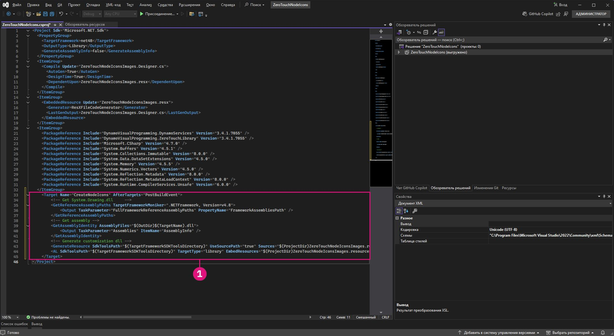

# 高级 Dynamo 节点自定义 

在建立了 ZeroTouch 的基础知识之后，本部分深入探讨自定义 Dynamo 节点以增强功能和用户体验的优势。通过添加警告消息、信息消息和自定义图标等功能，您可以创建更直观、信息更丰富且更具视觉吸引力的节点。这些自定义不仅可以帮助用户了解潜在问题或优化他们的工作流程，还可以使您的节点脱颖而出，成为专业且用户友好的工具。

自定义节点是确保您的解决方案清晰、可靠且专为满足特定项目需求而量身定制的绝佳方式。

## 使用 OnLogWarningMessage 生成自定义警告消息 <a href="#generating-custom-warning-messages-using-onlogwarningmessage" id="generating-custom-warning-messages-using-onlogwarningmessage"></a>

在 Dynamo 中，`OnLogWarningMessage` 方法提供了一种将警告消息直接记录到 Dynamo 控制台的方法。这是一项强大的功能，尤其是对于 Zero Touch 节点，因为它允许开发人员在输入或参数出现问题时警告用户这可能会导致意外行为。本指南将教您如何在任何 Zero Touch 节点中实施 `OnLogWarningMessage`。

### `OnLogWarningMessage` <a href="#implementation-step-for-onlogwarningmessage" id="implementation-step-for-onlogwarningmessage"></a> 的实施步骤

#### 步骤 1：导入所需的命名空间 <a href="#import-the-required-namespace" id="import-the-required-namespace"></a>

`OnLogWarningMessage` 是 `DynamoServices` 命名空间的一部分，因此首先要将其添加到项目文件中。

```
using DynamoServices;
```

#### 步骤 2：确定何时记录警告 <a href="#identify-when-to-log-warnings" id="identify-when-to-log-warnings"></a>

在添加警告消息之前，请考虑您的方法中的逻辑：

* 哪些条件可能会导致不正确或意外的结果？
* 该方法是否需要特定的输入值或参数才能正常运行？

要检查的条件示例：

* **超出范围的值**（例如 `if (inputValue < 0)`）。
* **Null 或空集合**（例如 `if (list == null || list.Count == 0)`）。
* **数据类型不匹配**（例如，如果文件类型不受支持）。

#### 步骤 3：使用 `OnLogWarningMessage` 记录警告 <a href="#use-onlogwarningmessage-to-log-the-warning" id="use-onlogwarningmessage-to-log-the-warning"></a>

在检测到可能导致问题的情况时进行 `OnLogWarningMessage` 调用。满足条件时，记录警告消息，为用户提供清晰的指导。

### `OnLogWarningMessage` <a href="#syntax-for-onlogwarningmessage" id="syntax-for-onlogwarningmessage"></a> 的语法

```
LogWarningMessageEvents.OnLogWarningMessage("Your warning message here.");
```

### `OnLogWarningMessage` <a href="#example-implementations-of-onlogwarningmessage" id="example-implementations-of-onlogwarningmessage"></a> 的实施示例

为了演示 `OnLogWarningMessage` 的实际应用，以下是您在构建 Zero Touch 节点时可能会遇到的不同方案。

#### 示例 1：验证数值输入 <a href="#example-1-validating-numeric-inputs" id="example-1-validating-numeric-inputs"></a>

在此示例中，我们将基于之前的 **“Zero-Touch 案例研究 - 网格节点”** 中创建的自定义节点；一种名为 `RectangularGrid` 的方法，用于根据 `xCount` 和 `yCount` 输入生成矩形网格。如果输入无效，我们将演练测试，然后使用 `OnLogWarningMessage` 记录警告并停止处理。


##### 使用 `OnLogWarningMessage` 进行输入验证 <a href="#using-onlogwarningmessage-for-input-validation" id="using-onlogwarningmessage-for-input-validation"></a>

基于 `xCount` 和 `yCount` 生成栅格时。在继续操作之前，您希望确保两个值均为正整数。

```
public static List<Rectangle> CreateGrid(int xCount, int yCount)
{
    // Check if xCount and yCount are positive
    if (xCount <= 0 || yCount <= 0)
    {
        LogWarningMessageEvents.OnLogWarningMessage("Grid count values must be positive integers.");
        return new List<Rectangle>();  // Return an empty list if inputs are invalid
    }
    // Proceed with grid creation...
}
```

在本例中：

* **条件**：如果 `xCount` 或 `yCount` 小于或等于 0。
* **消息**：`"Grid count values must be positive integers."`

如果用户输入零值或负值，这将在 Dynamo 中显示警告，帮助他们理解预期的输入。 

现在我们知道了它是什么样子的，我们可以将其实施到 Grids 示例节点中：

```
using Autodesk.DesignScript.Geometry;
using DynamoServices;

namespace CustomNodes
{
    public class Grids
    {
        // The empty private constructor.
        // This will not be imported into Dynamo.
        private Grids() { }

        /// <summary>
        /// This method creates a rectangular grid from an X and Y count.
        /// </summary>
        /// <param name="xCount">Number of grid cells in the X direction</param>
        /// <param name="yCount">Number of grid cells in the Y direction</param>
        /// <returns>A list of rectangles</returns>
        /// <search>grid, rectangle</search>
        public static List<Rectangle> RectangularGrid(int xCount = 10, int yCount = 10)
        {
            // Check for valid input values
            if (xCount <= 0 || yCount <= 0)
            {
                // Log a warning message if the input values are invalid
                LogWarningMessageEvents.OnLogWarningMessage("Grid count values must be positive integers.");
                return new List<Rectangle>(); // Return an empty list if inputs are invalid
            }

            double x = 0;
            double y = 0;

            var pList = new List<Rectangle>();

            for (int i = 0; i < xCount; i++)
            {
                y++;
                x = 0;
                for (int j = 0; j < yCount; j++)
                {
                    x++;
                    Point pt = Point.ByCoordinates(x, y);
                    Vector vec = Vector.ZAxis();
                    Plane bP = Plane.ByOriginNormal(pt, vec);
                    Rectangle rect = Rectangle.ByWidthLength(bP, 1, 1);
                    pList.Add(rect);
                    Point cPt = rect.Center();
                }
            }

            return pList;
        }
    }
}
```

##### 示例 2：检查 Null 或空集合 <a href="#example-2-checking-for-null-or-empty-collections" id="example-2-checking-for-null-or-empty-collections"></a>

如果您的方法需要点列表，但用户传递空列表或 Null 列表，则可以使用 `OnLogWarningMessage` 向他们通知相关问题。


```
public static Polygon CreatePolygonFromPoints(List<Point> points)
{
    if (points == null || points.Count < 3)
    {
        LogWarningMessageEvents.OnLogWarningMessage("Point list cannot be null or have fewer than three points.");
        return null;  // Return null if the input list is invalid
    }
    // Proceed with polygon creation...
}
```

在本例中：

* **条件**：如果 `points` 列表为 Null 或包含的点少于三个点。
* **消息**：`"Point list cannot be null or have fewer than three points."`

这会警告用户，他们需要传递一个包含至少三个点的有效列表才能形成一个多边形。

---

##### 示例 3：验证文件类型兼容性 <a href="#example-3-verifying-file-type-compatibility" id="example-3-verifying-file-type-compatibility"></a>

对于处理文件路径的节点，可能需要确保仅允许某些文件类型。如果检测到不受支持的文件类型，请记录警告。


```
public static void ProcessFile(string filePath)
{
    if (!filePath.EndsWith(".csv"))
    {
        LogWarningMessageEvents.OnLogWarningMessage("Only CSV files are supported.");
        return;
    }
    // Proceed with file processing...
}
```

在本例中：

* **条件**：如果文件路径不是以“.csv”结尾。
* **消息**：`"Only CSV files are supported."`

这会警告用户确保他们传递的是 CSV 文件，从而有助于防止出现与不兼容的文件格式相关的问题。

## 使用 `OnLogInfoMessage` <a href="#adding-informational-messages-with-onloginfomessage" id="adding-informational-messages-with-onloginfomessage"></a> 添加信息性消息

在 Dynamo 中，`DynamoServices` 命名空间中的 `OnLogInfoMessage` 允许开发人员将信息性消息直接记录到 Dynamo 的控制台。这有助于确认操作成功、沟通进度或提供有关节点操作的其他见解。本指南将教您如何在任何 Zero Touch 节点中添加 `OnLogInfoMessage`，以增强反馈并改善用户体验。

### `OnLogInfoMessage` <a href="#implementation-steps-for-onloginfomessage" id="implementation-steps-for-onloginfomessage"></a> 的实施步骤
#### 步骤 1：导入所需的命名空间 <a href="#step-1-import-the-required-namespace" id="step-1-import-the-required-namespace"></a>

`OnLogInfoMessage` 是 `DynamoServices` 命名空间的一部分，因此首先要将其添加到项目文件中。

#### 步骤 2：确定何时记录信息 <a href="#step-2-identify-when-to-log-information" id="step-2-identify-when-to-log-information"></a>

在添加信息消息之前，请考虑您的方法的用途：

* 在操作完成后，哪些信息可用于确认？
* 该方法中是否有用户可能想要了解的关键步骤或里程碑？

有用的确认示例：

* **完成消息**（例如，当一个网格或模型完全创建时）。
* **已处理数据的详细信息**（例如，“已成功处理 10 个项目”）。
* **执行摘要**（例如，流程中使用的参数）。

#### 步骤 3：使用 `OnLogInfoMessage` 记录信息性消息 <a href="#step-3-use-onloginfomessage-to-log-informational-message" id="step-3-use-onloginfomessage-to-log-informational-message"></a>

在方法中有意义的点处进行 `OnLogInfoMessage` 调用。当关键步骤或完成发生时，记录一条信息性消息，以更新用户所发生的情况。

### `OnLogInfoMessage` <a href="#syntax-for-onloginfomessage" id="syntax-for-onloginfomessage"></a> 的语法

```
LogWarningMessageEvents.OnLogInfoMessage("Your info message here.");
```

### `OnLogInfoMessage` <a href="#example-implementations-of-onloginfomessage" id="example-implementations-of-onloginfomessage"></a> 的实施示例

下面是演示如何在 Zero Touch 节点中使用 `OnLogInfoMessage` 的不同方案。

#### 示例 1：验证数值输入 <a href="#example-1-validating-numeric-inputs" id="example-1-validating-numeric-inputs"></a>

在此示例中，我们将基于之前的 **“Zero-Touch 案例研究 - 网格节点”** 中创建的自定义节点；一种名为 `RectangularGrid` 的方法，用于根据 `xCount` 和 `yCount` 输入生成矩形网格。如果输入无效，我们将演练测试，然后在节点完成运行后使用 `OnLogInfoMessage` 提供信息。


###### 使用 `OnLogInfoMessage` 进行输入验证 <a href="#using-onloginfomessage-for-unput-validation" id="using-onloginfomessage-for-unput-validation"></a>

基于 `xCount` 和 `yCount` 生成栅格时。生成网格后，您希望通过记录带有网格维度的信息消息来确认其创建。

```
public static List<Rectangle> CreateGrid(int xCount, int yCount)
{
    var pList = new List<Rectangle>();
    // Grid creation code here...

    // Confirm successful grid creation
    LogWarningMessageEvents.OnLogInfoMessage($"Successfully created a grid with dimensions {xCount}x{yCount}.");

    return pList;
}
```

在本例中：

* **条件**：网格创建过程已完成。
* **消息**：`"Successfully created a grid with dimensions {xCount}x{yCount}."`

此消息将通知用户网格已按指定创建，帮助他们确认节点是否按预期工作。

现在我们知道了它是什么样子的，我们可以将其实施到 Grids 示例节点中：

```
using Autodesk.DesignScript.Geometry;
using DynamoServices;

namespace CustomNodes
{
    public class Grids
    {
        // The empty private constructor.
        // This will not be imported into Dynamo.
        private Grids() { }

        /// <summary>
        /// This method creates a rectangular grid from an X and Y count.
        /// </summary>
        /// <param name="xCount">Number of grid cells in the X direction</param>
        /// <param name="yCount">Number of grid cells in the Y direction</param>
        /// <returns>A list of rectangles</returns>
        /// <search>grid, rectangle</search>
        public static List<Rectangle> RectangularGrid(int xCount = 10, int yCount = 10)
        {
            double x = 0;
            double y = 0;

            var pList = new List<Rectangle>();

            for (int i = 0; i < xCount; i++)
            {
                y++;
                x = 0;
                for (int j = 0; j < yCount; j++)
                {
                    x++;
                    Point pt = Point.ByCoordinates(x, y);
                    Vector vec = Vector.ZAxis();
                    Plane bP = Plane.ByOriginNormal(pt, vec);
                    Rectangle rect = Rectangle.ByWidthLength(bP, 1, 1);
                    pList.Add(rect);
                    Point cPt = rect.Center();
                }
            }

            // Log an info message indicating the grid was successfully created
            LogWarningMessageEvents.OnLogInfoMessage($"Successfully created a grid with dimensions {xCount}x{yCount}.");

            return pList;
        }
    }
}
```

#### 示例 2：提供数据计数信息 <a href="#example-2-providing-data-count-information" id="example-2-providing-data-count-information"></a>

如果要创建处理点列表的节点，则可能需要记录已成功处理的点数。这对于大型数据集非常有用。


```
public static List<Point> ProcessPoints(List<Point> points)
{
    var processedPoints = new List<Point>();
    foreach (var point in points)
    {
        // Process each point...
        processedPoints.Add(point);
    }

    // Log info about the count of processed points
    LogWarningMessageEvents.OnLogInfoMessage($"{processedPoints.Count} points were processed successfully.");

    return processedPoints;
}
```

在本例中：

* **条件**：循环完成后，显示已处理项目的计数。
* **消息**：`"6 points were processed successfully."`

此消息将帮助用户了解处理结果并确认所有点均已处理。


#### 示例 3：汇总使用的参数 <a href="#example-3-summarizing-parameters-used" id="example-3-summarizing-parameters-used"></a>

在某些情况下，确认节点用于完成操作的输入参数非常有用。例如，如果节点将数据导出到某个文件，则记录文件名和路径可以让用户确信使用了正确的文件。


```
public static void ExportData(string filePath, List<string> data)
{
    // Code to write data to the specified file path...

    // Log the file path used for export
    LogWarningMessageEvents.OnLogInfoMessage($"Data exported successfully to {filePath}.");

}
```

在本例中：

* **条件**：导出过程成功完成。
* **消息**：`"Data exported successfully to {filePath}."`

此消息会向用户确认导出工作正常，并显示确切的文件路径，从而有助于避免文件位置混淆。

## 创建自定义文档并将其添加到节点

### 自定义节点文档
一直以来，Dynamo 中对于软件包作者为其节点提供文档的方式存在限制。自定义节点作者已被限制为仅允许在节点的工具提示中显示简短描述，或在交付包含大量注释的示例图形的软件包时。


### 新方式
Dynamo 现在为软件包作者提供了一个改进的系统，以便为自定义节点提供更好、解释性更强的文档。这种新方法利用用户友好的 Markdown 语言进行文本创作，并利用文档浏览器视图扩展在 Dynamo 中显示 Markdown。使用 Markdown 为软件包作者在记录其自定义节点时提供了各种各样的新可能性。 

#### 什么是 Markdown？
Markdown 是一种轻量级标记语言，可用于设置纯文本文档的格式。自 2004 年创建 Markdown 以来，它的受欢迎程度只增不减，现在是世界上最受欢迎的标记语言之一。

#### Markdown 快速入门
开始制作 Markdown 文件非常简单 - 您只需要一个简单的文本编辑器，比如记事本，就可以开始了。但是，有比使用记事本更简单的方法来编写 Markdown。有几个在线编辑器，例如 [Dillinger](https://dillinger.io/)，可让您在进行更改时实时查看更改。编辑 Markdown 文件的另一种常用方法是使用代码编辑器，如 [Visual Studio Code](https://code.visualstudio.com/)。

#### Markdown 可以做什么？
Markdown 非常灵活，应该提供足够的功能来轻松创建良好的文档 - 这包括：添加图像或视频等媒体文件，创建具有不同形式内容的表格，当然还有简单的文本格式化功能，例如使文本变为**粗体**或*斜体*。在编写 Markdown 文档时，所有这些以及更多操作都是可能的，有关详细信息，请查看本指南，其中介绍了[基本 Markdown 语法](https://www.Markdownguide.org/basic-syntax/)。

### 将扩展文档添加到节点
将文档添加到节点非常简单。文档可以添加到所有类型的自定义节点中，包括：
* 现成的 Dynamo 节点
* 自定义节点 (.dyf) - 现成和/或其他软件包节点的集合。
* 自定义 C# 软件包节点（也称为 Zerotouch。这些自定义节点看起来像现成的节点）
* NodeModel 节点（包含特殊 UI 功能（例如下拉菜单或选择按钮）的节点）
* NodeModel 具有自定义 UI 的节点（包含独特 UI 功能的节点，例如节点上的图形）

按照以下几个步骤，让您的 Markdown 文件显示在 Dynamo 中。

#### 在 Dynamo 中打开文档文件
Dynamo 使用“文档浏览器”视图扩展来显示节点文档。要打开节点文档，请在节点上单击鼠标右键，然后选择“帮助”。这将打开文档浏览器并显示与该节点关联的 Markdown（如果已提供）。


显示在“文档浏览器”中的文档由两部分组成。第一个是 `Node Info` 部分，这是根据从节点提取的信息自动生成的，例如输入/输出、节点类别、节点名称/名称空间和节点简短描述。第二部分显示自定义节点文档，这是用于记录节点的 Markdown 文件。


#### 软件包文档文件夹
要将文档文件添加到 Dynamo 中的节点，请在软件包目录中创建一个名为 `/doc` 的新文件夹。加载软件包后，Dynamo 将扫描此目录并获取其中的所有文档 Markdown 文件。

#### 命名 Markdown 文件
要确保 Dynamo 知道在特定节点请求时要打开哪个文件，Markdown 文件的命名需要采用特定格式。Markdown 文件应根据其所记录的节点的命名空间进行命名。如果不确定节点的命名空间，请在节点上按 `Help` 键时查看 `Node Info` 部分，在该节点名称下，您将看到选定节点的完整命名空间。 

此命名空间应该是该特定节点的 Markdown 文件的名称。例如，上述图像中 `CustomNodeExample` 的命名空间为 `TestPackage.TestCategory.CustomNodeExample`，因此此节点的 Markdown 文件应命名为 `TestPackage.TestCategory.CustomNodeExample.md`

在有节点过载（节点名称相同但输入不同）的特殊情况下，需要在 `()` 中的节点命名空间之后添加输入名称。例如，内置节点 `Geometry.Translate` 具有多个过载。在本例中，我们会按如下方式为以下节点命名 Markdown 文件：`Autodesk.DesignScript.Geometry.Geometry.Translate(geometry,direction).md` `Autodesk.DesignScript.Geometry.Geometry.Translate(geometry,direction,distance).md`


#### 在 Dynamo 中打开时修改 Markdown 文件
为了便于修改文档文件，“文档浏览器”在打开的文档文件上实现了文件观察程序。这使您可以对 Markdown 文件进行更改，并将立即在 Dynamo 中看到更改。 


也可以在 Dynamo 处于打开状态时添加新文档文件。只需将新的 Markdown 文件添加到 `/doc` 文件夹，并使用与其所记录的节点对应的名称。

## 将自定义图标添加到 Zero Touch 节点

### 概述

Dynamo 中 Zero Touch 节点的自定义图标使节点在视觉上与众不同，并且在库中更易于识别。通过添加定制图标，可以使您的节点脱颖而出，让用户可以在列表中快速识别它们。

本指南将介绍如何将图标添加到 Zero Touch 节点。


### 添加自定义节点图标的步骤

#### 步骤 1：设置项目

首先，为 Zero Touch 节点创建 Visual Studio 类库 (.NET Framework) 项目。如果您还没有项目，请参见**入门**部分，了解有关创建项目的分步说明。


确保至少有一个正常运行的 Zero Touch 节点，因为图标只能添加到现有节点。有关有关指导，请参见 **Zero Touch 案例研究 - 网格节点**。


#### 步骤 2：创建图标图像

创建自定义图标的步骤：

1. **设计图标**：使用图像编辑器为节点创建简单、视觉清晰的图标。
2. **图像规格**：
    * **小图标**：32x32 像素（用于库的侧栏和节点本身）。
    * **大图标**：128x128 像素（将光标悬停在库中的节点上时，在节点特性中使用）。
3. **文件命名约定**：
    * 文件名必须与以下格式匹配，才能将它们与正确的节点相关联：
        * **`<ProjectName>.<ClassName>.<MethodName>.Small.png`**（用于小图标）。
        * **`<ProjectName>.<ClassName>.<MethodName>.Large.png`**（用于大图标）。

**示例**：如果项目为 `ZeroTouchNodeIcons`，类为 `Grids`，方法为 `RectangularGrid`，则文件将命名为：

* `ZeroTouchNodeIcons.Grids.RectangularGrid.Small.png`
* `ZeroTouchNodeIcons.Grids.RectangularGrid.Large.png`

> 提示：在所有图标中坚持一致的设计主题，以获得专业的外观。


#### 步骤 3：将资源文件添加到项目

要将图标嵌入 `.dll`，请创建一个资源文件：

1. **添加新的资源文件**：

  * 在**解决方案资源管理器**中右键单击您的项目。


  * 转到 **“添加”>“新建项目”**，然后选择 **“资源文件”**。


  * 将该文件命名为 `<ProjectName>Images.resx`。例如：`ZeroTouchNodeIconsImages.resx`。

2. **清除自定义工具特性**：
    * 在 **“解决方案资源管理器”** 中选择资源文件。
    * 在 **“特性”** 面板中，通过删除 `ResXFileCodeGenerator` 值来清除 `Custom Tool` 字段。


> *注意：未能清除“自定义工具”字段会导致 Visual Studio 将资源名称中的句点转换为下划线。请在构建之前验证您的资源名称是否使用句点分隔类名，而不是下划线。*


#### 步骤 4：将图像添加为资源

1. 使用 **“托管资源编辑器（旧版）”** 打开资源文件：
    * 如果使用 Visual Studio 17.11 或更高版本，请右键单击资源文件，选择 **“打开方式”**，然后选择 **“托管资源编辑器（旧版）”**。
    * 如果使用 17.11 之前的 Visual Studio 版本，请双击资源文件以使用资源编辑器打开（在您的 Visual Studio 版本中，该编辑器尚未成为旧版）。


2. 添加图片：
    * 将图像文件拖放到编辑器中，或使用 **“添加现有文件”** 选项。


3. 更新持久性：
    * 从“资源编辑器”中选择图像（如果从“解决方案资源管理器”中选择图像，则此图像将不起作用），将 **“特性”** 面板中的 **“持久性”** 特性更改为 `Embedded in .resx`。这可确保图像包含在您的 `.dll` 中。


#### 步骤 5：将项目转换为 SDK 样式

如果您的项目尚未采用 SDK 样式（嵌入资源时需要），请将其转换：

1. 从 Visual Studio 的 **Extensions > Manage Extensions** 菜单安装 `.NET Upgrade Assistant` 扩展。


2. 在**解决方案资源管理器**中的项目上单击鼠标右键，然后选择 **“升级”>“将项目转换为 SDK 样式”**。


3. 等待转换完成。


#### 步骤 6：添加构建后脚本以嵌入资源

1. 卸载项目：
    * 在**解决方案资源管理器**中的项目上单击鼠标右键，然后选择**卸载项目**。


2. 编辑 `.csproj` 文件：
    * 在 `</ItemGroup>` 和 `</Project>` 之间添加以下 `<Target>` 元素：

```
<Target Name="CreateNodeIcons" AfterTargets="PostBuildEvent">
		<!-- Get System.Drawing.dll     -->
		<GetReferenceAssemblyPaths TargetFrameworkMoniker=".NETFramework, Version=v4.8">
			<Output TaskParameter="FullFrameworkReferenceAssemblyPaths" PropertyName="FrameworkAssembliesPath" />
		</GetReferenceAssemblyPaths>
		<!-- Get assembly -->
		<GetAssemblyIdentity AssemblyFiles="$(OutDir)$(TargetName).dll">
			<Output TaskParameter="Assemblies" ItemName="AssemblyInfo" />
		</GetAssemblyIdentity>
		<!-- Generate customization dll -->
		<GenerateResource SdkToolsPath="$(TargetFrameworkSDKToolsDirectory)" UseSourcePath="true" Sources="$(ProjectDir)ZeroTouchNodeIconsImages.resx" OutputResources="$(ProjectDir)ZeroTouchNodeIconsImages.resources" References="$(FrameworkAssembliesPath)System.Drawing.dll" />
		<AL SdkToolsPath="$(TargetFrameworkSDKToolsDirectory)" TargetType="library" EmbedResources="$(ProjectDir)ZeroTouchNodeIconsImages.resources" OutputAssembly="$(OutDir)ZeroTouchNodeIcons.customization.dll" Version="%(AssemblyInfo.Version)" />
	</Target>
```

1. 将所有 `ZeroTouchNodeIcons` 实例替换为您的项目名称。
2. 重新加载项目：
    * 在已卸载的项目上单击鼠标右键，然后选择 **“重新加载项目”**。


#### 步骤 7：构建 .dll 并将其加载到 Dynamo 中

1. 构建项目：
    * 添加构建后脚本后，在 Visual Studio 中构建项目。


2. 检查输出文件：
    * 确保 `.dll` 和 `.customization.dll` 位于 `bin` 文件夹中。
3. 将 `.dll` 添加到 Dynamo：
    * 在 Dynamo 中，使用“导入库”按钮将 .dll 导入到 Dynamo。


4. 现在，您的自定义节点应显示各自的图标。
