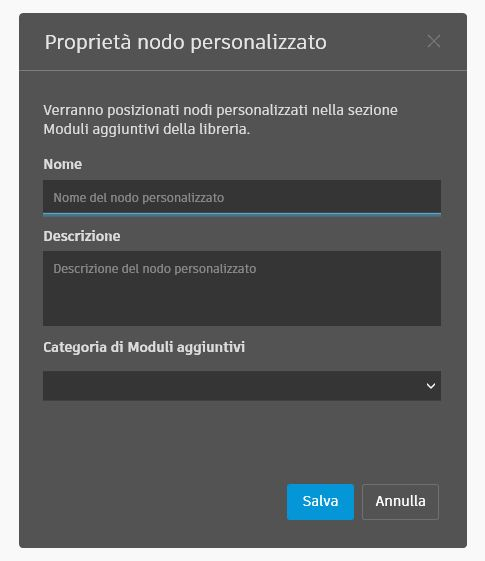

# カスタム パッケージ編成を定義する(Dynamo 2.0+) 

パッケージで目的のレイアウトを実現する方法は、パッケージに含めるノードのタイプによって異なります。ノード モデル派生ノード、ZeroTouch ノード、およびカスタム ノードでは、分類を定義するプロセスが若干異なります。これらのノード タイプは同じパッケージ内で混在させることができますが、以下に概説する戦略の組み合わせが必要になります。

## NodeModel
NodeModel ライブラリは、既定ではクラス構造に基づいて編成されます。
```C#
namespace SampleLibraryUI.Examples
```
```C#
// Class Attribute
[NodeName("MyNodeModel")]
public class MyNewNodeModel : NodeModel

// or

// Constructor
public ButtonCustomNodeModel()
{
    this.Name = "MyNodeModel";
}

```
ノードは、Add-ons の次の場所にあります。
```
SampleLibraryUI/Examples/MyNodeModel
```

下に示すように、クラスまたはコンストラクタで NodeCategory 属性を使用してカテゴリをオーバーライドすることもできます。
```C#
// Class Attribute
[NodeCategory("NewSampleLibraryUI.Examples")]

// or

// Constructor
public ButtonCustomNodeModel()
{
    this.Category = "NewSampleLibraryUI.Examples";
}
```

これで、ノードは Add-ons の次の場所に配置されます。
```
NewSampleLibraryUI/Examples/MyNodeModel
```

## ZeroTouch

ZeroTouch ライブラリも、既定ではクラス構造に基づいて編成されています。

```C#
namespace MyZTLibrary
```

```C#
public class Utilities
{
    public double doubleValue(double num)
    {
        return num * 2;
    }
}
```

ノードは、Add-ons の次の場所にあります。

```
MyZTLibrary/Utilities/doubleValue
```

また、Dynamo カスタマイズ XML ファイルを使用して、クラス構造の場所をオーバーライドすることもできます。
- XML ファイルには適切な名前を付け、パッケージの `extra` フォルダに含める必要があります。
    - `PackageName_DynamoCustomization.xml`

```XML
<?xml version="1.0"?>
<doc>
    <assembly>
        <name>MeshToolkit</name>
    </assembly>
    <namespaces>
        <!--Remap Namespaces-->
        <namespace name="Autodesk.Dynamo.MeshToolkit">
            <category>MeshToolkit</category>
        </namespace>
        <namespace name="Autodesk.Dynamo.MeshToolkit.Display">
                <category>Display</category>
        </namespace>
    </namespaces>
    <classes>
        <!--Remap Class Names-->
        <class name="Autodesk.Dynamo.MeshToolkit.Display.MeshDisplay" shortname="MeshDisplay"/>
        <class name="Autodesk.Dynamo.MeshToolkit.Mesh" shortname="Mesh"/>
    </classes>
</doc>

```

## CustomNodes

カスタム ノードは、ノードの作成時に指定した `Category Name` に基づいて編成されます(新しい[カスタム ノード]ダイアログ ボックスを使用)。  

**警告:**<br>
ノード名またはカテゴリにドット表記を使用すると、ネストされたサブカテゴリが追加されます。`.` は、追加の階層を決定するための区切り文字として機能します。これは、Dynamo 2.0 のライブラリの新しい動作です。



カテゴリ名は、.dyf ファイル(XML または JSON)で後から更新できます。

```JSON
{
  "Uuid": "85066088-1616-40b1-96e1-c33e685c6948",
  "IsCustomNode": true,
  "Category": "MyCustomNodes.Utilities.Actions",
  "Description": "This is an example custom nodes.",
  "Name": "doubleValue",
  "ElementResolver": {
    "ResolutionMap": {}
  },...
```

```XML
<Workspace Version="1.3.0.0000" X="100" Y="100" zoom="1.0000000" Description="This is an example custom nodes." Category="MyCustomNodes.Utilities.Actions" Name="doubleValue" ID="85066088-1616-40b1-96e1-c33e685c6948">
```

## パッケージ ノードの移行戦略

パッケージ作成者が新しいリリースで既存のノードの名前を変更する場合は、古い名前のノードを含むグラフを移行する手段を提供する必要があります。これは、次の方法で実現できます。

**ZeroTouch** ノードは、パッケージの `bin` フォルダにある次のような `Namespace.Migrations.XML` ファイルを使用します。

`MyZeroTouchLib.MyNodes.SayHello` から `MyZeroTouchLib.MyNodes.SayHelloRENAMED`
```XML
<?xml version="1.0"?>
<migrations>
  <priorNameHint>
    <oldName>MyZeroTouchLib.MyNodes.SayHello</oldName>
    <newName>MyZeroTouchLib.MyNodes.SayHelloRENAMED</newName>
  </priorNameHint>
</migrations>
```

**NodeModel 派生ノード**は、次のようにクラスで `AlsoKnownAs` 属性を使用します。

`SampleLibraryUI.Examples.DropDownExample` から `SampleLibraryUI.Examples.DropDownExampleRENAMED`
```C#
namespace SampleLibraryUI.Examples
{
    [NodeName("Drop Down Example")]
    [NodeDescription("An example drop down node.")]
    [IsDesignScriptCompatible]
    [AlsoKnownAs("SampleLibraryUI.Examples.DropDownExample")]
    public class DropDownExampleRENAMED : DSDropDownBase
    {
        ...
    }
{
```
