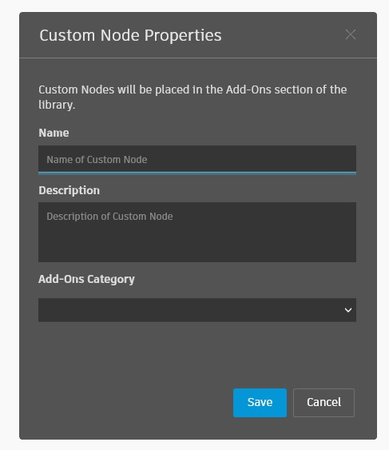

# Definování vlastní organizace balíčků pro Dynamo 2.0+

Dosažení požadovaného rozvržení balíčku závisí na typech uzlů, které do balíčku zahrnete. Uzly odvozené z uzlů NodeModel, uzly ZeroTouch a vlastní uzly mají mírně odlišný proces definování kategorizace. Tyto typy uzlů můžete kombinovat v rámci stejného balíčku, ale bude to vyžadovat kombinaci níže uvedených strategií.

## NodeModel

Knihovny NodeModel jsou ve výchozím nastavení uspořádány na základě struktury tříd.

```c#
namespace SampleLibraryUI.Examples
```

```c#
// Class Attribute
[NodeName("MyNodeModel")]
public class MyNewNodeModel : NodeModel

// or

// Constructor
public ButtonCustomNodeModel()
{
    this.Name = "MyNodeModel";
}

```

Uzel bude umístěn v doplňcích v následující cestě:

```
SampleLibraryUI/Examples/MyNodeModel
```

Kategorii můžete také přepsat pomocí atributu NodeCategory ve třídě nebo v konstruktoru, jak je zobrazeno níže.

```c#
// Class Attribute
[NodeCategory("NewSampleLibraryUI.Examples")]

// or

// Constructor
public ButtonCustomNodeModel()
{
    this.Category = "NewSampleLibraryUI.Examples";
}
```

Uzel se nyní bude nacházet v doplňcích v cestě:

```
NewSampleLibraryUI/Examples/MyNodeModel
```

## ZeroTouch

Knihovny ZeroTouch jsou také ve výchozím nastavení uspořádány podle struktury tříd.

```c#
namespace MyZTLibrary
```

```c#
public class Utilities
{
    public double doubleValue(double num)
    {
        return num * 2;
    }
}
```

Uzel bude umístěn v doplňcích v následující cestě:

```
MyZTLibrary/Utilities/doubleValue
```

Umístění struktury třídy lze rovněž přepsat pomocí souboru XML Dynamo Customization.

* Soubor XML musí mít odpovídající název a musí se nacházet ve složce `extra` balíčku.
  * `PackageName_DynamoCustomization.xml`

```xml
<?xml version="1.0"?>
<doc>
    <assembly>
        <name>MeshToolkit</name>
    </assembly>
    <namespaces>
        <!--Remap Namespaces-->
        <namespace name="Autodesk.Dynamo.MeshToolkit">
            <category>MeshToolkit</category>
        </namespace>
        <namespace name="Autodesk.Dynamo.MeshToolkit.Display">
                <category>Display</category>
        </namespace>
    </namespaces>
    <classes>
        <!--Remap Class Names-->
        <class name="Autodesk.Dynamo.MeshToolkit.Display.MeshDisplay" shortname="MeshDisplay"/>
        <class name="Autodesk.Dynamo.MeshToolkit.Mesh" shortname="Mesh"/>
    </classes>
</doc>

```

## Vlastní uzly

Vlastní uzly jsou uspořádány na základě parametru `Category Name` zadaného během vytváření uzlů (v novém dialogu Vlastní uzel).

**UPOZORNĚNÍ**\
 Použití tečkové notace v názvech nebo kategoriích uzlů bude mít za následek vytvoření dalších vnořených podkategorií. Tečka `.` bude fungovat jako oddělovač určující další hierarchii. Jedná se o nové chování v knihovně v aplikaci Dynamo 2.0.



Název kategorie lze později aktualizovat v souboru .dyf (XML nebo JSON),

```json
{
  "Uuid": "85066088-1616-40b1-96e1-c33e685c6948",
  "IsCustomNode": true,
  "Category": "MyCustomNodes.Utilities.Actions",
  "Description": "This is an example custom nodes.",
  "Name": "doubleValue",
  "ElementResolver": {
    "ResolutionMap": {}
  },...
```

```xml
<Workspace Version="1.3.0.0000" X="100" Y="100" zoom="1.0000000" Description="This is an example custom nodes." Category="MyCustomNodes.Utilities.Actions" Name="doubleValue" ID="85066088-1616-40b1-96e1-c33e685c6948">
```

## Strategie migrace uzlů balíčků

Pokud se autor balíčku rozhodne v nové verzi přejmenovat dříve existující uzel, měl by poskytnout prostředky pro migraci grafů, které obsahují uzly se starými názvy. Toho lze dosáhnout následujícími způsoby:

**Uzly ZeroTouch** používají soubor `Namespace.Migrations.XML` umístěný v balíčcích ve složce `bin`. Viz například:

`MyZeroTouchLib.MyNodes.SayHello` na `MyZeroTouchLib.MyNodes.SayHelloRENAMED`

```xml
<?xml version="1.0"?>
<migrations>
  <priorNameHint>
    <oldName>MyZeroTouchLib.MyNodes.SayHello</oldName>
    <newName>MyZeroTouchLib.MyNodes.SayHelloRENAMED</newName>
  </priorNameHint>
</migrations>
```

**Uzly odvozené z uzlů NodeModel** používají atribut `AlsoKnownAs` třídy. Viz například:

`SampleLibraryUI.Examples.DropDownExample` na `SampleLibraryUI.Examples.DropDownExampleRENAMED`

```c#
namespace SampleLibraryUI.Examples
{
    [NodeName("Drop Down Example")]
    [NodeDescription("An example drop down node.")]
    [IsDesignScriptCompatible]
    [AlsoKnownAs("SampleLibraryUI.Examples.DropDownExample")]
    public class DropDownExampleRENAMED : DSDropDownBase
    {
        ...
    }
{
```
