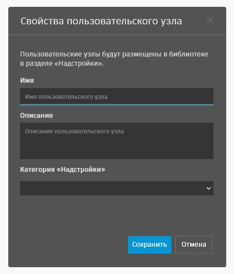

# 定义自定义软件包组织 （Dynamo 2.0+）

实现软件包所需的布局取决于将包含在包中的节点类型。“节点模型”派生的节点、ZeroTouch 节点和自定义节点在定义分类方面的过程都略有不同。可以在同一软件包中混合和匹配这些节点类型，但这需要结合使用下面概述的策略。

## NodeModel
默认情况下，NodeModel 库基于类结构进行组织。
```C#
namespace SampleLibraryUI.Examples
```
```C#
// Class Attribute
[NodeName("MyNodeModel")]
public class MyNewNodeModel : NodeModel

// or

// Constructor
public ButtonCustomNodeModel()
{
    this.Name = "MyNodeModel";
}

```
节点将位于以下目录下的附加模块中：
```
SampleLibraryUI/Examples/MyNodeModel
```

还可以通过在类或构造函数中使用 NodeCategory 属性来覆盖该类别，如下所示。
```C#
// Class Attribute
[NodeCategory("NewSampleLibraryUI.Examples")]

// or

// Constructor
public ButtonCustomNodeModel()
{
    this.Category = "NewSampleLibraryUI.Examples";
}
```

节点现在将位于以下目录下的附加模块中：
```
NewSampleLibraryUI/Examples/MyNodeModel
```

## ZeroTouch

默认情况下，ZeroTouch 库也根据类结构进行组织。

```C#
namespace MyZTLibrary
```

```C#
public class Utilities
{
    public double doubleValue(double num)
    {
        return num * 2;
    }
}
```

节点将位于以下目录下的附加模块中：

```
MyZTLibrary/Utilities/doubleValue
```

还可以使用 Dynamo 自定义 XML 文件替代类结构位置。
- XML 文件必须相应地命名并包含在软件包的 `extra` 文件夹中
    - `PackageName_DynamoCustomization.xml`

```XML
<?xml version="1.0"?>
<doc>
    <assembly>
        <name>MeshToolkit</name>
    </assembly>
    <namespaces>
        <!--Remap Namespaces-->
        <namespace name="Autodesk.Dynamo.MeshToolkit">
            <category>MeshToolkit</category>
        </namespace>
        <namespace name="Autodesk.Dynamo.MeshToolkit.Display">
                <category>Display</category>
        </namespace>
    </namespaces>
    <classes>
        <!--Remap Class Names-->
        <class name="Autodesk.Dynamo.MeshToolkit.Display.MeshDisplay" shortname="MeshDisplay"/>
        <class name="Autodesk.Dynamo.MeshToolkit.Mesh" shortname="Mesh"/>
    </classes>
</doc>

```

## CustomNodes

自定义节点是在创建节点（使用新的“自定义节点”对话框）期间根据指定的 `Category Name` 组织的。  

**警告！**<br>
在节点名称或类别中使用点表示法将产生其他嵌套的子类别。`.` 将用作分隔符来确定其他层次结构。这是 Dynamo 2.0 库中的新行为。



类别名称可以稍后在 .dyf 文件（XML 或 JSON）中更新

```JSON
{
  "Uuid": "85066088-1616-40b1-96e1-c33e685c6948",
  "IsCustomNode": true,
  "Category": "MyCustomNodes.Utilities.Actions",
  "Description": "This is an example custom nodes.",
  "Name": "doubleValue",
  "ElementResolver": {
    "ResolutionMap": {}
  },...
```

```XML
<Workspace Version="1.3.0.0000" X="100" Y="100" zoom="1.0000000" Description="This is an example custom nodes." Category="MyCustomNodes.Utilities.Actions" Name="doubleValue" ID="85066088-1616-40b1-96e1-c33e685c6948">
```

## 软件包节点移植策略

当软件包作者决定在新版本中重命名以前存在的节点时，他们应该提供一种方法来移植包含具有旧名称的节点的图表。这可以通过以下方式完成...

**ZeroTouch** 节点使用位于软件包 `bin` 文件夹中的 `Namespace.Migrations.XML` 文件，例如：

`MyZeroTouchLib.MyNodes.SayHello` 到 `MyZeroTouchLib.MyNodes.SayHelloRENAMED`
```XML
<?xml version="1.0"?>
<migrations>
  <priorNameHint>
    <oldName>MyZeroTouchLib.MyNodes.SayHello</oldName>
    <newName>MyZeroTouchLib.MyNodes.SayHelloRENAMED</newName>
  </priorNameHint>
</migrations>
```

**NodeModel 派生的节点**使用诸如以下类的 `AlsoKnownAs` 属性：

`SampleLibraryUI.Examples.DropDownExample` 到 `SampleLibraryUI.Examples.DropDownExampleRENAMED`
```C#
namespace SampleLibraryUI.Examples
{
    [NodeName("Drop Down Example")]
    [NodeDescription("An example drop down node.")]
    [IsDesignScriptCompatible]
    [AlsoKnownAs("SampleLibraryUI.Examples.DropDownExample")]
    public class DropDownExampleRENAMED : DSDropDownBase
    {
        ...
    }
{
```