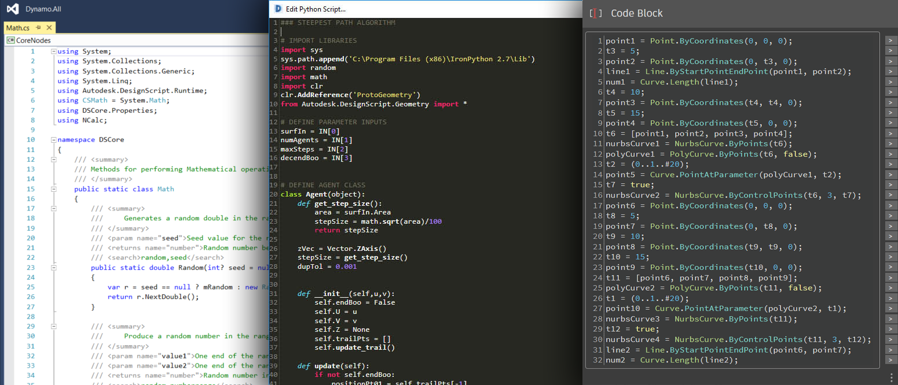
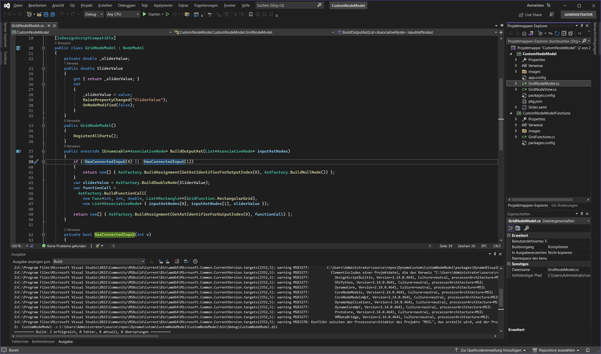
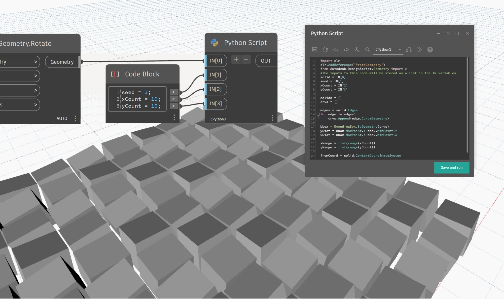
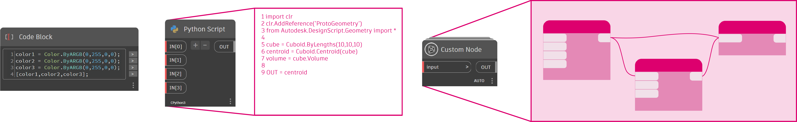
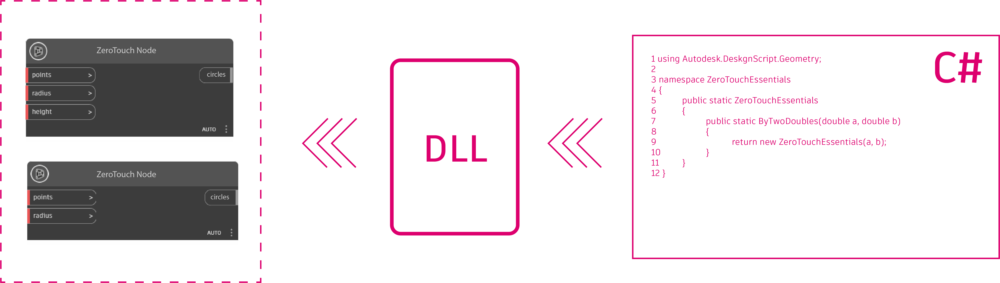
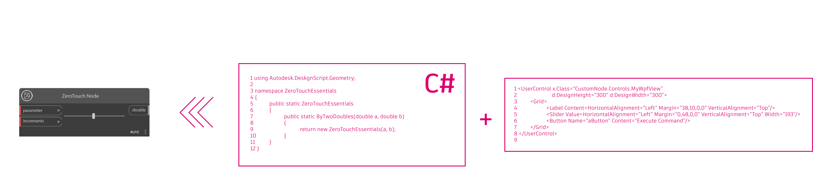
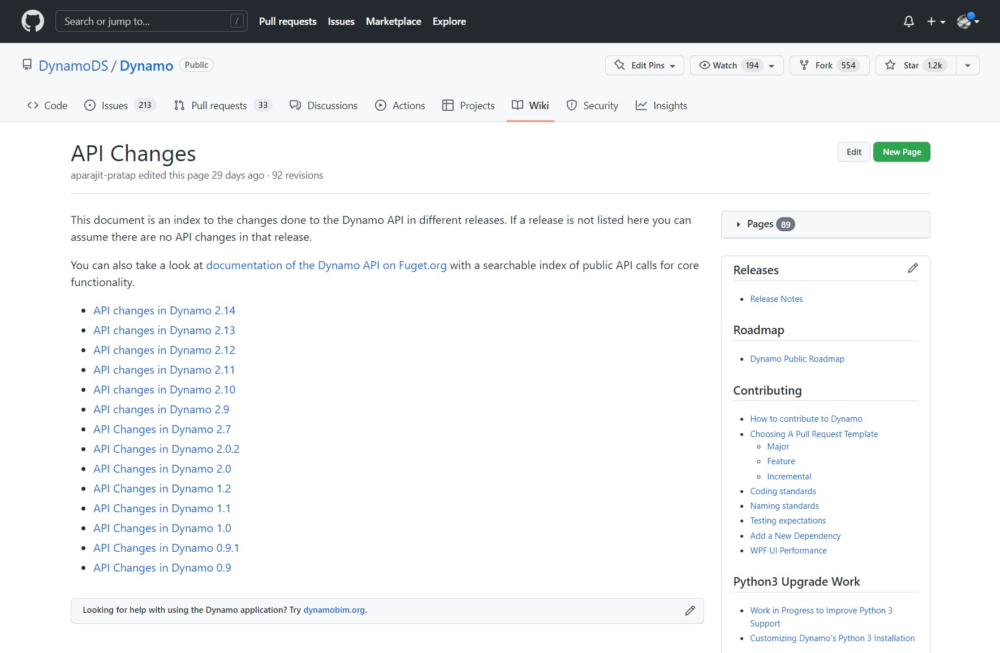
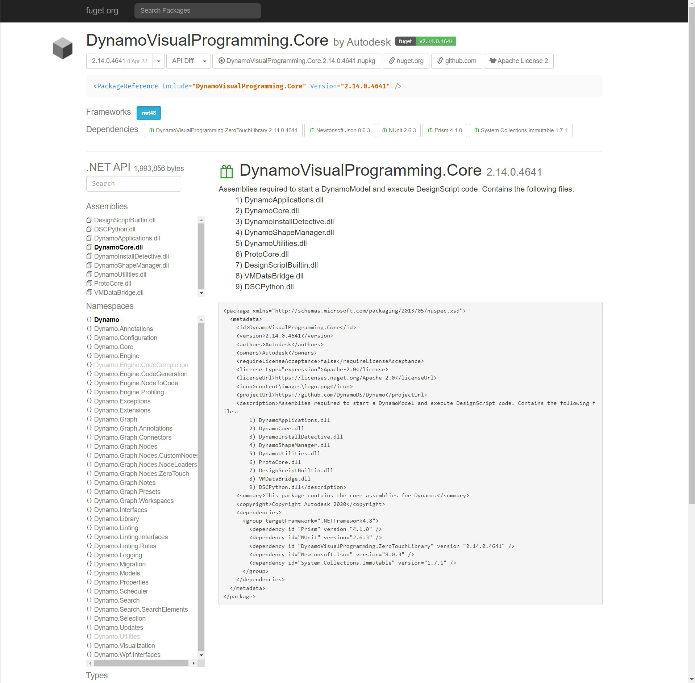

# Opracowywanie rozwiązań dla dodatku Dynamo

Platformę Dynamo zaprojektowano tak, aby umożliwić współtworzenie wszystkim użytkownikom, niezależnie od poziomu doświadczenia. Dostępnych jest kilka opcji programowania odpowiednich do różnych rodzajów i poziomów umiejętności, z których każda ma zalety i wady w zależności od zamierzonego celu. Poniżej omówimy te różne opcje i sposób wyboru między nimi.

> Trzy środowiska programistyczne: program Visual Studio, Edytor języka Python i język Code Block DesignScript

#### Jakie mam opcje? 

Opcje programowania rozwiązań dla dodatku Dynamo należą przede wszystkim do dwóch kategorii: _dla_ dodatku Dynamo i _w_ dodatku Dynamo. Te dwie kategorie należy rozumieć tak: „w” dodatku Dynamo oznacza zawartość tworzoną za pomocą środowiska IDE dodatku Dynamo, która ma być używana w dodatku Dynamo; natomiast „dla” dodatku Dynamo oznacza tworzenie za pomocą narzędzi zewnętrznych zawartości, która ma być importowana do dodatku Dynamo w celu jej używania. W tym podręczniku skoncentrowano się na programowaniu _dla_ dodatku Dynamo, ale poniżej opisano zasoby dotyczące wszystkich procesów.

#### Dla dodatku Dynamo 

Te węzły umożliwiają najwyższy stopień dostosowania. Wiele pakietów jest kompilowanych za pomocą tej metody i jest ona niezbędna do współtworzenia źródła dodatku Dynamo. Proces ich kompilowania zostanie omówiony w tym podręczniku.

* Węzły Zero-Touch
* Węzły pochodne od klasy NodeModel
* Rozszerzenia

> Przewodnik Primer zawiera podręcznik dotyczący [importowania bibliotek Zero-Touch](https://primer2.dynamobim.org/v/pl/6_custom_nodes_and_packages/6-2_packages/5-zero-touch).

W poniższym omówieniu jako środowisko programistyczne dla węzłów Zero-Touch i NodeModel jest używany program Visual Studio.

> Interfejs programu Visual Studio z projektem, który będziemy opracowywać

#### W dodatku Dynamo 

Mimo że te procesy istnieją w obszarze roboczym programowania wizualnego i są stosunkowo proste, wszystkie umożliwiają dostosowanie dodatku Dynamo. W przewodniku Primer opisano je szczegółowo i podano wskazówki dotyczące skryptów oraz wzorce postępowania — w rozdziale [Strategie dotyczące skryptów](../../9\_best\_practices/2-scripting-strategies.md).

*   Węzły z bokami kodu, Code Block, uwidaczniają kod DesignScript w środowisku programowania wizualnego, umożliwiając używanie elastycznych procesów roboczych węzłów i skryptów tekstowych. Funkcję w węźle Code Block może wywołać dowolny element w obszarze roboczym.

    > Pobierz przykład węzła Code Block (kliknij prawym przyciskiem myszy i zapisz jako) lub zobacz szczegółowe omówienie w [przewodniku Primer](https://primer2.dynamobim.org/v/pl/8_coding_in_dynamo/8-1_code-blocks-and-design-script/1-what-is-a-code-block).
*   Węzły niestandardowe są kontenerami dla kolekcji węzłów, a nawet całych wykresów. Są one skutecznym sposobem gromadzenia często używanych procedur i udostępniania ich społeczności.

    > Pobierz przykład węzła niestandardowego (kliknij prawym przyciskiem myszy i zapisz jako) lub zobacz szczegółowe omówienie w [przewodniku Primer](https://primer2.dynamobim.org/v/pl/6_custom_nodes_and_packages/6-1_custom-nodes/1-introduction).
*   Węzły w języku Python są interfejsem skryptowym w obszarze roboczym programowania wizualnego, podobnie jak węzły Code Block. W bibliotekach Autodesk.DesignScript używa się zapisu kropkowego podobnego do tego używanego w języku DesignScript.

    > Pobierz przykład węzła w języku Python (kliknij prawym przyciskiem myszy i zapisz jako) lub zobacz szczegółowe omówienie w [przewodniku Primer](https://primer2.dynamobim.org/v/pl/8_coding_in_dynamo/8-3_python)

Programowanie w obszarze roboczym dodatku Dynamo to wydajne rozwiązanie umożliwiające natychmiastowe uzyskanie informacji zwrotnych.

> Programowanie w obszarze roboczym dodatku Dynamo za pomocą węzła w języku Python

#### Jakie są zalety/wady poszczególnych opcji? 

Opcje programowania dla dodatku Dynamo zaprojektowano z uwzględnieniem złożoności wymagań dotyczących dostosowywania. Niezależnie od tego, czy celem jest napisanie skryptu cyklicznego w języku Python, czy opracowanie całkowicie niestandardowego interfejsu użytkownika węzła, dostępne są opcje implementowania kodu obejmujące tylko czynności niezbędne do przygotowania działającego rozwiązania.

**Węzły Code Block, węzeł w języku Python i węzły niestandardowe w dodatku Dynamo**

Są to proste opcje pisania kodu w środowisku programowania wizualnego dodatku Dynamo. Obszar roboczy programowania wizualnego dodatku Dynamo zapewnia dostęp do języka Python i języka DesignScript oraz możliwość umieszczania wielu węzłów wewnątrz węzła niestandardowego.

Te metody zapewniają następujące możliwości:

* Rozpoczęcie pisania w języku Python lub DesignScript przy niewielkiej konfiguracji lub w ogóle bez niej.
* Importowanie bibliotek języka Python do dodatku Dynamo.
* Udostępnianie społeczności węzłów Code Block, węzłów w języku Python i węzłów niestandardowych dodatku Dynamo w ramach pakietu.

**Węzły Zero-Touch**

Zero-Touch to prosta metoda importowania bibliotek C# przez wskazanie i kliknięcie. Dodatek Dynamo odczyta publiczne metody z pliku `.dll` i przekonwertuje je na węzły Dynamo. Za pomocą metody Zero-Touch można tworzyć własne pakiety i węzły niestandardowe.

Co można zrobić za pomocą tej metody:

* Importowanie biblioteki, która nie została opracowana dla dodatku Dynamo, i automatyczne tworzenie pakietu nowych węzłów, jak w [przykładzie A-Forge](../../6\_custom\_nodes\_and\_packages/6-2\_packages/5-zero-touch.md#case-study-importing-aforge) z przewodnika Primer
* Pisanie metod w języku C# i łatwe używanie ich jako węzłów w dodatku Dynamo
* Udostępnianie społeczności dodatku Dynamo biblioteki C# jako węzłów w pakiecie

**Węzły pochodne od klasy NodeModel**

Te węzły są osadzone nieco głębiej w strukturze dodatku Dynamo. Są one oparte na klasie `NodeModel` i napisane w języku C#. Mimo że ta metoda zapewnia największą elastyczność i największe możliwości, wymaga jednak wyraźnego zdefiniowania większości aspektów węzła i umieszczenia funkcji w osobnym zespole.

Co można zrobić za pomocą tej metody:

* Tworzenie w pełni konfigurowalnego interfejsu użytkownika węzła z suwakami, obrazami, kolorem itp. (np. węzeł ColorRange)
* Uzyskiwanie dostępu do informacji o tym, co się dzieje w obszarze rysunku dodatku Dynamo, i wpływanie na to
* Dostosowywanie skratowania
* Wczytywanie do dodatku Dynamo w postaci pakietu

#### Omówienie obsługi wersji dodatku Dynamo i zmian w interfejsie API (z wersji 1.x do wersji 2.x) 

Ponieważ dodatek Dynamo jest regularnie aktualizowany, w części interfejsu API używanej przez pakiet mogą być wprowadzane zmiany. Śledzenie tych zmian jest ważne na potrzeby zapewnienia dalszego poprawnego działania istniejących pakietów.

Zmiany interfejsu API są śledzone na [stronie wiki dodatku Dynamo w serwisie GitHub](https://github.com/DynamoDS/Dynamo/wiki/API-Changes). Obejmuje to zmiany wprowadzone w pakiecie DynamoCore, bibliotekach i obszarach roboczych.

Przykładem nadchodzącej istotnej zmiany jest przejście z formatu pliku XML na format pliku JSON w wersji 2.0. Węzły pochodne od klasy NodeModel będą teraz wymagać [konstruktora JSON](https://github.com/DynamoDS/Dynamo/wiki/Write-a-Json-Constructor-for-a-NodeModel-Node). W przeciwnym razie nie będą otwierane w dodatku Dynamo 2.0.

Dokumentacja interfejsu API dodatku Dynamo obejmuje obecnie podstawowe funkcje: [http://dynamods.github.io/DynamoAPI](http://dynamods.github.io/DynamoAPI)

#### Uprawnienia do dystrybucji plików binarnych w pakiecie 

Należy nadzorować pliki .dll zawarte w pakiecie przekazywanym do Menedżera pakietów. Jeśli autor pakietu nie utworzył danego pliku .dll, musi mieć uprawnienia do jego udostępniania.

Jeśli pakiet zawiera pliki binarne, użytkownicy muszą być monitowani podczas pobierania z informacją o tym, że pakiet zawiera pliki binarne.
