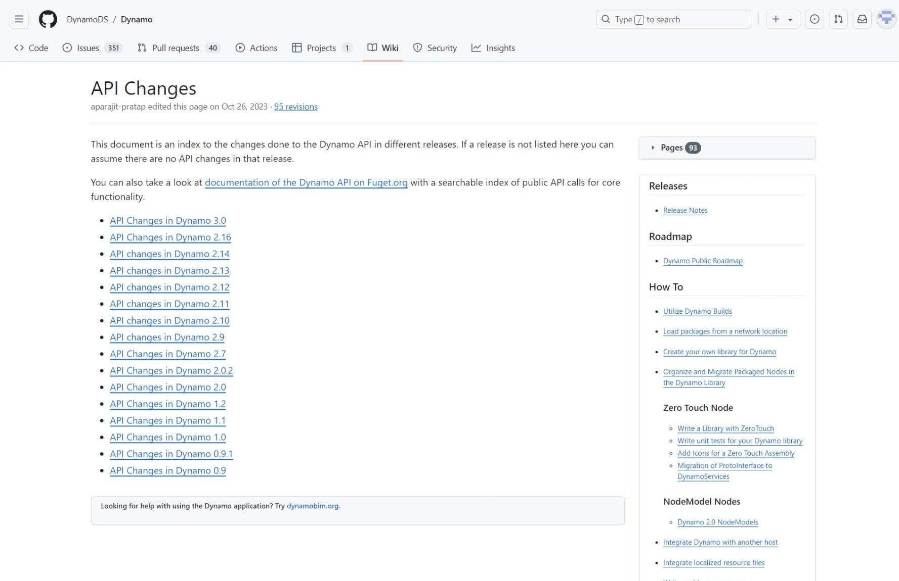

# Developing for Dynamo

Regardless of experience level, the Dynamo platform is designed for all users to be contributors. There are several development options that target different abilities and skill levels, each with its strengths and weaknesses depending on the goal. Below we will outline the different options and how to choose one over another.

> Three development environments: Visual Studio, Python Editor, and Code Block DesignScript

### What are my options? 

Development options for Dynamo fall primarily into two categories: _for_ Dynamo versus _in_ Dynamo. The two categories can be thought about as; "in" Dynamo implies content that is created using the Dynamo IDE to be used in Dynamo, and "for" Dynamo implies using external tools to create content to be imported into Dynamo to be used. Though this guide is focused on development _for_ Dynamo, resources for all processes are described below.

### For Dynamo 

These nodes allow for the highest degree of customization. Many packages are built with this method, and it is necessary for contributing to Dynamo's source. The process of building them will be covered in this guide.

* Zero-Touch Nodes
* NodeModel derived Nodes
* Extensions

> The Primer has a guide on [importing Zero-Touch libraries](https://primer2.dynamobim.org/6_custom_nodes_and_packages/6-2_packages/5-zero-touch).

For the discussion below Visual Studio is used as the development environment for Zero-Touch and NodeModel nodes.

> The Visual Studio interface with a project that we will be developing

### In Dynamo 

Though these processes exist in the visual programming workspace and are relatively straight forward, they are all viable options for customizing Dynamo. The Primer covers these extensively and provides scripting tips and best practices in the [Scripting Strategies](../../9_best_practices/2-scripting-strategies.md) chapter.

*   Code Blocks expose DesignScript in the visual programming environment, allowing for flexible text-script and node workflows. A function in a code block can be called by anything in the workspace.

    > Download a Code Block example (Right-click and save as) or see a detailed walk-through in the [Primer](https://primer.dynamobim.org/07_Code-Block/7-1_what-is-a-code-block.html).
*   Custom Nodes are containers for collections of nodes or even entire graphs. They are an effective way to collect frequently used routines and share them with the community.

    > Download a Custom Node example (Right-click and save as) or see a detailed walk-through in the [Primer](https://primer.dynamobim.org/10_Custom-Nodes/10-1_Introduction.html).
*   Python Nodes are a scripting interface in the visual programming workspace, similar to code blocks. The Autodesk.DesignScript libraries use a dot notation similar to DesignScript.

    > Download a Python Node example (Right-click and save as) or see a detailed walk-through in the [Primer](https://primer.dynamobim.org/10_Custom-Nodes/10-4_Python.html)

Developing in the Dynamo workspace is a powerful tool for getting immediate feedback.

> Developing in the Dynamo workspace with the Python Node

### What are the advantages/disadvantages of each? 

Development options for Dynamo have been designed to address the complexity of a customization need. Whether the goal is to write a recursive script in Python or build an entirely custom node UI, there are options for implementing code that involve only what's necessary to get up and running.

**Code Blocks, the Python Node and Custom Nodes in Dynamo**

These are straightforward options for writing code in the Dynamo visual programming environment. The Dynamo visual programming workspace provides access to Python, DesignScript, and the ability to contain multiple nodes inside of a Custom Node.

With these methods we can:

* Get started writing Python or DesignScript with little to no setup.
* Import Python libraries into Dynamo.
* Share Code Blocks, Python Nodes, and Custom Nodes with the Dynamo community as part of a package.

**Zero-Touch Nodes**

Zero-Touch refers to a simple point-and-click method for importing C# libraries. Dynamo will read the public methods of a `.dll` and convert them to Dynamo nodes. You can use Zero-Touch to develop your own custom nodes and packages.

With this method we can:

* Import a library which was not necessarily developed for Dynamo and automatically create a suite of new nodes, such as the [A-Forge example](../../6_custom_nodes_and_packages/6-2_packages/5-zero-touch.md#case-study-importing-aforge) in the Primer
* Write C# methods and easily use the methods as nodes in Dynamo
* Share a C# library as nodes with the Dynamo community in a package

**NodeModel derived Nodes**

These nodes are a step deeper into the structure of Dynamo. They are based on the `NodeModel` class and written in C#. While this method provides the most flexibility and power, most aspects of the node have to be explicitly defined and functions need to live in a separate assembly.

With this method we can:

* Create fully a customizable node UI with sliders, images, color, etc (e.g. ColorRange node)
* Access and affect what's happening in the Dynamo canvas
* Customize lacing
* Load into Dynamo as a package

### Understanding Dynamo versioning and API changes (1.x → 2.x) 

Since Dynamo is being regularly updated, changes might be made to part of the API that a package uses. Tracking these changes is important to ensure that existing packages continue to work properly.

API changes are tracked on the [Dynamo Github Wiki](https://github.com/DynamoDS/Dynamo/wiki/API-Changes). This covers changes to DynamoCore, Libraries, and Workspaces.

An example of an upcoming, significant change is the transition from XML to JSON file format in version 2.0. NodeModel derived nodes will now need a [JSON constructor](https://github.com/DynamoDS/Dynamo/wiki/Write-a-Json-Constructor-for-a-NodeModel-Node) otherwise they won't open in Dynamo 2.0.

Dynamo's API documentation currently covers the core functionality: [http://dynamods.github.io/DynamoAPI](http://dynamods.github.io/DynamoAPI)

### Permission to distribute binaries in a package 

Be aware of .dll's included in a package being uploaded to the package manager. If the package author did not create the .dll, they must have the rights to share it.

If a package includes binaries, users must be prompted upon downloading that the package contains binaries.

### Dynamo UI Performance Considerations

At the time of writing, Dynamo primarily uses WPF (windows presentation foundation) to render its UI. WPF is a complex and powerful xaml/binding based system. Because Dynamo has a complex UI, it's easy to create UI hangs, memory leaks, or wrap the graph execution and UI updates together in ways that degrade performance.

Please refer to the [Dynamo Performance Considerations Wiki Page](https://github.com/DynamoDS/Dynamo/wiki/Dynamo-UI-Performance) which will help you avoid a few common pitfalls making changes to Dynamo's code.
