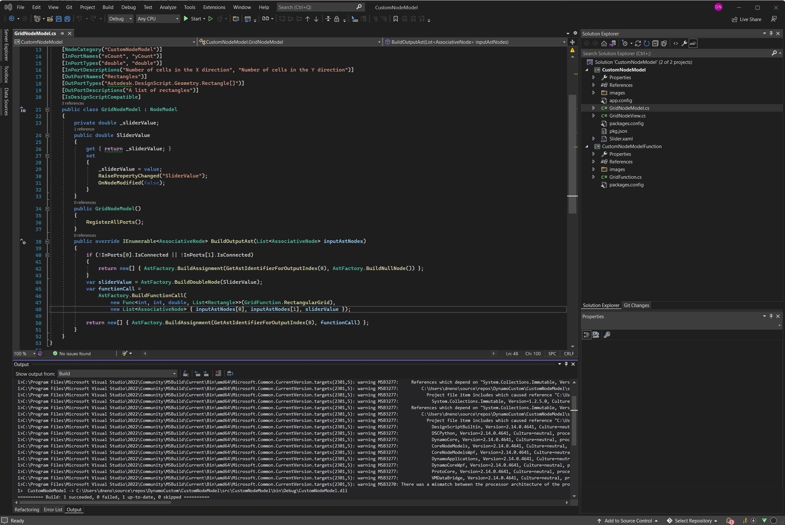

# Dynamo를 위한 개발 

경험 수준에 관계없이 Dynamo 플랫폼은 모든 사용자가 기여할 수 있도록 설계되었습니다. 다양한 능력과 기술 수준을 대상으로 하는 여러 가지 개발 옵션이 있으며, 각 개발 옵션은 목표에 따라 장단점이 있습니다. 아래에서는 여러 옵션에 대해 간략하게 알아보고 하나의 옵션을 선택하는 방법에 대해 살펴보겠습니다.

> 세 가지 개발 환경: Visual Studio, Python 편집기 및 코드 블록 DesignScript

#### 어떤 옵션이 제공됩니까? 

Dynamo의 개발 옵션은 주로 두 가지 카테고리인 _for_ Dynamo와 _in_ Dynamo로 나뉩니다. 두 가지 카테고리는 다음과 같이 생각할 수 있습니다. "in" Dynamo는 Dynamo IDE를 사용하여 생성한 콘텐츠를 Dynamo에서 사용하는 것을 의미하며, "for" Dynamo는 외부 도구를 사용하여 생성한 콘텐츠를 Dynamo로 가져와서 사용하는 것을 의미합니다. 이 안내서는 _for_ Dynamo 개발에 중점을 두고 있지만, 아래에 모든 프로세스에 대한 리소스가 명시되어 있습니다.

#### For Dynamo 

이러한 노드를 사용하면 최고 수준으로 사용자 지정할 수 있습니다. 많은 패키지가 이 방법으로 빌드되며, 이것은 Dynamo의 소스에 기여하는 데 필요합니다. 패키지를 빌드하는 프로세스는 이 안내서에 설명되어 있습니다.

* Zero-Touch 노드
* NodeModel 파생 노드
* 확장

> 입문서에는 [Zero-Touch 라이브러리 가져오기](https://primer2.dynamobim.org/6_custom_nodes_and_packages/6-2_packages/5-zero-touch)에 대한 안내서가 있습니다.

아래 설명에서는 Visual Studio를 Zero-Touch 및 NodeModel 노드의 개발 환경으로 사용합니다.

> Visual Studio 인터페이스와 개발 예정인 프로젝트

#### In Dynamo 

이러한 프로세스는 시각적 프로그래밍 작업공간에 존재하고 비교적 간단하지만, 모두 Dynamo를 사용자 지정하는 데 사용할 수 있는 옵션입니다. 입문서에서는 이러한 내용을 광범위하게 다루고 있으며 [스크립팅 전략](http://dynamoprimer.com/en/12\_Best-Practice/12-1\_Scripting-Strategies.html) 장에서 스크립팅 팁과 모범 사례를 제공합니다.

*   코드 블록은 시각적 프로그래밍 환경에서 DesignScript를 노출하여 유연한 텍스트 스크립트 및 노드 워크플로우를 지원합니다. 코드 블록의 함수는 작업공간의 모든 항목에서 호출할 수 있습니다.

    > 코드 블록 예제를 다운로드하거나(마우스 오른쪽 버튼을 클릭하고 다른 이름으로 저장) [입문서](https://primer.dynamobim.org/07\_Code-Block/7-1\_what-is-a-code-block.html)에서 자세한 내용을 참조하십시오.
*   사용자 지정 노드는 노드 모음 또는 전체 그래프를 위한 컨테이너로, 자주 사용하는 루틴을 수집하고 커뮤니티와 공유하는 효과적인 방법입니다.

    > 사용자 지정 노드 예제를 다운로드하거나(마우스 오른쪽 버튼을 클릭하고 다른 이름으로 저장) [입문서](https://primer.dynamobim.org/10\_Custom-Nodes/10-1\_Introduction.html)에서 자세한 내용을 참조하십시오.
*   Python 노드는 코드 블록과 유사한, 시각적 프로그래밍 작업공간의 스크립팅 인터페이스입니다. Autodesk.DesignScript 라이브러리는 DesignScript와 유사한 점 표기법을 사용합니다.

    > Python 노드 예제를 다운로드하거나(마우스 오른쪽 버튼을 클릭하고 다른 이름으로 저장) [입문서](https://primer.dynamobim.org/10\_Custom-Nodes/10-4\_Python.html)에서 자세한 내용을 참조하십시오.

Dynamo 작업공간을 통한 개발은 피드백을 즉각적으로 받을 수 있는 강력한 도구입니다.

> Python 노드를 사용하여 Dynamo 작업공간에서 개발하기

#### 장점과 단점은 각각 무엇입니까? 

Dynamo의 개발 옵션은 복잡한 사용자 지정 요구 사항을 해결하기 위해 설계되었습니다. Python으로 재귀 스크립트를 작성하든 완전히 사용자 지정 가능한 노드 UI를 빌드하든, 시작하고 실행하는 데 필요한 것만 포함하는 코드를 구현할 수 있는 옵션이 있습니다.

**Dynamo의 코드 블록, Python 노드 및 사용자 지정 노드**

아래에 Dynamo 시각적 프로그래밍 환경에서 코드를 작성할 수 있는 간단한 옵션이 나와 있습니다. Dynamo 시각적 프로그래밍 작업공간은 Python과 DesignScript에 대한 액세스와 사용자 지정 노드 안에 여러 노드를 포함할 수 있는 기능을 제공합니다.

이러한 방법을 사용하여 다음을 수행할 수 있습니다.

* 설정이 거의 또는 전혀 없는 Python 또는 DesignScript를 작성합니다.
* Python 라이브러리를 Dynamo로 가져옵니다.
* 코드 블록, Python 노드 및 사용자 지정 노드를 패키지의 일부로 Dynamo 커뮤니티와 공유합니다.

**Zero-Touch 노드**

Zero-Touch는 간단한 포인트 앤 클릭 방법으로 C# 라이브러리를 가져오는 것을 의미합니다. Dynamo에서는 `.dll`의 공용 메서드를 읽고 Dynamo 노드로 변환합니다. Zero-Touch를 사용하여 사용자 지정 노드 및 패키지를 개발할 수 있습니다.

이 방법을 사용하여 다음을 수행할 수 있습니다.

* Dynamo용으로 개발되지 않았을 수 있는 라이브러리를 가져와서 입문서의 [A-Forge 예제](http://dynamoprimer.com/en/10\_Packages/10-5\_Zero-Touch.html)와 같은 새로운 노드 모음을 자동으로 생성합니다.
* C# 메서드를 작성하고 Dynamo에서 메서드를 노드로 손쉽게 사용합니다.
* C# 라이브러리를 패키지의 노드로 Dynamo 커뮤니티와 공유합니다.

**NodeModel 파생 노드**

이러한 노드는 Dynamo 구조에서 한 단계 더 들어간 것으로, `NodeModel` 클래스를 기반으로 하며 C#으로 작성되었습니다. 이 방법이 가장 뛰어난 유연성과 강력한 성능을 제공하기는 하지만, 노드의 대부분의 측면을 명시적으로 정의해야 하고 함수는 별도의 어셈블리에 있어야 합니다.

이 방법을 사용하여 다음을 수행할 수 있습니다.

* 슬라이더, 이미지, 색상 등을 사용하여 완전히 사용자 지정 가능한 노드 UI를 생성합니다(예: ColorRange 노드)
* Dynamo 캔버스에서 발생하는 사항에 액세스하고 관련 작업을 수행합니다.
* 레이싱을 사용자 지정합니다.
* Dynamo에 패키지로 로드합니다.

#### Dynamo 버전 관리 및 API 변경 사항 이해하기(1.x → 2.x) 

Dynamo는 정기적으로 업데이트되고 있으므로 패키지에서 사용하는 API의 일부가 변경될 수 있습니다. 기존 패키지가 계속 제대로 작동하도록 하려면 이러한 변경 사항을 추적하는 것이 중요합니다.

API 변경 사항은 [Dynamo Github Wiki](https://github.com/DynamoDS/Dynamo/wiki/API-Changes)에서 추적할 수 있습니다. 이러한 변경 사항에는 DynamoCore, 라이브러리 및 작업공간에 대한 변경 사항이 포함됩니다.

버전 2.0에서 파일 형식이 XML에서 JSON으로 전환될 예정이며, 이는 예정된 중요 변경 사항 중 하나입니다. NodeModel 파생 노드에는 이제 [JSON 생성자](https://github.com/DynamoDS/Dynamo/wiki/Write-a-Json-Constructor-for-a-NodeModel-Node)가 필요하며, 이 생성자가 없으면 Dynamo 2.0에서 열리지 않습니다.

현재 Dynamo의 API 문서([http://dynamods.github.io/DynamoAPI](http://dynamods.github.io/DynamoAPI))에는 핵심 기능에 대한 설명이 포함되어 있습니다.

#### 패키지에 바이너리를 배포할 수 있는 권한 

패키지 관리자에 업로드되는 패키지에 .dll이 포함되어 있는지 확인합니다. 패키지 작성자가 .dll을 생성하지 않은 경우, 패키지 작성자에게 해당 .dll을 공유할 수 있는 권한이 있어야 합니다.

패키지에 바이너리가 포함되어 있는 경우 다운로드할 때 사용자에게 패키지에 바이너리가 포함되어 있다는 메시지가 표시되어야 합니다.
