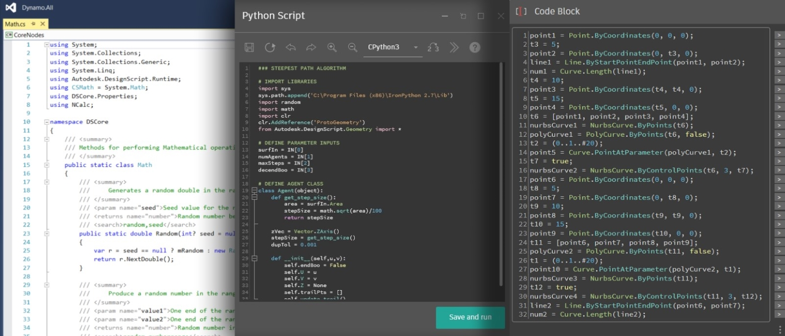

# 為 Dynamo 開發

無論經驗程度為何，Dynamo 平台專為所有使用者成為貢獻者而設計。針對不同的能力和技能程度有幾種開發選項，每種能力和技能程度的優缺點視目標而定。下面我們將概述不同的選項，以及如何選擇。

> 三種開發環境：Visual Studio、Python 編輯器和 Code Block DesignScript

#### 我有哪些選擇？

Dynamo 的開發選項主要分為兩個類別：_為_ Dynamo，以及 _在_ Dynamo。這兩個類別可視為：「在」Dynamo 表示使用 Dynamo IDE 建立要在 Dynamo 中使用的內容；「為」Dynamo 表示使用外部工具建立要匯入 Dynamo 中進行使用的內容。雖然本指南著重在 _為_ Dynamo 的開發，但下面會描述所有程序的資源。

#### 為 Dynamo 

這些節點允許最高程度的自訂。許多套件都使用此方法建置，因此要對 Dynamo 的原始碼做出貢獻也需要此方法。本指南將涵蓋建置這些節點的程序。

* Zero-Touch 節點
* NodeModel 衍生的節點
* 延伸

> Primer 在[匯入 Zero-Touch 資源庫](https://primer2.dynamobim.org/6_custom_nodes_and_packages/6-2_packages/5-zero-touch)提供了指南。

下面的討論使用 Visual Studio 當作 Zero-Touch 和 NodeModel 節點的開發環境。

> Visual Studio 介面，以及我們將開發的專案

#### 在 Dynamo 

雖然這些程序都在視覺程式設計工作區中，相對而言也簡單易懂，但它們都是自訂 Dynamo 的可行選項。Primer 廣泛涵蓋這些內容，並在[撰寫腳本策略](http://dynamoprimer.com/en/12\_Best-Practice/12-1\_Scripting-Strategies.html)一章中提供撰寫腳本的秘訣和最佳實踐。

*   「程式碼區塊」可在視覺程式設計環境中顯示 DesignScript，提供靈活的文字腳本和節點工作流程。程式碼區塊中的函數可被工作區中的任何內容呼叫。

    > 下載程式碼區塊範例 (按一下右鍵後另存)，或在 [Primer](https://primer.dynamobim.org/07\_Code-Block/7-1\_what-is-a-code-block.html) 中查看詳細的逐步解說。
*   「自訂節點」是節點集合 (甚至整個圖表) 的容器。是收集常用常式並與社群分享的有效方式。

    > 下載自訂節點範例 (按一下右鍵後另存)，或在 [Primer](https://primer.dynamobim.org/10\_Custom-Nodes/10-1\_Introduction.html) 中查看詳細的逐步解說。
*   「Python 節點」是視覺程式設計工作區中的腳本撰寫介面，與程式碼區塊類似。Autodesk.DesignScript 資源庫使用與 DesignScript 類似的點標記法。

    > 下載 Python 節點範例 (按一下右鍵後另存)，或在 [Primer](https://primer.dynamobim.org/10\_Custom-Nodes/10-4\_Python.html) 中查看詳細的逐步解說。

在 Dynamo 工作區中開發是一個能立即得到回饋的強大工具。

> 在 Dynamo 工作區中使用 Python 節點開發

#### 每種方法有哪些優點/缺點？

Dynamo 的開發選項已設計為可解決自訂需求的複雜性。無論目標是以 Python 撰寫遞迴指令碼，還是建置一個完全自訂的節點使用者介面，都有一些選項可實作只包含啟動和執行所需的程式碼。

**Dynamo 中的程式碼區塊、Python 節點和自訂節點**

這些是在 Dynamo 視覺程式設計環境中撰寫程式碼的簡單選項。Dynamo 視覺程式設計工作區可讓您存取 Python、DesignScript，並且能在自訂節點內包含多個節點。

使用這些方法，我們可以：

* 開始撰寫 Python 或 DesignScript，幾乎不用進行設定。
* 將 Python 資源庫匯入 Dynamo。
* 將程式碼區塊、Python 節點和自訂節點做為套件的一部分與 Dynamo 社群分享。

**Zero-Touch 節點**

「Zero-Touch」是指匯入 C# 資源庫所使用的一個簡易點選方法。Dynamo 將讀取 `.dll` 檔案的公開方法，並將其轉換為 Dynamo 節點。您可以使用 Zero-Touch 開發自己的自訂節點與套件

使用此方法，我們可以：

* 匯入不一定是為 Dynamo 開發的資源庫，並自動建立一組新節點，例如 Primer 中的 [A-Forge 範例](http://dynamoprimer.com/en/10\_Packages/10-5\_Zero-Touch.html)
* 撰寫 C# 方法，並輕鬆使用這些方法做為 Dynamo 中的節點
* 將 C# 資源庫以節點方式透過套件與 Dynamo 社群分享

**NodeModel 衍生的節點**

這些節點更深入 Dynamo 結構。它們以 `NodeModel` 類別為基礎，並以 C# 撰寫。雖然此方法提供最大的靈活性和功能，但節點的絕大多數層面必須明確定義，且函數必須位於單獨的組合中。

使用此方法，我們可以：

* 使用滑棒、影像、顏色等建立完全可自訂的節點使用者介面 (例如 ColorRange 節點)
* 存取並影響 Dynamo 圖元區中發生的結果
* 自訂交織
* 載入 Dynamo 中成為套件

#### 瞭解 Dynamo 版本管理和 API 變更 (1.x → 2.x) 

由於 Dynamo 會定期更新，因此可能會變更套件所使用的 API 部分。追蹤這些變更非常重要，以確保既有套件能持續正常運作。

[Dynamo Github Wiki](https://github.com/DynamoDS/Dynamo/wiki/API-Changes) 會追蹤 API 變更。這包括對 DynamoCore、資源庫和工作區的變更。

一個即將實施的重大變更範例是，在 2.0 版中從 XML 檔案格式轉換為 JSON 檔案格式。NodeModel 衍生的節點現在需要 [JSON 建構函式](https://github.com/DynamoDS/Dynamo/wiki/Write-a-Json-Constructor-for-a-NodeModel-Node)，否則無法在 Dynamo 2.0 中開啟。

Dynamo 的 API 文件目前涵蓋核心功能：[http://dynamods.github.io/DynamoAPI](http://dynamods.github.io/DynamoAPI)

#### 以套件散發二進位檔案的權限 

請注意要上傳到 Package Manager 的套件中是否包含 .dll。如果套件作者未建立 .dll，他們必須具有分享該 .dll 的權限。

如果套件包含二進位檔案，則必須在使用者下載包含二進位檔案的套件時加以提示。
