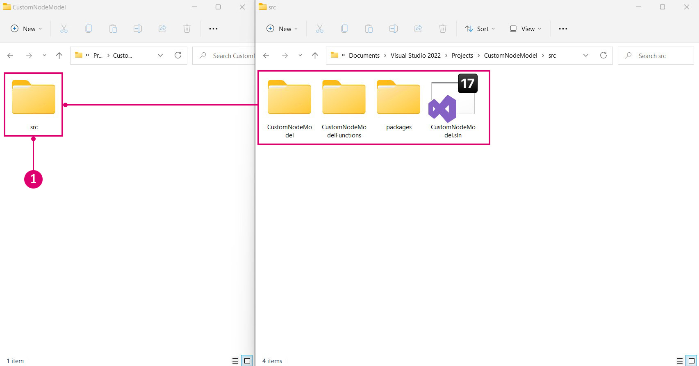
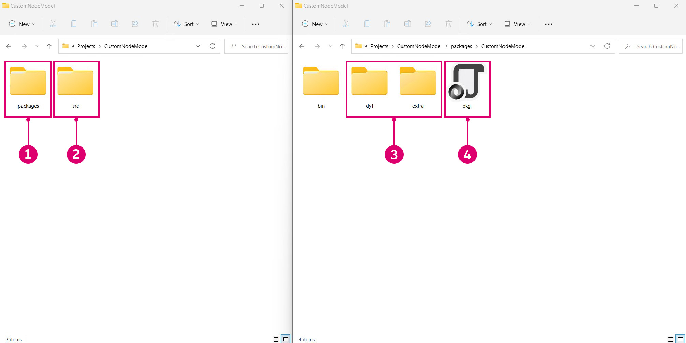

# Build a Package from Visual Studio

If you are developing assemblies to be published as a package for Dynamo, the project can be configured to group all the necessary assets and put them in a package-compatible directory structure. This will enable the project to be quickly tested as a package and simulate a user's experience.

#### How to build directly to the package folder <a href="#how-to-build-directly-to-the-package-folder" id="how-to-build-directly-to-the-package-folder"></a>

There are two methods for building a package in Visual Studio:

* Add post-build events through the Project Settings dialogue that use xcopy or Python scripts to copy the necessary files
* Use the "AfterBuild" build target in the `.csproj` file to create file and directory copy tasks

"AfterBuild" is the preferred method for these types of operations (and the one covered in this guide) as it does not rely on file copying which may not be available on the build machine.

#### Copy package files with the AfterBuild Method <a href="#copy-package-files-with-the-afterbuild-method" id="copy-package-files-with-the-afterbuild-method"></a>

Set up the directory structure in the repository so that the source files are separate from the package files. Working with the CustomNodeModel case study, place the Visual Studio project and all associated files into a new `src` folder. You will be storing all packages generated by the project in this folder. The folder structure should now look like this:

```
CustomNodeModel
> src
  > CustomNodeModel
  > CustomNodeModelFunction
  > packages
  > CustomNodeModel.sln
```



> 1. Move the project files into the new `src` folder

Now that the source files are in a separate folder, add a `AfterBuild` target to the `CustomNodeModel.csproj` file in Visual Studio. This should copy the necessary files into a new package folder. Open the `CustomNodeModel.csproj` file in a text editor (we used [Atom](https://atom.io)) and place the build target before the closing `</Project>` tag. This AfterBuild target will copy all .dll, .pbd, .xml, and .config files into a new bin folder and creates a dyf and extra folders.

```
  <Target Name="AfterBuild">
    <ItemGroup>
      <Dlls Include="$(OutDir)*.dll" />
      <Pdbs Include="$(OutDir)*.pdb" />
      <Xmls Include="$(OutDir)*.xml" />
      <Configs Include="$(OutDir)*.config" />
    </ItemGroup>
    <Copy SourceFiles="@(Dlls)" DestinationFolder="$(SolutionDir)..\packages\CustomNodeModel\bin\" />
    <Copy SourceFiles="@(Pdbs)" DestinationFolder="$(SolutionDir)..\packages\CustomNodeModel\bin\" />
    <Copy SourceFiles="@(Xmls)" DestinationFolder="$(SolutionDir)..\packages\CustomNodeModel\bin\" />
    <Copy SourceFiles="@(Configs)" DestinationFolder="$(SolutionDir)..\packages\CustomNodeModel\bin\" />
    <MakeDir Directories="$(SolutionDir)..\packages\CustomNodeModel\dyf" />
    <MakeDir Directories="$(SolutionDir)..\packages\CustomNodeModel\extra" />
  </Target>
```


> We will need to make sure that the target has been added to the `CustomNodeModel.csproj` file (not another project file) and that the project does not have any existing Post-Build settings.
>
> 1. Place AfterBuild target before the end `</Project>` tag.

In the `<ItemGroup>` section, a number of variables are defined to represent specific file types. For example, the `Dll` variable represents all files in the output directory whose extension is `.dll`.

```
<ItemGroup>
  <Dlls Include="$(OutDir)*.dll" />
</ItemGroup>
```

`Copy` task is to copy all `.dll` files to a directory, specifically the package folder to which we are building.

```
<Copy SourceFiles="@(Dlls)" DestinationFolder="$(SolutionDir)..\packages\CustomNodeModel\bin\" />
```

Dynamo packages typically have a `dyf` and `extra` folder for Dynamo Custom Nodes and other assets such as images. To create these folders, we need to use a `MakeDir` task. This task will create a folder if it does not exist. You can add files manually to this folder.

```
<MakeDir Directories="$(SolutionDir)..\packages\CustomNodeModel\extra" />
```

If you build the project, the project folder should now have a `packages` folder alongside the `src` folder previously created. Inside the `packages` directory is a folder containing everything needed for the package. We also need to copy the `pkg.json` file into the package folder so that Dynamo knows to load the package.



> 1. The new packages folder that the AfterBuild target created
> 2. The existing src folder with the project
> 3. The `dyf` and `extra` folders created from the AfterBuild target
> 4. Manually copy the `pkg.json` file.

Now you can publish the package using Dynamo's package manager or directly copy it into Dynamo's package directory: `<user>\AppData\Roaming\Dynamo\1.3\packages`.
