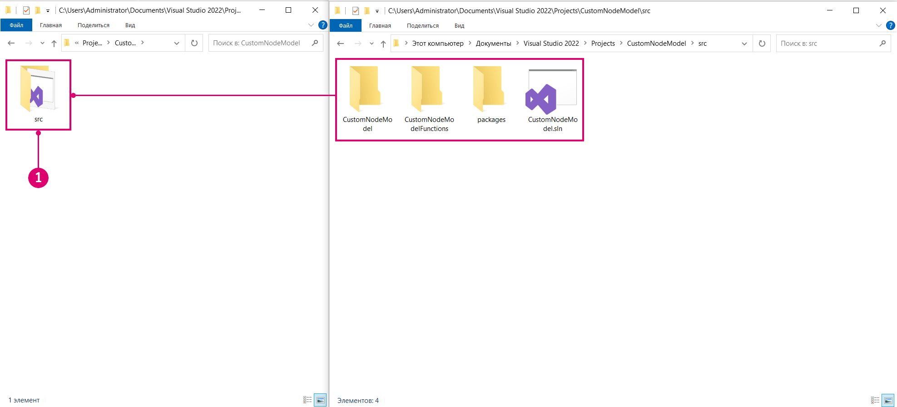
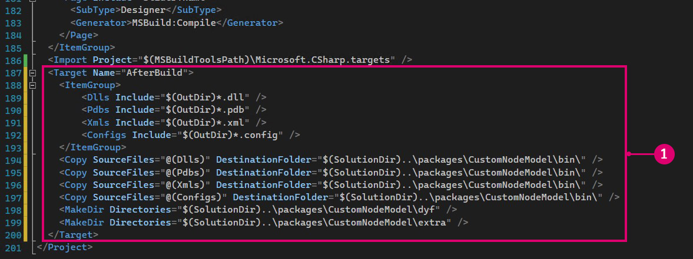

# Générer un package à partir de Visual Studio 

Si vous développez des assemblages destinés à être publiés sous forme de package pour Dynamo, le projet peut être configuré pour regrouper toutes les ressources nécessaires et les placer dans une structure de répertoire compatible avec le package. Cela permettra de tester rapidement le projet en tant que package et de simuler l’expérience d’un utilisateur.

#### Comment générer directement dans le dossier du package <a href="#how-to-build-directly-to-the-package-folder" id="how-to-build-directly-to-the-package-folder"></a>

Il existe deux méthodes pour générer un package dans Visual Studio :

* ajouter des événements après la génération via la boîte de dialogue Paramètres du projet qui utilisent xcopy ou des scripts Python pour copier les fichiers nécessaires ;
* utiliser la cible de génération « AfterBuild » dans le fichier `.csproj` pour créer des tâches de copie de fichiers et de répertoires.

« AfterBuild » est la méthode préférée pour ces types d’opérations (et celle couverte par ce guide) car elle ne repose pas sur la copie de fichiers qui peuvent ne pas être disponibles sur la machine de génération.

#### Copier des fichiers de package à l’aide de la méthode AfterBuild <a href="#copy-package-files-with-the-afterbuild-method" id="copy-package-files-with-the-afterbuild-method"></a>

Configurez la structure de répertoires dans le dépôt de sorte que les fichiers source soient séparés des fichiers de package. En travaillant avec l’étude de cas CustomNodeModel, placez le projet Visual Studio et tous les fichiers associés dans un nouveau dossier `src`. C’est dans ce dossier que seront stockés tous les packages générés par le projet. La structure du dossier devrait maintenant être la suivante :

```
CustomNodeModel
> src
  > CustomNodeModel
  > CustomNodeModelFunction
  > packages
  > CustomNodeModel.sln
```



> 1. Déplacez les fichiers de projet vers le nouveau dossier `src`.

Maintenant que les fichiers source se trouvent dans un dossier distinct, ajoutez une cible `AfterBuild` au fichier `CustomNodeModel.csproj` dans Visual Studio. Cela devrait permettre de copier les fichiers nécessaires dans un nouveau dossier de package. Ouvrez le fichier `CustomNodeModel.csproj` dans un éditeur de texte (nous avons utilisé [Atom](https://atom.io)) et placez la cible de génération avant la balise de fermeture `</Project>`. Cette cible AfterBuild copie tous les fichiers .dll, .pbd, .xml et .config dans un nouveau dossier bin et crée un fichier dyf et des dossiers supplémentaires.

```
  <Target Name="AfterBuild">
    <ItemGroup>
      <Dlls Include="$(OutDir)*.dll" />
      <Pdbs Include="$(OutDir)*.pdb" />
      <Xmls Include="$(OutDir)*.xml" />
      <Configs Include="$(OutDir)*.config" />
    </ItemGroup>
    <Copy SourceFiles="@(Dlls)" DestinationFolder="$(SolutionDir)..\packages\CustomNodeModel\bin\" />
    <Copy SourceFiles="@(Pdbs)" DestinationFolder="$(SolutionDir)..\packages\CustomNodeModel\bin\" />
    <Copy SourceFiles="@(Xmls)" DestinationFolder="$(SolutionDir)..\packages\CustomNodeModel\bin\" />
    <Copy SourceFiles="@(Configs)" DestinationFolder="$(SolutionDir)..\packages\CustomNodeModel\bin\" />
    <MakeDir Directories="$(SolutionDir)..\packages\CustomNodeModel\dyf" />
    <MakeDir Directories="$(SolutionDir)..\packages\CustomNodeModel\extra" />
  </Target>
```



> Nous devons nous assurer que la cible a été ajoutée au fichier `CustomNodeModel.csproj` (et non à un autre fichier de projet) et que le projet ne possède aucun paramètre postérieur à la génération.
>
> 1. Placez la cible AfterBuild avant la balise de fin `</Project>`.

Dans la section `<ItemGroup>`, un certain nombre de variables sont définies pour représenter des types de fichiers spécifiques. Par exemple, la variable `Dll` représente tous les fichiers du répertoire de sortie dont l’extension est `.dll`.

```
<ItemGroup>
  <Dlls Include="$(OutDir)*.dll" />
</ItemGroup>
```

La tâche `Copy` consiste à copier tous les fichiers `.dll` dans un répertoire, en particulier le dossier de package vers lequel se fait la génération.

```
<Copy SourceFiles="@(Dlls)" DestinationFolder="$(SolutionDir)..\packages\CustomNodeModel\bin\" />
```

Les packages Dynamo possèdent généralement un dossier `dyf` et `extra` pour les nœuds personnalisés Dynamo et d’autres ressources telles que des images. Pour créer ces dossiers, nous devons utiliser une tâche `MakeDir`. Cette tâche crée un dossier s’il n’existe pas. Vous pouvez ajouter des fichiers manuellement à ce dossier.

```
<MakeDir Directories="$(SolutionDir)..\packages\CustomNodeModel\extra" />
```

Si vous générez le projet, le dossier de projet doit désormais comporter un dossier `packages` en plus du dossier `src` créé précédemment. Le répertoire `packages` contient un dossier contenant tous les éléments nécessaires au package. Vous devez également copier le fichier `pkg.json` dans le dossier du package afin que Dynamo sache comment charger le package.


> 1. Le nouveau dossier de packages créé par la cible AfterBuild
> 2. Le dossier src existant avec le projet
> 3. Les dossiers `dyf` et `extra` créés à partir de la cible AfterBuild
> 4. Copiez manuellement le fichier `pkg.json`

Vous pouvez désormais publier le package à l’aide du gestionnaire de package de Dynamo ou le copier directement dans le répertoire de package de Dynamo : `<user>\AppData\Roaming\Dynamo\1.3\packages`.
