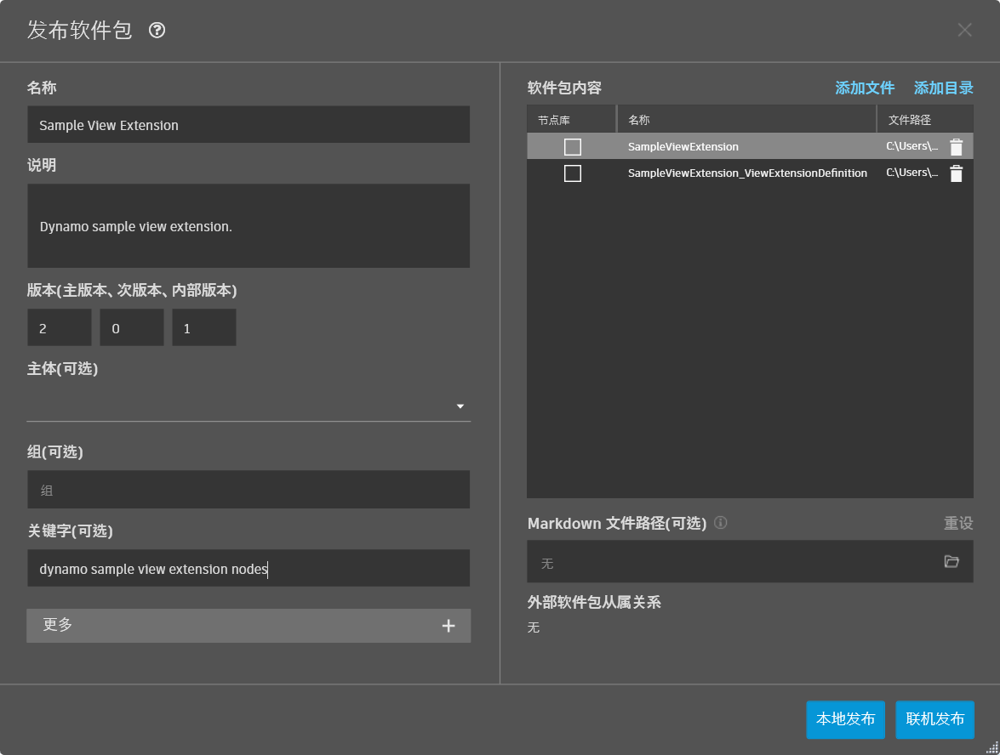
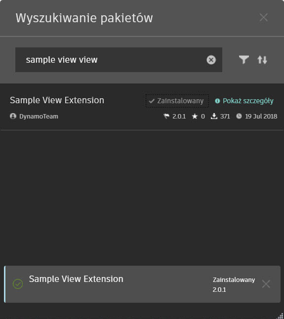

# Extensiones como paquetes

### Extensiones como paquetes <a href="#extensions-as-packages" id="extensions-as-packages"></a>

### Descripción general <a href="#overview" id="overview"></a>

Las extensiones de Dynamo se pueden implementar en Package Manager igual que las bibliotecas de nodos de Dynamo normales. Cuando un paquete instalado contiene una extensión de vista, la extensión se carga en el tiempo de ejecución durante la carga de Dynamo. Puede comprobar en la consola de Dynamo que la extensión se haya cargado correctamente.

### Estructura del paquete <a href="#package-structure" id="package-structure"></a>

La estructura de un paquete de extensión es la misma que la de un paquete normal y contiene lo siguiente:

```
C:\Users\User\AppData\Roaming\Dynamo\Dynamo Core\2.1\packages\Sample View Extension
│   pkg.json
├───bin
│       SampleViewExtension.dll
├───dyf
└───extra
        SampleViewExtension_ViewExtensionDefinition.xml
```

Suponiendo que ya haya creado la extensión, tendrá (como mínimo) un montaje de .NET y un archivo manifest. El montaje debe contener una clase que implemente `IViewExtension` o `IExtension`. El archivo manifest .XML indica a Dynamo la clase de la que se debe crear una instancia para iniciar la extensión. Para que Package Manager pueda localizar correctamente la extensión, el archivo manifest debe corresponderse con la ubicación y el nombre del montaje.

Incluya los archivos de montaje en la carpeta `bin` y el archivo manifest en la carpeta `extra`. Los componentes adicionales también se pueden incluir en esta carpeta.

Archivo manifest .XML de ejemplo:

```
<ViewExtensionDefinition>
  <AssemblyPath>..\bin\MyViewExtension.dll</AssemblyPath>
  <TypeName>MyViewExtension.MyViewExtension</TypeName>
</ViewExtensionDefinition>
```

### Carga <a href="#uploading" id="uploading"></a>

Una vez que tenga una carpeta que contenga los subdirectorios indicados anteriormente, podrá enviar (cargar) elementos a Package Manager. Algo que debe tener en cuenta es que actualmente no se pueden publicar paquetes desde Dynamo Sandbox. Esto significa que debe utilizar Dynamo Revit. Una vez en Dynamo Revit, vaya a Paquetes => Publicar paquete nuevo. Se solicitará al usuario que inicie sesión en la cuenta de Autodesk Account a la que desea asociar el paquete.

En este momento, debería encontrarse en la ventana normal de publicación de paquetes, donde introducirá todos los campos necesarios relativos a su paquete o extensión. Hay un paso adicional **muy importante** que requiere asegurarse de que ninguno de los archivos de montaje se marque como biblioteca de nodos. Para ello, haga clic con el botón derecho en los archivos que ha importado (la carpeta de paquetes creada anteriormente). Aparecerá un menú contextual que le permite activar (o desactivar) esta opción. Todos los montajes de extensión deben estar desactivados.



Antes de realizar la publicación pública, debe efectuarla siempre localmente para asegurarse de que todo funciona según lo previsto. Una vez que se haya verificado esto, puede seleccionar Publicar para llevar a cabo el proceso.

### Extracción <a href="#pulling" id="pulling"></a>

Para comprobar que el paquete se haya cargado correctamente, debe poder buscarlo con la nomenclatura y las palabras clave especificadas en el paso de publicación. Por último, es importante señalar que las mismas extensiones requerirán un reinicio de Dynamo antes de poder utilizarse. Por lo general, al iniciar Dynamo, se deben especificar parámetros para estas extensiones.


