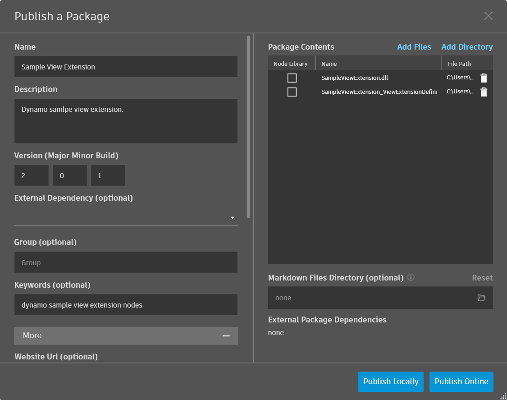

# Расширения в виде пакетов

### Расширения в виде пакетов <a href="#extensions-as-packages" id="extensions-as-packages"></a>

### Обзор <a href="#overview" id="overview"></a>

Расширения Dynamo можно развернуть в диспетчере пакетов так же, как и обычные библиотеки узлов Dynamo. Если установленный пакет содержит расширение вида, оно загружается во время выполнения при загрузке Dynamo. Откройте консоль Dynamo и убедитесь, что расширение загружено правильно.

### Структура пакета <a href="#package-structure" id="package-structure"></a>

Структура пакета расширения совпадает со структурой обычного пакета.

```
C:\Users\User\AppData\Roaming\Dynamo\Dynamo Core\2.1\packages\Sample View Extension
│   pkg.json
├───bin
│       SampleViewExtension.dll
├───dyf
└───extra
        SampleViewExtension_ViewExtensionDefinition.xml
```

Если расширение уже собрано, то у вас уже должны быть сборка .NET и файл манифеста. Сборка должна содержать класс, который реализует `IViewExtension` или `IExtension`. XML-файл манифеста указывает Dynamo, какой класс следует создать для запуска расширения. Чтобы диспетчер пакетов нашел расширение, файл манифеста должен точно соответствовать расположению и имени сборки.

Все файлы сборки можно поместить в папку `bin`, а файл манифеста — в папку `extra`. В эту папку также можно поместить любые дополнительные компоненты.

Пример файла манифеста XML.

```
<ViewExtensionDefinition>
  <AssemblyPath>..\bin\MyViewExtension.dll</AssemblyPath>
  <TypeName>MyViewExtension.MyViewExtension</TypeName>
</ViewExtensionDefinition>
```

### Выгрузка <a href="#uploading" id="uploading"></a>

После создания папки, содержащей указанные выше подкаталоги, ее можно передать (выгрузить) в диспетчер пакетов. Следует помнить, что в настоящее время невозможно публиковать пакеты из Dynamo Sandbox. Это означает, что необходимо использовать Dynamo Revit. В Dynamo Revit перейдите в раздел Packages > Publish New Package (Пакеты > Опубликовать новый пакет). При этом пользователю будет предложено войти в свою учетную запись Autodesk, с которой требуется связать пакет.

На этом этапе должно быть открыто обычное окно публикации пакета, в котором необходимо заполнить все обязательные поля, относящиеся к пакету или расширению. Теперь **очень важно** убедиться в том, что ни один из файлов сборки не помечен как библиотека узлов. Для этого щелкните правой кнопкой мыши импортированные файлы (папка пакета, созданная выше). Откроется контекстное меню, в котором можно установить (или снять) флажок для этого параметра. Флажок должен быть снят для всех сборок расширений.



Перед публикацией в открытом доступе сначала опубликуйте пакет локально, чтобы убедиться в том, что все работает надлежащим образом. Проверив работу, нажмите кнопку публикации.

### Извлечение <a href="#pulling" id="pulling"></a>

Чтобы убедиться в том, что пакет успешно загружен, попробуйте найти его по имени и ключевым словам, указанным на этапе публикации. Наконец, важно отметить, что для работы расширений потребуется перезагрузка Dynamo. Как правило, для этих расширений необходимы параметры, заданные при загрузке Dynamo.


