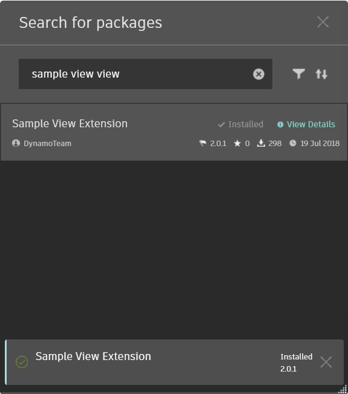

# Rozszerzenia jako pakiety

### Rozszerzenia jako pakiety <a href="#extensions-as-packages" id="extensions-as-packages"></a>

### Omówienie <a href="#overview" id="overview"></a>

Rozszerzenia dodatku Dynamo można wdrażać w Menedżerze pakietów, tak jak zwykłe biblioteki węzłów dodatku Dynamo. Jeśli zainstalowany pakiet zawiera rozszerzenie widoku, jest ono wczytywane podczas wykonywania wraz z wczytaniem dodatku Dynamo. Aby upewnić się, że rozszerzenie zostało poprawnie wczytane, można sprawdzić konsolę dodatku Dynamo.

### Struktura pakietu <a href="#package-structure" id="package-structure"></a>

Struktura pakietu rozszerzenia jest taka sama jak zwykłego pakietu i zawiera:

```
C:\Users\User\AppData\Roaming\Dynamo\Dynamo Core\2.1\packages\Sample View Extension
│   pkg.json
├───bin
│       SampleViewExtension.dll
├───dyf
└───extra
        SampleViewExtension_ViewExtensionDefinition.xml
```

Przy założeniu, że już skompilowano rozszerzenie, będzie istnieć (co najmniej) zespół .NET i plik manifestu. Zespół powinien zawierać klasę z zaimplementowanym interfejsem `IViewExtension` lub `IExtension`. Plik manifestu .XML informuje dodatek Dynamo, wystąpienie której klasy ma utworzyć w celu uruchomienia rozszerzenia. Aby Menedżer pakietów poprawnie zlokalizował rozszerzenie, plik manifestu powinien być w pełni zgodny z położeniem zespołu i nazewnictwem.

Umieść wszystkie pliki zespołu w folderze `bin`, a pliki manifestu w folderze `extra`. W tym folderze można również umieścić wszelkie dodatkowe zasoby.

Przykładowy plik manifestu .XML:

```
<ViewExtensionDefinition>
  <AssemblyPath>..\bin\MyViewExtension.dll</AssemblyPath>
  <TypeName>MyViewExtension.MyViewExtension</TypeName>
</ViewExtensionDefinition>
```

### Przekazywanie <a href="#uploading" id="uploading"></a>

Po utworzeniu folderu zawierającego podkatalogi opisane powyżej wszystko jest gotowe do wysłania (przekazania) do Menedżera pakietów. Należy jednak pamiętać, że obecnie nie można publikować pakietów z trybu Dynamo Sandbox. Oznacza to, że należy używać dodatku Dynamo Revit. W dodatku Revit Dynamo przejdź do opcji Packages (Pakiety) => Publish New Package (Publikuj nowy pakiet). Spowoduje to wyświetlenie monitu o zalogowanie się na koncie Autodesk, z którym ma zostać skojarzony pakiet.

W tym momencie powinno być wyświetlone normalne okno publikowania pakietu, w którym należy wypełnić wszystkie wymagane pola dotyczące pakietu/rozszerzenia. **Bardzo ważną** dodatkową czynnością jest upewnienie się, że żaden plik zespołu nie jest oznaczony jako biblioteka węzłów. W tym celu kliknij prawym przyciskiem myszy zaimportowane pliki (folder pakietu utworzony powyżej). Zostanie wyświetlone menu kontekstowe, które umożliwia zaznaczenie (lub cofnięcie zaznaczenia) tej opcji. Żadne zespoły rozszerzenia nie powinny być zaznaczone.


Przed opublikowaniem publicznie należy zawsze opublikować lokalnie, aby upewnić się, że wszystko działa zgodnie z oczekiwaniami. Gdy to zostanie już sprawdzone, możesz wysłać pakiet w świat, wybierając opcję publikowania.

### Ściąganie (pull) <a href="#pulling" id="pulling"></a>

Aby upewnić się, że pakiet został pomyślnie przekazany, potwierdź, że możesz wyszukać go na podstawie nazw i słów kluczowych określonych w kroku publikowania. Na koniec należy pamiętać, że do działania niektórych rozszerzeń wymagane jest ponowne uruchomienie dodatku Dynamo. Zazwyczaj te rozszerzenia wymagają określenia parametrów podczas uruchamiania dodatku Dynamo.


