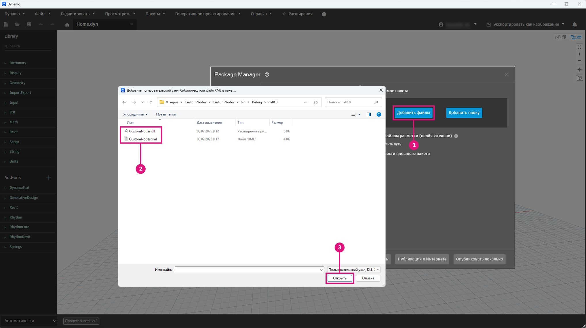

# パッケージをパブリッシュする 

### パッケージをパブリッシュする 

パッケージは、Dynamo コミュニティでノードを保存し、共有できる便利な方法です。パッケージには、Dynamo ワークスペースで作成されたカスタム ノードから NodeModel 派生ノードまで、すべての情報を含めることができます。パッケージは、Package Manager を使用してパブリッシュおよびインストールします。ここで説明する内容に加えて、[Primer](https://primer2.dynamobim.org/6_custom_nodes_and_packages/6-2_packages/1-introduction) のパッケージに関する一般的なガイドも参照してください。

#### Package Manager について 

Dynamo Package Manager は、Dynamo または Web ブラウザからアクセスできるソフトウェア レジストリ(npm と同様)です。Package Manager には、パッケージのインストール、パブリッシュ、更新、および表示が含まれます。npm と同様に、パッケージの異なるバージョンが維持されます。プロジェクトの依存関係を管理する場合にも役立ちます。

ブラウザでパッケージを検索し、統計情報を表示します: [https://dynamopackages.com/](https://dynamopackages.com)

* Dynamo では、Package Manager にはパッケージのインストール、パブリッシュ、および更新が含まれます。

> 1. パッケージをオンラインで検索する: `Packages > Search for a Package...`
> 2. インストールされたパッケージを表示/編集する: `Packages > Manage Packages...`
> 3. 新しいパッケージをパブリッシュする: `Packages > Publish New Package...`

#### パッケージをパブリッシュする

パッケージは、Dynamo 内の Package Manager からパブリッシュします。プロセスとしては、まずローカルにパブリッシュし、パッケージをテストしてから、オンラインでパブリッシュしてコミュニティと共有することが推奨されます。ここでは NodeModel ケース スタディを使用して、RectangularGrid ノードをパッケージとしてローカルにパブリッシュし、オンラインでパブリッシュする際に必要となる手順を紹介します。

Dynamo を起動して、`Packages > Publish New Package...` を選択し、`Publish a Package` ウィンドウを開きます。

> 1. `Add file...` を選択して、パッケージに追加するファイルを参照します。
> 2. NodeModel ケース スタディから、2 つの `.dll` ファイルを選択します。
> 3. `Ok` を選択します。

パッケージの内容にファイルを追加したら、パッケージに名前を付け、説明とバージョンを記入します。Dynamo を使用してパッケージをパブリッシュすると、自動的に `pkg.json` ファイルが作成されます。

> パッケージをパブリッシュする準備が整いました。
>
> 1. 名前、説明、バージョンなど必要な情報を入力します。
> 2. [ローカルにパブリッシュ]をクリックして Dynamo のパッケージ フォルダ: `AppData\Roaming\Dynamo\Dynamo Core\1.3\packages` を選択し、Core でノードを使用できるようにしてパブリッシュを実行します。パッケージが共有できる状態になるまでは、常にローカルにパブリッシュします。

パッケージをパブリッシュすると、ノードは Dynamo ライブラリのカテゴリ `CustomNodeModel` の下で使用できるようになります。

> 1. 先ほど Dynamo ライブラリで作成したパッケージ

パッケージをオンラインでパブリッシュする準備ができたら、Package Manager を開いて `Publish` を選択し、続いて `Publish Online` を選択します。

> 1. Dynamo がパッケージをどのようにフォーマットしたかを確認するには、「CustomNodeModel」の右側にある 3 つの垂直ドットをクリックし、[ルート フォルダを表示]を選択します。
> 2. `Publish` を選択し、[Dynamo パッケージをパブリッシュ]ウィンドウで `Publish Online` を選択します。
> 3. パッケージを削除するには、`Delete` を選択します。

#### パッケージを更新する方法について

パッケージの更新プロセスは、パブリッシュと同様です。Package Manager を開いて、更新する必要のあるパッケージの `Publish Version...` を選択し、上位バージョンを指定します。

> 1. `Publish Version` を選択し、新しいファイルを使用してルート フォルダ内の既存のパッケージを更新します。次に、ローカルにパブリッシュするか、オンラインでパブリッシュするかを選択します。

#### Package Manager Web クライアント 

Package Manager Web クライアントは、バージョン管理やダウンロード統計など、パッケージ データの検索および表示にのみ使用されます。

次のリンクから Package Manager Web クライアントにアクセスできます: [https://dynamopackages.com/](https://dynamopackages.com)

