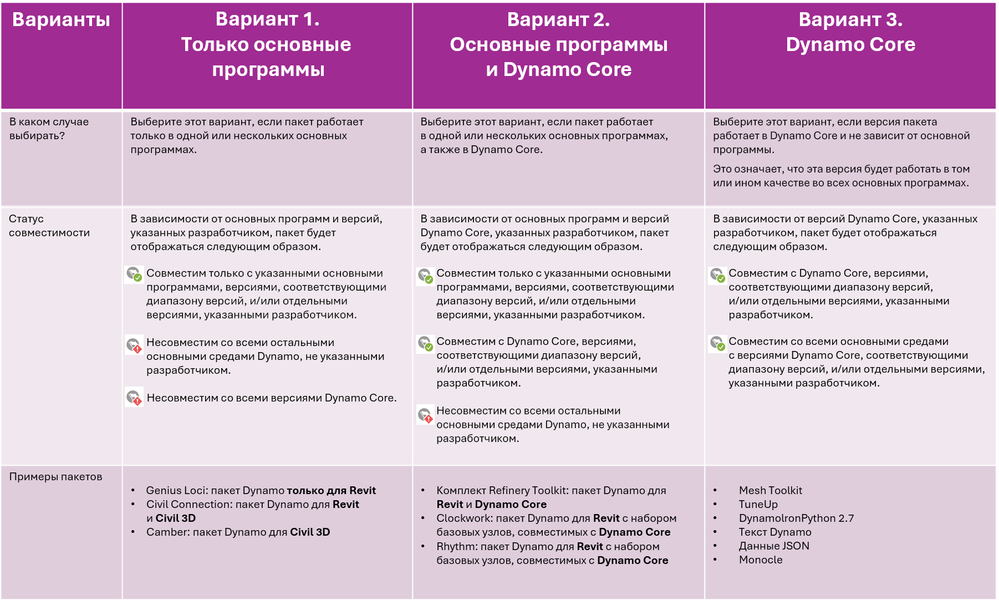

# 發佈套件

### 發佈套件 

套件是儲存節點並與 Dynamo 社群分享節點一個很便利的方式。套件可以包含從在 Dynamo 工作區中建立的自訂節點到 NodeModel 衍生的節點等所有內容。套件的發佈和安裝是透過 Package Manager 進行。除了此頁面，[Primer](https://primer2.dynamobim.org/v/zh-tw/6_custom_nodes_and_packages/6-2_packages/1-introduction) 也提供套件的一般指南。

#### 什麼是 Package Manager？

Dynamo Package Manager 是一種可從 Dynamo 或網頁瀏覽器存取的軟體登錄 (類似於 npm)。Package Manager 包括安裝、發佈、更新和檢視套件。與 npm 一樣，它維護不同版本的套件。它也能協助管理專案的相依性。

在瀏覽器中，搜尋套件並檢視統計資訊：[https://dynamopackages.com/](https://dynamopackages.com)

* 在 Dynamo 中，Package Manager 包括安裝、發佈和更新套件。

> 1. 線上搜尋套件：`Packages > Search for a Package...`
> 2. 檢視/編輯安裝的套件：`Packages > Manage Packages...`
> 3. 發佈新套件：`Packages > Publish New Package...`

#### 發佈套件 

套件的發佈是透過 Dynamo 內的 Package Manager 進行。建議的程序是在本端發佈、測試套件，然後線上發佈與社群分享。使用 NodeModel 案例研究，我們將逐步完成必要步驟，將 RectangularGrid 節點以套件方式本端發佈，然後線上發佈。

啟動 Dynamo，然後選取「`Packages > Publish New Package...`」以開啟「`Publish a Package`」視窗。

> 1. 選取「`Add file...`」瀏覽要加入套件的檔案
> 2. 從 NodeModel 案例研究中選取兩個 `.dll` 檔案
> 3. 選取「`Ok`」

將檔案加入套件內容後，為套件指定名稱、描述和版本。使用 Dynamo 發佈套件會自動建立一個 `pkg.json` 檔案。

> 一個準備好要發佈的套件。
>
> 1. 提供名稱、描述和版本等必要資訊。
> 2. 按一下「本端發佈」，然後選取 Dynamo 的套件資料夾：`AppData\Roaming\Dynamo\Dynamo Core\1.3\packages` 讓節點能在 Core 當中使用。在套件準備好分享之前，請永遠在本端發佈。

發佈套件後，在 Dynamo 資源庫的 `CustomNodeModel` 品類下就能使用節點。

> 1. 我們剛剛在 Dynamo 資源庫中建立的套件

套件一旦準備好線上發佈，請開啟 Package Manager，選擇「`Publish`」，然後選擇「`Publish Online`」。

> 1. 若要查看 Dynamo 如何格式化套件，請按一下「CustomNodeModel」右側的三個垂直點，然後選擇「展示根目錄」
> 2. 在「發佈 Dynamo 套件」視窗中，選取「`Publish`」，然後選取「`Publish Online`」。
> 3. 若要刪除套件，請選取「`Delete`」。

#### 如何更新套件？

更新套件的程序與發佈類似。開啟 Package Manager，然後對需要更新的套件選取「`Publish Version...`」，並輸入一個更高的版本。

> 1. 選取「`Publish Version`」以使用根目錄中的新檔案更新既有套件，然後選擇在本端還是線上發佈。

#### Package Manager 網路用戶端 

Package Manager 網路用戶端可讓使用者搜尋和檢視套件資料，包括版本控制、下載統計資訊和其他相關資訊。此外，套件作者還可以直接透過網路用戶端登入以更新其套件詳細資料，例如相容性資訊。

如需有關這些功能的更多資訊，請參閱此處的部落格文章：[https://dynamobim.org/discover-the-new-dynamo-package-management-experience/](https://dynamobim.org/discover-the-new-dynamo-package-management-experience/)。

透過此連結 [https://dynamopackages.com/](https://dynamopackages.com) 可以存取 Package Manager 網路用戶端

##### 更新套件詳細資料

作者可以按照以下步驟編輯其套件描述、網站連結和儲存庫連結：  

> 1. 在 **「我的套件」** 下選取套件，然後按一下 **「編輯套件詳細資料」** 。  
> 2. 使用各自的欄位增加或修改 **「網站」** 和 **「儲存庫」** 連結。  
> 3. 依需要更新 **「套件描述」** 。  
> 4. 按一下 **「儲存變更」** 套用更新。  

 **注意**: 由於伺服器更新需要一些時間，因此更新內容最多可能需要 15 分鐘，才能在 Dynamo 內的 Package Manager 中重新整理。我們正努力減少這種延誤。  

 

##### 編輯已發佈套件版本的相容性資訊  

對於先前發佈的套件版本，可以透過回溯方式更新相容性資訊。請依以下步驟執行：  

**步驟 1：**  

1. 按一下要更新的套件版本。  
2.  **「相依於」** 清單將自動填入套件所相依的套件。  
3. 按一下 **「相容性」** 旁邊的鉛筆圖示，開啟 **「編輯相容性資訊」** 工作流程。  

**步驟 2：**  

請按照以下流程圖並參考下表，協助您瞭解哪種選項最適合您的套件。

我們來使用一些範例來逐步解說一些情境：

**範例套件 #1** \- Civil Connection：此套件與 Revit 和 Civil 3D 兩者都有 API 相依性，且不包括核心節點的集合 (例如：幾何函數、數學函數和/或清單管理)。因此，在此案例中，理想的選擇是選項 1。套件在與版本範圍和/或個別版本清單相符的 Revit 和 Civil 3D 中會顯示為「相容」。

**範例套件 #2** \- Rhythm：此套件是 Revit 特定節點的集合，以及核心節點的集合。在此案例中，套件有主體相依性。但也包括可在 Dynamo Core 中運作的核心節點。因此，在此案例中，理想的選擇是選項 2。套件在與版本範圍和/或個別版本清單相符的 Revit 和 Dynamo Core (也稱為 Dynamo Sandbox) 環境中會顯示為「相容」。

**範例套件 #3** \- Mesh Toolkit：此套件是一個 Dynamo Core 套件，是沒有主體相依性的幾何節點集合。因此，在此案例中，理想的選擇是選項 3。套件在與版本範圍和/或個別版本清單相符的 Dynamo 和所有主體環境中會顯示為「相容」。

根據選取的選項，將會彈出 Dynamo 和/或主體特定的欄位，如下圖所示。

