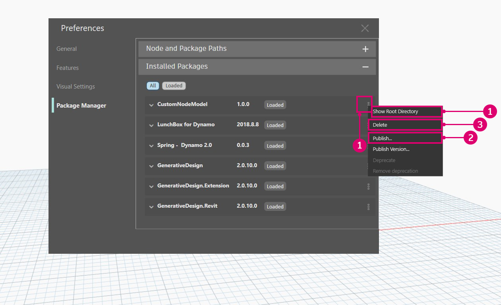

# Publicar um pacote

### Publicar um pacote 

Os pacotes são uma forma conveniente de armazenar e compartilhar nós com a comunidade do Dynamo. Um pacote pode conter tudo, desde nós personalizados criados no espaço de trabalho do Dynamo até nós derivados do NodeModel. Os pacotes são publicados e instalados usando o Gerenciador de pacotes. Além desta página, o [Manual](https://primer2.dynamobim.org/6_custom_nodes_and_packages/6-2_packages/1-introduction) tem um guia geral sobre os pacotes.

#### O que é um Gerenciador de pacotes? 

O Gerenciador de pacotes do Dynamo é um Registro de software (semelhante ao npm) que pode ser acessado no Dynamo ou em um navegador da Web. O Gerenciador de pacotes inclui a instalação, publicação, atualização e visualização de pacotes. Como o npm, ele mantém diferentes versões de pacotes. Também ajuda a gerenciar as dependências do projeto.

No navegador, procure pacotes e visualize as estatísticas: [https://dynamopackages.com/](https://dynamopackages.com)

* No Dynamo, o Gerenciador de pacotes inclui pacotes de instalação, publicação e atualização.

> 1. Procurar pacotes on-line: `Packages > Search for a Package...`
> 2. Visualizar/editar pacotes instalados: `Packages > Manage Packages...`
> 3. Publicar um novo pacote: `Packages > Publish New Package...`

#### Publicar um pacote 

Os pacotes são publicados do Gerenciador de pacotes no Dynamo. O processo recomendado é publicar localmente, testar o pacote e, em seguida, publicar on-line para compartilhar com a comunidade. Usando o estudo de caso NodeModel, vamos passar pelas etapas necessárias para publicar o nó RetangularGrid como um pacote localmente e, em seguida, on-line.

Inicie o Dynamo e selecione `Packages > Publish New Package...` para abrir a janela `Publish a Package`.

> 1. Selecionar `Add file...` para procurar arquivos para adicionar ao pacote
> 2. Selecionar os dois arquivos `.dll` no estudo de caso NodeModel
> 3. Selecionar `Ok`

Com os arquivos adicionados ao conteúdo do pacote, atribua um nome, uma descrição e uma versão ao pacote. A publicação de um pacote usando o Dynamo cria automaticamente um arquivo `pkg.json`.

> Um pacote pronto para ser publicado.
>
> 1. Fornecer as informações necessárias para o nome, a descrição e a versão.
> 2. Publicar clicando em “Publicar localmente” e selecionar a pasta de pacotes do Dynamo: `AppData\Roaming\Dynamo\Dynamo Core\1.3\packages` para ter o nó disponível no Core. Sempre publique localmente até que o pacote esteja pronto para compartilhar.

Após a publicação de um pacote, os nós estarão disponíveis na biblioteca do Dynamo na categoria `CustomNodeModel`.

> 1. O pacote que acabamos de criar na biblioteca do Dynamo

Quando o pacote estiver pronto para publicação on-line, abra o Gerenciador de pacotes, escolha `Publish` e, em seguida, `Publish Online`.

> 1. Para ver como o Dynamo formatou o pacote, clicar nos três pontos verticais à direita de “CustomNodeModel” e escolher “Mostrar diretório raiz”
> 2. Selecionar `Publish` e, em seguida, `Publish Online` na janela “Publicar um pacote do Dynamo”.
> 3. Para excluir um pacote, selecionar `Delete`.

#### Como atualizar um pacote? 

A atualização de um pacote é um processo semelhante ao da publicação. Abra o Gerenciador de pacotes e selecione `Publish Version...` no pacote que precisa ser atualizado e insira uma versão posterior.

> 1. Selecionar `Publish Version` para atualizar um pacote existente com novos arquivos no diretório raiz e, em seguida, escolher se ele deve ser publicado localmente ou on-line.

#### Cliente Web do Gerenciador de pacotes 

O cliente Web do Gerenciador de pacotes permite que os usuários pesquisem e visualizem dados de pacotes, incluindo controle de versão, estatísticas de download e outras informações relevantes. Além disso, os autores do pacote podem fazer login para atualizar os detalhes do pacote, como informações de compatibilidade, diretamente por meio do cliente da Web.

Para obter mais informações sobre esses recursos, consulte a postagem do blog aqui: [https://dynamobim.org/discover-the-new-dynamo-package-management-experience/](https://dynamobim.org/discover-the-new-dynamo-package-management-experience/).

É possível acessar o cliente Web do Gerenciador de pacotes neste link: [https://dynamopackages.com/](https://dynamopackages.com)

##### Atualizar os detalhes do pacote

Os autores podem editar a descrição do pacote, o link do site e o link do repositório seguindo estas etapas:  

> 1. Em **Meus pacotes**, selecione o pacote e clique em **Editar detalhes do pacote**.  
> 2. Adicione ou modifique os links do **Site** e do **Repositório** usando os respectivos campos.  
> 3. Atualize a **Descrição do pacote** conforme necessário.  
> 4. Clique em **Salvar alterações** para aplicar as atualizações.  

 **Observação**: As atualizações podem levar até 15 minutos para serem atualizadas no Gerenciador de pacotes no Dynamo, já que as atualizações de servidor levam algum tempo. Há esforços em andamento para reduzir esse atraso.  

 

##### Editar informações de compatibilidade para versões de pacote publicadas  

É possível atualizar as informações de compatibilidade retroativamente para versões de pacotes publicadas anteriormente. Siga estas etapas:  

**Etapa 1:**  

1. Clique na versão do pacote que você deseja atualizar.  
2. A lista **Depende** será preenchida automaticamente com os pacotes dos quais o pacote depende.  
3. Clique no ícone de lápis ao lado de **Compatibilidade** para abrir o fluxo de trabalho **Editar informações de compatibilidade**.  

**Etapa 2:**  

Siga o fluxograma abaixo e consulte a tabela abaixo para entender qual opção funciona melhor para o pacote.

Vamos usar alguns exemplos para analisar alguns cenários:

**Exemplo de pacote nº 1** – Conexão do Civil: esse pacote tem dependências de APIs com o Revit e o Civil 3D e não inclui uma coleção de nós principais (por exemplo: funções de geometria, funções matemáticas e/ou gerenciamento de lista). Então, neste caso, a opção ideal seria escolher a Opção 1. O pacote que corresponda ao intervalo de versões e/ou à lista de versões individuais será mostrado como compatível no Revit e no Civil 3D.

**Exemplo de pacote nº 2** – Ritmo: esse pacote é uma coleção de nós específicos do Revit junto com uma coleção de nós principais. Nesse caso, o pacote tem dependências de hospedeiro. Mas também inclui nós principais que funcionarão no Dynamo Core. Então, nesse caso, a alternativa ideal seria a Opção 2. O pacote será mostrado como compatível no ambiente do Revit e do Dynamo Core (também chamado de Dynamo Sandbox) que corresponde ao intervalo de versões e/ou à lista de versões individuais.

**Exemplo de pacote nº 3** – Kit de ferramentas de malha: esse pacote é um pacote do Dynamo Core que é uma coleção de nós de geometria que não tem dependências de hospedeiro. Então, nesse caso, a alternativa ideal seria a Opção 3. O pacote será mostrado como Compatível no Dynamo e em todos os ambientes de hospedeiro que correspondam ao intervalo de versões e/ou à lista de versões individuais.

Dependendo da opção selecionada, os campos específicos do Dynamo e/ou do hospedeiro serão exibidos conforme mostrado na imagem abaixo.

