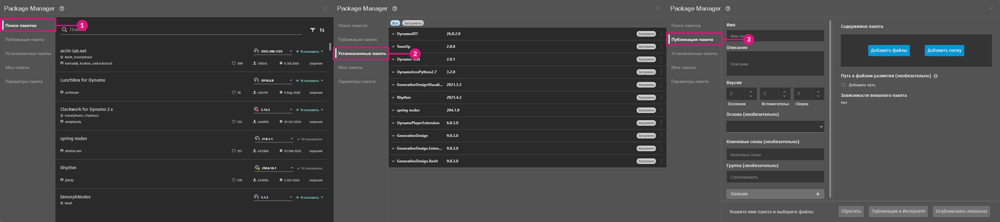

# Publier un package

### Publier un package 

Les packages sont un moyen pratique de stocker et de partager des nœuds avec la communauté Dynamo. Un package peut contenir tout ce qui est nécessaire, des nœuds personnalisés créés dans l’espace de travail Dynamo aux nœuds dérivés de NodeModel. Les packages sont publiés et installés à l’aide du gestionnaire de package. En plus de cette page, le [guide](https://primer2.dynamobim.org/6_custom_nodes_and_packages/6-2_packages/1-introduction) contient un guide général sur les packages.

#### Qu’est-ce qu’un gestionnaire de package ? 

Le gestionnaire de package Dynamo est un registre de logiciels (similaire à npm) accessible à partir de Dynamo ou d’un navigateur web. Le gestionnaire de package comprend l’installation, la publication, la mise à jour et la visualisation des packages. Comme npm, il conserve différentes versions des packages. Il permet également de gérer les dépendances de votre projet.

Dans le navigateur, recherchez des packages et consultez les statistiques : [https://dynamopackages.com/](https://dynamopackages.com)

* Dans Dynamo, le gestionnaire de package inclut les packages d’installation, de publication et de mise à jour.

> 1. Rechercher des packages en ligne : `Packages > Search for a Package...`
> 2. Afficher/modifier les packages installés : `Packages > Manage Packages...`
> 3. Publier un nouveau package : `Packages > Publish New Package...`

#### Publier un package 

Les packages sont publiés à partir du gestionnaire de package dans Dynamo. Le processus recommandé consiste à publier localement, tester le package, puis publier en ligne pour le partager avec la communauté. En utilisant l’étude de cas NodeModel, nous allons suivre les étapes nécessaires pour publier le nœud RectangularGrid en tant que package localement et ensuite en ligne.

Lancez Dynamo et sélectionnez `Packages > Publish New Package...` pour ouvrir la fenêtre `Publish a Package`.

> 1. Sélectionnez `Add file...` pour rechercher les fichiers à ajouter au package
> 2. Sélectionnez les deux fichiers `.dll` dans l’étude de cas NodeModel
> 3. Sélectionnez `Ok`

Une fois les fichiers ajoutés au contenu du package, donnez-lui un nom, une description et une version. Publier un package avec Dynamo crée automatiquement un fichier `pkg.json`.

> Un package prêt à être publié.
>
> 1. Renseignez les informations requises pour le nom, la description et la version.
> 2. Publiez en cliquant sur « Publier localement » et sélectionnez le dossier de package de Dynamo : `AppData\Roaming\Dynamo\Dynamo Core\1.3\packages` pour que le nœud soit disponible dans Core. Publiez toujours localement jusqu’à ce que le package soit prêt à être partagé.

Après avoir publié un package, les nœuds seront disponibles dans la bibliothèque Dynamo sous la catégorie `CustomNodeModel`.

> 1. Le package que nous venons de créer dans la bibliothèque Dynamo

Une fois que le package est prêt à être publié en ligne, ouvrez le gestionnaire de package et choisissez `Publish` puis `Publish Online`.

> 1. Pour voir comment Dynamo a formaté le package, cliquez sur les trois points verticaux à droite de « CustomNodeModel » et choisissez « Afficher le répertoire racine ».
> 2. Sélectionnez `Publish`, puis `Publish Online` dans la fenêtre « Publier un package Dynamo ».
> 3. Pour supprimer un package, sélectionnez `Delete`.

#### Comment mettre à jour un package ? 

La mise à jour d’un package est un processus similaire à la publication. Ouvrez le gestionnaire de package et sélectionnez `Publish Version...` sur le package à mettre à jour, puis entrez une version supérieure.

> 1. Sélectionnez `Publish Version` pour mettre à jour un package existant avec de nouveaux fichiers dans le répertoire racine, puis choisissez s’il doit être publié localement ou en ligne.

#### Client Web du gestionnaire de package 

Le client Web du gestionnaire de package permet aux utilisateurs de rechercher et d’afficher les données des packages, y compris le contrôle des versions, les statistiques de téléchargement et d’autres informations pertinentes. En outre, les créateurs de packages peuvent se connecter pour mettre à jour les détails du package, telles que la compatibilité, directement via le client Web.

Pour plus d’informations sur ces fonctionnalités, consultez l’article de blog suivant : [https://dynamobim.org/discover-the-new-dynamo-package-management-experience/](https://dynamobim.org/discover-the-new-dynamo-package-management-experience/).

Le client Web du gestionnaire de package est accessible à l’adresse suivante : [https://dynamopackages.com/](https://dynamopackages.com)

##### Mise à jour des détails du package

Les créateurs peuvent modifier la description du package, le lien vers le site Web et le lien vers le référentiel en procédant comme suit :  

> 1. Sous **Mes packages**, sélectionnez le package et cliquez sur **Modifier les détails du package**.  
> 2. Ajoutez ou modifiez les liens vers le **site Web** et le **référentiel** à l’aide des champs respectifs.  
> 3. Mettez à jour la **description du package** si nécessaire.  
> 4. Cliquez sur **Enregistrer les modifications** pour appliquer les mises à jour.  

 **Remarque** : l’application des mises à jour dans le gestionnaire de packages peut prendre jusqu’à 15 minutes dans Dynamo, car les mises à jour du serveur prennent un certain temps. Nous nous efforçons de réduire ce retard.  

 

##### Modifier les informations de compatibilité pour les versions de packages publiés  

Les informations de compatibilité peuvent être mises à jour de manière rétroactive pour les versions de package précédemment publiés. Procédez comme suit :  

**Étape 1 :**  

1. Cliquez sur la version du package que vous voulez mettre à jour.  
2. La liste **Dépend de** sera automatiquement remplie avec les packages dont dépend votre package.  
3. Cliquez sur l’icône en forme de crayon à côté de **Compatibilité** pour ouvrir le workflow **Modifier les informations de compatibilité**.  

**Étape 2 :**  

Suivez le schéma opérationnel ci-dessous et reportez-vous au tableau pour choisir l’option qui convient le mieux à votre package.

Voici quelques exemples pour explorer différents scénarios :

**Exemple de package # 1** \- Civil Connection : ce package a des dépendances d’API avec Revit et Civil 3D et n’inclut pas de collection de nœuds principaux (par exemple : fonctions géométriques, fonctions mathématiques et/ou gestion de liste). Donc, dans ce cas, la solution idéale serait l’option 1. Le package s’affiche comme compatible dans Revit et Civil 3D et correspond à la gamme de versions et/ou à la liste de versions individuelle.

**Exemple de package # 2** \- Rythm : ce package contient une collection de nœuds Revit spécifiques ainsi qu’une collection de nœuds principaux. Dans ce cas, le package a des dépendances d’hôte. Mais il inclut également les nœuds principaux qui fonctionnent dans Dynamo Core. Donc, dans ce cas, la solution idéale serait l’option 2. Le package s’affiche comme compatible dans les environnements Revit et Dynamo Core (également appelé Dynamo Sandbox) qui correspondent à la gamme de versions et/ou à la liste de versions individuelle.

**Exemple de package # 3** \- Mesh Toolkit : il s’agit d’un package Dynamo Core qui contient une collection de nœuds de géométrie et n’a pas de dépendances d’hôte. Donc, dans ce cas, la solution idéale serait l’option 3. Le package s’affiche comme compatible dans Dynamo et dans tous les environnements hôtes qui correspondent à la gamme de versions et/ou à la liste de versions individuelle.

Selon l’option sélectionnée, les champs spécifiques à Dynamo et/ou à l’hôte s’affichent, comme illustré sur l’image ci-dessous.

