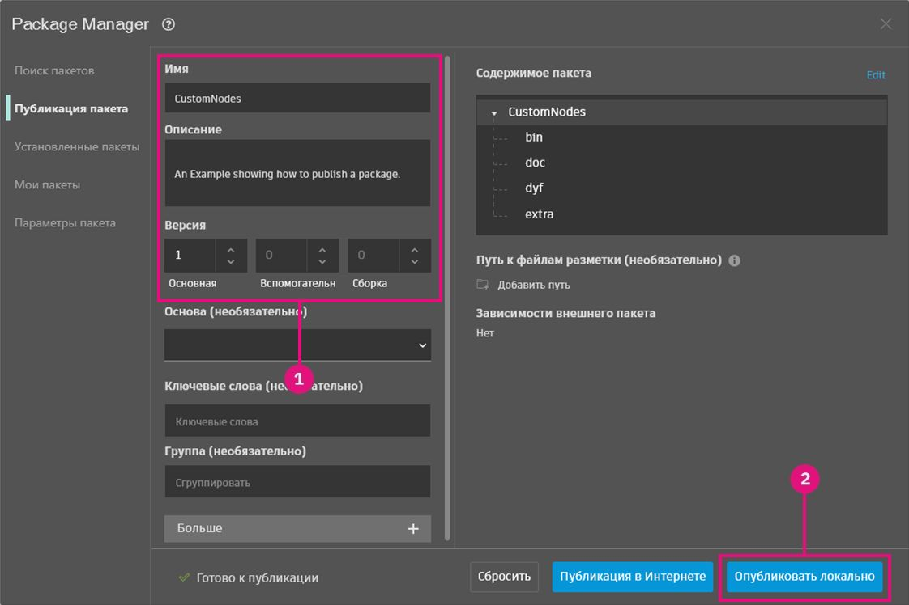

# Publizieren eines Pakets

### Publizieren eines Pakets 

Pakete sind eine einfache Möglichkeit, Blöcke zu speichern und gemeinsam mit der Dynamo-Community zu nutzen. Ein Paket kann alle möglichen Elemente enthalten, von benutzerdefinierten Blöcken, die im Dynamo-Arbeitsbereich erstellt wurden, bis hin zu von NodeModel abgeleiteten Blöcken. Pakete werden mit dem Package Manager publiziert und installiert. Zusätzlich zu dieser Seite enthält der [Primer](https://primer2.dynamobim.org/v/de/6_custom_nodes_and_packages/6-2_packages/1-introduction) eine allgemeine Anleitung für Pakete.

#### Was ist ein Package Manager? 

Der Dynamo Package Manager ist eine Softwareregistrierung (ähnlich wie npm), auf die Sie über Dynamo oder über einen Webbrowser zugreifen können. Der Package Manager umfasst das Installieren, Publizieren, Aktualisieren und Anzeigen von Paketen. Wie npm verwaltet er verschiedene Versionen von Paketen. Außerdem können Sie so die Abhängigkeiten Ihres Projekts verwalten.

Suchen Sie im Browser nach Paketen, und zeigen Sie Statistiken an: [https://dynamopackages.com/](https://dynamopackages.com).

* In Dynamo umfasst der Package Manager das Installieren, Publizieren und Aktualisieren von Paketen.

> 1. Online-Suche nach Paketen: `Packages > Search for a Package...`
> 2. Anzeigen/Bearbeiten von installierten Paketen: `Packages > Manage Packages...`
> 3. Publizieren eines neuen Pakets: `Packages > Publish New Package...`

#### <a href="#publishing-a-package" id="publishing-a-package">Publizieren von Paketen</a>

Pakete werden in Dynamo über den Package Manager publiziert. Es wird empfohlen, lokal zu publizieren, das Paket zu testen und dann online zu publizieren, um das Paket gemeinsam mit der Community zu nutzen. Anhand der NodeModel-Fallstudie werden die erforderlichen Schritte zum Publizieren des RectangularGrid-Blocks als Paket lokal und dann online beschrieben.

Starten Sie Dynamo, und wählen Sie `Packages > Publish New Package...`, um das Fenster `Publish a Package` zu öffnen.

> 1. Wählen Sie `Add file...`, um nach Dateien zu suchen, die dem Paket hinzugefügt werden sollen.
> 2. Wählen Sie die beiden `.dll`-Dateien aus der NodeModel-Fallstudie aus.
> 3. Wählen Sie `Ok` aus.

Geben Sie dem Paket einen Namen, eine Beschreibung und eine Versionsbezeichnung, wenn die Dateien dem Paketinhalt hinzugefügt wurden. Beim Publizieren eines Pakets mit Dynamo wird automatisch eine `pkg.json`-Datei erstellt.

> Ein Paket, das bereit für die Publizierung ist
>
> 1. Geben Sie die erforderlichen Informationen für Name, Beschreibung und Version ein.
> 2. Publizieren Sie das Paket, indem Sie auf Lokal publizieren klicken und den Dynamo-Paketordner `AppData\Roaming\Dynamo\Dynamo Core\1.3\packages` auswählen, damit der Block in Core verfügbar ist. Publizieren Sie immer lokal, bis das Paket so weit ist, dass es freigegeben werden kann.

Nach dem Publizieren eines Pakets sind die Blöcke in der Dynamo-Bibliothek unter der Kategorie `CustomNodeModel` verfügbar.

> 1. Das soeben in der Dynamo-Bibliothek erstellte Paket.

Wenn das Paket online publiziert werden kann, öffnen Sie den Package Manager, wählen Sie `Publish` und dann `Publish Online`.

> 1. Um zu sehen, wie Dynamo das Paket formatiert hat, klicken Sie auf die drei vertikalen Punkte rechts neben CustomNodeModel und wählen Stammverzeichnis anzeigen.
> 2. Wählen Sie im Fenster zum Publizieren von Dynamo-Paketen `Publish` und dann `Publish Online` aus.
> 3. Um ein Paket zu löschen, wählen Sie `Delete`.

#### Wie aktualisiere ich ein Paket? 

Das Aktualisieren eines Pakets ist ein ähnlicher Vorgang wie das Publizieren. Öffnen Sie den Package Manager, wählen Sie `Publish Version...` für das Paket aus, das aktualisiert werden muss, und geben Sie eine höhere Version ein.

> 1. Wählen Sie `Publish Version`, um ein vorhandenes Paket mit neuen Dateien im Stammverzeichnis zu aktualisieren, und wählen Sie dann, ob es lokal oder online publiziert werden soll.

#### Web-Client des Package Manager 

Mit dem Web-Client des Package Manager können Benutzer nach Paketdaten suchen und diese anzeigen, einschließlich Versionierung, Download-Statistiken und anderen relevanten Informationen. Darüber hinaus können sich Paketautoren anmelden, um ihre Paketdetails, wie z. B. Kompatibilitätsinformationen, direkt über den Web-Client zu aktualisieren.

Weitere Informationen zu diesen Funktionen finden Sie im folgenden Blog-Post: [https://dynamobim.org/discover-the-new-dynamo-package-management-experience/](https://dynamobim.org/discover-the-new-dynamo-package-management-experience/).

Der Web-Client des Package Manager ist über folgenden Link verfügbar: [https://dynamopackages.com/](https://dynamopackages.com)

##### Aktualisieren von Paketdetails

Autoren können ihre Paketbeschreibung, den Website-Link und den Repository-Link bearbeiten, indem sie die folgenden Schritte ausführen:  

> 1. Wählen Sie unter **Meine Pakete** das Paket aus, und klicken Sie auf **Paketdetails bearbeiten**.  
> 2. Fügen Sie die Links für die **Website** und das **Repository** mithilfe der entsprechenden Felder hinzu, oder ändern Sie sie.  
> 3. Aktualisieren Sie bei Bedarf die **Paketbeschreibung**.  
> 4. Klicken Sie auf **Änderungen speichern**, um die Aktualisierungen anzuwenden.  

 **Anmerkung**: Die Aktualisierung im Package Manager in Dynamo kann bis zu 15 Minuten dauern, da Server-Updates einige Zeit in Anspruch nehmen. Wir arbeiten daran, um diese Zeit zu reduzieren.  

 

##### Bearbeiten von Kompatibilitätsinformationen für publizierte Paketversionen  

Kompatibilitätsinformationen können rückwirkend für zuvor publizierte Paketversionen aktualisiert werden. Führen Sie die folgenden Schritte aus:  

**Schritt 1:**  

1. Klicken Sie auf die Paketversion, die Sie aktualisieren möchten.  
2. Die Liste **Abhängig von** wird automatisch mit den Paketen gefüllt, von denen Ihr Paket abhängt.  
3. Klicken Sie auf das Stiftsymbol neben **Kompatibilität**, um den Arbeitsablauf **Kompatibilitätsinformationen bearbeiten** zu öffnen.  

**Schritt 2:**  

Folgen Sie dem Flussdiagramm unten, und prüfen Sie die folgende Tabelle, um zu ermitteln, welche Option für Ihr Paket am besten geeignet ist.

Sehen wir uns einige Szenarien anhand von Beispielen an:

**Beispielpaket Nr. 1** – Civil Connection: Dieses Paket verfügt über API-Abhängigkeiten in Bezug auf Revit und Civil 3D und enthält keine Sammlung von Kernblöcken (z. B. Geometriefunktionen, mathematische Funktionen und/oder Listenverwaltung). In diesem Fall wäre Option 1 die ideale Option. Das Paket wird in Revit und Civil 3D als kompatibel angezeigt, die dem Versionsbereich und/oder der Liste der einzelnen Versionen entsprechen.

**Beispielpaket Nr. 2** – Rhythm: Dieses Paket ist eine Sammlung aus Revit-spezifischen Blöcken sowie Core-Blöcken. In diesem Fall weist das Paket Host-Abhängigkeiten auf. Es enthält aber auch Core-Blöcke, die in Dynamo Core verwendet werden können. In diesem Fall wäre die ideale Option Option 2. Das Paket wird in der Revit- und Dynamo Core-Umgebung (auch als Dynamo Sandbox bezeichnet) als kompatibel angezeigt, die dem Versionsbereich und/oder der Liste der einzelnen Versionen entspricht.

**Beispielpaket Nr. 3** – Mesh Toolkit: Dieses Paket ist ein Dynamo Core-Paket, bei dem es sich um eine Sammlung von Geometrieblöcken ohne Host-Abhängigkeiten handelt. In diesem Fall wäre die ideale Option Option 3. Das Paket wird in Dynamo und allen Host-Umgebungen als kompatibel angezeigt, die dem Versionsbereich und/oder der Liste der einzelnen Versionen entsprechen.

Je nach ausgewählter Option werden Dynamo- und/oder Host-spezifische Felder eingeblendet, wie in der folgenden Abbildung gezeigt.

