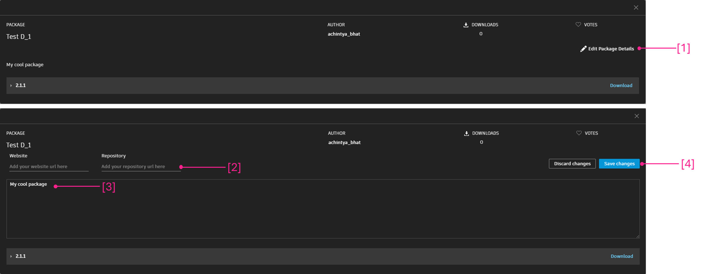

# Publicar un paquete

### Publicar un paquete 

Los paquetes permiten almacenar y compartir de forma cómoda nodos con la comunidad de Dynamo. Un paquete puede contener todo tipo de elementos, desde nodos personalizados creados en el espacio de trabajo de Dynamo hasta nodos derivados de NodeModel. Los paquetes se publican y se instalan mediante Package Manager. Además de esta página, [Dynamo Primer](https://primer2.dynamobim.org/6_custom_nodes_and_packages/6-2_packages/1-introduction) incluye una guía general sobre los paquetes.

#### ¿Qué es Package Manager? 

La herramienta Package Manager de Dynamo es un registro de software (similar a npm) al que se puede acceder desde Dynamo o en un navegador web. Package Manager permite la instalación, la publicación, la actualización y la visualización de paquetes. Al igual que npm, conserva diferentes versiones de los paquetes. También ayuda a administrar las dependencias del proyecto.

En el navegador, busque paquetes y vea estadísticas. Para ello, visite [https://dynamopackages.com/](https://dynamopackages.com).

* En Dynamo, Package Manager permite la instalación, la publicación y la actualización de paquetes.

> 1. Busque paquetes en línea mediante `Packages > Search for a Package...`.
> 2. Vea o edite los paquetes instalados mediante `Packages > Manage Packages...`.
> 3. Publique un nuevo paquete `Packages > Publish New Package...`.

#### Publicación de un paquete 

Los paquetes se publican desde Package Manager en Dynamo. El proceso recomendado es publicar localmente, probar el paquete y, a continuación, publicar en línea para compartirlo con la comunidad. Mediante el caso real de NodeModel, vamos a seguir los pasos necesarios para publicar localmente el nodo RectangularGrid como un paquete y, a continuación, en línea.

Inicie Dynamo y seleccione `Packages > Publish New Package...` para abrir la ventana `Publish a Package`.

> 1. Seleccione `Add file...` para buscar archivos que añadir al paquete.
> 2. Seleccione los dos archivos `.dll` del caso real de NodeModel.
> 3. Seleccione `Ok`.

Una vez que se hayan añadido los archivos al contenido del paquete, asigne al paquete un nombre, una descripción y una versión. Al publicar un paquete mediante Dynamo, se crea automáticamente un archivo `pkg.json`.

> Un paquete listo para su publicación.
>
> 1. Proporcione la información necesaria para el nombre, la descripción y la versión.
> 2. Haga clic en "Publicar localmente" para publicar y seleccione la carpeta de paquetes de Dynamo, `AppData\Roaming\Dynamo\Dynamo Core\1.3\packages`, para que el nodo esté disponible en Core. Realice siempre la publicación localmente hasta que el paquete esté listo para compartirse.

Después de publicar un paquete, los nodos estarán disponibles en la biblioteca de Dynamo, en la categoría `CustomNodeModel`.

> 1. El paquete que acabamos de crear en la biblioteca de Dynamo

Una vez que el paquete esté listo para publicarse en línea, abra Package Manager, y seleccione `Publish` y, a continuación, `Publish Online`.

> 1. Para ver cómo Dynamo ha aplicado formato al paquete, haga clic en los tres puntos verticales que aparecen a la derecha de "CustomNodeModel" y elija "Mostrar directorio raíz".
> 2. Seleccione `Publish` y, a continuación, `Publish Online` en la ventana "Publicar un paquete de Dynamo".
> 3. Para suprimir un paquete, seleccione `Delete`.

#### ¿Cómo se actualiza un paquete? 

La actualización de un paquete es un proceso similar al de su publicación. Abra Package Manager, seleccione `Publish Version...` en el paquete que debe actualizarse y especifique una versión posterior.

> 1. Seleccione `Publish Version` para actualizar un paquete existente con nuevos archivos en el directorio raíz y, a continuación, elija si debe publicarse localmente o en línea.

#### Cliente web de Package Manager 

El cliente web de Package Manager permite a los usuarios buscar y ver los datos de paquetes, incluidas las versiones, las estadísticas de descarga y otra información relevante. Además, los autores de paquetes pueden iniciar sesión para actualizar los detalles de los paquetes, como la información sobre compatibilidad, directamente a través del cliente web.

Para obtener más información sobre estas funciones, consulte esta publicación del blog: [https://dynamobim.org/discover-the-new-dynamo-package-management-experience/](https://dynamobim.org/discover-the-new-dynamo-package-management-experience/).

Se puede acceder al cliente web de Package Manager en el siguiente vínculo: [https://dynamopackages.com/](https://dynamopackages.com).

##### Actualización de detalles del paquete

Los autores pueden editar la descripción del paquete, el enlace al sitio web y el enlace del repositorio siguiendo estos pasos:  

> 1. En **Mis paquetes**, seleccione el paquete y haga clic en **Editar detalles del paquete**.  
> 2. Agregue o modifique los enlaces del **sitio web** y el **repositorio** utilizando los campos respectivos.  
> 3. Actualice la **Descripción del paquete** según sea necesario.  
> 4. Haga clic en **Guardar cambios** para aplicar las actualizaciones.  

 **Nota**: Las actualizaciones pueden tardar hasta 15 minutos en actualizarse en Package Manager dentro de Dynamo, ya que las actualizaciones del servidor llevan cierto tiempo. Se están realizando esfuerzos para reducir este retardo.  

 

##### Editar la información sobre compatibilidad de las versiones de paquete publicadas  

La información sobre compatibilidad se puede actualizar de forma retroactiva para las versiones del paquete publicadas anteriormente. Siga estos pasos:  

**Paso 1:**  

1. Haga clic en la versión del paquete que desea actualizar.  
2. La lista **Depende de** se rellenará automáticamente con los paquetes de los que depende el paquete.  
3. Haga clic en el icono de lápiz situado junto a **Compatibilidad** para abrir el flujo de trabajo **Editar información de compatibilidad**.  

**Paso 2:**  

Siga el diagrama de flujo siguiente y consulte la tabla de abajo para determinar la opción que mejor se adapta a su paquete.

Usaremos varios ejemplos para analizar diferentes escenarios:

**Paquete de ejemplo n.º 1** \- Conexión de Civil: este paquete tiene dependencias de API con Revit y Civil 3D y no incluye una colección de nodos principales (por ejemplo, funciones de geometría, funciones matemáticas y/o gestión de listas). Por lo tanto, en este caso, la opción ideal sería optar por la opción 1. El paquete se mostrará como "Compatible" en las versiones de Revit y Civil 3D que coincidan con el rango especificado o con la lista de versiones individuales.

**Paquete de ejemplo n.º 2** \- Rhythm: este paquete es una colección de nodos específicos de Revit junto con una colección de nodos principales. En este caso, el paquete tiene dependencias de anfitrión, pero también incluye nodos principales que funcionarán en Dynamo Core. Por lo tanto, en este caso, la opción ideal sería la opción 2. El paquete se mostrará como "Compatible" en los entornos de Revit y Dynamo Core (también denominado Dynamo Sandbox) que coincidan con el rango de versiones o la lista de versiones individuales especificados.

**Paquete de ejemplo n.º 3** \- Kit de herramientas de malla: este es un paquete de Dynamo Core que consiste en una colección de nodos de geometría que no tiene dependencias de anfitrión. Por lo tanto, en este caso, la opción ideal sería la opción 3. El paquete se mostrará como "Compatible" en Dynamo y en todos los entornos anfitriones que coincidan con el rango de versiones o la lista de versiones individuales especificados.

En función de la opción seleccionada, aparecerán campos específicos de Dynamo o del anfitrión, tal como se muestra en la imagen siguiente.

