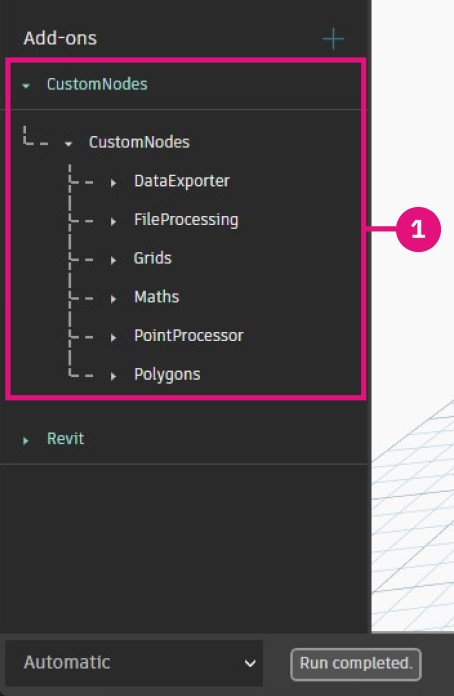
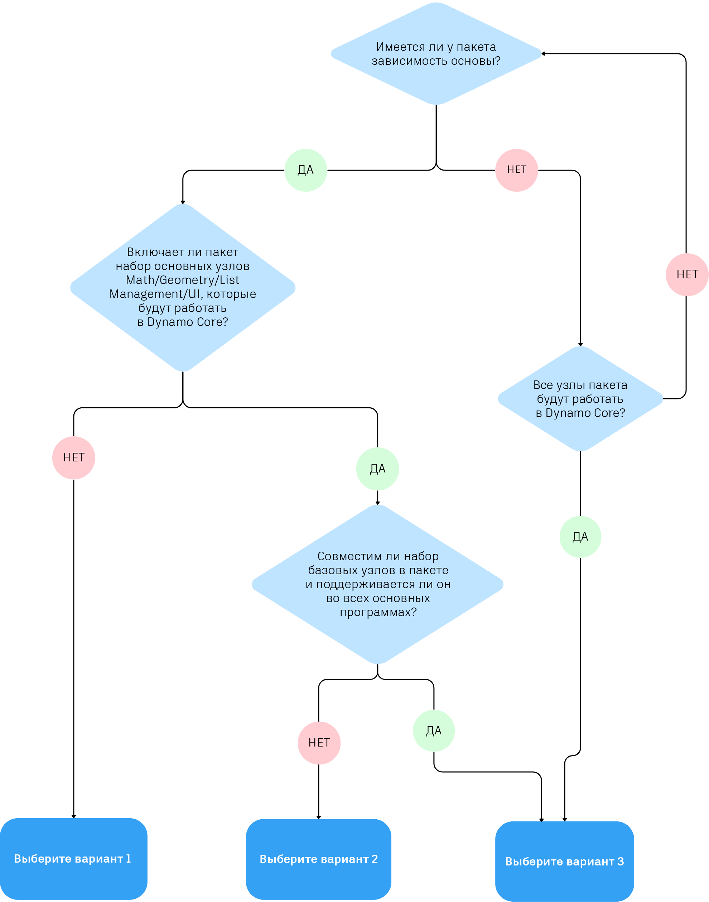

# Публикация пакета 

### Публикация пакета 

Пакеты — это удобный способ хранения узлов и предоставления к ним доступа сообществу Dynamo. В пакет можно поместить любые элементы: от пользовательских узлов, созданных в рабочем пространстве Dynamo, до производных узлов NodeModel.  Пакеты публикуются и устанавливаются с помощью диспетчера пакетов. Дополнительные сведения о пакетах см. в [руководстве](https://primer2.dynamobim.org/v/ru/6_custom_nodes_and_packages/6-2_packages/1-introduction).

#### Что такое диспетчер пакетов? 

Диспетчер пакетов Dynamo — это программный реестр (похожий на npm), который можно открыть из Dynamo или в веб-браузере. Диспетчер пакетов обеспечивает установку, публикацию, обновление и просмотр пакетов. Как и npm, он поддерживает различные версии пакетов. Кроме того, он помогает управлять зависимостями проекта.

В браузере найдите пакеты и просмотрите статистику: [https://dynamopackages.com/](https://dynamopackages.com)

* В Dynamo диспетчер пакетов обеспечивает установку, публикацию и обновление пакетов.

> 1. Поиск пакетов в Интернете: `Packages > Search for a Package...` (Пакеты > Поиск пакета).
> 2. Просмотр/редактирование установленных пакетов: `Packages > Manage Packages...` (Пакеты > Управлять пакетами).
> 3. Публикация нового пакета: `Packages > Publish New Package...` (Пакеты > Опубликовать новый пакет).

#### Публикация пакетов 

Пакеты публикуются из диспетчера пакетов в Dynamo. Рекомендуется опубликовать пакет локально, протестировать его и затем опубликовать в Интернете, чтобы поделиться с сообществом. На основе примера NodeModel мы выполним все необходимые действия, чтобы опубликовать узел RectangularGrid в виде пакета локально, а затем в Интернете.

Запустите Dynamo и выберите `Packages > Publish New Package...` (Пакеты > Опубликовать новый пакет), чтобы открыть окно `Publish a Package` (Опубликовать пакет).

> 1. Выберите `Add file...` (Добавить файл) для поиска файлов, которые требуется добавить в пакет.
> 2. Выберите два файла `.dll` из примера NodeModel.
> 3. Нажмите `Ok`.

После добавления файлов в содержимое пакета присвойте пакету имя, описание и версию. При публикации пакета с помощью Dynamo автоматически создается файл `pkg.json`.

> Пакет готов к публикации.
>
> 1. Введите требуемые сведения: имя, описание и версию.
> 2. Чтобы опубликовать файл, нажмите кнопку «Опубликовать локально» и выберите папку пакета Dynamo: `AppData\Roaming\Dynamo\Dynamo Core\1.3\packages`. Узел будет доступен в Core. Всегда публикуйте пакет локально до тех пор, пока он не будет готов к публикации в открытом доступе.

После публикации пакета узлы будут доступны в библиотеке Dynamo в категории `CustomNodeModel`.

> 1. Пакет, созданный в библиотеке Dynamo

Когда пакет будет готов к публикации в Интернете, откройте диспетчер пакетов и выберите `Publish` (Опубликовать), а затем `Publish Online` (Опубликовать в Интернете).

> 1. Чтобы узнать, как пакет был отформатирован в Dynamo, щелкните значок с тремя точками справа от CustomNodeModel и выберите Show Root Directory (Показать корневой каталог).
> 2. Выберите `Publish` (Опубликовать), а затем `Publish Online` (Опубликовать в Интернете) в окне публикации пакета Dynamo.
> 3. Чтобы удалить пакет, выберите `Delete` (Удалить).

#### Как обновить пакет? 

Процесс обновления пакета аналогичен процессу публикации. Откройте диспетчер пакетов, выберите `Publish Version...` (Публикация версии) для пакета, который необходимо обновить, и введите более позднюю версию.

> 1. Выберите `Publish Version` (Публикация версии), чтобы дополнить существующий пакет новыми файлами в корневом каталоге, а затем выберите, следует ли опубликовать пакет локально или в Интернете.

#### Веб-клиент диспетчера пакетов 

Веб-клиент диспетчера пакетов позволяет пользователям искать и просматривать данные пакета, включая управление версиями, статистику загрузок и другие соответствующие сведения. Кроме того, разработчики пакетов могут войти в систему, чтобы изменить сведения о своих пакетах, например о совместимости, непосредственно через веб-клиент.

Дополнительные сведения об этих функциях см. в публикации блога: [https://dynamobim.org/discover-the-new-dynamo-package-management-experience/](https://dynamobim.org/discover-the-new-dynamo-package-management-experience/).

Веб-клиент диспетчера пакетов можно найти на странице [https://dynamopackages.com/](https://dynamopackages.com)

##### Обновление сведений о пакете

Авторы могут изменить описание пакета, ссылку на веб-сайт и ссылку на репозиторий, выполнив следующие действия:  

> 1. В разделе **Мои пакеты** выберите пакет и нажмите **Изменить сведения о пакете**.  
> 2. Добавьте или измените ссылки **Веб-сайт** и **Репозиторий** в соответствующих полях.  
> 3. При необходимости обновите **Описание пакета**.  
> 4. Нажмите кнопку **Сохранить изменения**, чтобы применить изменения.  

 **Примечание**. Изменения отобразятся в диспетчере пакетов в Dynamo в течение 15 минут, поскольку обновление данных на сервере занимает некоторое время. В настоящее время мы стараемся сократить это время.  

 

##### Изменение сведений о совместимости для опубликованных версий пакетов  

Сведения о совместимости для ранее опубликованных версий пакетов можно изменить задним числом. Выполните следующие действия:  

**Шаг 1**  

1. Щелкните версию пакета, которую требуется обновить.  
2. В списке **Зависит от** будут автоматически указаны пакеты, от которых зависит ваш пакет.  
3. Щелкните значок карандаша рядом с пунктом **Совместимость**, чтобы открыть рабочий процесс **Изменение сведений о совместимости**.  

**Шаг 2**  

Следуйте приведенной ниже блок-схеме и таблице, чтобы выбрать подходящий вариант для вашего пакета.

Рассмотрим несколько сценариев на примерах:

**Пример пакета 1** — Civil Connection. Этот пакет имеет зависимости API от Revit и Civil 3D и не включает коллекцию основных узлов (например, функции геометрии, математические функции и/или управление списками). В этом случае лучше подойдет вариант 1. Пакет будет отображаться как совместимый в Revit и Civil 3D и будет соответствовать диапазону версий и/или списку отдельных версий.

**Пример пакета 2** — Rhythm. Этот пакет представляет собой коллекцию специальных узлов Revit вместе с коллекцией основных узлов. В этом случае у пакета есть зависимости от основной программы. Кроме того, в него включены основные узлы, которые будут работать в Dynamo Core. В этом случае лучше подойдет вариант 2. Пакет будет отображаться как совместимый в Revit и Dynamo Core (Dynamo Sandbox) и будет соответствовать диапазону версий и/или списку отдельных версий.

**Пример пакета 3** — Mesh Toolkit. Это пакет Dynamo Core, который представляет собой коллекцию узлов геометрии, не имеющих зависимостей от основных программ. В этом случае лучше подойдет вариант 3. Пакет будет отображаться как совместимый в Dynamo и всех основных средах в соответствии с диапазоном версий и/или списком отдельных версий.

В зависимости от выбранного варианта будут отображаться поля, относящиеся к Dynamo и/или основной программе, как показано на изображении ниже.

