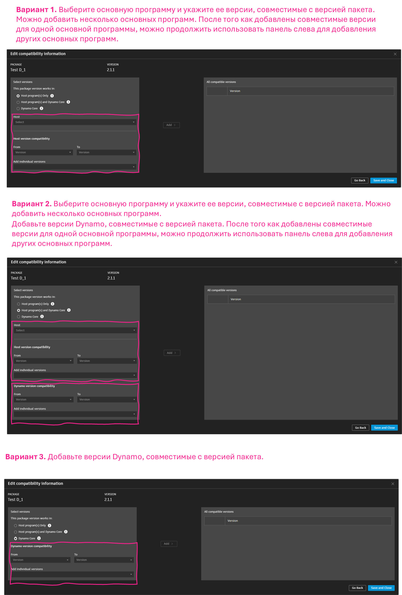

# Pubblicazione di un pacchetto

### Pubblicazione di un pacchetto 

I pacchetti rappresentano un modo comodo per memorizzare e condividere i nodi con la comunità di Dynamo. Un pacchetto può contenere tutti gli elementi, dai nodi personalizzati creati nell'area di lavoro di Dynamo ai nodi derivati da NodeModel. I pacchetti vengono pubblicati e installati utilizzando Package Manager. Oltre a questa pagina, la [Guida introduttiva](https://primer2.dynamobim.org/6_custom_nodes_and_packages/6-2_packages/1-introduction) include una guida generale sui pacchetti.

#### Che cos'è Package Manager? 

Dynamo Package Manager è un Registro di sistema del software (simile a npm) accessibile da Dynamo o in un browser Web. Package Manager include l'installazione, la pubblicazione, l'aggiornamento e la visualizzazione di pacchetti. Come npm, mantiene diverse versioni dei pacchetti. Inoltre, consente di gestire le dipendenze del progetto.

Nel browser, cercare i pacchetti e visualizzare le statistiche: [https://dynamopackages.com/](https://dynamopackages.com).

* In Dynamo, Package Manager include i pacchetti di installazione, pubblicazione e aggiornamento.

> 1. Cercare i pacchetti in linea: `Pacchetti > Ricerca pacchetti`.
> 2. Visualizzare/Modificare i pacchetti installati: `Pacchetti > Gestisci pacchetti`.
> 3. Pubblicare un nuovo pacchetto: `Pacchetti > Pubblica nuovo pacchetto`.

#### Pubblicazione di un pacchetto 

I pacchetti vengono pubblicati da Package Manager all'interno di Dynamo. Il processo consigliato consiste nel pubblicare localmente, verificare il pacchetto e quindi pubblicarlo in linea per condividerlo con la comunità. Utilizzando il case study NodeModel, verranno eseguiti i passaggi necessari per pubblicare il nodo RectangularGrid come pacchetto localmente e quindi in linea.

Avviare Dynamo e selezionare `Pacchetti > Pubblica nuovo pacchetto... ` per aprire la finestra `Pubblica un pacchetto`.

> 1. Selezionare `Aggiungi file` per cercare i file da aggiungere al pacchetto.
> 2. Selezionare i due file `.dll` dal case study NodeModel.
> 3. Selezionare `Ok`.

Con i file aggiunti al contenuto del pacchetto, assegnare al pacchetto un nome, una descrizione e una versione. La pubblicazione di un pacchetto utilizzando Dynamo crea automaticamente un file `pkg.json`.

> Un pacchetto pronto per essere pubblicato.
>
> 1. Fornire le informazioni richieste per nome, descrizione e versione.
> 2. Pubblicare facendo clic su Pubblica localmente e selezionare la cartella del pacchetto di Dynamo: `AppData\Roaming\Dynamo\Dynamo Core\1.3\packages` per rendere disponibile il nodo in Core. Pubblicare sempre localmente il pacchetto fino a quando non è pronto per la condivisione.

Dopo la pubblicazione di un pacchetto, i nodi saranno disponibili nella libreria di Dynamo nella categoria `CustomNodeModel`.

> 1. Il pacchetto appena creato nella libreria di Dynamo

Quando il pacchetto è pronto per la pubblicazione in linea, aprire Package Manager e scegliere `Pubblica`, quindi `Pubblica in linea`.

> 1. Per vedere come Dynamo ha formattato il pacchetto, fare clic sui tre puntini verticali a destra di CustomNodeModel e scegliere Mostra directory principale.
> 2. Selezionare `Pubblica`, quindi `Pubblica in linea` nella finestra Pubblica un pacchetto di Dynamo.
> 3. Per eliminare un pacchetto, selezionare `Elimina`.

#### Come aggiornare un pacchetto 

L'aggiornamento di un pacchetto è un processo simile alla pubblicazione. Aprire Package Manager, selezionare `Pubblica versione...` nel pacchetto che deve essere aggiornato e immettere una versione successiva.

> 1. Selezionare `Pubblica versione...` per aggiornare un pacchetto esistente con nuovi file nella directory principale, quindi scegliere se deve essere pubblicato localmente o in linea.

#### Client Web di Package Manager 

Il client Web di Package Manager consente agli utenti di cercare e visualizzare i dati del pacchetto, inclusi il controllo delle versioni, le statistiche di download e altre informazioni pertinenti. Inoltre, gli autori del pacchetto possono accedere per aggiornare i dettagli del pacchetto, ad esempio le informazioni sulla compatibilità, direttamente tramite il client Web.

Per ulteriori informazioni su queste funzionalità, vedere il post del blog qui: [https://dynamobim.org/discover-the-new-dynamo-package-management-experience/](https://dynamobim.org/discover-the-new-dynamo-package-management-experience/).

Il client Web di Package Manager è accessibile tramite il seguente collegamento: [https://dynamopackages.com/](https://dynamopackages.com).

##### Aggiornamento dei dettagli del pacchetto

Gli autori possono modificare la descrizione del pacchetto, il collegamento al sito Web e il collegamento al repository seguendo questi passaggi:  

> 1. In **Pacchetti personali**, selezionare il pacchetto e fare clic sull'icona di **modifica dei dettagli del pacchetto**.  
> 2. Aggiungere o modificare i collegamenti **Sito Web** e **Repository** utilizzando i rispettivi campi.  
> 3. Aggiornare la **descrizione del pacchetto** in base alle esigenze.  
> 4. Fare clic su **Salva modifiche** per applicare gli aggiornamenti.  

 **Nota** Gli aggiornamenti potrebbero richiedere fino a 15 minuti per essere eseguiti in Package Manager all'interno di Dynamo, poiché che gli aggiornamenti del server impiegano un certo periodo di tempo. Sono in atto misure per ridurne i tempi.  

 

##### Modifica delle informazioni di compatibilità per le versioni dei pacchetti pubblicate  

Le informazioni sulla compatibilità possono essere aggiornate retroattivamente per le versioni dei pacchetti pubblicate in precedenza. Attenersi alla procedura seguente:  

**Passaggio 1.**  

1. Fare clic sulla versione del pacchetto che si desidera aggiornare.  
2. L'elenco **Dipende da** verrà compilato automaticamente con i pacchetti da cui dipende il pacchetto in questione.  
3. Fare clic sull'icona a forma di matita accanto a **Compatibilità** per aprire il workflow di **modifica delle informazioni di compatibilità**.  

**Passaggio 2.**  

Seguire il seguente diagramma di flusso e fare riferimento alla tabella sottostante per capire quale opzione funziona meglio per il pacchetto.

Utilizziamo degli esempi per illustrare alcuni scenari:

**Pacchetto di esempio n. 1**: Civil Connection: questo pacchetto ha dipendenze API sia con Revit che con Civil 3D e non include una raccolta di nodi principali (ad esempio: funzioni geometriche, funzioni matematiche e/o gestione di elenchi). Quindi, in questo caso, l'ideale sarebbe scegliere l'opzione 1. Il pacchetto verrà mostrato come Compatibile in Revit e nell'ambiente Civil 3D che corrisponde alla serie di versioni e/o all'elenco delle singole versioni.

**Pacchetto di esempio n. 2**: Rhythm: questo pacchetto è una raccolta di nodi specifici di Revit insieme ad una raccolta di nodi di Core. In questo caso, il pacchetto ha dipendenze host. Ma include anche i nodi principali che funzioneranno in Dynamo Core. Quindi, in questo caso, l'ideale sarebbe scegliere l'opzione 2. Il pacchetto verrà mostrato come Compatibile in Revit e nell'ambiente Dynamo Core (denominato anche Dynamo Sandbox) che corrisponde alla serie di versioni e/o all'elenco delle singole versioni.

**Pacchetto di esempio n. 3**: Mesh Toolkit: si tratta di un pacchetto di Dynamo Core, che è una raccolta di nodi geometrici senza dipendenze host. Quindi, in questo caso, l'ideale sarebbe scegliere l'opzione 3. Il pacchetto verrà mostrato come Compatibile in Dynamo e in tutti gli ambienti host che corrispondono alla serie di versioni e/o all'elenco delle singole versioni.

A seconda dell'opzione selezionata, compariranno i campi specifici di Dynamo e/o dell'host, come mostrato nell'immagine seguente.

