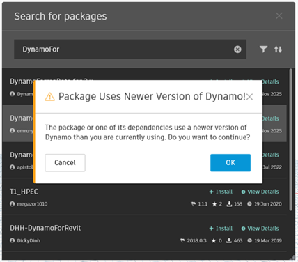

# Updating your Packages and Dynamo Libraries for Dynamo 4.x

### Introduction <a href="#introduction" id="introduction"></a>

This section contains information on issues you may encounter while migrating your graphs, packages and libraries to Dynamo 4.x. Dynamo 4.0 introduces:

* Significant performance improvements
* Stability and bug-fix updates
* Modernization of the codebase
* Removal of APIs previously marked obsolete in 1.x
* A major runtime update from .NET 8 to .NET 10
* PythonNet 3 is now the default Python engine for all new Python nodes

The .NET 10 migration effort ensures Dynamo remains aligned with Microsoft’s technology roadmap, well ahead of the end of support for .NET 8 in November 2026.

When you launch Dynamo 4.0, you’ll be asked to update to .NET 10 if you haven’t already. Package authors are required to update their projects to target .NET 10 to ensure full compatibility.

All new Python nodes created in Dynamo 4.0+ start with PythonNet3. Don’t worry about backward compatibility: For those who work in multi-version shops (e.g., Revit or Civil 3D 2025/2026), install the PythonNet3 Engine package in Dynamo 3.3–3.6 to maintain compatibility. More information can be found [here](https://dynamobim.org/dynamo-core-4-0-release/).

API and nodes that were marked as obsolete in 1.x have been removed in Dynamo 4.0. You can reference the [full list of changes here](https://github.com/DynamoDS/Dynamo/wiki/API-Changes-in-Dynamo-4.0.0).

## Package Compatibility <a href="#package-compatibility" id="package-compatibility"></a>

### Using Dynamo 2.x and 3.x Packages in Dynamo 4.x 
Because Dynamo 4.x now runs on the .NET 10 runtime, packages that were built for Dynamo 2.x (*using .NET48*) and Dynamo 3.x (*using .NET 8*) are not guaranteed to work in Dynamo 4.x. When you attempt to download a package in Dynamo 4.x that was published from a Dynamo version less than 4.0, you will get a warning that the package is from an older version of Dynamo.

**This does not mean the package will not work** It's simply a warning that there could be compatibility issues, and in general it's a good idea to check if there's a newer version that has been built specifically for Dynamo 4.x.

You may also notice this type of warning in your Dynamo log files at package load time. If everything is working correctly, you can ignore it.

### Using Dynamo 4.x Packages in Dynamo 2.x 

It's very unlikely that a package built for Dynamo 4.x (_using .Net 10_) is going to work on Dynamo 2.x. You will also see the below warning when you try to install packages built for Dynamo 4.x in Dynamo 2.x.



#### Using Dynamo 4.x Packages in Dynamo 3.x

The package built for Dynamo 4.x (_using .Net 10_) might work on Dynamo 3.x as long as if all the APIs used in the package exist in .NET 8. But there is no guarantee that it will work. You will also see the below warning when you try to install packages built for Dynamo 4.x in Dynamo 3.x:

> Are you sure you want to install \[package name and version]? The compatibility of this version with your setup has not been verified. It may or may not work as expected.


### Custom Icons in .NET10
As Dynamo is now built with the .NET10.0 Runtime, the Dynamo mechanism for icon packages is now updated due to changes in .NET10 Runtime. Embedded Bitmap icons in a .resx file are no longer supported. The prefered option is embedded Byte[]

**Previous embedded resource format**
```xml
  <assembly alias="System.Drawing" name="System.Drawing, Version=4.0.0.0, Culture=neutral, PublicKeyToken=b03f5f7f11d50a3a" />
  <data name="DefaultIcon" type="System.Drawing.Bitmap, System.Drawing" mimetype="application/x-microsoft.net.object.bytearray.base64">
    <value>
        iVBORw0KGgoAAAANSUhEUgAAACAAAAAgCAYAAABzenr0AAAABGdBTUEAALGPC/xhBQAAABl0RVh0U29m
        dHdhcmUAQWRvYmUgSW1hZ2VSZWFkeXHJZTwAAALySURBVFhH7ZTvS1NRGMfvXyD+A4LQy8DeGCj5Y7Ql
        rTcb2MyZ6Zxpxpx3bnkn6uwi/pizXGqm27w5qcS5u81+QHrRdIGRFk43RcNUEvSFiRcsQSJZzxlHsde7
        vhD2gS/3Puc8l+/3nMM9RIwYMc4NP8SZ8SAdiPbIKuWWW12JeOrsweb8pjhzDJ7WTXHGkUtOhSEED5oE
        0aCzC4VX7sMlsZGZkrctSV/3y8rug6kKZCVr3h4pewNhBRPiQTRuFQYwp9clYisuiVBKUupqevIXXiqx
        gVKznUsa0AooA8xFyt65DXiqcHv0fEu7bFySynlXdh1abSIKAGKROVdKDd7sD/FZnkU5bieQOehkx6IG
        zAzBq+KJGZl6uzvHEnbI646mRNKdxkI7nd8b2Oow9WxpmCE1bieUtvl+2cvQa1xGDwqAhFYMsk5fkxs/
        ZYiC6sfTv0vN/rl2jTXMFWh5m6JlspocDuTaAn+ujAZPjixqjgOgdxRiJ0vk69RZ9nKYJQ6NJU8FlQ2W
        HjtXYJi90/11/4YrRMFYB5oThNMBEG31/c1lnR8PXhgepaIaBUgZD+qLemZnumodExAyAcbeRJqF4HQA
        WPVFpX3h+/vconl0HMhMMs6l5Y28WifdTfs1bPnPdkfJYhY3NhX5WAiOA4B5HNp2upZhoWaHmvOrnz4r
        DlCeyv1yd9sa5SOlRp82zuTSmCk39Qt/Hj2nAjC3ndNcg7OkC3QAZp8b7PSw2uE/VA2MOXB7BJNL+xe/
        Rg8yf65XzZPDzWBasWK2q33jivQRvCPLT+r7+rwGas3xsPEC6gfzS4IGcBcrjFUstVfl1eehGgJFLiIw
        R4r8bqPlFeahOt1yk7OCA/NdUCEaFwQwp0H/XcVWsnUXzLl7gwMJcBR3QVy1V7taw2pb0A7gVmEAcx3o
        5GolW99pShnvoZ41cWC8BWJA1/G08IB5PIg3uE0f0E48cNeGKa9uAa88AbedLTgE2gma8hiS8HCMGDHO
        OwTxD3r4nexvPxELAAAAAElFTkSuQmCC
</value>
```

**.NET 10 embedded resource format**

```xml
  <assembly alias="System.Windows.Forms" name="System.Windows.Forms, Version=4.0.0.0, Culture=neutral, PublicKeyToken=b77a5c561934e089" />
  <data name="DefaultCustomNode.Large" type="System.Resources.ResXFileRef, System.Windows.Forms">
    <value>Resources\DefaultCustomNode.Large.png;System.Byte[], mscorlib, Version=4.0.0.0, Culture=neutral, PublicKeyToken=b77a5c561934e089</value>
```
This is described in greater detail in [Migrating Node Icons](<4-migrating-node-icons.md>)

Best practice is to multi-target your project to both .NET 8 and .NET 10 by modifying your .csproj.

```xml
<TargetFrameworks>net8.0;net10.0</TargetFrameworks>
```

This ensures:

* Support for Revit-hosted Dynamo versions still on .NET 8
* Compatibility with standalone Dynamo 4.x on .NET 10
